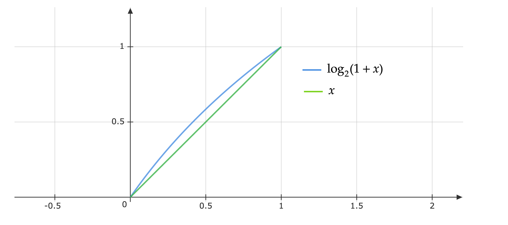

## 介绍

第一次听到魔数(magic number)的时候，觉得很神奇，为什么一个常数可以在所有场景都适用呢？后来发现这是计算机内部数据表示的一个必然结果。在本篇文章中，将从求平方根算法出发，介绍雷神之锤的经典算法：Fast inverse Square root.

## Binary search

我们首先从Leetcode一道easy题目出发,题目是[Leetcode69. Sqrt(x)](https://leetcode.com/problems/sqrtx/),题目给定一个整数$x$，要求我们计算$\sqrt{x}$， 并且结果是整数。一个比较自然的想法就是二分法，即：

```c++
int Sqrt(x){
  int left = 0, right = 46340;
  int mid = 0;
  while (left <= right){
    mid = (left + right) / 2;
    if (mid * mid == x)	return mid;
    if (mid * mid > x)	right = mid - 1;
    else	left = mid + 1;
  }
  return right;
}
```

注意到我们在代码里也使用了一个魔数：$46340$, 这是因为题目给的数据范围为$[0,2^{31}-1]$, 而$46341^2>2^{31}-1$,所以我们就缩小了数据范围。可以看到，魔数与计算机的设计是息息相关的。

### 进阶版

一般地，我们计算平方根的时候，返回的结果应该是实数，因此，我们可以对上述程序进行扩展：

```c++
#include <stdexcept> // invalid_argument
#include <math.h> // fabs

double Sqrt(double x){
  if (x < 0.0) 
    throw std::invalid_argument( "received negative value" );
  double left = 0.0, right = x;
  double mid = 0.0;
  const double eps = 1e-7; // precision
  while (std::fabs(left - right) > eps){
    mid = (left + right) / 2;
    if (mid * mid > x)	right = mid;
    else	left = mid;
  }
  return mid;
}
```

二分法求解$\sqrt{x}$的复杂度为$\mathcal{O}(\log\frac{b-a}{\epsilon})$, 其中$[a,b]$是根所在的区间，上述代码中设置为$[0,x]$，$\epsilon$是根的精度，上述代码中设置为$10^{-7}$. 

实际上，当$\epsilon$非常小时，二分法会非常慢。我们以计算$\sqrt{5}$为例，每次循环打印迭代次数和误差$\vert\sqrt{5}-mid\vert$,得到结果如下：

```
...
iter: 16, error: 3.12657e-05
iter: 17, error: 6.88131e-06
iter: 18, error: 1.21922e-05
iter: 19, error: 2.65543e-06
iter: 20, error: 2.11294e-06
iter: 21, error: 2.71249e-07
iter: 22, error: 9.20844e-07
iter: 23, error: 3.24797e-07
iter: 24, error: 2.67742e-08
iter: 25, error: 1.22237e-07
iter: 26, error: 4.77316e-08
```

可以看到，收敛速度还是挺慢的，那么有没有速度更快的求平方根算法呢，这个时候Newton法就有话要说了。

## Newton method

Newton法主要是求解以下方程的解：

$$ f(x)=0 $$

其中$f$是二阶连续可微的，且存在唯一 $x^\*$ 使得 $f(x^\*)=0$ ，则给定初识点 $x^0$ ,Newton法的迭代格式如下：

$$ x^{k+1}=x^k-\frac{f(x^k)}{f'(x^k)} $$

其中 $f'(x^k)$ 是 $f$ 在 $x^k$ 处的导数，在求根问题中，我们的目标函数是 $f(x)=x^2-a$ , $f'(x)=2x$ ,因此我们可以实现Newton法如下：

```c++
double Newton_root_finding(double a, double x0){
	if (x < 0.0) 
  	throw std::invalid_argument( "received negative value" );
  int kMaxIter = 10;
  for (int i = 0; i < kMaxIter; ++i){
    x0 = x0 - (x0 * x0 - a) / (2 * x0);
  }
  return x0;
}
```

我们还是以$\sqrt{5}$为例，初识点$x^0=5$, Newton法的运行结果如下：

```
iter: 1, error: 0.763932
iter: 2, error: 0.0972654
iter: 3, error: 0.00202726
iter: 4, error: 9.18144e-07
iter: 5, error: 1.88294e-13
iter: 6, error: 0
iter: 7, error: 0
iter: 8, error: 0
iter: 9, error: 0
iter: 10, error: 0
```

可以看到，Newton法用了5步就找到了最优解，吊打二分法一条街。Newton法一般在目标函数单调时效果比较好，当函数有多个零点或者多重零点时，Newton法的收敛速率会比较差，我们在此不做具体讨论。关于Newton法的手收敛速率可以参考[2]。

## Fast inverse Square root

事实上，我们要介绍的Quake算法和求根公式关系并不是很大，而是因为在游戏中经常需要对向量进行归一化，即给定$\vec{x}$, 我们需要计算

$$
\hat{x} = \frac{\vec{x}}{\|\vec{x}\|_2}
$$

假设$\vec{x}=(x_1,x_2,x_3)$, 则$\|\vec{x}\|_2=\sqrt{x_1^2+x_2^2+x_3^2}$, 这里就需要求平方根了，而Quake算法就是用来求$\frac{1}{\sqrt{x}}$的。

首先，我们给出雷神之锤的算法[1]：

```c
float Q_rsqrt(float number){
  long i;
  float x2, y;
  const float threehalfs = 1.5F;
  
  x2 = number * 0.5F;
  y = number;
  i = *(long *)&y;
  i = 0x5f3759df - (i >> 1);
  y = *(float *)&i;
  y = y * (threehalfs - (x2 * y * y));
  // y = y * (threehalfs - (x2 * y * y));
  return y;
}
```

我们首先来看代码的第11行和第12行，这里其实就是我们前面提到的Newton法，由Quake算法的介绍我们可以给出目标函数$f(x)=\frac{1}{x^2}-a$, 因此Newton法迭代格式为：

$$
x^{k+1} = x^k-\frac{(x^k)^{-2}-a}{-2(x^k)^{-3}}=x^k *\frac{3-a(x^k)^{2}}{2}
$$

因此，代码的11行和12行实际上就是(4)式的实现。而由6-10行产生的$y$实际上就是$\frac{1}{\sqrt{a}}$的一个估计。我们接下来详细介绍这一部分，为此，我们需要了解计算机内部浮点数的存储格式。

### IEEE 754 float-point format

注：我们在本文中均以32位浮点数来说明，64位浮点数的表示原理相同。

由于计算机只能表示有限小数（事实上现实也是如此，我们没办法写出$\pi$或者其他无限小数的所有位数），因此我们需要用有限的位数来表示一个小数。其实整数也是一样，比如C++中一般`int`类型所能表示的范围为$[-2^{31}, 2^{31}-1]$，这是因为我们一般用4bytes来表示一个整数，4bytes=32bit,首位用作符号，其余31位用来表示数字。

浮点数也是类似的思想，不过略微有些差别，对于一个实数$x\in\mathbb{R}$，我们可以将其表示为$x=(-1)^s 2^{e-127}(1+f)$,其中：

- $s$ 是符号位，用$1$bit来表示，$s=1$表示$x$是负数，$s=0$表示$x$是正数
- $e$ 是指数，用8bit来表示，即 $e\in[0,255]$.注意到我们实际上存储的是$e+127$，因为这样可以表示到更小数量级的小数，这时候指数的范围为$[-127,128]$.
- $f$ 是尾数，用23bit来表示, $f\in[0,1)$.实际上存储的是 $f*2^{23}$（这样才是一个二进制整数）

用一个比较简单的例子来说明：比如 $x=6.3025$, 我们首先将其转换为二进制表示：

$$
x=6.3025=110.0100110101110000101_{(2)}
$$

接下来，我们将二进制表示为表示为标准格式：

$$
x=+2^{129-127}(1+0.57562494277954101563)
$$

那么 $s=0_{(2)}$ , $e+127=129=10000001_{(2)}$ , $f=0.57562494277954101563=0.10010011010111000010100_{(2)}$ . 因此 $x$ 可以表示为：

$$
0\ 10000001\ 10010011010111000010100_{(2)}
$$

### Quake's initial guess

接下来，我们结合浮点数表示来解释Quake算法的6-10行。Quake算法的基本思路为位了计算 $y=\frac{1}{\sqrt{x}}$ 先计算 $\log_2 y=\log_2(\frac{1}{\sqrt{x}})$ 。

首先，我们可以简化一下：

$$
\log_2 y=\log_2(\frac{1}{\sqrt{x}})\Leftrightarrow \log_2y=-\frac{1}{2}\log_2x
$$

结合浮点数表示 $x=2^{e}(1+f)$ 我们有：

$$
\log_2x = \log_2(2^{e}(1+f))=e+\log_2(1+f)
$$

进一步地，因为 $f\in[0,1)$ ,我们可以用一阶泰勒展开近似：$\log_2(1+f)\approx f+\sigma$ ,其中 $\sigma$ 是一个控制误差的常数，

$$
\log_2x \approx e + f + \sigma
$$

另一方面，我们将 $x$ 的浮点数表示为一个整数的形式,记作 $I_x$ ：

$$
\begin{aligned}
I_x &= 0*2^{31} + (e+127)*2^{23} + f*2^{23} \\
&=2^{23}(e+127+f)\\
&=2^{23}(e+f+\sigma+127-\sigma)\\
&\approx 2^{23}\log_2x + 2^{23}(127-\sigma)
\end{aligned}
$$

我们同理可以得到 $y$ 的浮点数表示的整数形式，记作 $I_y$ ,将 $I_x,I_y$ 带入到(8)式中，我们就得到：

$$
\frac{I_y}{2^{23}}-(127-\sigma) \approx -\frac{1}{2}\left(\frac{I_x}{2^{23}}-(127-\sigma)\right)
$$

即：

$$
I_y\approx \frac{3}{2}*2^{23}*(127-\sigma)-\frac{1}{2}I_x
$$

写成代码就是第9行：

```c++
i = 0x5f3759df - ( i >> 1 );
```

这里魔数的含义就是：

$$
\text{0x5f3759df}=\frac{3}{2}*2^{23}*(127-\sigma)
$$

由此还可以计算出 $\sigma\approx 0.0450466$ .

那么接下来的问题是如何计算$I_x$，首先我们知道`&y`是取变量`y`的地址，如果我们想读取变量$y$的值，我们只需要令`z=*(&y)`即可，这样`z`的值就和`y`的值相等，但是我们前文已经讲述过，实际上在`&y`处，计算机存储的就是形如(7)式所示的$I_y$,因此为了将其读取为一个整数，我们需要将指针改变成整数指针，即`(long *)&y`，这个表达式的意思是把变量`y`当成一个整型`long`来看待，这样`*(long *)&y`得到的就是$I_y$了。

同理，经过代码第9行之后，`i`所表示的值就从$I_x$变成$I_y$了，与上面的原理相同，我们用`*(float *)&i`就能得到$y$的值。


总的来说，Quake算法的流程如下：

1. 通过指针技巧计算$I_x$（代码第8行）
2. 通过(13)式计算$I_y$（代码第9行）
3. 通过指针技巧计算$y$（代码第10行）
4. 使用Newton法进一步提高解的精度（代码第11，12行）

### Why this $\sigma$

我们还有一个问题没有回答，为什么$\sigma\approx 0.0450466$? 这其实是经过分析得到的结果，首先$\sigma$的定义是控制下式

$$
\log_2(1+x)\approx x + \sigma， x\in[0,1)
$$

误差的常数。首先我们来看$\sigma=0$时的情况：



可以看到当$x=0$和$x=1$时，我们用$x$估计$\log_2(1+x)$的误差为$0$，最大误差出现在$\alpha:=\frac{1}{\ln2}-1$处，为

$$
\tau = \frac{-1+\ln2+\ln\ln2}{\ln2}\approx 0.0860713320559342
$$

因此，我们知道$\sigma$的最优取值应该在区间$[0,\tau]$内，即直线$x+\sigma$与$\log_2(1+x)$在区间$[0,1]$内应该始终有交点。接下来，为了选取最优的$\sigma$，我们介绍一种比较通俗的做法。

由于给定一个$\sigma$，我们都能计算出误差$\epsilon(x):=|\log_2(1+x)-(x+\sigma)|$的最大值，因此方法一的思想为选取令最大误差尽可能小的$\sigma$.注意到$\epsilon(x)$的最大值出现在$x=0$和 $x=\alpha$处，$\epsilon(0)=\sigma$, $\epsilon(\alpha)=\tau-\sigma$.为了最小化最大的误差，我们令 $\sigma=\tau-\sigma$,就得到了

$$
\sigma = \frac{1}{2}\tau=\approx 0.0430356660279671
$$

还有其他的计算方法，我们不再介绍。有兴趣的读者可以参考[3]。代码中实际使用的$\sigma$可能采用了其他的优化方式。

## Reference

[1]https://en.wikipedia.org/wiki/Fast_inverse_square_root

[2]Burden R L, Faires J D, Burden A M. Numerical analysis[M]. Cengage learning, 2015.

[3]McEniry C. The mathematics behind the fast inverse square root function code[J]. Tech. rep., 2007.
