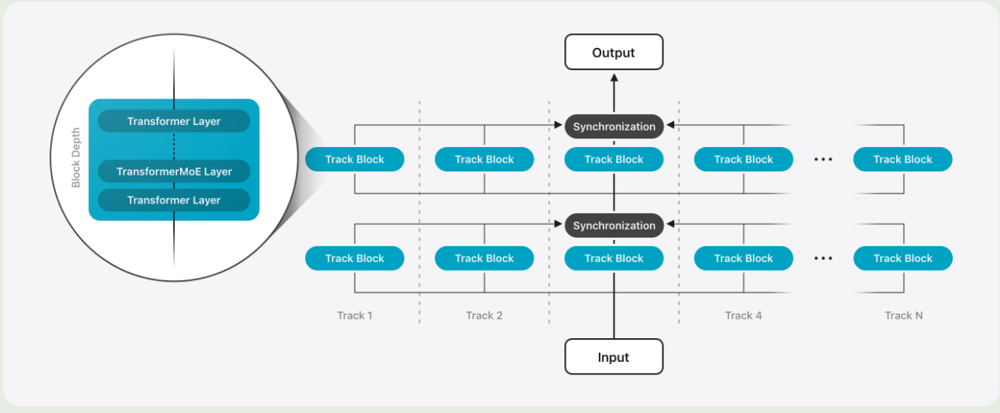
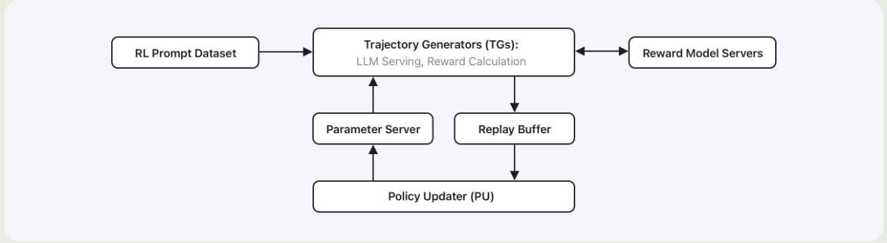

Apple 在 7 月份发布了 AFM 技术报告，包括两个多语种多模态大模型，分别为 3B 和 xB, 一个面向 device, 另一个面向 server， 前者主要集中于效率，后者集中于表现。

## Pre-training

### Architecture

#### On-Device Model

对于 on-device model, 作者将模型分为两个 block, Block1 占 $62.5\%$ 的 transformer layers, Block2 占 $37.5\%$ 的 transformer layers. 但是，对于 Block2, 作者移除了 key, value projection, 对应的 KV cache 则直接从 Block1 中获取。通过这种方式，作者将 KV cache memory usage 减少了 $37.5\%$. 并且，由于 Block2 不产生任何 key values, prefill stage 可以跳过这些计算，这样 TTFT 也可以减少 $37.5\%$.

#### Server Model

对于 server model, 作者对架构进行了改进，来提高效率。架构如下图所示

**Parallel Track Transformer**
作者提出了 Parallel Track (PT) Transformer 架构，PT-Transformer 将 transformer 模型分割多个小的 transformer, 作者将这些小的 transformer 称之为 *track*. 每个 track 包含多个 transformer block. 不同的 track 只会在输入和输出的时候进行交互，这样就能够减少同步的开销。作者讲这种模式称为 **track parallelism**.

**PT-MoE**
为了进一步提高 server model 的效率，作者将 MoE 和 PT-transformer 结合在一起。具体的做法就是，每两个 transformer block 为一组，每组里包含一个 dense layer 和一个 MoE layer.

**Interleaving Global and Local Attention Layers**
作者还设计额 interleaved attention 机制，也就是，将 transformer block 按照四个为 1 组，前面 3 个 block 使用 window attention, window size 为 4096 和 RoPE. 最后一个 block 使用 global attention layer 以及 [NoPE](https://maosong.website/p/notes-on-nope/). 作者认为，使用 NoPE 可以提高模型对长上下文的泛化性。

> Recall
> Qwen2.5-VL 的 ViT 使用的类似的做法，即 8 个 block 为一组，前面 7 个 block 使用 window attention, 最后一个 block 使用 full self attention.

#### Vision Encoder

Vision encoder 包含 ViT 和 adapter 两个模块

对于 ViT 来说，作者使用了 ViT 架构：

- server model 使用了 1B 参数的 ViT-g
- on-device model 使用了 300M 参数的 ViTDet-L backbone

作者在 ViTDet 的基础上加入了 Register-Window 机制，这个机制用于编码一个 global register token 来与不同的 loca windows 进行交互。

对于 adapter 来说，其包含了一个 transformer layer, 一个 linear projection layer, 一个 $3\times 3$ 的 convolutional layer. 其中， linear projection 用于将 visual token 映射到 LLM 的特征空间，pooling layer 用于压缩 visual token 个数。

### Data

主要包括 web data 和 image data 两部分

image data 部分：

1. Image-Text Crawl Data: 包含 **175M** 图文交错数据，包含 **550M** images
2. Synthetic Image Caption data: **5B** image caption 数据
3. Text-Rich Image Data
4. High-quality Domain-Specific Image-text Data: 包括 caption 数据， grounding 数据，table, chart, plots 数据以及 knowledge-required domains 的数据

### Training Recipe

text tokenizer 大小为 150K.

Vision encoder 的训练包含两个 stage:

1. 基于 CLIP 的方法，使用 **6B**的 image-text pair 数据进行训练，图片精度为 448, 作者还使用了 FLIP 来提高训练效率
2. 使用一个 compact LLM, 同时训练 vsion encoder, adapter 和 compact LLM. 加入了更高质量的数据，图片精度为 672.

LLM 的训练使用了 **13.4T** token

## Post-training

### SFT

SFT 数据包括：

1. General knowledge
2. Reasoning: 纯文本包括 math 和 reasoning, 多模态包括 STEM, math, CoT 数据
3. Text-Rich Image understanding: chart, table 数据
4. Multilingual OCR: OCR 相关数据
5. Text and visual grounding: grounding 数据
6. Multi-image reasoning: 多图推理数据

作者还基于 retrieval-based 方法来收集数据，具体做法就是给定一些 prompt, 然后通过一个 Image search pipeline 来进行检索。

训练的时候，作者将图片精度从 672 提升到 1344, 处理方式就是将图片切分为四个子图，然后作者还加入了一个总蓝图。这样，vision encoder 的输入包括四个子图和一个 thumbnail 图.

为了提高 on-device model 的效率，作者设置了三种模式：

- rapid mode: 图片精度为 224
- balanced mode: 只有 thumbnail 图
- high-resolution mode: 四个子图和一个 thumbnail 图

对于不同的 mode, 如果输入的是低精度图片，则 $50\%$ 概率为 rapid mode; 如果输入的是高精度图片，则 $1\%$ 的概率为 rapid mode. 对于其他数据，作者将 $20\%$ 的数据设置为 balanced mode.

### RLHF

作者使用 [RLOO](RLOO.md) 作为 RLHF 的算法。

RL 的 infra 如下图所示

infra 主要由两个部分组成：

1. Trajectory Generators: 生成轨迹并提供反馈
2. Policy updater: 更新 policy

训练时，作者首先训练了一个 reward model, 与 [AFM-2024](AFM-2024.md) 相似，作者使用了一个 preference loss function 以及一个 single-sided grading 作为 regularization.

数据包括以下类别:

- text-only prompts
- Image-text prompts
- Math prompts
- Image-text STEM reasoning prompts

其中，前面两个使用 reward function 进行打分，后面两个基于 ruled-based verifier 进行打分

作者还发现，人类的打分和 reward model 的发奋可能会出现 $20\%\sim30\%$ 的偏差。为了解决这个问题，作者训练了一个单独的 reward model, 专门用于 prompt selection.

## Tool Use

工具调用数据由于 Multi-turn 和依赖软件工具，比较难以收集。为了解决这个问题，作者设计了一个交互式标注平台，包括一个 agent 和一个工具执行环境。环境包括了工具和数据库，能执行工具调用并反馈。

标注时，用户发起一个请求，然后 agent 自动执行工具调用，最后平台返回反正的轨迹。

## Multilingual

作者逐步增加模型对于新语言的理解能力。默认情形下，输入和输出的语种一致，但是包含 $0.4\%$ 的跨语种数据。在 SFT 和 RLHF 阶段，英语和多语种数据的比例为 $80\%:20\%$.

## Optimization

作者使用了 QAT 来将 on-device model 压缩到 2 bits-per-weight, 使用 Adaptive Scalable Texture Compression (ASTC) 来 post-training 3.56 bits-per-weight 版本的 server model.

### QAT

QAT 是一个在模型训练过程中模拟量化误差，从而提升模型量化后表现的方法。它解决了传统后量化方法精度损失较大的问题，是平衡模型性能用户效率的关键手段。

训练时，作者通过修改权重 $W$ 来模仿量化：

$$
\tilde{W} = s\left(\mathrm{clamp}(\lfloor \frac{W}{s}+z\rceil, q_{\min}, q_{\max}) - z\right)
$$

其中, $s$ 是 scaling factor, $z$ 是 zero point, $q_{\min}$, $q_{\max}$ 是 quantization 的 range. 为了解决 rounding operation 不可微的问题，作者使用了 straight-through estimator 的方法来近似梯度。

作者还提出了一个可学习的 scaling factor $f$ 用于计算 quantization scale, 计算方法如下所示

$$
s = \frac{f\cdot \max(|W|)}{q_{\max}}
$$

作者通过精细设计 $f$ 的初始化来保证模型训练的 robust.

### ASTC

对于 server model, 作者使用了 ASTC, 一个针对 GPU 图形纹理压缩的技术，来压缩模型权重。具体做法就是，模型训练好之后，作者对模型权重应用 ASTC, 然后对每个块进行预处理。存储时，每个块用 ASTC-HAR-ch 模式压缩为 128 位。最小值单独存储为 float16.

推理时，GPU 硬件自动解压缩 ASTC 块，然后解压的权重最小值相加参与矩阵计算

### Quality Recovery Adapters

作者还是用 LoRA 来恢复量化模型的精度，并通过选择性压缩策略优化 ASTC 过程，在极小的算力开销下实现了接近全量微调的性能。

## Evaluation

On-device model 表现如下

| Model         | MMLU      | MMMLU     | MGSM      |
| ------------- | --------- | --------- | --------- |
| AFM On-Device | 67.85     | 60.60     | 74.91     |
| Qwen-2.5-3B   | 66.37     | 56.53     | 64.80     |
| Qwen-3-4B     | **75.10** | **66.52** | **82.97** |
| Gemma-3-4B    | 62.81     | 56.71     | 74.74     |
| Gemma-3n-E4B  | 57.84     | 50.93     | 77.77     |

server model 表现如下

| Model         | MMLU      | MMMLU     | MGSM      |
| ------------- | --------- | --------- | --------- |
| AFM Server    | 80.20     | 74.60     | 87.09     |
| LLaMA 4 Scout | 84.88     | 80.24     | 90.34     |
| Qwen-3-235B   | **87.52** | **82.95** | **92.00** |
| GPT-4o        | 85.70     | 84.00     | 90.30     |

## Conclusion

作者提出了 AFM-2025 多模态多语种大语言模型系列，包括 on-device 和 server 两个版本，作者介绍了模型的架构，训练数据和训练方式。

## References

- [Publication](https://machinelearning.apple.com/papers/apple_intelligence_foundation_language_models_tech_report_2025.pdf)
- [blog](https://machinelearning.apple.com/research/apple-foundation-models-tech-report-2025)
