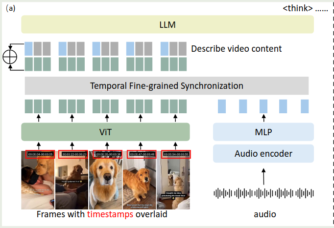
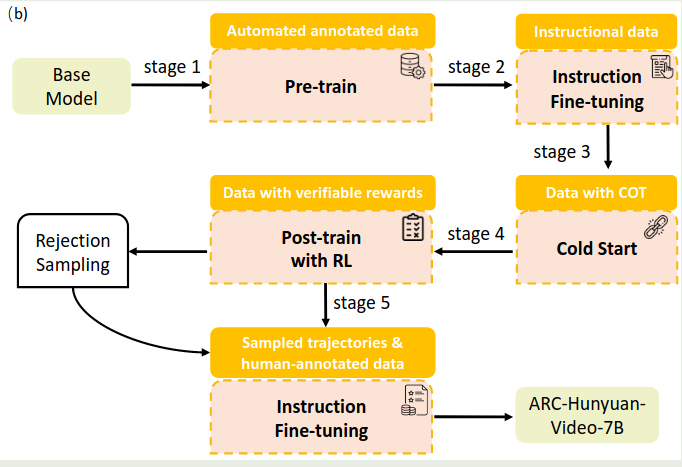
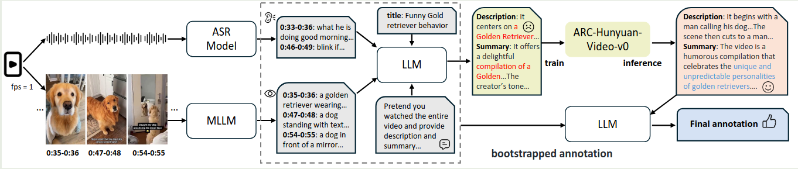

腾讯 ARC LAB 提出了 ARC-Hunyuan-Video-7B, 一个针对短视频理解和推理的视频多模态大模型。

## Introduction

作者首先提出了 Structured video comprehension 的概念

> the ability to decompose a video into its constituent events and narrative elements with temporal precision.

视频信息包含了 dense visual elements, 比如文字等信息，还有 rich audio streams, 比如音效，音乐，再就是 rapid narrative pacing, 用于强调情感。

已有的多模态大模型对于视频的细粒度理解和推理能力存在不足。尽管 [Keye-VL](https://maosong.website/p/notes-on-keye-vl/) 也是一个短视频理解多模态大模型，但是其并没有利用 audio 模态的信息。其他的 audio-visual LLM 虽然可以处理 audio 模态的信息，但是他们主要集中于通用场景的视频，这类视频的特点是：叙述节奏慢，信息密度低。因此，对于叙述节奏快，信息丰富的短视频，这些模型表现就比较差。

基于以上这些问题，作者提出了 ARC-Hunyuan-Video-7B, 一个基于 Hunyuan-7B vision-language model 的短视频多模态大模型，其主要做了两点改进：

1. 加入了一个 audio encoder 用于提取 audio 信息，然后对 audio 信息与视觉信息进行同步
2. 使用了一个 timestamp overlap 机制，将时间戳印在视频的帧上，帮助模型理解事件的时序信息

作者还涉及了多阶段的训练策略，来提高模型的表现。最后在测试时，对于一个 1 分钟的视频，模型在 H20 GPU 上进需要 10 秒就可以处理完毕。

## Method

### Architecture

模型基于 Hunyuan-7B-VLM 开发得到，

- Visual Encoding: 作者将时间戳以 `HH:MM:SS` 的形式印在视频的帧上。视频的采样率为 1FPS, 超过 150s 的视频会进行均匀采样降低至 150s. 每一帧会 resize 到 $640\times 640$, 最后每一帧输出 112 token
- Audio Encoding: 使用 Whisper 作为编码器。小于 300s 的视频，会按照 30s 为单位切分为不同的 chunk, 大于 300s 的视频，会分割为 150 个 chunk, 然后每个 chunk 只保留开头 2s 的内容。最后，使用 Whisper 进行特征提取，最后再通过 MLP 与 LLM 的特征空间进行对齐
- Visual-audio Synchronization: 先对 audio token 进行 zero padding 与 Visual token 的个数进行对齐，然后将两者相加

### Training

#### Pre-training

作者首先保住了一些数据。具体流程就是，使用 Whisper-v3 来转录带时间戳的音频，然后使用 InternVL-2.5-8B [[InternVL-2.5]] 来生成细粒度的 caption. 作者还使用 CoT prompt 策略，让模型一步步生成时间的描述，创作者的想法以及如何吸引用户的 tag 等。

预训练数据如下

| Category                      | data                                            |
| ----------------------------- | ----------------------------------------------- |
| Video description and summary | 4.5M short-form video 0.2M public video      |
| Image caption and OCR         | 4.7M image-text pairs                           |
| ASR                           | 3.2M audio-text pairs                           |
| Video temporal grounding      | 0.5M temporally grounding instances             |
| Video multi-granular caption  | 50K high-quality samples 80K in-house videos |

训练包含两个 stage:

1. Stage 1: 使用 ASR 数据训练模型接受音频输入的能力，为了避免视觉模态能力下降，作者还加入了 Image-text pair data 来训练，缺失的模态用 zero padding 来补齐
2. Stage 2: 使用全部数据进行训练，仅训练 MLP 和 LLM

#### Post-training

作者首先进行了消融实验，探究 human-annotated 数据对模型表现的影响。作者收集了 140 条人类标注的数据，然后基于这些数据进行消融实验：

1. 直接使用人类标注数据进行 SFT, 模型表现变化不大
2. 直接使用人类标注数据作为正样本，合成数据作为负样本进行 DPO, 模型表现变化也不大

作者分析原因认为，**人类标注数据和合成数据之间存在 distribution shift**.

受 [DeepSeek-R1](https://maosong.website/p/notes-on-deepseek-r1/) 启发，作者决定使用 GRPO 算法来提高模型的表现，训练任务包含两个：

1. multi-dimensional Multi-choide QA: 提高模型的视频理解能力
2. Temporal video grounding: 提高模型的时序感知能力

| Stage          | Data                                                                                                                                                               | Module  | Description        |
| -------------- | ------------------------------------------------------------------------------------------------------------------------------------------------------------------ | ------- | ------------------ |
| SFT            | MCQ:  - 460K open-ended QA  - 70K MCQA  - 20K QA Grounding:  - 10K academic  - 5K real-world General:  - 45K description  - 12K caption | MLP+LLM | 提高指令跟随能力           |
| Cold Start SFT | - 90K MCQA - 18K temporal grounding - 20K open-ended QA - 15K summarization - 3K chapter-level captioning                                              | MLP+LLM | 初步激活模型的 reas 能力      |
| RL             | - 100K MCQ - 35K temporal grounding                                                                                                                             | LLM     | 提升模型的 reasoning 能力   |
| SFT            | - 25K human-annotated subjective question - 100K MCQ with CoT - 50K temporal grounding with reasoning traces                                                 | -       | 使用人类标注数据进一步提高模型的能力 |

## Experiments

作者构建了一个评估短视频理解能力的 benchmark: ShortVid-Bench, 评估以下方面：

1. Temporal Reasoning and Localization
2. Affective Intent Classification
3. Creator Intent Taxonomy
4. Narrative Comprehension
5. Humor & Meme Deconstruction
6. Creative Innovation Analysis

对比的模型包括 Qwen2.5-VL-7B, Qwen2.5-omni-7B 和 Keye-VL-8B

评估结果如下：

## Conclusion

作者提出了 ARC-Hunyuan-Video-7B, 一个针对短视频的视频理解多模态大模型。作者详细介绍了模型的架构，训练数据以及评估。

## References

- [arxiv](http://arxiv.org/abs/2507.20939)
- [Github](https://github.com/TencentARC/ARC-Hunyuan-Video-7B)
