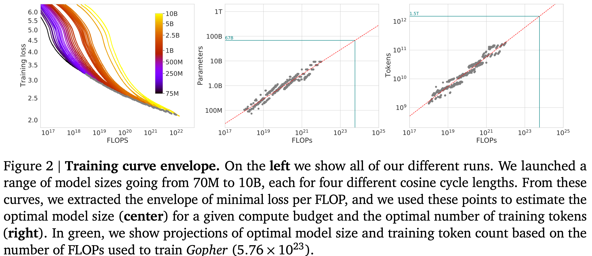
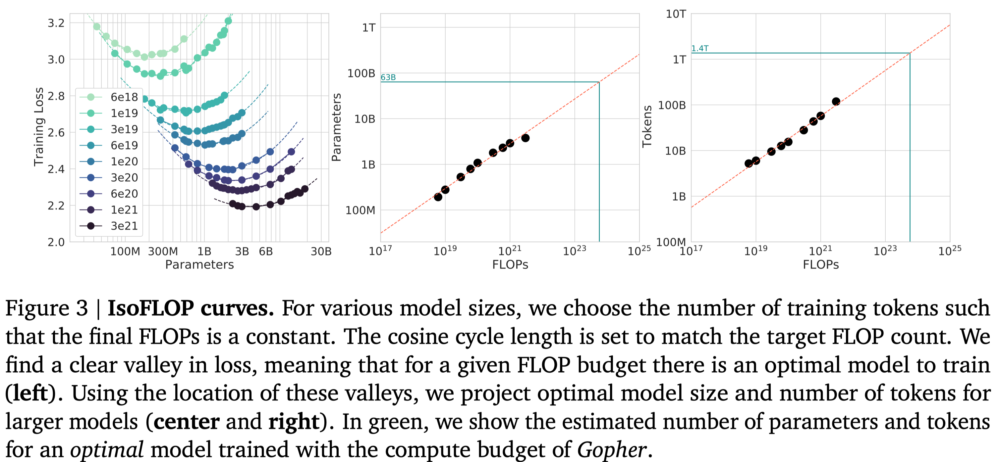
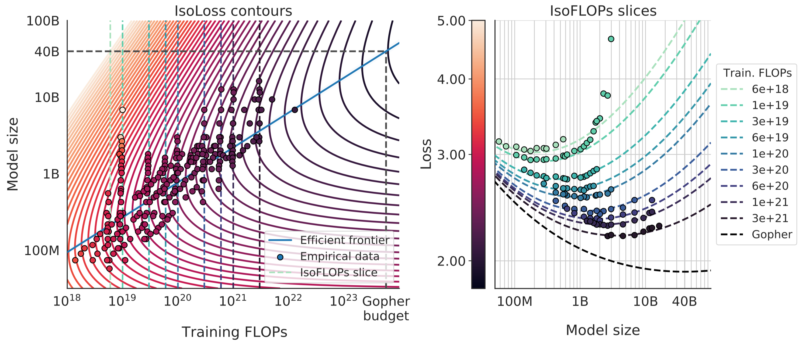
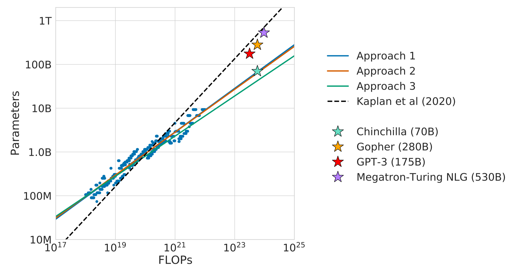
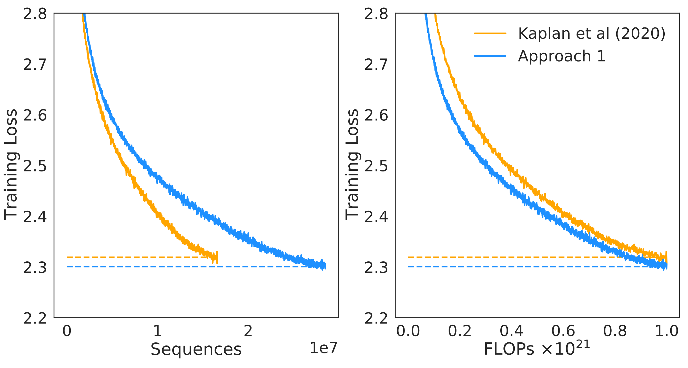
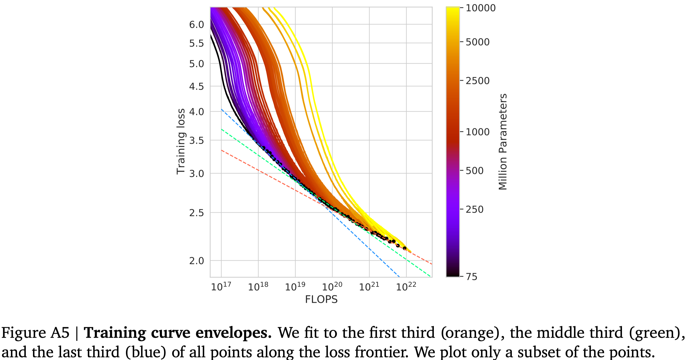

## Introduction

本文中关注的研究问题为：

> 给定一个 FLOPs budget, 如何平衡 model size 和 dataset size 之间的关系？

即，我们希望求解如下优化问题：

$$
N_{opt}(C), D_{opt}(C) =\arg\min_{N,D,\ \mathrm{s.t.}\ FLOPs(N,D)=C} L(N,D)
$$

作者通过训练 400 多个模型，构建了对应的 scaling law.

已有工作如 [Kaplan scaling law](https://maosong.website/p/kaplan-scaling-law/) 已经发现模型参数和大语言模型表现之间的关系，一个结论就是计算最优并不代表达到最优的 loss. 在本文中，作者也有相同结论，但是作者认为大模型应该使用比 [Kaplan scaling law](https://maosong.website/p/kaplan-scaling-law/) 推荐的更多的 training token. 基于这个发现，作者训练了 Chinchilla, 一个 70B 的 LLM, Chinchilla 相比 Gopher 表现有了大幅度的提升。

## Scaling Law

### Fix Model Size and Very Dataset Size

这个方法中，作者通过改变训练步数，来研究 FLOPs 与模型表现之间的关系，结果如下图所示

通过对实验结果进行拟合，作者发现存在关系 $N_{opt}(C)\propto C^a$ 以及 $D_{opt}(C)\propto C^b$, 拟合的结果为 $a=b=0.5$.

### IsoFLOPS Profiles

这个方法中，作者使用了不同的模型大小以及算力来构建最优模型参数量与算力之间的关系。作者给定 9 个算力配置，然后选取不同参数量的模型，训练的 token 数由算力和模型参数量决定，实验结果如下图所示

结果显示，不同大小的模型的表现 (loss) 随算力上升先下降后上升。因此给定算力，存在一个最优的 model size. 作者基于拟合出来的曲线得到了 Gopher 使用的算力配置下的最优 model size 和 training tokens. 同样的，作者得到 $a=0.49,b=0.51$.

### Fitting a Parametric Loss Function

这个方法中，作者对 $L(N,D)$ 进行建模，作者使用了如下的公式

$$
L(N,D) = E + \frac{A}{N^{\alpha}} + \frac{B}{D^{\beta}}
$$

第一项代表了建模的误差，第二项代表了数据集充分大损失与模型参数之间的关系，第三项代表了当模型充分训练时，损失与数据集大小之间的关系。

为了求解 $(A,B,E,\alpha,\beta)$, 作者基于训练收集到的数据 $L(N_i,D_i)$, 通过 L-BFGS 算法来最小化 Huber loss 进行求解，结果得到 $(A,B,E,\alpha,\beta)=(1.69, 406.4, 410.7, 0.34, 0.28)$.

将结果带入带上面的表达式中，然后求出梯度为 0 的点，就得到

$$
N_{opt}(C) = G\left(\frac C6\right)^a, D_{opt}(C) = G^{-1}\left(\frac C6\right)^b, \text{ where }G=\left(\frac{\alpha A}{\beta B}\right)^{1/(\alpha+\beta)}, a=\frac{\beta}{\alpha+\beta}, b=\frac{\alpha}{\alpha+\beta}
$$

带入数值之后就得到 $a=0.46$, $b=0.54$. 作者对结果可视化如下图所示，左图是拟合曲线的 Contour plot, 右图对左图的一个切片

### Optimal Model Scaling

作者将三种方法的结果以及 [Kaplan scaling law](https://maosong.website/p/kaplan-scaling-law/) 的结果总结放在下表中，作者假设 $N_{opt}(C)\propto C^a$ 以及 $D_{opt}(C)\propto C^b$

| Approach   | $a$  | $b$  |
| ---------- | ---- | ---- |
| Kaplan     | 0.73 | 0.26 |
| Approach 1 | 0.50 | 0.50 |
| Approach 2 | 0.49 | 0.51 |
| Approach 3 | 0.46 | 0.54 |

结果表明，三种方法的结论差不多：model size 和 dataset size 增长 debility 差不多。

作者因此给出来的不同模型大小所需要的算力以及 token, 结果如下表所示

| Parameters | Approach 1 |         | Approach 2 |         | Approach 3 |         |
| ---------- | ---------- | ------- | ---------- | ------- | ---------- | ------- |
|            | FLOPs      | Tokens  | FLOPs      | Tokens  | FLOPs      | Tokens  |
| 400 M      | 1.92e+19   | 8.0 B   | 1.84e+19   | 7.7 B   | 1.84e+19   | 7.7 B   |
| 1 B        | 1.21e+20   | 20.2 B  | 1.20e+20   | 20.0 B  | 1.20e+20   | 20.0 B  |
| 10 B       | 1.23e+22   | 205.1 B | 1.32e+22   | 219.5 B | 1.32e+22   | 219.5 B |
| 67 B       | 5.76e+23   | 1.5 T   | 6.88e+23   | 1.7 T   | 6.88e+23   | 1.7 T   |
| 175 B      | 3.85e+24   | 3.7 T   | 4.54e+24   | 4.3 T   | 4.54e+24   | 4.3 T   |
| 280 B      | 9.90e+24   | 5.9 T   | 1.18e+25   | 7.1 T   | 1.18e+25   | 7.1 T   |
| 520 B      | 3.43e+25   | 11.0 T  | 4.19e+25   | 13.4 T  | 4.19e+25   | 13.4 T  |
| 1 T        | 1.27e+26   | 21.2 T  | 1.59e+26   | 26.5 T  | 1.59e+26   | 26.5 T  |
| 10 T       | 1.30e+28   | 216.2 T | 1.75e+28   | 292.0 T | 1.75e+28   | 292.0 T |

作者基于发现的 scaling law, 对已有模型进行了探究，发现现有的大模型都存在 under-training 的现象，结果如下图所示

实验结果显示，现有的大模型的 size 应该更小（或者需要更大的算力）。作者最终的结论就是，现有的比较小的模型，需要更多的算力才能达到更好的表现。

## Chinchilla

基于上一节的发现，作者提出了 Chinchilla, 一个 70B 的模型，训练使用了 1.4T token. 训练的数据集为 MassiveText 的扩展版本，训练使用的优化器为 AdamW, tokenizer 为 SentencePiece.

模型配置如下表所示

| Model          | Layers | Number Heads | Key/Value Size | dmodel | Max LR            | Batch Size  |
| -------------- | ------ | ------------ | -------------- | ------ | ----------------- | ----------- |
| Gopher 280B    | 80     | 128          | 128            | 16384  | $4\times 10^{-5}$ | $3M\to6M$   |
| Chinchilla 70B | 80     | 64           | 128            | 8192   | $1\times 10^{-5}$ | $1.5M\to3M$ |

### Ablation Study

**learning rate schedule**
作者还通过 ablation study 发现，cosine learning rate cycle length 应该和训练步数差不多，当 cycle length 太长时，模型表现会下降。

**Optimizer**
作者对比了 [Adam](https://maosong.website/p/notes-on-adam/) 和 [AdamW](https://maosong.website/p/notes-on-adamw/) 的表现，结果发现，AdamW 的表现优于 Adam.

**High Precision**
训练时，作者使用了高精度也就是 `float32` 来保存梯度的状态，结果显示，不管是 Adam 还是 AdamW, 使用高精度都可以提高模型的表现

**Comparison with Kaplan**
作者还对比了 Chinchilla 和 Kaplan 的预测结果，如下图所示

结果显示，基于 Chinchilla 预测得到的模型训练效果比 Kaplan 的更好。

**Curvature of the FLOPs-frontier**
作者发现，FLOP-minimal loss frontier 存在 curvature, 也就是小模型和大模型预测出来的曲线是不一样的，作者将结果展示在下图中

结果显示，从小模型拟合出来的结果比大模型拥有更高的算力使用效率，作者认为这是未来的一个研究方向。

## Conclusion

本文中作者重新探究了针对 LLM 的 scaling law, 作者发现已有的大模型都存在 under-training 的现象，也就是说，模型需要更多的训练 token, 具体来讲，model size scaling 和 dataset scaling 应该处于同一水平。作者基于这个结论，提出了 Chinchilla, 一个 70B 的 LLM, 其表现超过了 280B 的 LLM.

## References

- [arxiv](http://arxiv.org/abs/2203.15556)
