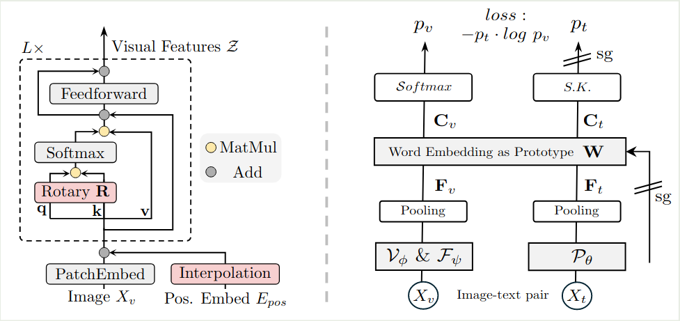
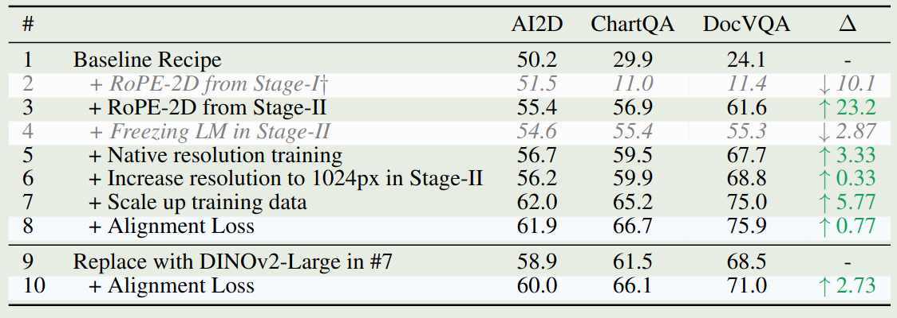

## Introduction

作者首先提到已有的 vision foundation model (VFM) 存在两个问题：

1. 不能处理动态分辨率图片输入，尽管我们可以使用 Bilinear interpolation 和 multi-resolution training 等方法，但是模型对于动态分辨率图片输入处理能力仍然不足
2. VFM 和 LLM 之间存在 representation gap

针对这两个问题，作者提出了 CoMP, 一个 continual pre-training pipeline, CoMP 包含两个模块：

1. C-RoPE, 一个针对 VFM 的 continual RoPE, 用于帮助 VFM 处理动态分辨率图片输入
2. Alignment  Loss, 用于对齐 VFM 和 LLM 的 representation

## Method

CoMP 整体的架构图如下所示

可以看到，CoMP 本质上就是一个多模态大模型，知识我们训练的目标为 VFM

### C-RoPE

C-RopE 的核心思想是结合绝对位置编码以及相对位置编码来使得 pre-trained ViT 可以接受任意精度图片输入，对于输入图片 $X_V\in\mathbb{R}^{H\times W}$, 首先经过 patchify 得到 $N=HW/P^2$ 个 patch, 这里 $P$ 是 patch size, 每个 patch 大小为 $x_p\in\mathbb{R}^{N\times (P^2\cdot C)}$, $C$ 是 channels. 然后 VFM 每一个 layer 的计算过程为

$$
\begin{aligned}
z_0 &= [x_p^1E;\dots;x_p^NE] + \mathrm{Int}(E_{pos})\\
q_i,k_i,v_i &= \mathrm{Proj}_q(z_i), \mathrm{Proj}_k(z_i), \mathrm{Proj}_v(z_i)\\
y_i &= z_i + \mathrm{Proj}_o(\mathrm{Softmax}\left((Rq_i)^T(Rk_i) / D_v\right)v_i)\\
z_{i+1} &= y_i + \mathrm{FFN}(y_i)
\end{aligned}
$$

这里 $E\in\mathbb{E}^{P^2\cdot C\times D_v}$, $E_{pos}\in\mathbb{R}^{N\times D_V}$ 分别是 patch embedding 和 learnable position embedding, $\mathrm{Int}(\cdot)$ 是 bilinear interpolation.

相比于 [ViT](https://maosong.website/p/notes-on-vit/), C-RoPE 做出了两点改动：

1. 使用了 Interpolation 来支持动态分辨率图片输入
2. 使用了 RoPE 来高效利用位置信息

### Text-supervised Generative Pre-training

作者还是用了 LLM 的 cross-entropy loss 来进行对齐，text decoding loss 定义为

$$
\mathcal{L}_{dec} = -\frac1T\sum_{i=V+1}^{V+T}\log P(X_i\mid X_{<i}, H_v)
$$

其中 $H_v=\mathcal{F}_{\psi}(\mathcal{V}(X_V))$ 是视觉特征，$T, V$ 分别代表了文本 token 和视觉 token 个数

### Vision-language Representation Alignment

text-decoding loss 可以对其视觉特征和文本特征，但是对于使用自监督训练方式的 VLM, 比如 [DINOv2](DINOv2.md), 其预训练目标与 text-decoding loss 之间存在较大 gap, 为了解决这个问题，作者提出了 alignment loss.

具体做法就是先计算出文本和视觉特征：

$$
F_v = \mathrm{Pool}(H_v), F_t = \mathrm{Pool}(P_{\theta}(X_t))
$$

然后作者将 $F_v, F_t$ 映射到语言空间，

$$
C_v = W^TF_v, C_t=W^TF_t
$$

这里 $W\in\mathbb{R}^{D_t\times K}$, $D_t, K$ 分别为 LLM 的 hidden size 以及 vocabulary size.

接下来作者使用了 iterative Sinkhorn-Knopp 算法来归一化 $C_t$

$$
p_t=\mathrm{Diag}(u_W)\exp(\frac{C_t}{\epsilon})\mathrm{Diag}(v)
$$

这里 $u_W\in\mathbb{R}^K$ 是 words 的 prior marginal distribution,$v\in\mathbb{R}^B$ 是 renormalization vector

最终 alignment loss 定义为

$$
\mathcal{L}_{align} = -p_t\log p_v
$$

这里 $p_v=\mathrm{softmax}(C_v)$, 作者对 LLM 使用了 stop gradient 操作，仅训练 VFM

### Training

CoMP 训练分为三个阶段：

- Stage 1: warming up, 仅训练 adapter
- Stage 2: 所有模型参数参与训练，使用了 RoPE 2D 和高精度图片输入
- Stage 3: instruction tuning, 使用 RoPE 2D 和动态分辨率图片输入

训练的损失为

$$
\mathcal{L} = \begin{cases}
\mathcal{L}_{dec} + \alpha \mathcal{L}_{align}, &\text{Stage 1 and Stage 2}\\
\mathcal{L}_{dec}, &\text{Stage 3}
\end{cases}
$$

## Experiments

作者基于 [CLIP](CLIP.md), [SigLIP](SigLIP.md), [SigLip-2](SigLip-2.md), [DINOv2](DINOv2.md), [AIMv2](AIMv2.md) 等 VFM 进行了实验，主要结果如下图所示

作者还对 training recipe 进行的消融实验，结果如下，可以看到，RoPE-2D 对模型表现提升最大，数据量和动态分辨率图片输入次之

作者还对 C-RoPE 以及 alignment loss 进行的消融实验，结果如下图所示

## Conclusion

作者在本文中提出了 CoMP，一个 continual pre-training VFM 的方法，通过 C-RoPE 以及 alignment loss, 作者提高了 VFM 在 MLLM 中的表现

## References

- [arxiv](http://arxiv.org/abs/2503.18931)
