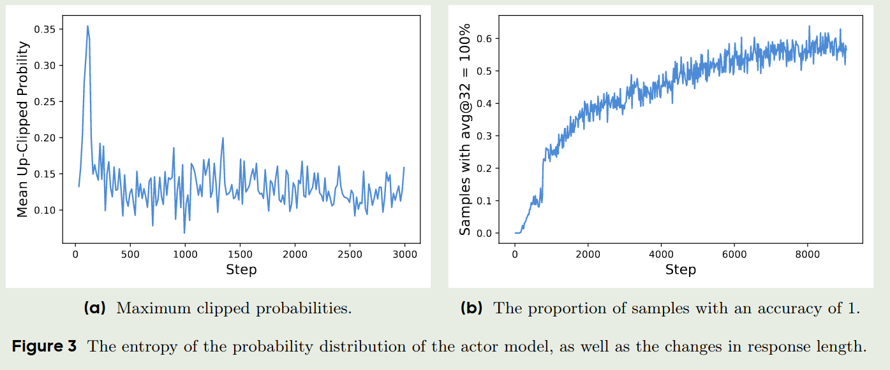
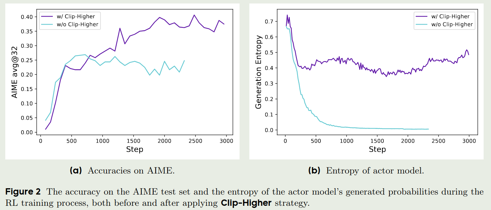
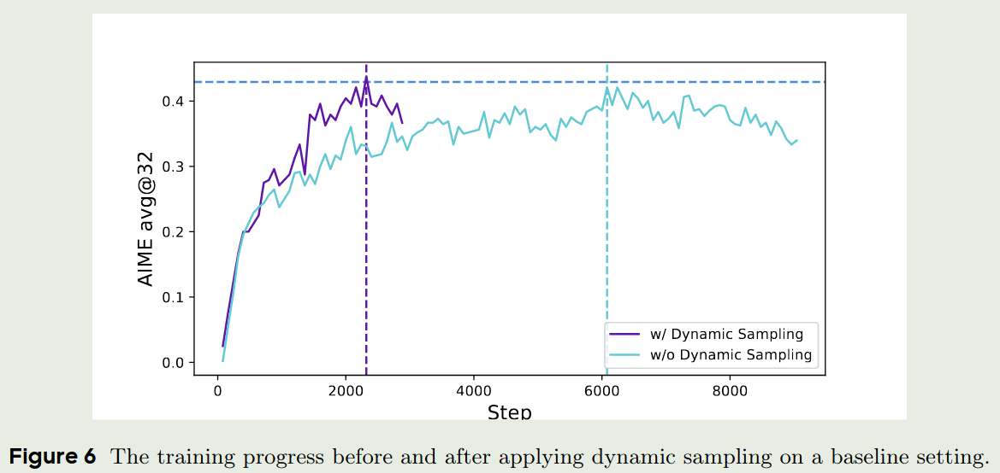
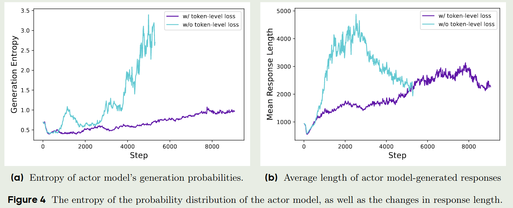
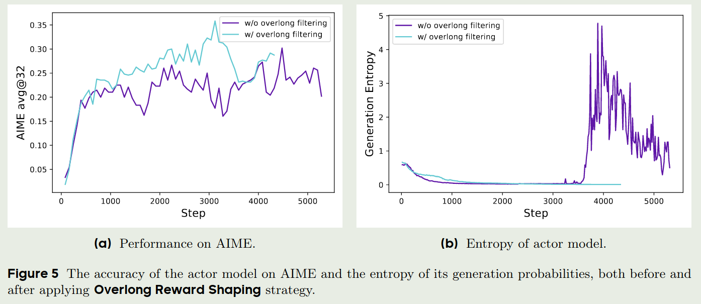
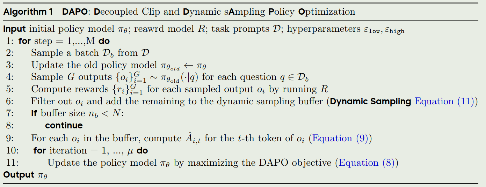
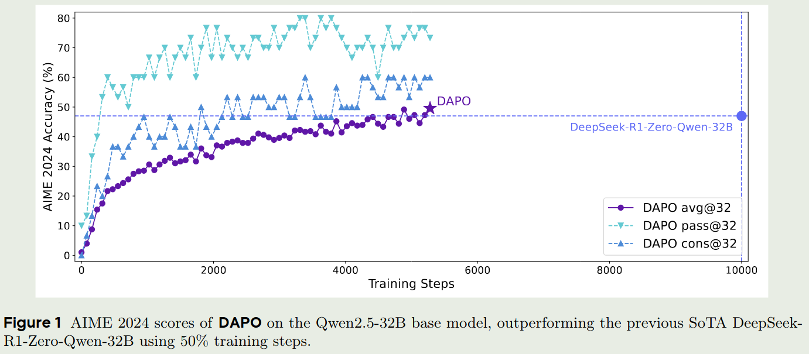
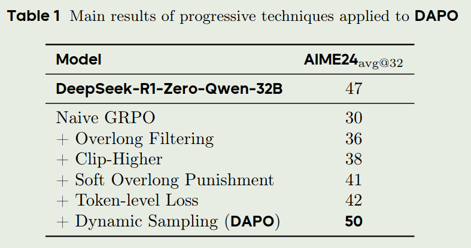
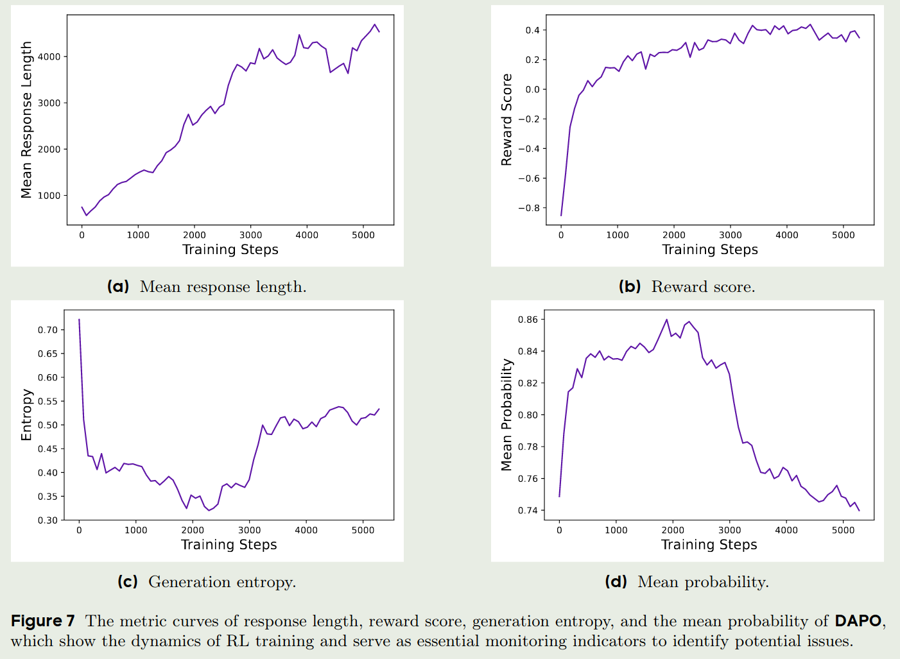

# Introduction

字节Seed团队和清华合作提出了DAPO，一种全开源的，基于PPO的强化学习方法，一用于提升LLM的reasoning能力。

# Preliminary

Preliminary包括PPO，GRPO还有KL divergence

## PPO

PPO的训练目标为：

$$
 \mathcal{J}_{\mathrm{PPO}}(\theta) = \mathbb{E}_{(q,a)\sim\mathcal{D},o_{\leq t}\sim \pi_{\theta_{old}}(\cdot\mid q)}\left[ \min\left(r_t(\theta)\hat{A}_t,\mathrm{clip}\left(r_t(\theta), 1-\epsilon, 1+\epsilon\right)\hat{A}_t\right) \right]
$$

其中

$$
r_t(\theta) = \frac{\pi_{\theta}(o_t\mid q, o_{< t})}{\pi_{\theta_{old}}(o_t\mid q, o_{< t})}
$$

$(q,a)$ 是从数据集 $\mathcal{D}$ 采样的QA pair，$\epsilon>0$ 是一个超参数，$\hat{A}_t$ 是 $t$时刻的优势估计 (advantage estimator). 给定 value function $V$ 以及 reward function $R$, $\hat{A}_t$ 通过计算GAE得到：

$$
\hat{A}_t^{\mathrm{GAE}(\gamma, \lambda)}=\sum_{k=0}^{\infty}(\gamma\lambda)^k\delta_{t+k}
$$

其中

$$
\delta_k = R_k + \gamma V(s_{k+1})-V(s_k),\quad 0\leq \gamma,\lambda\leq 1
$$

## GRPO

相比于PPO，GRPO不依赖于value function, 因此不需要使用reward model. GRPO通过一组输出来估计value $V(s)$, 然后进行更新。具体来说，给定 QA pair $(q,a)$, 我们从$\pi_{\theta_{old}}$中采样$G$个输出 $\{o_i\}_{i=1}^G$, 接下来我们基于reward $\{R_i\}_{i=1}^G$ 使用如下表达式来估计group-level reward:

$$
\hat{A}_{i,t} = \frac{r_i - \mathrm{mean}(\{R_i\}_{i=1}^G)}{\mathrm{std}(\{R_i\}_{i=1}^G)}
$$

最后，GRPO的训练目标与PPO类似，只不过将 $\hat{A}_t$ 替换为 $\hat{A}_{i,t}$, 然后在分组上进行了归一化：

$$
\mathcal{J}_{\mathrm{GRPO}}(\theta) = \mathbb{E}_{(q,a)\sim\mathcal{D},\{o_i\}_{i=1}^G\sim \pi_{\theta_{old}}(\cdot\mid q)}\left[ \frac{1}{G}\sum_{i=1}^G\frac{1}{|o_i|}\sum_{t=1}^{|o_i|}\min\left(r_{i,t}(\theta)\hat{A}_{i,t},\mathrm{clip}\left(r_{i,t}(\theta), 1-\epsilon, 1+\epsilon\right)\hat{A}_{i,t}\right) \right]
$$

其中，

$$
r_{i,t}(\theta) = \frac{\pi_{\theta}(o_{i,t}\mid q, o_{i,< t})}{\pi_{\theta_{old}}(o_{i,t}\mid q, o_{i,< t})}
$$

## KL divergence

在传统的RLHF框架中，我们再PPO的基础上，增加了一个KL divergence正则项，用于约束新旧策略的差异。具体来说，给定旧策略 $\pi_{\theta_{old}}$ 和新策略 $\pi_{\theta}$，我们实际上优化的损失函数为

$$
\mathcal{J}_{\mathrm{RLHF}}(\theta) = \mathcal{J}_{\mathrm{PPO}}(\theta) - \beta\mathrm{KL}\left(\pi_{\theta_{old}}(\cdot\mid q)\|\pi_{\theta}(\cdot\mid q)\right)
$$

其中，$\beta$ 是一个超参数，用于平衡PPO损失和KL divergence损失。上面的PPO损失函数也可以改为GRPO损失函数。

作者在本文中认为，reasoning model和RLHF的训练目标是不一样的，RLHF加上KL divergence正则项，会使得模型在推理时过于保守，偏向于explotition而reasoning model则需要exploration。因此，作者在本文中去掉了这一项。

## Rule-based reward modeling

作者基于final accuracy来作为outcome reward, 避免模型训练出现reward hacking问题。reward function 如下：

$$
R(\hat{y},y) = \begin{cases}
    1, & \text{if is\_equivalent}(\hat{y},y) \\
    -1, & \text{otherwise}
\end{cases}
$$

# DAPO

DAPO基于GRPO改进，其优化的目标函数为：

$$
\mathcal{J}_{\mathrm{DAPO}}(\theta) =  \mathbb{E}_{(q,a)\sim\mathcal{D},\{o_i\}_{i=1}^G\sim \pi_{\theta_{old}}(\cdot\mid q)}\left[ \frac{1}{\sum_{t=1}^G|o_i|}\sum_{i=1}^G\sum_{t=1}^{|o_i|}\min\left(r_{i,t}(\theta)\hat{A}_{i,t},\mathrm{clip}\left(r_{i,t}(\theta), 1-\epsilon_{low}, 1+\epsilon_{high}\right)\hat{A}_{i,t}\right) \right]
s.t. \quad 0< \vert \{o_i\mid \text{is\_equivalent}(o_i,a)\} \vert < G
$$

其中，$\alpha$ 是一个超参数，用于约束输出数量, $r_{i,t}(\theta)$ 和 $\hat{A}_{i,t}$ 的定义与GRPO相同。

接下来就是DAPO算法的几个关键点：

## Clip-Higher

作者认为，PPO和GRPO存在entropy collapse问题，也就是policy的entropy会迅速的下降，导致最终每个group的输出基本都差不多，模型很难探索到新的知识。因此，作者提出了Clip-Higher策略，也就是说，让模型能够充分探索。

作者举了一个例子，当 $\epsilon=0.2$ 时，如果一个group的输出为 $[0.01, 0.9]$, 那么在clip之后，最大的更新幅度为 $[0.01, 0.9]\times 0.2=[0.002, 0.18]$. 这对于概率比较小的输出来说，很难帮助模型提升。因此，作者修改了其阈值。进一步地，作者分离了clip的阈值，分别使用 $\epsilon_{low}$ 和 $\epsilon_{high}$ 来约束更新幅度。作者通过实验验证了这个例子，结果如下图所示：

最后，加入Clip-Higher策略的DAPO的训练目标为，与GRPO的训练目标相比，我们使用 $\epsilon_{low}$ 和 $\epsilon_{high}$ 来约束更新幅度。

$$
\mathcal{J}_{\mathrm{DAPO}}(\theta) =  \mathbb{E}_{(q,a)\sim\mathcal{D},\{o_i\}_{i=1}^G\sim \pi_{\theta_{old}}(\cdot\mid q)}\left[ \frac{1}{\sum_{t=1}^G|o_i|}\sum_{i=1}^G\sum_{t=1}^{|o_i|}\min\left(r_{i,t}(\theta)\hat{A}_{i,t},\mathrm{clip}\left(r_{i,t}(\theta), 1-\epsilon_{low}, 1+\epsilon_{high}\right)\hat{A}_{i,t}\right) \right]
s.t. \quad 0< \vert \{o_i\mid \text{is\_equivalent}(o_i,a)\} \vert < G
$$

在实际训练中，作者使用了一个比较大的 $\epsilon_{high}$ 来保证概率较小的token也能有较大的概率被采样到。
Clip-Higher的实验结果如下图所示：

## Dynamic Sampling

作者认为，在GRPO中，如果一个group的输出全都是对的，那么其advantage会趋近于0，结果导致 policy 不会得到更新，这样就降低了采样效率。

为了解决这个问题，坐着提出了over-sample以及filtering策略，来过滤accracy等于1或者0的prompts,也就是DAPO中的约束项：

$$
s.t. \quad 0< \vert \{o_i\mid \text{is\_equivalent}(o_i,a)\} \vert < G
$$

通过增加这个约束项，我们可以保证每个group的输出不会趋同，从保证模型能够得到更新，以提高采样效率。实验结果如下图所示：

## Token-level policy gradient loss

GRPO采用了一个sample-level的loss计算方式，也就是GRPO首先在每个sample中计算每个token的损失并进行平均，然后在不同的sample中在此进行平均。在这种方式下，每个sample对最终的loss贡献是相同的。这样就导致两个问题：

1. 对于高质量的long answer，通过在token层面进行平均，因为answe比较长，因此整体loss会比较低，也就会降低这个sample的贡献，导致模型很难学习到长答案。
2. 一些非常长的sample，其往往包含gibberish或者repetitive tokens，这些sample对模型训练是有害的

因此，为了解决这个问题，作者提出了Token-level policy gradient loss，也就是我们改变了求和方式

$$
\frac{1}{G}\sum_{i=1}^G\frac{1}{|o_i|}\sum_{t=1}^{|o_i|}\left(\cdot\right)\to  \frac{1}{\sum_{t=1}^G|o_i|}\sum_{i=1}^G\sum_{t=1}^{|o_i|}\left(\cdot\right)
$$

通过这种方式，我们让长回答的loss贡献更大，从而提高模型学习长回答的能力。另一方面，现在每个token对整体loss的贡献是相同的，一些关键token的loss也会被放大，从而提高模型的表现。

实验结果如下图所示：

## Overlong reward shaping

与Kimi-k1.5类似，DAPO也增加了length penalty，用于惩罚过长的回答。作者首先使用了一个overlong filtering技巧，来mask掉truncated samples的loss，作者发现通过这个技巧，可以提升模型的训练稳定性以及表现，实验结果如下图所示

作者还提出了soft overlong punishment， 用于reshape truncated samples的reward，表达式如下：

$$
R_{length}(y) = \begin{cases}
    0, & \text{if } |y|\leq L_{\max}-L_{cache} \\
    \frac{(L_{\max}-L_{cache})-|y|}{L_{cache}}, & \text{if } L_{\max}-L_{cache}<|y|\leq L_{\max} \\
    -1, & \text{if } |y|>L_{\max}
\end{cases}
$$

## 算法

DAPO的算法流程如下：

# 实验

## 数据集

作者构建了DAPO-Math-17K数据集用于DAPO的训练，该数据集从AoPS得到，包含了17K prompts，每个prompt都对应一个整数作为答案。

## 训练细节

作者以GRPO作为baseline， $G=16$, $L_{\max}=16384$, $L_{cache}=4096$, $\epsilon_{low}=0.2$, $\epsilon_{high}=0.28$

评估时，使用AIME作为benchmark，以 avg@32作为指标，temperature设置为1.0, topp设置为0.7。

## 实验结果

DAPO与GRPO的对比如下图所示：

## Ablation study

作者探究了每一个部分对最终表现的影响，结果如下：

## traing dynamics

作者还探究了mean response length, reward score, generation entropy以及mean probability随训练轮数的变化，其中：

- mean response length: 在一定程度上反应了模型训练的稳定性和表现
- reward score: 反应模型的表现，作者认为，给定一个reliable reward signal， LLM可以很好的fit到训练数据集上，但是作者发现最终的reward与val score相关性比较大，很可能是因为模型过拟合了
- generation entropy & mean probability: 代表了模型的探索能力，通过实验结果可以看到，DAPO初期的探索能力比较强，但是随着训练的进行，探索能力下降，利用能力增强。

结果如下：

# 结论

作者基于GRPO提出了DAPO，一种全开源的，基于PPO的强化学习方法，用于提升LLM的reasoning能力。作者首先分析了GRPO损失函数存在的不足，然后进行了针对性改进，包括Clip-Higher, Dynamic Sampling, Token-level policy gradient loss以及Overlong reward shaping。作者通过实验验证了DAPO的有效性，并探究了DAPO的训练动态。

# Reference

1. [DAPO: An Open-Source LLM Reinforcement Learning System at Scale](http://arxiv.org/abs/2503.14476)
