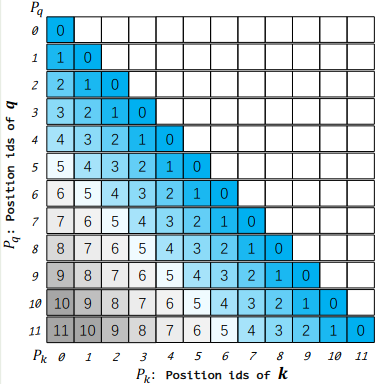
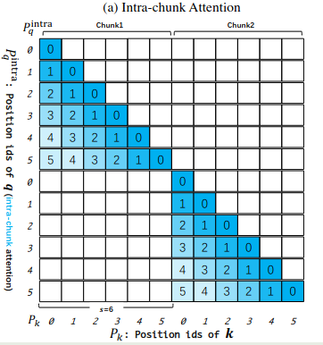
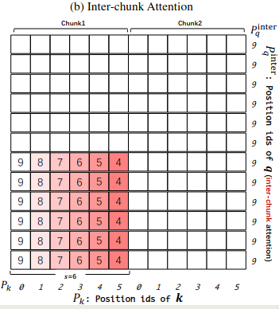
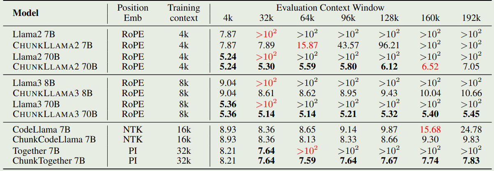
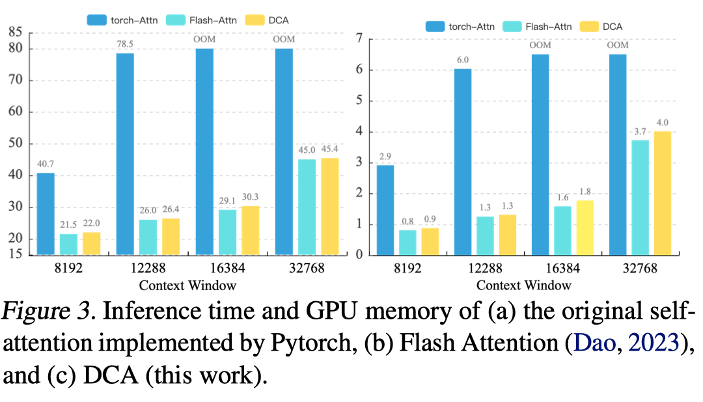
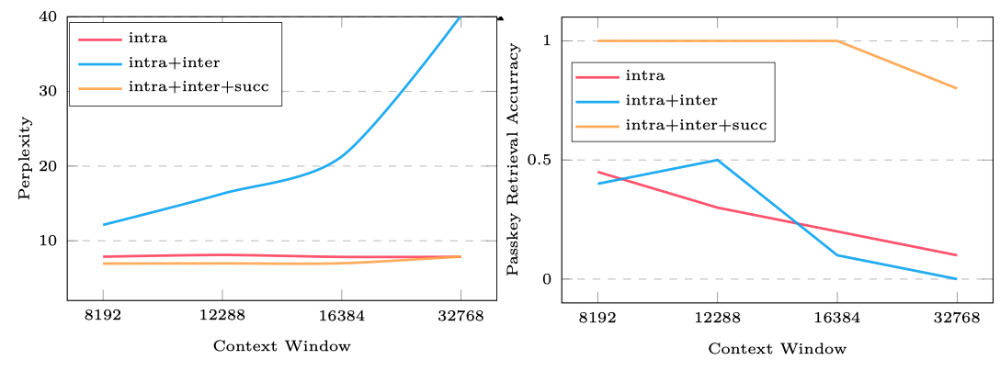

Dual Chunk Attention (DCA) 由阿里巴巴在 2024 年 9 月份提出，DCA 是一个无需训练的，扩展 LLM 上下文长度的方法，后续，DCA 被应用于 Qwen2, Qwen2.5, Qwen2.5-1M 以及 Qwen3 中，与 [YARN](https://maosong.website/p/notes-on-yarn/) 一起作为扩展模型上下文的有效手段

## Introduction

提升 LLM 上下文长度的方法可以分为两类：一类是 training-free 的，包括 LM-infinite 和 StreamingLLM 等，这些方法以损失 long range dependency 为代价来保持较低的 perplexity。另一类为了保留全局信息，则是通过外插来扩展模型的上下文，主要工作我们在 [YARN](https://maosong.website/p/notes-on-yarn/) 中已经回顾了。

第二类方法的问题在于，其依赖训练，在 training-free 的 setting 下，这些方法也会导致 perplexity 的上升

因此，在本文中，作者就提出了 Dual Chunk Attention (DCA) ，一个无需训练的，扩展 LLM 上下文长度的方法。DCA 的主要做法是将 attention 的计算进行分块，这样就可以提高计算效率。

通过实验，作者给出了三点关键发现：

1. **Extrapolation**： DCA 可以在无需训练的情况下，将 LLM 的上下文提升到 32K，而不导致 Perplexity 大幅度增加
2. **Orthogonality**： DCA 可以和其他方法一起使用，如 [YARN](https://maosong.website/p/notes-on-yarn/), 这一点已经在 Qwen2.5-1M 以及 Qwen3 中得到了应用
3. **Long Context Understanding**: DCA 可以在无需训练的情况下，在长上下文设置下，达到已有 SOTA 模型的表现

## Preliminary

对于一个长度为 $L$ 的 token 序列，我们首先定义对应的 position id 如下

$$
P_{\mathbf{q}} = [0,1,\dots,L-1],\quad P_{\mathbf{k}} = [0,1,\dots,L-1]
$$

然后，对于第 $i$ 个位置和第 $j$ 个位置的 token，其 attention score 定义为：

$$
\langle f(\mathbf{q}, i), f(\mathbf{k}, j)\rangle =\langle R_{\theta,i}\mathbf{q}, R_{\theta,j}\mathbf{k}\rangle =\mathbf{q}^TR_{\theta, i-j}\mathbf{k}
$$

具体细节参考 [Position Encoding](https://maosong.website/p/notes-on-position-encoding/) 中的 RoPE 部分介绍。这里面的关键在于，最后的结果只与相对位置 $i-j$ 相关，而与绝对位置 $i$ 和 $j$ 无关。因此，我们可以用一个相对位置矩阵 $M\in\mathbb{R}^{L\times L}$ 来表示这个信息，其中 $M_{ij}=P_{\mathbf{q},i}-  P_{\mathbf{k},j}$ 代表了第 $i$ 个位置的 query $\mathbf{q}$ 和第 $j$ 个位置的 key $\mathbf{k}$ 的相对位置信息，其示意图如下所示



原始版本的 RoPE 的问题在于，在训练时，模型没有见过更长的上下文，因此其泛化性也最差，这一点在 [YARN](https://maosong.website/p/notes-on-yarn/) 已经得到了验证

## Method

DCA 的关键在于将 sequence 分割为若干个 Chunk，然后将 attention 的计算拆分为三个部分：

1. intra-chunk：负责计算每个 chunk 内部的 attention
2. inter-chunk ：负责计算 chunk 之间的 attention
3. successive-chunk：负责计算相邻两个 chunk 之间的 attention

为了更好理解 DCA，我们接下来假设 $L=12$, 这时我们有

$$
P_{\mathbf{q}} = [0,1,\dots,11],\quad P_{\mathbf{k}} = [0,1,\dots,11]
$$

### Intra-Chunk Attention

我们首先定义个超参数 chunk size $s>0$, 然后我们将我们的 sequence 分割成 $L/s$ 个 chunk，然后每个 chunk 重新进行编号，就得到了如下的 position id

$$
P_{\mathbf{q}}^{Intra} = [0,1,\dots,L-1]\mod s,\quad P_{\mathbf{k}}^{Intra} = [0,1,\dots,L-1]\mod s
$$

接下来，我们定义 intra-chunk 的相对位置矩阵 $M$， 此时，我们仅在每个 chunk 内部进行计算 attention，即

$$
M[i][j] = \begin{cases} P_{\mathbf{q},i}^{Intra} -  P_{\mathbf{k},j}^{Intra},&\text{if}\lfloor  P_{\mathbf{q},i}/s \rfloor = \lfloor P_{\mathbf{k},j} /s\rfloor ,\\
0,&\text{otherwise}
\end{cases}
$$

在上面的例子中，假设 $s=6$, 那么我们新的 position id 就变成了

$$
\begin{aligned}
P_{\mathbf{q}}^{Intra} = [0,1,2,3,4,5,0,1,2,3,4,5]\\
P_{\mathbf{k}}^{Intra} = [\underbrace{0,1,2,3,4,5}_{\text{Chunk 0}},\underbrace{0,1,2,3,4,5}_{\text{Chunk 1}}]
\end{aligned}
$$

对其进行可视化，我们就得到



### Inter-Chunk Attention

接下来，我们来看一下不同 chunk 之间如何计算彼此的 attention。在 Intra-chunk attention 计算中，我们忽略了跨 chunk 的信息，而且，由于现在的 position id 不再是单调递增的了，我们直接使用 $P_{\mathbf{q}}^{Intra}$ 和 $P_{\mathbf{k}}^{Intra}$ 给出的位置信息不对，这也是为什么我们在 Intra-chunk attention 中要求 query 和 key 在同一个 chunk 中才能计算的原因。

为了解决这个问题，作者构建了一个新的 position id。首先我们引入一个新的超参数 $c>\max_i P_{\mathbf{q},i}$,  $c$ 代表了模型预训练时的上下文长度，如 4096。

接下来，基于 $c$, 我们定义新的 position id 如下：

$$
P_{\mathbf{q}}^{Inter} = [c-1,c-1,\dots,c-1]\in\mathbb{R}^s,\quad P_{\mathbf{k}}^{Inter} = P_{\mathbf{k}}^{Intra}
$$

> 注：这里的 $P_{\mathbf{q}}^{Inter}$ 指的是某一个 chunk 中的 position id，每个 chunk 中的 position id 都相同，请参考例子理解，后面不再赘述。

也就是说，在计算跨 chunk 的 attention 的时候，我们直接把 query 的 position id 设置为最大值，然后 key 的 position id 依然使用 intra-chunk 的位置信息。由于 $\max_i P_{\mathbf{k},i}=s-1$, 因此我们有

$$
M[i][j] = P_{\mathbf{q},i}^{Inter} -  P_{\mathbf{k},j}^{Inter} = c - 1 - P_{\mathbf{k},j}^{Inter}\geq c - 1 - (s- 1) \geq c-s.
$$

最后，我们对于 inter chunk 的位置矩阵 $M$ 定义如下：

$$
M[i][j] = \begin{cases} P_{\mathbf{q},i}^{Inter} -  P_{\mathbf{k},j}^{Inter},&\text{if}\lfloor  P_{\mathbf{q},i}/s \rfloor \neq \lfloor P_{\mathbf{k},j} /s\rfloor ,\\
0,&\text{otherwise}
\end{cases}
$$

在上面的例子中，当 $c=10$ 时，$c-1=9$,  我们有

$$
P_{\mathbf{q}}^{Inter}=[\underbrace{9,9,9,9,9,9}_{\text{Chunk 0}},\underbrace{9,9,9,9,9,9}_{\text{Chunk 1}}]
$$

对其进行可视化，得到



### Successive-Chunk Attention

现在我们既可以计算 intra-chunk，也可以计算 inter-block 的 attention，但是问题是对于相邻的 chunk，其位置信息不对了，从上面的可视化中，我们可以看到，当 $P_{\mathbf{q},i}=6$ , $P_{\mathbf{k},j}=5$ 时，我们有

$$
P_{\mathbf{q},i}^{Inter} -  P_{\mathbf{k},j}^{Inter}=9-5=4\neq 1 = P_{\mathbf{q},i}-P_{\mathbf{k},j}
$$

也就是说，inter-block 的 attention 会破坏原有的相对位置信息，因此我们就通过 successive chunk attention 来解决这个问题，使得 $P_{\mathbf{q},i}^{Inter} -  P_{\mathbf{k},j}^{Inter}\approx P_{\mathbf{q},i}-P_{\mathbf{k},j}$.

作者发现，这个问题不是所有的 chunk 都有，而是只存在于相邻的 chunk 中，因此，作者又加入了一个超参数 $w>0$ 代表了 local window size，我们可以直接将其设置为 $c-s$, 通过这个 local window，我们调整对应的 position id 如下：

$$
P_{\mathbf{q}}^{Succ} = [\overbrace{s,s+1,\dots,s+w-1}^{w \text{ elements}},c-1, \dots,c-1]\in\mathbb{R}^s,\quad P_{\mathbf{k}}^{Succ} = P_{\mathbf{k}}^{Inter}
$$

对于 successive chunk 的位置矩阵 $M$ 定义如下：

$$
M[i][j] = \begin{cases} P_{\mathbf{q},i}^{Inter} -  P_{\mathbf{k},j}^{Inter},&\text{if}\lfloor  P_{\mathbf{q},i}/s \rfloor - \lfloor P_{\mathbf{k},j} /s\rfloor=1 ,\\
0,&\text{otherwise}
\end{cases}
$$

在上面的例子中，我们设置 $w=4$, 就得到

$$
P_{\mathbf{q}}^{Succ}=[\underbrace{6,7,8,9,9,9}_{\text{Chunk 0}},\underbrace{6,7,8,9,9,9}_{\text{Chunk 1}}]
$$

对其进行可视化，得到


### Computation

接下来，我们把所有的改进放在一起，就得到

$$
M[i][j] = \begin{cases}
P_{\mathbf{q},i}^{Intra} -  P_{\mathbf{k},j},&\text{if}\lfloor  P_{\mathbf{q},i}/s \rfloor - \lfloor P_{\mathbf{k},j} /s\rfloor=0 ,\\
P_{\mathbf{q},i}^{Succ} -  P_{\mathbf{k},j},&\text{if}\lfloor  P_{\mathbf{q},i}/s \rfloor - \lfloor P_{\mathbf{k},j} /s\rfloor=1 ,\\
P_{\mathbf{q},i}^{Inter} -  P_{\mathbf{k},j},&\text{if}\lfloor  P_{\mathbf{q},i}/s \rfloor - \lfloor P_{\mathbf{k},j} /s\rfloor>1.
\end{cases}
$$

基于上面的位置矩阵 $M$， 我们再依次计算对应的 attention score

$$
\langle f(\mathbf{q}, i), f(\mathbf{k}, j)\rangle = \begin{cases}
\langle f(\mathbf{q}, P_{\mathbf{q},i}^{Intra})
, f(\mathbf{k}, P_{\mathbf{k},j})\rangle,&\text{if}\lfloor  P_{\mathbf{q},i}/s \rfloor - \lfloor P_{\mathbf{k},j} /s\rfloor=0 ,\\
\langle f(\mathbf{q}, P_{\mathbf{q},i}^{Succ})
, f(\mathbf{k}, P_{\mathbf{k},j})\rangle,&\text{if}\lfloor  P_{\mathbf{q},i}/s \rfloor - \lfloor P_{\mathbf{k},j} /s\rfloor=1 ,\\
\langle f(\mathbf{q}, P_{\mathbf{q},i}^{Inter})
, f(\mathbf{k}, P_{\mathbf{k},j})\rangle,&\text{if}\lfloor  P_{\mathbf{q},i}/s \rfloor - \lfloor P_{\mathbf{k},j} /s\rfloor>1.
\end{cases}
$$

## Code

首先是 `RotaryEmbedding` 部分的修改

```python
class DCARotaryEmbedding(nn.Module):
    def __init__(self, max_len, chunk_size, local_window):
        self.max_len = max_len
        self.chunk_size = chunk_size
        self.local_window = local_window

        self.inv_freq = ...

    def forward(self, x):
        q_t =  torch.arange(self.chunk_size)
        qc_t = (q_t + self.chunk_size).clamp(max=self.chunk_size)
        k_t = torch.arange(seq_len) % self.chunk_size

        q_freqs = torch.outer(q_t, self.inv_freq)  # seq_len x dim/2
        qc_freqs = torch.outer(qc_t, self.inv_freq)
        k_freqs = torch.outer(k_t, self.inv_freq)  # seq_len x dim/2

        q_emb = torch.cat((q_freqs, q_freqs), dim=-1)  # seq_len x dim
        qc_emb = torch.cat((qc_freqs, qc_freqs), dim=-1)
        k_emb = torch.cat((k_freqs, k_freqs), dim=-1)  # seq_len x dim
        # compute related sin, cos
        return q_sin, q_cos, qc_sin, qc_cos, k_sin, k_cos
```

attention 计算时的逻辑

```python
class Attention(nn.Module):
    def forward(...):
        
        key_states = apply_rotary_pos_emb(key_states, k_cos, k_sin, position_ids)
        q_states_intra = apply_rotary_pos_emb(query_states[:, :, :chunk_len, :], q_cos, q_sin,
                                              position_ids[:, :chunk_len])
        k_states_prev = key_states[:, :, :chunk_len, :]
        v_states_prev = value_states[:, :, :chunk_len, :]
        # first chunk
        flash_result = do_flash_attn(q_states_intra, k_states_prev, v_states_prev)
        flash_results.append(flash_result)
        remain_len = kv_seq_len - chunk_len

         while remain_len > 0:
            flash_per_chunk = []
            begin = kv_seq_len - remain_len
            curr_chunk_len = min(chunk_len, remain_len)
            end = begin + curr_chunk_len
            # current chunk, intra-chunk attention
            q_states_intra = apply_rotary_pos_emb(query_states[:, :, begin:end, :], q_cos, q_sin,
                                                  position_ids[:, begin:end])

            k_states_intra = key_states[:, :, begin:end, :]
            v_states_intra = value_states[:, :, begin:end, :]
            flash_result = do_flash_attn(q_states_intra, k_states_intra, v_states_intra)
            flash_per_chunk.append(flash_result)
            # successive chunk attention
            q_states_succ = apply_rotary_pos_emb(query_states[:, :, begin:end, :], qc_cos, qc_sin,
                                                 position_ids[:, begin:end])
            flash_result = do_flash_attn(q_states_succ, k_states_prev, v_states_prev, False)
            flash_per_chunk.append(flash_result)
            # inter chunk attention
            if begin - (k_states_prev.size(-2)) > 0:
                prev_len = k_states_prev.size(-2)
                q_states_inter = apply_rotary_pos_emb(query_states[:, :, begin:end, :], qc_cos, qc_sin,
                                                      position_ids[:, chunk_len - 1][:, None].repeat(1, curr_chunk_len))
                k_states_inter = key_states[:, :, :begin - prev_len, :]
                v_states_inter = value_states[:, :, :begin - prev_len, :]
                flash_result = do_flash_attn(q_states_inter, k_states_inter, v_states_inter, False)
                flash_per_chunk.append(flash_result)

            flash_results.append(flash_per_chunk)
            k_states_prev = k_states_intra
            v_states_prev = v_states_intra
            remain_len = remain_len - chunk_len
        # merge the final results
        attn_output = merge_attn_outputs(flash_results)
```

## Evaluation



作者还分析了一下 DCA 的效率，结果如下



可以看到，在 [flash attention](https://maosong.website/p/notes-on-flashattention/) 的基础上加上 DCA 之后，内存占用和推理时间并没有发生太大变化

作者还分析了三种 attention 对结果的贡献，如下图所示



结果显示，intra block 的 perplexity 是最低的，但是其在下游任务上表现是最差的。当三者结合在一起之后，perplexity 和下游任务上的表现都是最好的。

## Conclusion

本文中，我们回顾了 Qwen 系列扩展大模型上下文的方法 Dual Chunk Attention （DCA） 通过将 attention 切分成更小的 chunk，然后将 attention 的计算分为 intra-chunk，inter-chunk 和 successive-chunk，分别处理 chunk 内部，chunk 之间以及相邻 chunk 的 attention，通过这种方式，在无需训练的情况下，我们可以有效将模型上下文长度扩展 4 倍以上。

## References

- [Arxiv](http://arxiv.org/abs/2402.17463)
- [Github](https://github.com/HKUNLP/ChunkLlama/tree/main)
