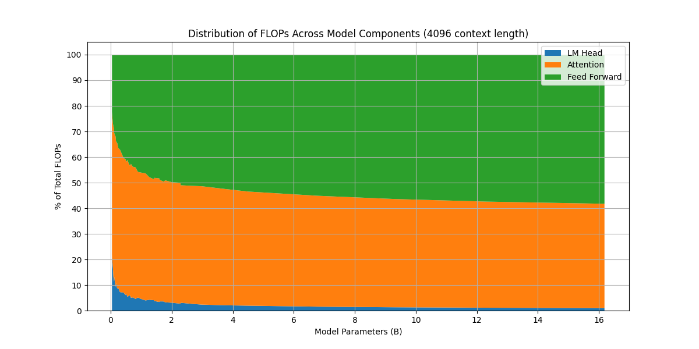
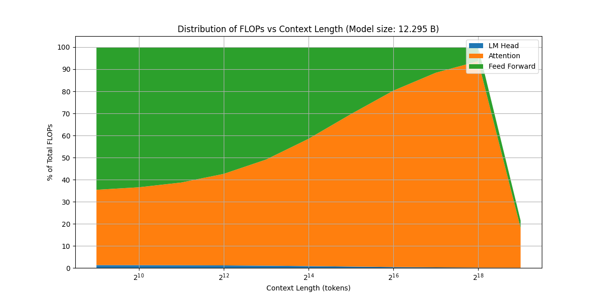

本文中，我们介绍如何计算基于 transformer 架构的 LLM 的 FLOPs, 计算完成之后，我们可以推导出算力 $C$ 与模型参数量 $N$，数据集大小 $D$ 之间的关系，即 $C\approx 6ND$.

## Background

### FLOPs

FLOPs，floating point operations，表示浮点数运算次数，一般计算 FLOPs 仅考虑加法和乘法。

> 假设 $A\in\mathbb{R}^{m\times p}$, $B\in\mathbb{R}^{p\times n}$,  则 计算 $C=AB$ 的过程中一共需要进行 $mnp$ 次乘法运算和 $mnp$ 次加法运算，因此总的 FLOPs 为 $2mnp$.

### Assumption

> 假设 $A\in\mathbb{R}^{m\times p}$, $B\in\mathbb{R}^{p\times n}$,  $C\in\mathbb{R}^{m\times n}$ 则 计算 $D=AB+C$ 的过程中一共需要进行 $mnp$ 次乘法运算和 $mnp+mn$ 次加法运算，因此总的 FLOPs 为 $2mnp+mn\approx 2mnp$.

基于上述结论，我们计算 FLOPs 时，忽略 element-wise 的操作，即我们做如下假设：

1. 忽略 normalization 中的小常数项运算
2. 忽略 residual connection 和 bias term 的加法
3. 忽略注意力的 MASK 和 softmax，因为这两者都是 element-wise operation.
4. 使用 look-up 计算 embedding  layer

> 注，基于以上假设，我们的结果与 Chinchilla Scaling law 的结果稍有不同，但结论不变。

### Notation

| Math Variable  | Code Variable         | Description              |
| -------------- | --------------------- | ------------------------ |
| $n$            | `num_hidden_layers`   | Transformer block 个数     |
| $\vert V\vert$ | `vocab_size`          | 词表大小                     |
| $d$            | `hidden_size`         | token embedding 的维度      |
| $d_{ff}$       | `intermediate_size`   | MLP 的中间层的维度              |
| $h$            | `num_attention_heads` | query head 的个数           |
| $s$            | `seq_len`             | length of token sequence |

> 注：为了避免混淆，我们使用 $n$ 来表示 decode layer 的个数。

## Computation

我们计算训练阶段的总 FLOPs, 记为 $C$,  [Kaplan scaling law](https://maosong.website/p/kaplan-scaling-law/) 用 PF-days 作为单位，$1\text{ PF-Days}=10^{15}\times 24\times 3600\ FLOPs$. 训练阶段包括前向阶段 (forward pass) 和反向传播阶段 (backward pass). 因此

$$
C = FLOPs(\text{forward}) + FLOPs(\text{backward})
$$

### Forward

decoder-only transformer 的模型架构包含三个模块：

1. 1 层 embedding layer
2. $n$ 层 decoder layer
3. 1 层 lm head layer

因此模型总的 FLOPs 为

$$
FLOPs(\text{forward}) = FLOPs(\text{embedding}) + n*FLOPs(\mathrm{decode\_layer})+FLOPs(\mathrm{lm\_head})
$$

#### Embedding & Lm Head

首先，对于 embedding layer, embedding layer 本质上是一个 look up table, 计算过程中不涉及浮点数运算，因此 $\boxed{FLOPs(\text{embedding})=0}$.

接下来，对于 `lm_head`, 这是一个 linear layer, 其权重大小为 $W\in\mathbb{R}^{d\times |V|}$,  输入为 $x\in\mathbb{R}^{s\times d}$, 因此 $\boxed{FLOPs(\mathrm{lm\_head})=2sd|V|}$.

因此，我们有

$$
FLOPs(\text{forward}) = n*FLOPs(\mathrm{decode\_layer})+ 2sd|V|
$$

#### Decode Layer

对于 `decode_layer`, 其又包含了四个模块：

1. pre-normalization
2. attention
3. post-normalization
4. FFN

pre-normalization 和 post-normalization 一般是一样的，因此

$$
\begin{aligned}
FLOPs(\mathrm{decode\_layer}) &= FLOPs(\mathrm{pre\_normoalization}) + FLOPs(\mathrm{Attention}) + FLOPs(\mathrm{post\_normoalization}) +FLOPs(\mathrm{FFN})\\
&= 2*FLOPs(\mathrm{normoalization}) + FLOPs(\mathrm{Attention})+FLOPs(\mathrm{FFN})
\end{aligned}
$$

#### Normalization

现在有两种常见的 normalization, 也就是 LayerNorm 和 RMSNorm

LayerNorm 定义如下

$$
\mathrm{LayerNorm}(x) = \frac{x-\mathbb{E}[x]}{\sqrt{\mathrm{var}[x]+\epsilon}}\odot \beta + \gamma
$$

其中 $\beta,\gamma\in\mathbb{R}^d$ 是可学习的参数。

对输入 $x\in\mathbb{R}^{s\times d}$,  均值需要约 $sd$ 次 FLOPs，方差 $\mathrm{var}[x]$ 只需要约 $3sd$ 次 FLOPs，这两者的计算都可以忽略。接下来就是 scaling 和 shift, 这两者都是 element-wise 操作，我们这里，因此总的 FLOPs 为

$$
\boxed{FLOPs(\mathrm{normoalization}) = 4sd}
$$

RMSNorm 的作用和 LayerNorm 是一样的，但是实现上更简单

$$
\mathrm{RMSNorm}(x) = \frac{x}{\sqrt{\|x\|_2^2+\epsilon}}\odot \gamma
$$

其中 $\gamma\in\mathbb{R}^d$ 是可学习的参数

对于 RMSNorm，其分析方式与 LayerNorm 基本一致，因此总的 FLOPs 为

$$
\boxed{FLOPs(\mathrm{normoalization}) = 4sd}
$$

总之，不管使用哪种 normalization，其 FLOPs 都是

$$
\boxed{FLOPs(\mathrm{normoalization}) = 4sd}
$$

#### Attention

Attention 定义如下

$$
\mathrm{Attention}(X) = \mathrm{softmax}\left(\frac{QK^T}{\sqrt{d}}\right)V\in\mathbb{R}^{m\times d}
$$

其中 $X\in\mathbb{R}^{s\times d}$, $W_Q,W_K,W_V\in\mathbb{R}^{d\times d}$

$$
Q = W_QX\in\mathbb{R}^{s\times d},\quad
K =W_KX\in\mathbb{R}^{s\times d},\quad
V = W_VX\in\mathbb{R}^{s\times d}
$$

$Q,K,V$ 计算的 FLOPs 为 $6*sd^2$.  $QK^T$ 的 FlOPs 为 $2s^2d$, $\mathrm{softmax}(\cdot)V$ 的 FLOPs 为 $2s^2d$, 最后对于 multi-head attention 还有一个 output projection layer, 其权重为 $W_O\in\mathbb{R}^{d\times d}$, 因此 FLOPs 为 $2sd^2$. 故 attention 最终的 FLOPs 为

$$
FLOPs(\mathrm{Attention})=6sd^2+2s^2d+2s^2d+2sd^2=\boxed{8sd^2+4s^2d}
$$

#### FFN

对于 FFN，有两种常见的形式，一种基于 ReLU 激活函数，其定义如下

$$
y = \max(xW_1+b_1, 0)W_2 + b_2
$$

其中 $W_1\in\mathbb{R}^{d_{ff}\times d}$, $W_2\in\mathbb{R}^{d\times d_{ff}}$. $b_1\in\mathbb{R}^{d_{ff}}$, $b_2\in\mathbb{R}^{d}$.

对输入 $x\in\mathbb{R}^{s\times d}$, 其 FLOPs 为

$$
FLOPs(\mathrm{FFN_{ReLU}}) = 2sdd_{ff} + 2sd_{ff}d =\boxed{4sdd_{ff}}
$$

其中第一项和第二项分别为为 $xW_1$ 与 $\max(xW_1+b_1, 0)W_2$ 的 FLOPs.

另一种基于 SwiGLU 激活函数，其定义为

$$
\mathrm{SwiGLU}(x) = x\odot \sigma(x)
$$

其中 $\sigma(\cdot)$ 是 sigmoid 函数

FFN 的定义为

$$
y = W_2(W_3x\odot \mathrm{SwiGLU}(W_1x))
$$

其中 $W_3,W_1\in\mathbb{R}^{d_{ff}\times d}$, $W_2\in\mathbb{R}^{d\times d_{ff}}$.

对输入 $x\in\mathbb{R}^{s\times d}$, 其 FLOPs 为

$$
FLOPs(\mathrm{FFN_{SwiGLU}}) = 2sdd_{ff} + 2sdd_{ff} + 2sd_{ff}d = \boxed{6sdd_{ff}}
$$

#### Summary

最终，decoder-only transformer 的 FLOPs 计算量为 （我们假设使用 multi-head attention, 基于 SwiGLU 的 MLP）

$$
\begin{aligned}
FLOPs(\text{forward}) &= FLOPs(\text{embedding}) + n*FLOPs(\mathrm{decode\_layer})+FLOPs(\mathrm{lm\_head})\\
&= n*FLOPs(\mathrm{decode\_layer})+2sd|V|\\
&= n*(2*FLOPs(\mathrm{normoalization}) + FLOPs(\mathrm{Attention})+FLOPs(\mathrm{FFN}))+2sd|V|\\
&= n*(8sd+8sd^2+4s^2d+6sdd_{ff})+2sd|V|\\
&= nsd^2\left(\frac8d + 8+\frac{4s}{d}+\frac{6d_{ff}}{d}+\frac{2|V|}{nd}\right)\\
&\approx \boxed{nsd^2\left(8+\frac{4s}{d}+\frac{6d_{ff}}{d}+\frac{2|V|}{nd}\right)}
\end{aligned}
$$

这里我们丢弃了 normalization 项，因为 normalization 的 FLOPs 是一个低阶项

### Backward

首先，我们有如下结论：

> 神经网络 backward 过程的计算量（FLOPs）为 forward 过程的两倍

我们使用一个简单的例子来证明这个结论，考虑线性层 $h=Wx$, 其中 $W\in\mathbb{R}^{m\times d}$, 对于输入 $x\in\mathbb{R}^{d\times 1}$ 其 forward 过程的计算量为 $2md$.

对于反向过程，我们需要分别计算损失 $L$ 对权重和输入的梯度，即

$$
\frac{\partial L}{\partial x} = W^T\frac{\partial L}{\partial h}\in\mathbb{R}^{d\times 1}, \quad\frac{\partial L}{\partial W} = \frac{\partial L}{\partial h}\otimes x^T\in{m\times d},
$$

这里 $\frac{\partial L}{\partial h}\in\mathbb{R}^{m\times 1}$ 为损失对输出 $h$ 的梯度。因此反向传播的总计算量为

$$
2dm + 2md = 4md
$$

这里的两项分别是对 $x$ 和 $W$ 求梯度的 FLOPs.

### Overall

将前向传播和反向传播的计算量汇总我们就得到一次前向传播和一次反向传播过程中，对于长度为 $s$ 的 token, 其 FLOPs 为 (multi-head attention, SwiGLU-FFN)

$$
\begin{aligned}
C &= FLOPs(\text{forward}) + FLOPs(\text{backward})\\
&= 3FLOPs(\mathrm{forward}) \\
&\approx \boxed{3nsd^2\left(8+\frac{4s}{d}+\frac{6d_{ff}}{d}+\frac{2V}{nd}\right)}
\end{aligned}
$$

### Extension

#### GQA

GQA 与 MHA 不同的地方在于通过共享 key 和 value 来降低 KV cache 的占用，我们假设 group number 为 $g$, 则 key 和 value 的 FLOPs 现在变成了

$$
2sdd_h\frac{h}{g}+2sdd_h\frac{h}{g}=4sdd_h\frac{h}{g}
$$

因此 attention 部分总的 FLOPs 变成了

$$
FLOPs(\mathrm{Attention})=4sd^2+2s^2d+2s^2d+4sdd_h\frac{h}{g}=4sd^2+4s^2d+4sdd_h\frac{h}{g}
$$

当 $g=h$ 时，GQA 就变成了 MHA, 此时的 FLOPs 也一致。

#### MoE

MoE 是针对 Dense FFN 的一个改进，介绍见 [MoE](MoE.md), 我们假设一共有 $e$ 个路由专家，其中激活 $k$ 个。

Gate layer 一般是一个 linear layer, 其权重矩阵大小为 $W_{G}\in\mathbb{R}^{d\times e}$, 因此 $FLOPs(\text{router})= 2sde$.

Expert layer 和前面提到的 FFN 一致，我们每次挑选出 $k$ 个专家进行计算，因此 expert 部分 $FLOPs(\text{expert})=6ksdd_{ff}$.

从而对于 MoE 来说，FFN 部分的 FLOPs 为

$$
FLOPs(\text{MoE}) = FLOPs(\text{router})+FLOPs(\text{expert})= \boxed{2sde+6ksdd_{ff}}
$$

### Simplification

我们已经得到了 transformer 的 FLOPs 计算表达式，但是其表达式比较繁琐，因此，在研究 scaling law 时，一般会进行简化。

首先，在 [LLM parameter analysis](https://maosong.website/p/llm-parameter-computation/) 中，我们已经给出了 LLM 参数量 $N$ （基于 [Qwen3](https://maosong.website/p/notes-on-qwen3/)）的计算结果

$$
N=n*(4d+3dd_{ff}+2hh_{d}d + 2h_{kv}h_dd) + d(2|V|+1)
$$

我们这里对其进行简化，一般来说 $d_{ff}=8/3d$, $h_{kv}=h$, $h_d=d/h$, 带入就得到

$$
N = n(4d+8d^2+2d^2+2d^2) + d(2|V|+1)=n(12d^2+4d)+ d(2|V|+1)
$$

我们忽略关于 $d$ 的一阶项，并且我们假设 $|V| << 12nd$, 则最终模型参数量可以近似为

$$
\boxed{N \approx 12nd^2}
$$

接下来，我们基于上面的配置简化 FLOPs 表达式

$$
\begin{aligned}
C &=
3nsd^2\left(8+\frac{4s}{d}+\frac{6d_{ff}}{d}+\frac{2|V|}{nd}\right) \\
&= 3nsd^2\left(24+\frac{4s}{d}+\frac{2|V|}{nd}\right)\\
&\approx 72nsd^2 \\
&= 6sN
\end{aligned}
$$

这里我们利用了前面的 $|V| << 12nd$ 假设，为了简便我们还舍弃了 $4s/d$.

注意到 $s$ 代表 token 序列长度，如果训练集的总 token 个数为 $D$, 则最终对于包含 $D$ tokens 的数据集和包含 $N$ 参数量的 LLM, 其训练总 FLOPs 可以近似估计为

$$
\boxed{C\approx 6ND}
$$

## Experiments

### Setting

接下来我们定量分析一些模型的 FLOPs. 我们基于 [Chinchilla scaling law](https://maosong.website/p/chinchilla-scaling-law/) 给出的实验配置 (Table A9), 我们筛掉 `kv_size * n_heads != d_model` 的配置，$|V|=32,000$.

各部分的 FLOPs 计算代码如下

```python
def compute_flops(n, V, d, d_ff, s):
    lm_head_flops = 2 * V * d * s
    attention_flops = 8 * s * d * d + 4 * s * s * d
    feed_forward_flops = 4 * s * d * d_ff
    return lm_head_flops, attention_flops, feed_forward_flops
```

首先我们看一下不同大小模型的 FLOPs 分布情况



可以看到，当模型越来越大，FFN 层的算力占比越来越高，这也是为什么后来采用 MoE 架构的一个原因。

接下来，我们看一下模型 FLOPs 分布情况随上下文长度变化的情况



可以看到，随 context length 增加，attention 的算力占比逐渐上升，这符合 attention 是一个平方复杂度的算法的结论。并且，当上下文足够长之后，计算还出现了 overflow (图像右端的突然下降)。

## Conclusion

在本文中，我们介绍了如何计算基于 decoder-only transformer LLM 的 FLOPs, 并推导除了 Kaplan scaling law 中使用的公式 $C=6ND$, 这为后面的 infra 和 scaling law 的学习提供了基础。

## References

- [Chinchilla Scaling law](http://arxiv.org/abs/2203.15556)
- [pytorch embedding layer](https://docs.pytorch.org/docs/stable/generated/torch.nn.Embedding.html)
- [transformer flops](https://www.adamcasson.com/posts/transformer-flops)
