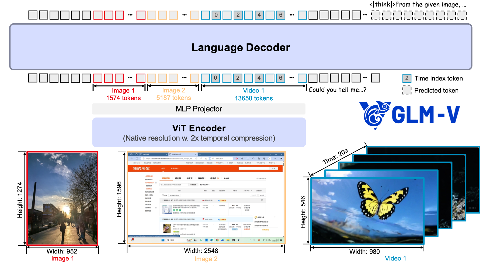
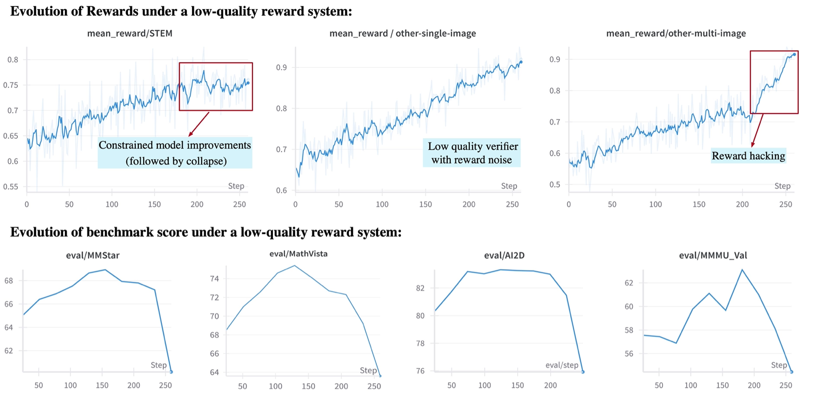
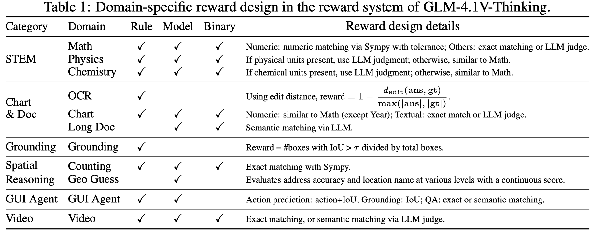
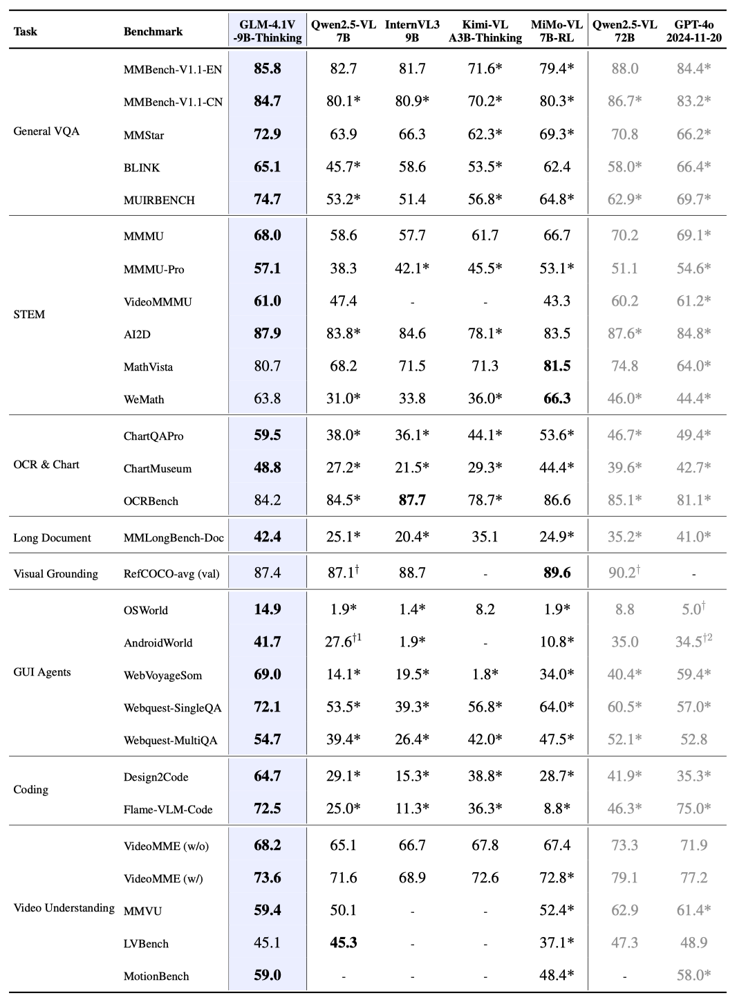
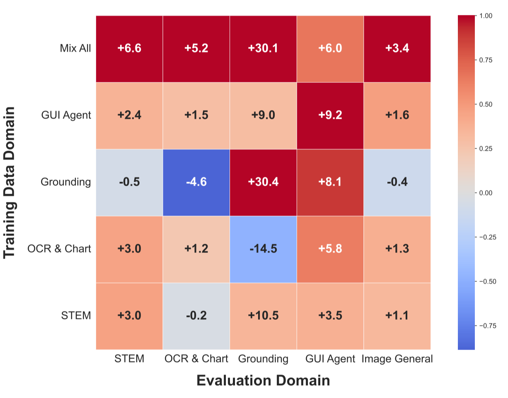

智谱 AI 在 25 年 7 月份发布了 GLM-4.1V-Thinking, 一个 9B 的多模态大语言模型，其在多个 benchmark 上达到了相同大小 MLLM 的 SOTA

## Introduction

已有工作如 [MiMo-VL](https://maosong.website/p/notes-on-mimo-vl/) 和 V-Triune 主要集中在特定的领域，目前还没有一个在所有领域都能超过 non-reasoning model 表现的多模态 reasoning model.

基于这个目标，作者提出了 GLM-4.1V-Thinking, 一个 9B 的，用于通用领域多模态 reasoning 的 MLLM. 在预训练阶段，作者通过构建多样化的数据来提升模型的基础能力。在 post-training 阶段，作者构建了 domain-specific 的数据来让模型学会 reasoning. 最后，作者提出了 Reinforcement Learning with Curriculum Sampling (RLCS) 来扩展模型的 reasoning 能力。

作者主要发现如下：

1. multi-domain RL 的泛化性非常强，在某一个 domain 上进行 RL 训练也可以提高模型在其他 domain 上的表现
2. 动态选择 RL 训练的数据可以有效提高模型的表现和训练效率
3. 一个 robust 以及 precise 的 reward model 对于 multi-domain RL 是至关重要的

## Method

### Architecture

GLM-4.1V-Thinking 是一个标准的 ViT-MLP-LLM 架构，其中：

- ViT: ViT 使用的是 AIMv2-Huge
- MLP: 是一个 3 层的 MLP，架构为 `linear-LayerNorm-GELU-SwiGLU`, 并且在进入 MLP 之前，GLM-4.1V-Thinking 还会在 spatial 上进行降采样，降采样率为 2
- LLM: LLM 使用的是 GLM



与 [Qwen2.5-VL](https://maosong.website/p/notes-on-qwen2.5-vl/) 一样，作者将 encoder 的 2D convolution 替换为了 3D convolution，用于处理视频输入，然后对于 single-image inputs，GLM-4.1V-Thinking 会将输入复制，变成一个含有两帧相同图片的 video 输入

为了支持不同分辨率图片输入，作者进行了两点改进：

第一是使用了 2D RoPE 来处理不同分辨率的图片输入

第二是使用 bicubic interpolation 来将不同分辨率的图片适应到 encoder 的 position embedding 上。具体来讲，对一个拥有 $H_p\times W_p$ patches 的图片，每个 patch 的坐标 $(w,h)$ 首先会被 normalized 到 $[-1,1]$ 中：

$$
g_{norm} = (w_{norm}, h_{norm}) = 2* \left(\frac{w+0.5}{W_p}, \frac{h+0.5}{H_p}\right) - 1
$$

然后，我们再使用 bicubic interpolation $\mathcal{I}_{bicubic}$ 将坐标映射到原始的 position  embedding 上：

$$
P_{adapted} = \mathcal{I}_{bicubic}(P_{orig}, g_{norm})
$$

对于视频输入，作者在每一帧之后插入了一个 time index token, 用每一帧的 timestamp string 来表示。这个做法与 [Qwen2.5-VL](https://maosong.website/p/notes-on-qwen2.5-vl/) 一样。

### Pre-training

#### Pre-training Data

Pre-training 数据包括 image-caption data, interleaved image-text data, OCR data, grounding data, video data 和 instruction tuning data

**Image caption data**
Image caption data 用于提升模型的世界知识。作者从 LAION, DataComp, DNF 以及 Wukong 等数据集收集了 10B 的 image-text pairs, 然后进行数据清洗：

1. Heuristic-based filtering: 基于规则，如 resolution, caption length 等过滤掉低质量的图片
2. Relevance filtering: 计算 CLIP score, 过滤掉低质量的数据
3. Concept-balanced resampling: 基于 MetaCLIP , 来提升数据的覆盖程度，解决长尾分布的问题。这里 [Seed1.5-VL](https://maosong.website/p/notes-on-seed1.5-vl/) 有一个类似的消融实验。
4. Factual-centered re-captioning: 通过 rewrite caption 来提升 caption 的质量和信息密度。Idefics2 通过实验发现，rewriting caption 可以提高模型的表现。作者在最终的数据集里，混合了一部分 re-caption 的数据。

**Interleaved image-text data**
相比于 image-caption data, interleaved image-text data 体量更大，且逻辑关系更强。但是噪声也更多，因此作者针对不同来源的数据构建了不同的数据清洗策略：

1. Web data processing pipeline: 数据来源为 MINT, MMC4, OmniCorpus 等。作者首先基于 CLIP-score，去掉与上下文不相关的图片；然后，作者去除掉广告，二维码等低质量的图片；最后，作者将图多文少的样本也给去除掉，比如相册图片。作者还训练了一个 high-knowledge-density image classifier, 来识别信息密度高的样本。
2. Academic book processing pipeline: 作者从电子书中收集了 100M 的样本，这些电子书主要是 STEM domain，然后作者构建了一个 PDF parsing tool 来提取文档内容。

**OCR data**
OCR 数据包含**220M images**, 数据集由三部分组成：

1. Synthetic document images: 基于预训练语料，使用不同的格式来渲染文字生成不同的图片，然后基于 LAION 的图片作为背景
2. Natural scene text images: 使用 Paddle-OCR 来从图片中提取文字以及对应的 bounding box
3. Academic documents: 使用类似 Nougat 的方法来构建 PDF page-Markdown 的数据。

**Grounding data**
主要包含自然场景和 GUI 两个 domain 的 grounding 数据：

1. Natural image grounding: 基于 LAION-115M 得到。作者使用 GLIPv2, 来自动化解析 caption 中的实体，然后预测对应的 bounding box, 作者将 bounding box 较少的样本去除掉。最终得到**40M**高质量的自然场景数据
2. GUI grounding: 基于 CC 提取对应的 url, 然后使用 Playwright 来与网页进行交互，进而获取到所有的 DOM elements 与其对应的 bounding box. 最终收集到 **140M**高质量的 QA 样本

**Video data**
Video data 从多个来源得到，作者使用了 fine-grained human annotation 来保证数据质量。作者还标注了 camera motion 等信息

为了保证数据的质量，作者进行了去重，来减少数据语义的相似性。

**Instruction tuning data**
instruction tuning data 的策略如下：

1. Task coverage and taxonomy: 优化数据分布
2. Complex scenario augmentation: 构建复杂的指令跟随数据
3. Data contamination check: 数据污染检查

最终一共收集到 **50M**样本，覆盖 visual perception, multimodal reasoning, GUI agent 等任务。

#### Pre-training Training

Pre-training 由两个 stage 组成：

1. Multimodal pre-training: 提高模型的通用多模态能力，上下文长度为 8192, global batch size 为 1536. 使用了 data packing 策略，使用了 2-way tensor parallelism
2. Long-context continue training: 提升模型在高精度图片，长视频，长上下文场景下的表现，上下文长度为 32768, 使用了 2-way tensor parallelism 和 4-way context parallelism.

### SFT

#### SFT Data

数据包括 long CoT reasoning 数据，来让模型以标准格式输出 multi-step solution.

数据包括 verifiable tasks 以及 non-verifiable tasks, 覆盖中英两种语言。作者过滤了非常简单和非常困难的样本。

数据格式如下

```
<think> {think_content} </think> <answer> {answer_content} </answer>
```

对于 verifiable tasks, 输出格式为

```
<answer> <|begin_of_box|> {answer_content} <|end_of_box|> </answer>
```

数据清洗策略包括：

1. 严格遵守格式要求
2. reasoning style 不一致或者有噪声
3. 混合语言输出。

作者还使用 RL checkpoints 来生成一部分高质量数据，加入到 SFT 阶段的数据集里面。

#### SFT Training

全参数微调。上下文长度为 32768， batch size 为 32.数据包括 long-form reasoning data 以及纯文本数据，包括 math, multi-turn conversation, agent planning 以及 instruction following 等.

> [!tip] Observation
> 作者发现，在 SFT 阶段即使是使用带噪声的 reasoning data，模型在 RL 阶段也能继续训练。也就是说，不完美的 reasoning trace 也能提供 guidance. 但是，使用更高质量的数据可以让模型 RL 阶段的训练更稳定且表现更好。

### RL

与 [Seed1.5-VL](https://maosong.website/p/notes-on-seed1.5-vl/) 一样，作者在 RL 阶段结合了 RLVR 和 RLHF 两个训练目标。任务包括 STEM problem solving (such as mathematics, physics, chemistry), grounding, optical character recognition (OCR), video understanding, GUI agents, chart and document understanding, logical reasoning, and instruction following.

**Data**
作者首先构建了一个任务集合，然后基于这些任务，来过滤或者生成对应的 QA pair, 接下来作者基于难度和质量来过滤，最后作者在每个 domain 上进行 RL 的训练来保证数据的有效性。

**Reward modelling**
作者构建了一个 reward system, 用于给不同 domain 的任务进行奖励。为了探究不同 domain 的 reward 对模型整体表现的影响，作者设计了一个 low-quality reward system，实验结果如下，可以看到模型在训练后期出现了 collapse 或者 reward hacking 的情况。



> [!tip] Observation
> 作者发现，不同任务的不同信号奖励会对模型最终表现产生巨大影响。

在使用 LLM 提取模型回答的 answer 的时候，作者要求模型的最终答案为 `<|begin_of_box|> {answer_content} <|end_of_box|>` 这种形式，避免大语言模型提取出错。

作者构建的 reward system 包含如下模块：

1. shared verification functions: 包括格式检查等
2. domain specific modules: 与 domain 相关的模块
3. unit testing: 观测 domain 输出的分布，然后基于输出的分布来调整 reward logic

最终 reward 的 design 如下表所示



**RLCS**
作者使用了 GRPO 来进行优化训练。作者发现，仅需 200 training steps 模型在一半以上问题的准确率就达到了 $90\%$.

为了提升模型的训练效率，作者提出了 Reinforcement Learning with Curriculum Sampling (RLCS), 也就是将课程学习与 RL 结合起来。作者基于模型训练情况动态调整训练样本的难度，来保证每个样本对模型训练的提升都是最大的。

在 RLCS 训练之前，作者先使用模型评测得到每个样本的 pass@k, 然后根据结果将样本进行分类。在训练过程中，作者记录每个样本的 pass@k， 然后动态更新其分类结果。在采样的时候，作者基于难度来对样本进行加权，来降低太简单或者太难样本的采样概率。

作者还提出了一些提高 RL 表现的方法：

1. Larger batch size: 使用更大的 batch size 效果更好
2. Dynamic sampling expansion via ratio EMA: 作者定义了 naive 样本和高质量样本的比例，然后根据这个比例进行采样，来提升整体的采样效率。
3. Force answering: 与 [Qwen3](https://maosong.website/p/notes-on-qwen3/) 一样，对于比较难的问题，当输出的 token 数过长时，作者对模型输出进行截断，然后让模型基于已有思考过程直接输出结果。
4. Discard KL loss: 与 DAPO 一样，作者也移除了 KL divergence loss
5. Clip-higher: 与 DAPO 一样，作者通过修改超参数来提高模型的探索能力

> [!tip] Observation
>
> 1. RL 阶段的表现与 cold-start SFT 的表现并不完全相关。作者发现，cold-start SFT 取得更好的表现并不一定保证 RL 的表现就更好。
> 2. RL 阶段各个 domain 数据的影响是正交的，这与 cold-start SFT 阶段的结果不同。

作者还提出了一些提高训练稳定性的方法：

1. 提高 cold-start SFT 阶段数据的质量
2. 移除 KL divergence loss
3. 使用 top-p 为 1，而不是 0.9 (如 [Qwen-LLM](https://maosong.website/p/notes-on-qwen-llm/) 中的设置)，top-p 为 1 可以 cover 整个 vocabulary，避免某些 token 没有参与训练
4. per-sample loss 和 per-token loss 没有显著区别，但是 per-sample loss 稳定性更高
5. 在 cold-start SFT 阶段让模型学会格式要求，而不是在 RL 阶段加入 format reward

**Infra**
在 infra 方面，作者做了如下改进：

1. Load balancing of sequence lengths across DP ranks. 平衡每个 rank 的 sequensequence length 以及 compute load
2. Intra-rank training with sequence packing and gradient accumulation. 将 sequence packing 和 gradient accumulation 结合起来
3. Sample packing and reorganization within DP ranks. data packing
4. Dynamic sampling expansion via ratio EMA. 平衡 naive 样本和高质量样本之间的比例

## Evaluation

### Performance



可以看到，GLM-4.1V-Thinking 在多个 benchmark 上都达到了 SOTA.

### Ablation Study

作者评估了一下不同 domain 的 RL 训练对模型整体表现的影响。作者使用不同的数据来进行训练，然后分析结果的相关性，结果如下



实验结果发现：

1. 在某个 domain 上的训练会提高模型在其他 domain 上的表现
2. 联合多个 domain 进行训练最终的表现会更好

作者还发现，不同的任务之间存在关联，如 GUI-agent 和 grounding 这两个任务是高度相关的。OCR & Chart 以及 GUI-agent 也是高度相关的。

## Conclusion

在本文中，作者提出了 GLM-4.1V-Thinking, 一个 9B 的通用多模态 reasoning model, 作者通过构建高质量的数据，多阶段的训练，让模型在 reasoning 和 non-reasoning 任务上均超过了已有的 SOTA 模型的表现

作者认为，模型有以下局限：

1. 模型并没有提升 reasoning 的质量，在某些情况下，模型结果正确，但是中间过程错误。作者分析这是因为目前只有针对结果的奖励机制。因此，未来需要能够评估中间过程的 reward model
2. RL 的训练具有不稳定性，作者发现模型对设置比较敏感，这对 RL 训练的 scaling 提出了挑战。
3. 模型在复杂场景下表现依旧不太好，比如图片中有物体遮挡的情况，这些感知误差也会影响最终的 reasoning 表现。作者认为如何同时提高 perception 和 reasoning 的表现是一个需要研究的课题。

未来的工作有：

1. 如何构建更好的 reward 机制，来同时评估结果和中间过程。从而防止模型 reward hacking
2. 如何基于 multimodal training 来提升模型在纯文本任务上的表现。探究 visual reasoning 和 text reasoning 如何互相促进也是一个课题
3. 如何更好评估模型的表现，即如何更好评估模型的 failure modes, 比如幻觉，short reasoning 等

## References

- [Arxiv](https://arxiv.org/abs/2507.01006)
- [Huggingface](https://huggingface.co/THUDM/GLM-4.1V-9B-Thinking)

## Appendix

GLM-4.1V-Thinking 的 patch merger 代码

```python

class Glm4vVisionPatchMerger(nn.Module):
    def __init__(self, dim: int, context_dim: int, hidden_act: str, bias: bool = False) -> None:
        super().__init__()
        self.proj = nn.Linear(dim, dim, bias=bias)
        self.post_projection_norm = LayerNorm(dim)
        self.gate_proj = nn.Linear(dim, context_dim, bias=bias)
        self.up_proj = nn.Linear(dim, context_dim, bias=bias)
        self.down_proj = nn.Linear(context_dim, dim, bias=bias)
        self.act1 = nn.GELU()
        self.act_fn = ACT2FN[hidden_act]

    def forward(self, hidden_state: torch.Tensor) -> torch.Tensor:
        hidden_state = self.proj(hidden_state)
        hidden_state = self.act1(self.post_projection_norm(hidden_state))
        return self.down_proj(self.act_fn(self.gate_proj(hidden_state)) * self.up_proj(hidden_state))

class Glm4vVisionModel:
    def __init__(self, config):
        self.downsample = nn.Conv2d(
            in_channels=config.hidden_size,
            out_channels=config.out_hidden_size,
            kernel_size=config.spatial_merge_size,
            stride=config.spatial_merge_size,
        )
        self.merger = Glm4vVisionPatchMerger(
            dim=config.out_hidden_size, context_dim=config.intermediate_size, hidden_act=config.hidden_act
        )

    def forward(self, hidden_states):
        ...
        hidden_states = hidden_states.view(-1, self.spatial_merge_size, self.spatial_merge_size, hidden_states.shape[-1])
        hidden_states = hidden_states.permute(0, 3, 1, 2)
        hidden_states = self.downsample(hidden_states).view(-1, self.config.out_hidden_size)
        hidden_states = self.merger(hidden_states)
```
