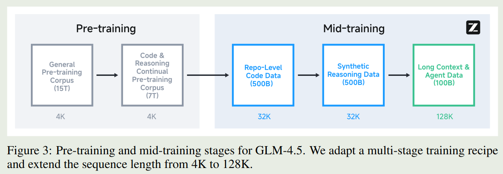
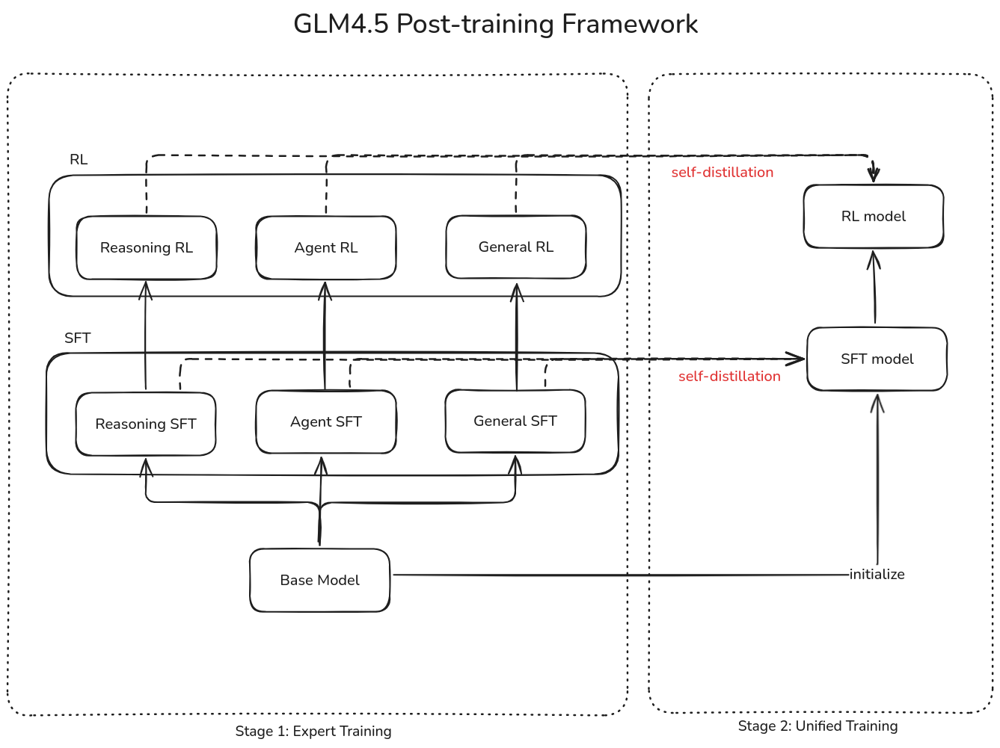
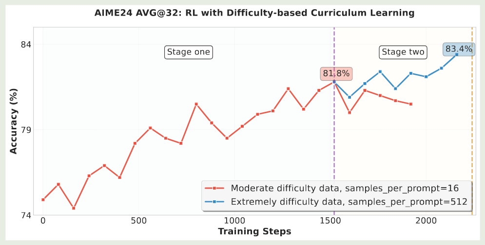
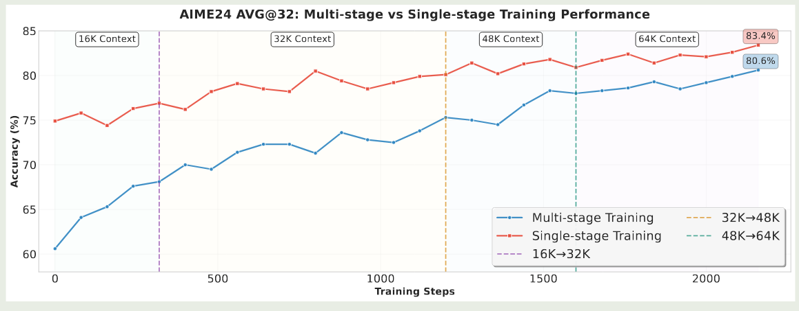
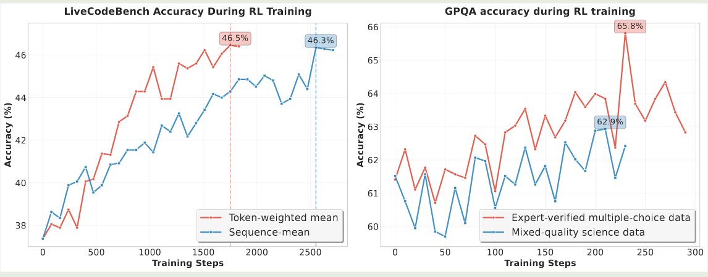
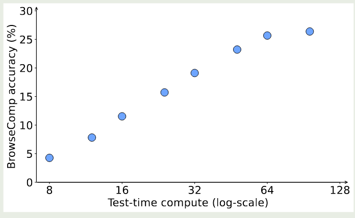
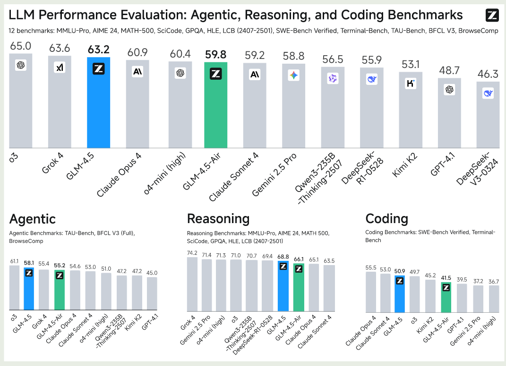
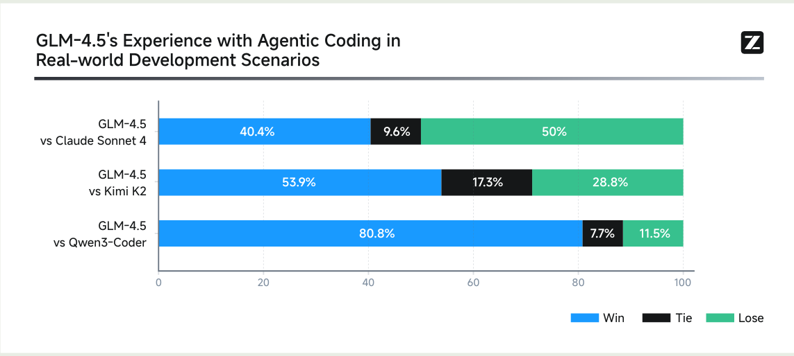

智谱 AI 提出了 GLM4.5, 包含 GLM4.5 和 GLM-4.5-Air,两个 MoE LLM. 模型大小分别为 355B-A22B 和 106B-A12B, GLM4.5 主要关注 agentic, reasoning 以及 coding 三个领域。

## Introduction

作者认为，通用模型有三个关键能力，即 ARC：

1. Agent: 与外部工具以及真实世界进行交互
2. Reasoning: 解决数学和科学领域的复杂问题
3. Coding: 解决真实世界软件工程相关问题

已有的商业模型如 o1/o3, Claude Sonnet 4 已经在 ARC 上达到了非常好的表现，但是开源模型仍然比较稀缺

基于这个目标，作者就提出了 GLM4.5 和 GLM-4.5-Air, 来统一完成三个不同的目标。

## Method

## Pre-training

### Architecture

GLM-4.5 是一个基于 MoE 架构的 LLM,  架构与 DeepSeek-MoE 相似，作者做了如下几点改变：

1. 在 MoE layer 中，使用了 loss-free balance routing, 然后使用了 sigmoid function 作为 routing score 的 normalization.
2. 与 [Kimi-k2](https://maosong.website/p/notes-on-kimi-k2/) 和 [DeepSeek-V3](https://maosong.website/p/notes-on-deepseek-v3/) 相比，作者降低了 head dimension, 提升了 number of layers. 作者认为更深的模型更有利于提高模型的 Reasoning 表现
3. attention 上，作者使用了 [GQA](https://maosong.website/p/notes-on-gqa/), 对于 #RoPE, 作者使用了 partial RoPE, 只旋转每个 token 的前半部分， 作者还将 attention heads 的个数增加到了 2.5 倍，作者发现增加 attention heads 可以提高模型的 Reasoning 表现
4. 作者还使用了 [QK-Norm](https://maosong.website/p/notes-on-qk-norm/) 来防止 attention logits 爆炸
5. 作者还使用了一个 MoE layer 作为 MTP layer 来支持 speculative decoding.

模型与 [DeepSeek-V3](https://maosong.website/p/notes-on-deepseek-v3/) 和 Kimi-k2 的对比如下

| Model                      | GLM-4.5  | GLM-4.5-Air | Step 3    | Kimi K2   |
| -------------------------- | -------- | ----------- | --------- | --------- |
| Date                       | 2025/8/8 | 2025/8/8    | 2025/7/25 | 2025/7/28 |
| # Total Parameters         | 355B     | 106B        | 316B      | 1043B     |
| # Activated Parameters     | 32B      | 12B         | 38B       | 32B       |
| # Dense Layers             | 3        | 1           | 5         | 1         |
| # MoE Layers               | 89       | 45          | 56        | 60        |
| # MTP Layers               | 1        | 1           | 0         | 0         |
| Hidden Dim                 | 5120     | 4096        | 7168      | 7168      |
| Dense Intermediate Dim     | 12288    | 10944       | 18432     | 18432     |
| MoE Intermediate Dim       | 1536     | 1408        | 5120      | 2048      |
| Attention                  | GQA      | GQA         | MFA       | MLA       |
| Attention Head Dim         | 128      | 128         | 256       | 192       |
| # Attention Heads          | 96       | 96          | 64        | 64        |
| # Key-Value Heads          | 8        | 8           | 1         | 64        |
| scoring                    | sigmoid  | sigmoid     | softmax   | softmax   |
| # Experts (total)          | 160      | 128         | 48        | 384       |
| # Experts Active Per Token | 8        | 8           | 3         | 8         |
| # Shared Experts           | 1        | 1           | 1         | 1         |
| QK-Norm                    | Yes      | No          | No        | No        |

### Pre-training Data

预训练数据包括四个方面

1. Web: 过滤低质量数据和使用模版产生的数据
2. Multilingual: 基于 webpages 和 Fineweb-2
3. Code: 基于 GitHub 和其他代码平台，作者使用了 [[Fill in the middle]] 来训练模型。
4. Math & Scirence: 训练一个 classifier 来给数据进行打分。

最终，预训练数据一共包括 **23T token**.

### Pre-training Recipe

预训练包括 2 个阶段:

1. Pre-training: 使用网页数据进行训练
2. Mid-training: 加入 code, math, science 数据进行训练，在这个阶段，作者使用了 repo-level 的 code 数据，合成的 reasoning 数据以及长上下文数据。作者将模型上下文从 4K 扩展到 32K，然后在扩展到 128K.

作者在 pre-training 的时候使用了 random truncation, 在 mid-training 的时候使用了 best-fit packing 技巧

训练时，与 Kimi-k2 一样，作者使用了 [Muon](https://maosong.website/p/notes-on-moonlight/) 作为优化器。作者使用了 cosine decay schedule. batch size 从 16M token 到 64M token.

## Post-training

Post-training 分为两个阶段：

- Stage 1, Expert Training. 构建 agent, reasoning, General chat 三个 domain 的专家模型
- Stage 2, Unified Training. 使用 self-distillation 来汇总多个模型的能力

训练框架如下图所示

### SFT

两个 stage 都由 SFT 开始，

- 在 Stage 1 里，SFT 的目标是让 expert model 掌握初步的 chat, reasoning 以及 tool-use 的能力。作者使用了一小部分包含 CoT 的 SFT 数据进行训练
- 在 Stage 2 中，SFT 的目标是将不同的 expert model 蒸馏到一个模型中，作者使用了百万级的数据，包含 reasoning 任务和通用的 chat 数据，来训练模型的 hybrid reasoning 能力

在训练模型的 tool-use 能力是，作者发现，function call 在 code 场景下会出现混淆，提高了模型的学习成本。因此，作者的解决方法是使用了类似 XML 的 special token tags

> Recall
> 与之相反，Kimi-K2 认为模板应该尽可能简洁，因此 Kimi 采取了 TypeScript 作为 function call 的语言

从专家模型进行采样是，作者进行了数据过滤。还对数据进行了分级结果发现，使用难题进行训练可以提升模型 $2\%\sim4\%$ 的表现，多次采样也可以提高模型的表现

Agentic SFT 数据的构建包括四个步骤：

1. Agentic Framework and Tool Collection: 收集 MCP 和 tool API
2. Task Synthesis: 合成不同的 agentic 任务
3. Trajectory Generation: 采样生成的 rollout
4. Quality Filtering: 过滤低质量的数据

### RL

#### Reasoning RL

这个阶段使用了 GRPO 算法进行训练，与 [DAPO](https://maosong.website/p/notes-on-dapo/) 一样，作者去除了损失函数中的 KL divergence。

首先，作者探究了课程学习对模型表现的影响，结果发现，课程学习可以有效提高模型的性能。因此，作者构建了一个 2 阶段的课程学习框架。实验结果如下图所示

可以看到，在第二个阶段，模型可以进一步通过更难的题目获得提升。

其次，作者探究了以下渐进式扩展模型上下文对模型表现的影响。DeepScaleR 认为，逐步提高模型的上下文长度，可以有效提高模型的表现。但是，本文确认为这种方法会损害模型的性能，原因在于，模型在 SFT 阶段的上下文长度就是 64K, 如果我们降低模型的上下文长度，这会导致训练数据分布不一致，从而影响模型的长上下文表现。因此作者直接在 64K 的上下文上进行训练。

接下来，作者探究了以下采样温度对模型表现的影响，温度太低会导致模型探索能力下降，太高的话会导致输出质量下降。因此作者动态调整采样温度来平衡模型的性能以及探索能力。

> [!tip]
> Kimi-K2 认为随着 RL 训练的进行，我们应该逐步降低采样温度来稳定模型的表现

最后，作者分析了以下 code 以及 Science RL 中的一些问题。对于 code RL, 作者发现，我们应该在 sequence 层面而不是 token 层面进行平均。对于 Science RL, 作者强调了高质量数据的重要性。实验结果如下图所示

#### Agent RL

作者主要关注 web-search 以及 code generation 两个任务。对于 web-search, 作者构建了一个数据合成 pipeline, 用于生成 multi-step reasoning 的 QA 数据。构建过程包括基于知识图谱的 multi-hop reasoning 和 human-in-the-loop 的内容提取。对于 code generation, 作者基于 GitHub 的 PR 以及 issues 构建了 benchmark

RL 的训练目标如下

$$
\mathcal{L}(\theta) = \mathbb{E}_{x\sim\mathcal{D}}\left[\frac1K\sum_{i=1}^K(r(x,y_i) - \bar{r}(x))\right]
$$

其中 $(x,y_i)$ 是基于 $\pi_{\mathrm{old}}$ 采样的 trace, $\bar{r}(x) = 1/k\sum_{i=1}^Kr(x,y_i)$ 是平均的 reward. 计算损失时，只有模型的回答参与计算。

作者发现，通过训练模型的 web-search 以及 code generation 能分，模型在 tool-use 以及 coding 任务上的表现也有了提升。作者还是用了 format penalty 来保证模型输出格式的正确性。如果格式不对的话，模型获得的奖励是 0

> Recall
> 在 [GLM-4.V-Thinking](https://maosong.website/p/notes-on-glm-4.1v-thinking/) 中，作者认为应该在 cold-start SFT 阶段让模型学会格式要求，而不是在 RL 阶段加入 format reward

由于 agent RL 的训练比较耗时，为了提高训练效率。作者首先基于 SFT 模型进行 agent RL 训练，训练到一定步数之后，作者使用 self-distillation 来将能力蒸馏回 SFT model, 接下来再基于 Self-distillation 后的 SFT 模型来进行 agent RL 训练

> Recall
> [Seed1.5-VL](https://maosong.website/p/notes-on-seed1.5-vl/) 和 LlaMA3.2 都提到了使用 multi-round SFT-RL 的形式来提高模型的表现

作者还发现，随着交互轮数的提升，模型的表现也有相应提升。实验结果如下图所示

#### General RL

General RL 用于提高模型的整体表现，解决潜在的问题以及提升关键能力，作者主要使用了 RLHF 和 RLAIF 两种方法

对于 Holistic RL, 作者收集了 5000 条 prompt, reward 基于人类反馈和 AI 反馈。人类反馈用于训练一个 reward model, 对于 AI 反馈，作者构建了 scoring rubrics. 然后作者将两种反馈结合在一起

对于 Instruction following RL, 作者构建了基于规则的奖励，reward model 的奖励以及 critical model 的奖励。实验结果显示，这种奖励方式可以有效降低模型的 reward hacking

对于 function calling RL, 作者使用了 step-wise rule-based RL 来提高模型表现。对于 end-to-end multi-turn RL, 作者训练了一个 expert model 来蒸馏专家到模型。

最后，对于 Pathology RL, 作者希望通过 RL 来解决潜在的问题，比如语言混合输出，重复输出以及格式错误等。作者构建了一批模型容易出错的数据，然后来训练模型。

#### Infra

作者针对不同任务分别构建了不同的 scheduling 模式：

- 对于通用 RL 任务，作者将 training engine 和 inference engine 放在一个 worker 来提高效率
- 对于 agentic RL 任务，作者将 training 和 inference engine 分开，来提高 data throughput

在训练时，作者使用了 BF16 精度，在推理时，作者使用了 FP8 精度来提高推理效率。

针对 agentic RL 任务，作者还进行了优化。与 Kimi-k2 类似，作者让 inference engine 持续产出 rollout, 然后让 training engine 来更新模型权重，最后同步到 inference engine 上

## Experiments

整体表现如下图所示，GLm4.5 在 ARC benchmark 上的平均表现达到了第三名。

具体来看，

1. 在 agentic benchmark 上, GLM4.5 仅次于 o3 的表现
2. 在 coding benchmark 上，GLM4.5 次于 Claude Opus 4 和 Claude Sonnet 4, 排第三名
3. 在通用能力上，GLM

人工对比 coding agent 能力的结果如下图所示

## Conclusion

作者提出了 GLM4.5， 一个基于 MoE 架构的大语言模型系列，包含 GLM4.5(355B-A22B) 和 GLM4.5-Air(106B-A12B) 两个模型，作者详细介绍了模型的架构，训练，数据和评估。

## References

- [arxiv](http://arxiv.org/abs/2508.06471)
