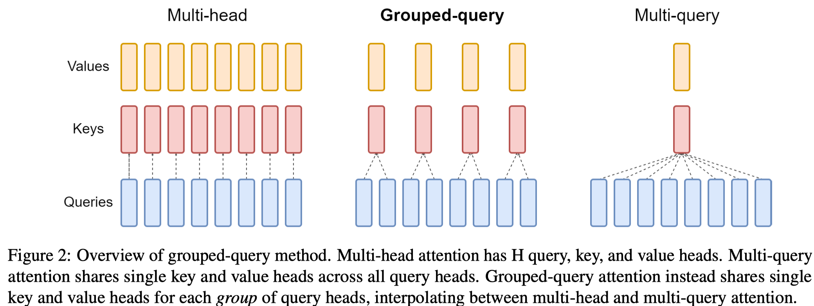

Google Research 在 23 年 12 月份提出了 Group Query Attention (GQA), 一个提升 multi-head attention 效率的方法。GQA 自 [Qwen2](Qwen2.md) 系列开始被应用。

## Introduction

Multi-head attention (MHA) 的问题在于 inference 阶段，每次 decoding，都需要重新加载 attention 模块中 query layer, key layer 和 value layer 的权重，而加载权重会受带宽限制。

已有的工作有 [MQA](MQA.md), 也就是我们把多个 head 的 key layer 以及 value layer 压缩成一个，这样对于 $h$ 个 head 的 attention，我们有 $h$ 个 query layer，$1$ 个 key layer 以及 1 个 value layer. 但是 MQA 的问题在于其会导致性能下降，而且训练过程会不稳定。

因此，在本文中作者就作出了两点贡献：

1. 如何将一个 MHA 模型转化为一个一个 MQA 模型
2. 提出了 Group Query Attention (GQA)，在保持模型性能的同时，提高计算效率

## Method

### Uptraining

将 MHA 模型转化为 MQA 模型分为两步：

1. 将 MHA 权重转化为 MQA 权重
2. 额外的预训练

具体来讲，作者使用了一个 mean pooling 的方法，来将不同 head 的 query layer 以及 key layer 的权重转化为 MQA 对应 layer 的权重。然后作者 pre-training 若干步来让模型适应新的结构。

### GQA

GQA 的思路在于在 MHA 和 MQA 之间达到一个平衡，也就是说我们将 key layer 和 value layer 进行分组，每个组内共享一个 key layer 和 value layer, 我们假设有 $h$ 个 head，$G$ 个 group，那么

1. $G=1$ 时，所有的 head 共享一个 key layer 和一个 value layer, 此时 GQA 等价于 MQA
2. $G=H$ 时，每个 head 都有一个 key layer 和一个 value layer, 此时 GQA 等价于 MHA
3. $1<G<H$ 时，GQA 时 MQA 和 MHA 的一个 trade-off，兼顾两者的性能与效率

三者的示意图如下所示



## Code

MQA 的代码也比较好理解，我们首先定义 group size，即 `num_key_value_heads`, 然后基于 group size 定义对应的 key layer `self.k_proj` 和 value layer `self.v_proj`.

计算得到 `key_states` 和 `value_states` 之后，在计算 attention，即 `eager_attention_forward` 的时候，我们对 `key_states` 和 `value_states` 进行复制，即 `repeat_kv`

```python
def repeat_kv(hidden_states: torch.Tensor, n_rep: int) -> torch.Tensor:
    batch, num_key_value_heads, slen, head_dim = hidden_states.shape
    if n_rep == 1:
        return hidden_states
    hidden_states = hidden_states[:, :, None, :, :].expand(batch, num_key_value_heads, n_rep, slen, head_dim)
    return hidden_states.reshape(batch, num_key_value_heads * n_rep, slen, head_dim)

def eager_attention_forward(
    module: nn.Module,
    query: torch.Tensor,
    key: torch.Tensor,
    value: torch.Tensor,
    attention_mask: Optional[torch.Tensor],
    scaling: float,
    dropout: float = 0.0,
    **kwargs: Unpack[TransformersKwargs],
):
    key_states = repeat_kv(key, module.num_key_value_groups)
    value_states = repeat_kv(value, module.num_key_value_groups)

    attn_weights = torch.matmul(query, key_states.transpose(2, 3)) * scaling
    if attention_mask is not None:
        causal_mask = attention_mask[:, :, :, : key_states.shape[-2]]
        attn_weights = attn_weights + causal_mask

    attn_weights = nn.functional.softmax(attn_weights, dim=-1, dtype=torch.float32).to(query.dtype)
    attn_weights = nn.functional.dropout(attn_weights, p=dropout, training=module.training)
    attn_output = torch.matmul(attn_weights, value_states)
    attn_output = attn_output.transpose(1, 2).contiguous()

    return attn_output, attn_weights

class Qwen3Attention(nn.Module):
    def __init__(self, config: Qwen3Config, layer_idx: int):
        super().__init__()
        self.head_dim = getattr(config, "head_dim", config.hidden_size // config.num_attention_heads)
        self.scaling = self.head_dim**-0.5

        self.q_proj = nn.Linear(
            config.hidden_size, config.num_attention_heads * self.head_dim, bias=config.attention_bias
        )
        self.k_proj = nn.Linear(
            config.hidden_size, config.num_key_value_heads * self.head_dim, bias=config.attention_bias
        )
        self.v_proj = nn.Linear(
            config.hidden_size, config.num_key_value_heads * self.head_dim, bias=config.attention_bias
        )
        self.o_proj = nn.Linear(
            config.num_attention_heads * self.head_dim, config.hidden_size, bias=config.attention_bias
        )

    def forward(
        self,
        hidden_states: torch.Tensor,
        position_embeddings: tuple[torch.Tensor, torch.Tensor],
        attention_mask: Optional[torch.Tensor],
        past_key_value: Optional[Cache] = None,
        cache_position: Optional[torch.LongTensor] = None,
        **kwargs: Unpack[FlashAttentionKwargs],
    ) -> tuple[torch.Tensor, Optional[torch.Tensor], Optional[tuple[torch.Tensor]]]:
        input_shape = hidden_states.shape[:-1]
        hidden_shape = (*input_shape, -1, self.head_dim)

        query_states = self.q_norm(self.q_proj(hidden_states).view(hidden_shape)).transpose(1, 2)
        key_states = self.k_norm(self.k_proj(hidden_states).view(hidden_shape)).transpose(1, 2)
        value_states = self.v_proj(hidden_states).view(hidden_shape).transpose(1, 2)

        cos, sin = position_embeddings
        query_states, key_states = apply_rotary_pos_emb(query_states, key_states, cos, sin)

        attn_output, attn_weights = eager_attention_forward(
            self,
            query_states,
            key_states,
            value_states,
            attention_mask,
            dropout=0.0,
            scaling=self.scaling,
            sliding_window=self.sliding_window,  # diff with Llama
            **kwargs,
        )

        attn_output = attn_output.reshape(*input_shape, -1).contiguous()
        attn_output = self.o_proj(attn_output)
        return attn_output, attn_weights
```

## Conclusion

本文中，作者提出了一个解决 multi-query attention 的 uptraining 方法，以及提出了 GQA，一个结合 MHA 表现和 MQA 效率的新型注意力机制。

## References

- [arxiv](https://arxiv.org/abs/2305.13245)
