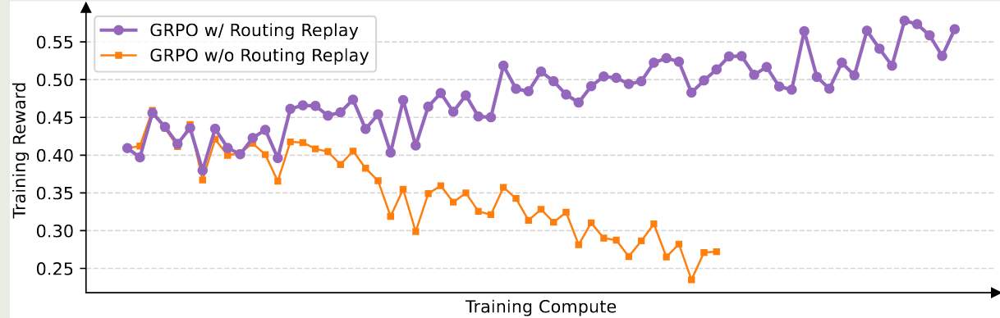
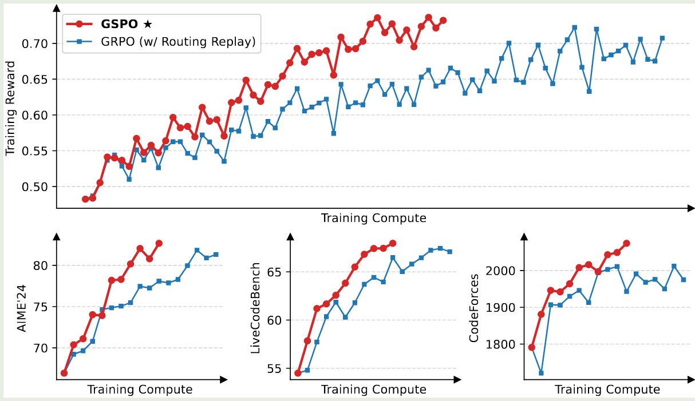

Qwen 提出了 Group Sequence Policy Optimization (GSPO), 一个针对 GRPO 进行改进的 RL 算法。GSPO 在 sequence 层面计算 importance ratio, 避免了 token-level 计算带来的训练不稳定性。

## Introduction

GRPO.md 的问题在于训练超大规模的 LLM 时，会出现 model collapse, [Qwen3](https://maosong.website/p/notes-on-qwen3/) 和 MiniMax-01 均对 GRPO 算法进行了改进。

在本文中，作者认为 GRPO 算法的问题在于 Importance sampling weight 的计算是有问题的，这导致了误差随生成回答长度累积，最后被 clipping 机制放大，从而导致模型崩溃。

为了解决这个问题，作者提出了 GSPO, 一个在 sequence 层面进行 Importance sampling 的 RL 算法，GSPO 还对 reward 进行 normalization 来保持训练的稳定性

## Method

### Preliminary

对于一个大语言模型 $\pi_{\theta}$, 我们将 $x$ 记为 query, 将 $y$ 记为 $\pi_{\theta}$ 针对 $x$ 的 response, 即

$$
\pi_{\theta}(y\mid x) = \prod_{t=1}^{|y|}\pi_{\theta}(y_t\mid x, y_{<t})
$$

其中 $|y|$ 代表 response $y$ 的长度, 一般我们还有一个 reward model $r$, 用于生成奖励 $r(x,y)\in[0, 1]$.

> [!tip] Note
> 本文中没有提及 KL divergence, 作者认为这不是重点，所以没有在公式中标出。

PPO 算法包含四个模型：reference model, 也就是 $\pi_{old}$, policy model, 也就是 $\pi_{\theta}$, value model, 用于计算 advantage, 以及 reward model, 用于计算奖励。 PPO 算法如下面公式所示

$$
\mathcal{J}_{\mathrm{PPO}}(\theta) = \mathbb{E}_{(x,y)\sim\mathcal{D},y_{\leq t}\sim \pi_{\theta_{old}}(\cdot\mid q)}\left[ \min\left(r_t(\theta)\hat{A}_t,\mathrm{clip}\left(r_t(\theta), 1-\epsilon, 1+\epsilon\right)\hat{A}_t\right) \right]
$$

其中

$$
r_t(\theta) = \frac{\pi_{\theta}(y_t\mid x, y_{< t})}{\pi_{\theta_{old}}(y_t\mid x, y_{< t})}
$$

是 token $y_t$ 的 importance ratio, $\hat{A}_t$ 是 $y_t$ 的 advantage estimation.

**PPO** 算法的问题在于其严重依赖 value model, 一般 value model 与 policy model 的大小相当，以保持内存和算力的负载均衡。

为了解决 PPO 的这个问题，GRPO 通过多次采样然后计算 relative advantage 来避免使用 value model. 其目标函数为

$$
\mathcal{J}_{\mathrm{GRPO}}(\theta) = \mathbb{E}_{(x, y)\sim\mathcal{D},\{y_i\}_{i=1}^G\sim \pi_{\theta_{old}}(\cdot\mid q)}\left[ \frac{1}{G}\sum_{i=1}^G\frac{1}{|y_i|}\sum_{t=1}^{|y_i|}\min\left(r_{i,t}(\theta)\hat{A}_{i,t},\mathrm{clip}\left(r_{i,t}(\theta), 1-\epsilon, 1+\epsilon\right)\hat{A}_{i,t}\right) \right]
$$

其中，$G$ 是针对 query $x$ 的多次采样 response,

$$
r_{i,t}(\theta) = \frac{\pi_{\theta}(y_{i,t}\mid x, y_{i,< t})}{\pi_{\theta_{old}}(y_{i,t}\mid x, y_{i,< t})}
$$

是 importance ratio,

$$
\hat{A}_{i,t} = \hat{A}_{i} = \frac{r(x,y_i) - \mathrm{mean}(\{r(x,y_i)\}_{i=1}^G)}{\mathrm{std}(\{r(x,y_i)\}_{i=1}^G)}
$$

是使用 group response 估计得到的 advantage.

### Motivation

在 Qwen3 中已经提到，对于稀疏的 MoE 模型，我们必须使用更大的 batch size 来最大化内存和算力使用效率。但是，更大的 batch 意味着有一些数据必须是 off-policy 的，因此 PPO 和 GRPO 就需要使用 clipping 来降低 off-policy sample 对模型表现产生过大影响。

基于 clipping 机制，作者认为 GRPO 的目标函数是 "ill-pose" 的，其原因在于 GRPO 计算的 Importance ratio 是与 RL 训练目标不匹配的。

通常，importance sampling 的公式如下：

$$
\mathbb{E}_{z\sim\pi_{\mathrm{tar}}}[f(z)] = \mathbb{E}_{z\sim\pi_{\mathrm{beh}}}\left[\frac{\pi_{\mathrm{tar}}(z)}{\pi_{\mathrm{beh}}(z)}f(z)\right]
$$

其中 $\pi_{\mathrm{tar}}$ 是目标分布， $\pi_{\mathrm{beh}}$ 是采样分布, importance ratio $\pi_{\mathrm{tar}}(z)/\pi_{\mathrm{beh}}(z)$ 负责对采样进行修正。

对于 GRPO, 其 importance ratio 是在 token 层面定义的，而一次采样是在 sequence 层面定义的，因此这种区别就导致了 GRPO 存在 high-variance noise.

因此，作者认为，**Importance ratio 的关键在于优化目标应该与 reward 的粒度是一致的**。

### GSPO

基于上面的想法，作者就提出了 GSPO, 作者首先针对 LLM 改写了上面的 importance sampling 的公式

$$
\mathbb{E}_{x\sim \mathcal{D}, y\sim\pi_{\theta}(\cdot\mid x)}[r(x,y)] = \mathbb{E}_{x\sim\mathcal{D}, y\sim\pi_{\theta_{old}}(\cdot\mid x)}\left[\frac{\pi_{\theta}(y\mid x)}{\pi_{\theta_{old}}(y\mid x)}r(x,y)\right]
$$

这里的 Importance ratio 表现了采样的回答 $\pi_{old}(y\mid x)$ 与目标回答 $\pi_{\theta}(y\mid x)$ 之间的差距，这是从 sequence 层面上体现的。

因此，作者基于上面的式子，构建出了 GSPO 的目标函数

$$
\mathcal{J}_{\mathrm{GSPO}}(\theta) = \mathbb{E}_{(x, y)\sim\mathcal{D},\{y_i\}_{i=1}^G\sim \pi_{\theta_{old}}(\cdot\mid q)}\left[ \frac{1}{G}\sum_{i=1}^G\min\left(s_{i}(\theta)\hat{A}_{i},\mathrm{clip}\left(s_{i}(\theta), 1-\epsilon, 1+\epsilon\right)\hat{A}_{i}\right) \right]
$$

这里 $\hat{A}_{i}$ 与 GRPO 一致， $s_i(\theta)$ 是 normalize 之后的 importance ratio, 定义如下

$$
s_i(\theta) = \left(\frac{\pi_{\theta}(y_{i}\mid x)}{\pi_{\theta_{old}}(y_{i}\mid x)}\right)^{\frac{1}{|y_i|}} = \exp\left(\frac{1}{|y_i|}\sum_{i=1}^{|y_i|}\frac{\pi_{\theta}(y_{i,t}\mid x, y_{i,< t})}{\pi_{\theta_{old}}(y_{i,t}\mid x, y_{i,< t})}\right)
$$

这里作者使用了 length normalization 来控制 variance.

作者对比了以下 GSPO 和 GRPO 两者的梯度，我们忽略期望的计算，直接写出内部的梯度，有

$$
\begin{aligned}
\nabla_\theta \mathcal{J}_{\mathrm{GSPO}}(\theta) &= \frac{1}{G}\sum_{i=1}^G\left(\frac{\pi_{\theta}(y_{i}\mid x)}{\pi_{\theta_{old}}(y_{i}\mid x)}\right)^{\frac{1}{|y_i|}}\hat{A}_i\cdot \frac{1}{|y_i|}\sum_{t=1}^{|y_i|} \nabla_{\theta} \log\pi_{\theta}(y_{i,t}\mid x, y_{<t})\\
\nabla_\theta \mathcal{J}_{\mathrm{GRPO}}(\theta) &= \frac{1}{G}\sum_{i=1}^G\hat{A}_i\cdot \frac{1}{|y_i|}\sum_{t=1}^{|y_i|} \frac{\pi_{\theta}(y_{i,t}\mid x, y_{i,< t})}{\pi_{\theta_{old}}(y_{i,t}\mid x, y_{i,< t})}\nabla_{\theta} \log\pi_{\theta}(y_{i,t}\mid x, y_{<t})\\
\end{aligned}
$$

可以看到，两者不同的地方在于 token 的 reweight 方式，GRPO 中先加权再求和；而 GSPO 中则是先求和，然后在 sequence 层面进行加权

### GSPO-token

为了支持 multi-turn RL 等需要细粒度 advantage 的场景，作者对 GSPO 的目标函数进行了改进，得到了 GSPO-token, 其目标函数为

$$
\mathcal{J}_{\mathrm{GSPO-token}}(\theta) = \mathbb{E}_{(x, y)\sim\mathcal{D},\{y_i\}_{i=1}^G\sim \pi_{\theta_{old}}(\cdot\mid q)}\left[ \frac{1}{G}\sum_{i=1}^G\frac{1}{|y_i|}\sum_{t=1}^{|y_i|}\min\left(s_{i,t}(\theta)\hat{A}_{i},\mathrm{clip}\left(s_{i,t}(\theta), 1-\epsilon, 1+\epsilon\right)\hat{A}_{i}\right) \right]
$$

其中，

$$
s_{i,t}(\theta) = \mathrm{sg}[s_i(\theta)]\frac{\pi_{\theta_{old}}(y_{i,t}\mid x, y_{i,< t})}{\mathrm{sg}[\pi_{\theta_{old}}(y_{i,t}\mid x, y_{i,< t})]}
$$

这里 $\mathrm{sg}$ 是 stop gradient operation. 通过这种改写方式，GSPO-token 与 GSPO 的优化目标一致，但是可以在更细粒度的 token 层面进行优化。

## Evaluation

作者使用 Qwen3-30B-A3B 进行测试。对于 GRPO，作者发现必须使用 Routing Replay training strategy 才能提升 MoE RL 的收敛性，  Routing Replay 的具体做法就是保留 $\pi_{\theta_{old}}$ 的激活专家，在 $\pi_{\theta}$ 中使用相同的专家来保持稳定性。但是，GSPO 则不需要这个技巧。

实验结果如下图所示。

从实验结果可以看到，GSPO 比 GRPO 更加高效，效果也更好。

作者带对比了 GSPO 与 GRPO 的 clipping 比例，结果发现，GSPO clipping 的 token 比例比 GRPO 高几个数量级，作者认为，尽管 GSPO clip 了更多 token, 但是 GSPO 更加高效，这也说明 GRPOtoken 层面的梯度估计是存在噪声的。

作者还介绍了以下 MoE 模型中 RL 训练的 expert-activation volatility 现象，也就是说，MoE 模型参数更新之后，对于同一个 response, 激活的专家可能飞铲个不同。作者举例说明，对于 Qwen3-30B-A3B, 更新一次梯度之后，有 $10\%$ 左右的激活专家变得不一样了。

作者最后介绍了以下 GSPO 的两个优势，一个是解决了 GRPO 依赖于 Routing Replay 的问题；第二个是支持 SGLang 和 vLLM 等推理框架。

## Conclusion

作者提出了 GSPO，一个在 sequence 层面计算 importance ratio 的 RL 算法，解决了 GRPO 在训练大规模 MoE LLM 时出现的训练不稳定性以及 mode collapse 现象。

## References

- [Group Sequence Policy Optimization](http://arxiv.org/abs/2507.18071)
