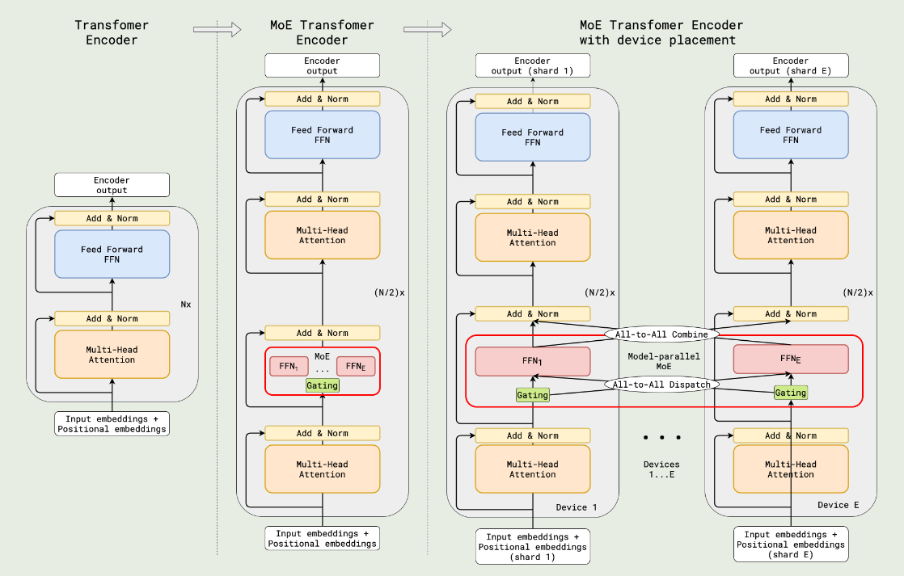
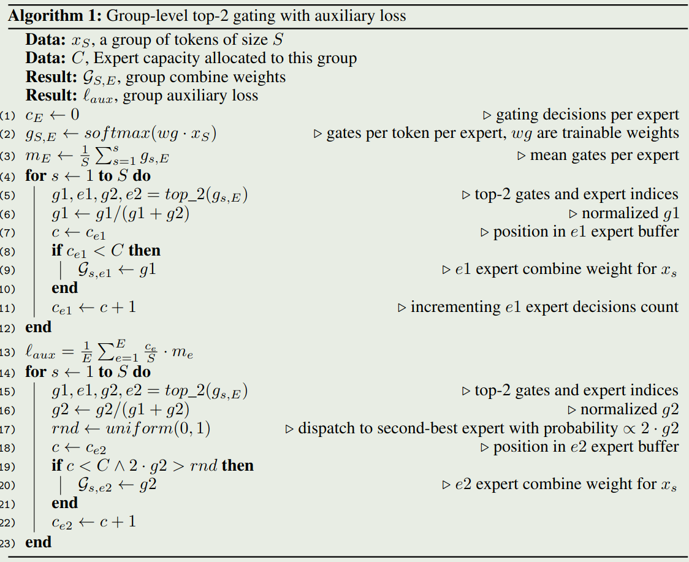
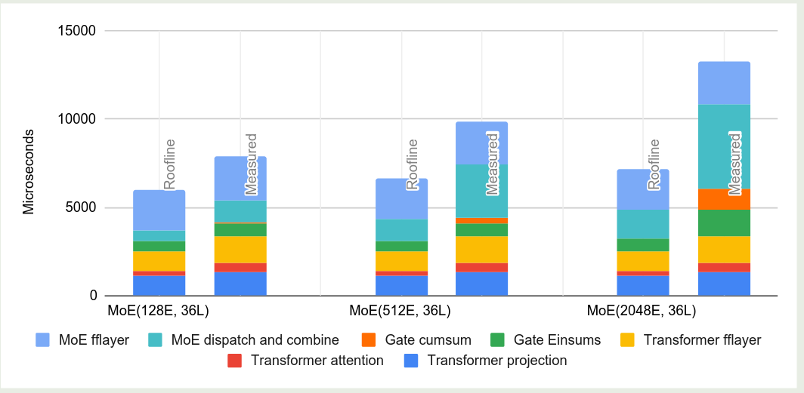

## Introduction

作者认为，训练大规模的模型存在如下问题：

1. 缺乏有效的 Model parallelism 算法
2. 随着设备数的增加，训练时间与 model size 呈现超线性增长的关系
3. (tensorflow) 在 nodes 数增多时，构建所需要的时间也大幅度增长
4. 在多个设备上 partition model 比较困难

作者在本文中构建了一个基于 sparse MoE 架构的 600B 模型。为了解决这些问题，作者作出了如下贡献：

1. 作者提出了基于 MoE 架构的模型，来减少计算和通信开销
2. 作者提出了 Gshard, 来自动化实现并行
3. 作者提出了 SPMD (single program multiple data) 来减少计算表示和编译的难度

## Method

架构如下图所示



其中激活专家个数为 2 个，MoE layer 和 FFN layer 交替出现。

作者对 GATE 函数进行了如下优化：

1. expert capacity. 每个 expert 都有一个处理 token 的上限值，超过该上限值之后 GATE 直接输出 0 进入下一层，假设 batch size 为 $N$, 专家个数为 $E$, 则该阈值定义为 $N/E$
2. group dispatching. 将 token 拆分为 $G$ 个 group, 每个 group 并行处理，每个 group 里每个专家处理的 token 个数上限为 $N/(GE)$.
3. Auxiliary loss. 作者使用了 [Load Balancing loss](Load%20Balancing%20loss.md) 来实现负载均衡
4. Random routing. 作者选取了 top-2 的专家，当第二个专家的权重太小是，作者直接忽略第二个专家，简化为选取 top-1 的专家

算法运行如下所示



## Parallel Implementation

第一步是将算法转化为线性代数的方式，算法的代码如下所示

```python
gates = softmax(einsum("GSM, ME->GSE", inputs, wg))
combine_weights, dispatch_mask = Top2Gating(gates)
dispatched_expert_inputs = einsum("GSEC, GSM->EGCM", dispatch_mask, reshaped_inputs)
h = einsum("EGCM, EMH->EGCH", dispatched_expert_inputs, wi)
h = relu(h)
expert_outputs = einsum("EGCH, EHM->GECM", h, wo)
outputs = einsum("GSEC, GECM->GSM", combine_weights, expert_outputs)
```

第二步是通过 API 来实现并行执行

```python
# Partition inputs along group (G) dim.  
inputs = split(inputs, 0, D)
# Replicate the gating weights
wg = replicate(wg)
gates = softmax(einsum("GSM, ME->GSE", inputs, wg))
combine_weights, dispatch_mask = Top2Gating(gating_logits)
dispatched_expert_inputs = einsum("GSEC, GSM->EGCM", dispatch_mask, reshaped_inputs)
# Partition dispatched inputs along expert (E) dim.
dispatched_expert_inputs = split(dispatched_expert_inputs, 0, D)
h = einsum("EGCM, EMH->EGCH", dispatched_expert_inputs, wi)
```

第三部就是基于 compiler infra 来基于 sharding annotation 自动化分割一个 computation graph.

## Experiments

作者在机器翻译的任务上训练了若干模型，结果发现：

1. 层数更多的模型表现更好
2. 提高 expert capacity 有效提高模型的表现
3. 使用更多的 expert 可以在 high-resourced 任务上提高表现
4. dense 模型相比于 MoE 模型拥有更强的迁移能力

从训练效率上来看

1. 层数更多的模型的 sample efficiency 也更高
2. 600B 的模型也可以在 4 天之内训练完毕

从内存使用效率上来看

1. 层数相同时，weight memory 以及 activation memory 不随专家个数增加而增加
2. 专家个数比较少（128）时，模型可以达到 roofline performance 的 $70\%$, 专家个数比较多（2048）时，模型依然可以达到 roofline performance 的 $48\%$.



## Conclusion

作者探究了如何提高大规模模型的训练效率，作者提出了基于 MoE 架构的模型，然后作者还设计了 GShard, 一个自动化分割大规模模型的深度学习模块。实现结果发现，增加模型 size 可以提高模型的表现。作者还发现，SPMD 是一个更好的提高计算效率的方法。

## Reference

- [arxiv](http://arxiv.org/abs/2006.16668)
