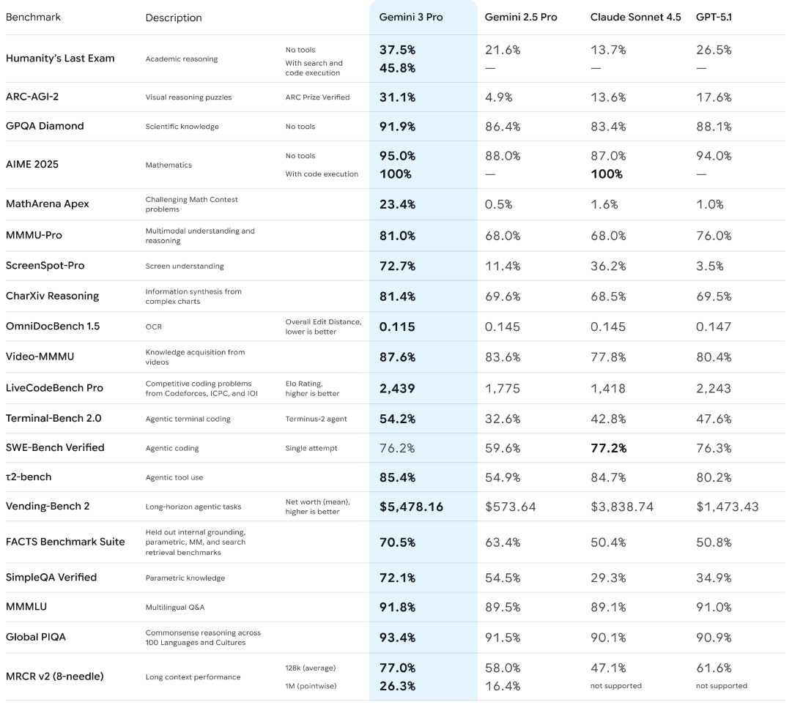
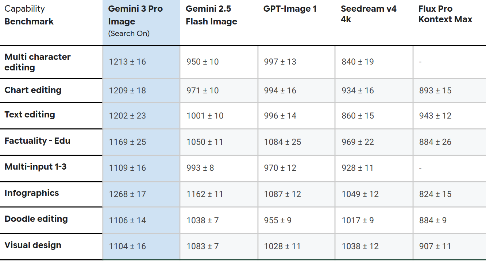

Gemini 3.0 是是 Google 新一代最强模型，model card 介绍了 Gemini 3.0 系列的评估结果以及基本能力

## Introduction

Gemini 3.0 系列包含

- Gemini 3.0 Pro
- Gemini 3.0 Flash
- Gemini 3.0 Pro Image
三个模型

Gemini 3.0 Pro 拥有原生多模态以及 reasoning 能力，可以处理 text, audio, images, video 以及 code repositories 等模态。

|        | modalities                 | context |
| ------ | -------------------------- | ------- |
| input  | text, images, audio, video | 1M      |
| output | text                       | 64K     |

Gemini 3.0 Flash 与 Gemini 3.0 Pro 基本一致，与 [Gemini2.5](https://maosong.website/p/notes-on-gemini2.5/) 相同，应该是采取了蒸馏的方式来实现更高的吞吐速度以及效率

Gemini 3.0 Pro Image 基于 Gemini 3.0 Pro 开发，是一个支持 text, image prompt 的图片生成模型

## Method

模型从零开始训练，使用了 MoE 架构和 [Transformer](Transformer.md) 架构

模型使用 TPU 进行训练，训练架构为 JAX 和 ML Pathways.

## Experiments

Gemini 3.0 Pro 对比了 [Gemini2.5](https://maosong.website/p/notes-on-gemini2.5/) , Claude Sonnet 4.5 和 GPT-5.1

Gemini 3.0 Flash 对比了 Gemini 3.0 Pro, Gemini 2.5 Flash, Gemini 2.5 Pro, Claude Sonnet 4.5, GPT-5.2 和 Grok 4.1 Fast.

Gemini 3.0 Pro Image 对比了 Gemini 2.5 Flash Image, GPT-Image 1, Seedream v4, Flux Pro Kontext Max

## References

- [Gemini 3.0 Pro Model Card](https://storage.googleapis.com/deepmind-media/Model-Cards/Gemini-3-Pro-Model-Card.pdf)
- [Gemini 3.0 Flash Model Card](https://storage.googleapis.com/deepmind-media/Model-Cards/Gemini-3-Flash-Model-Card.pdf)
- [Gemini 3.0 Pro Image Model Card](https://storage.googleapis.com/deepmind-media/Model-Cards/Gemini-3-Pro-Image-Model-Card.pdf)
