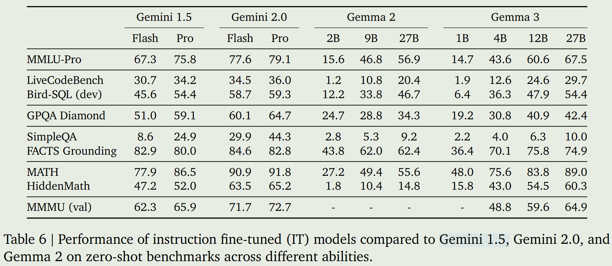
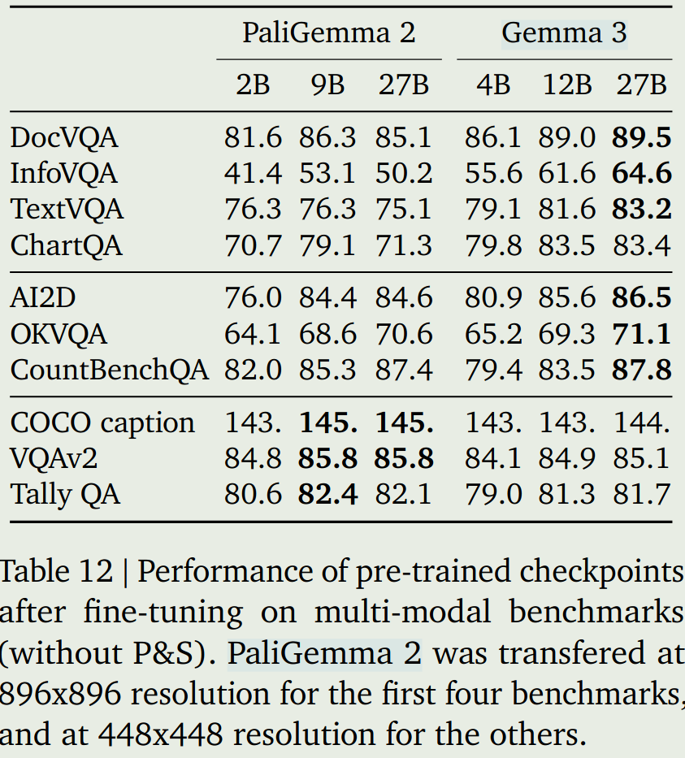
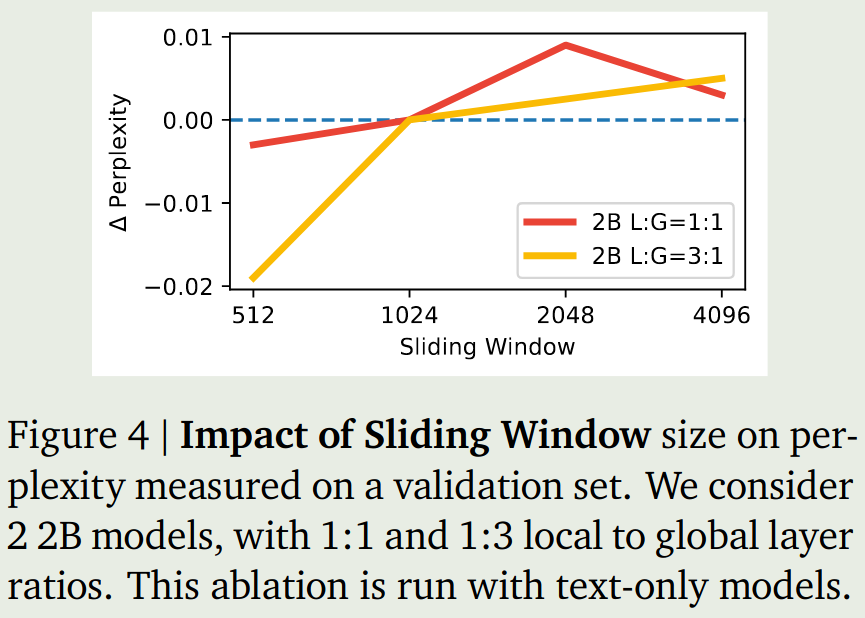
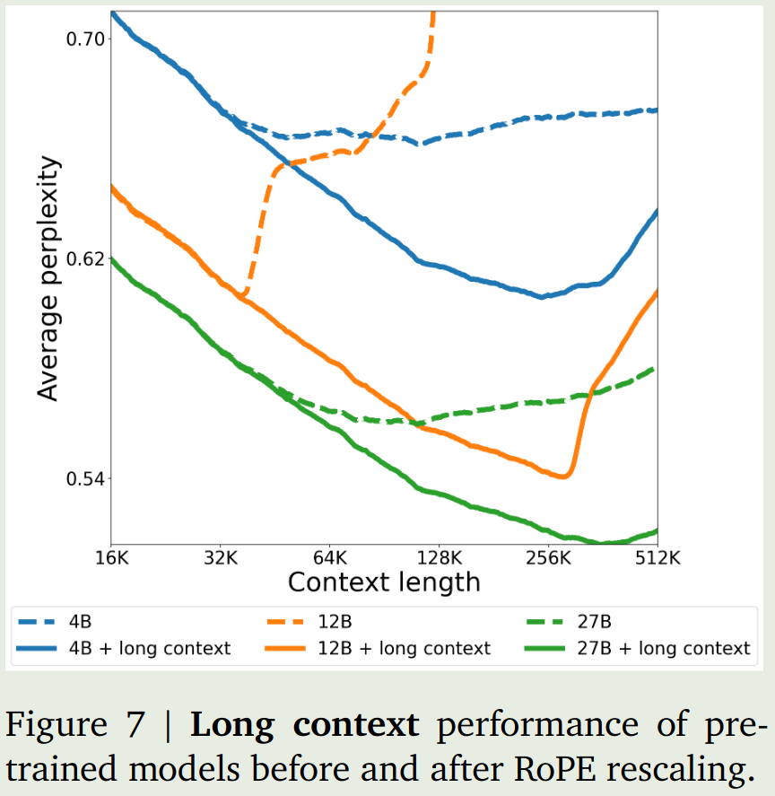
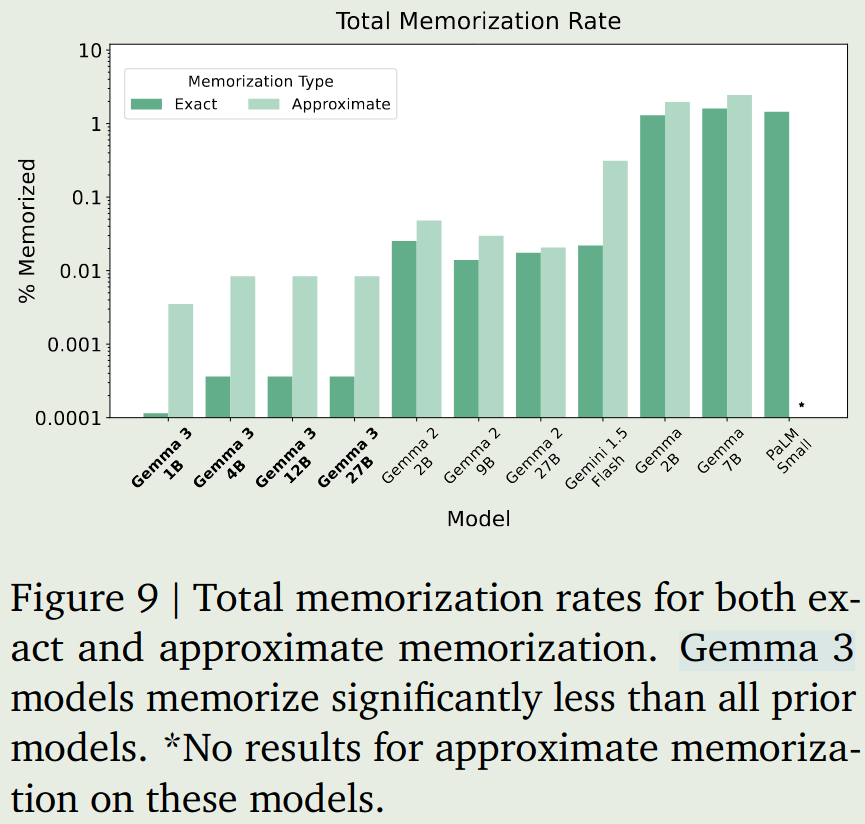

# TLDR

作者提出了Gemma3系列大模型，包括1B, 4B, 12B, 27B四个size。4B, 12B, 27B三个size均支持多模态，128K的上下文长度以及140种语言。

# 方法

## 数据处理

### 数据格式

```
[BOS]<start_of_turn>user 
Who are you?<end_of_turn> 
<start_of_turn>model 
My name is Gemma!<end_of_turn> 
<start_of_turn>user 
What is 2+2?<end_of_turn> 
<start_of_turn>model
2+2=4.<end_of_turn>
```

pretrain和SFT的区别在于,pretrain时模型输出以`<eos>`结束,SFT时模型输出以`<end_of_turn>`结束.

### 图片处理

输入的图片都会被resize到896x896，如果图片精度过大或者不是正方形，则会通过Pan & Scan技巧裁剪为多个子图，然后每个子图分别进行resize。核心处理代码为：

```python
crop_size_w = int(math.ceil(width / num_crops_w))
crop_size_h = int(math.ceil(height / num_crops_h))

# Don't apply PaS if crop size is too small.
if min(crop_size_w, crop_size_h) < pan_and_scan_min_crop_size:
    return []

crop_positions_w = [crop_size_w * i for i in range(num_crops_w)]
crop_positions_h = [crop_size_h * i for i in range(num_crops_h)]

image_crops = [
    image[pos_h : pos_h + crop_size_h, pos_w : pos_w + crop_size_w]
    for pos_h, pos_w in itertools.product(crop_positions_h, crop_positions_w)
]
```

## 模型架构

模型包括4个size，分别是1B, 4B, 12B, 27B。1B的模型是单模态的，4B, 12B, 27B的模型是多模态的。对于多模态模型来说：

- Vision encoder: Siglip-400M
- Projection layer: linear layer
- LLM: Gemma 3

## 模型参数

| Model | Vision  Encoder | Embedding Parameters | Non-embedding Parameters | context length | multilingual | training data |
|-------|--------------|----------------------|--------------------------|---------------|-------------|-------------|
| 1B | 0 | 302M | 698M | 32K | English | 2T tokens |
| 4B | 417M | 675M | 3,209M | 128K | 140+ languages | 4T tokens |
| 12B | 417M | 1,012M | 10,759M | 128K | 140+ languages | 12T tokens |
| 27B | 417M | 1,416M | 25,600M | 128K | 140+ languages | 14T tokens |

## Attention layers

为了提高效率，作者将部分layer的self-attention替换为sliding window attention。论文里是将6 layers为一组，替换一组中最后一层为sliding window attention，其余层为self attention。判断某layer是否为sliding window attention的代码为：

```python
# config.sliding_window_pattern = 6
self.is_sliding = bool((layer_idx + 1) % config.sliding_window_pattern)
```

## Long context

作者将global self-attention的RoPE的base frequency从10K提升到了1M，对于sliding window attention，RoPE的base frequency保持10k不变。

## 预训练

1. 数据在模型参数里进行了汇总
2. tokenizer使用的是Gemini2.0的tokenizer，基于SentencePiece，vocab大小为262K
3. 使用知识蒸馏的方法进行训练，每个token按照教师模型的概率采样256个logits，然后使用cross-entropy loss进行训练
4. 4B, 12B, 27B的模型先在32K的context length上进行训练，然后在128K的context length上进行训练

## Quantization Aware training

作者提供了quantized版本的模型，模型基于预训练好的模型使用QAT方法进行SFT 5000 steps左右。最后是各个模型的内存占用情况

|      |Raw (GB) ||Quantized (GB)||  
|------|--------|--------|--------|--------|
|Model |bf16 |Int4| Int4(blocks=32)| SFP8|  
|1B |2.0 |0.5 |0.7 |1.0 |
|+KV |2.9 |1.4 |1.6 |1.9 |
|4B |8.0 |2.6 |2.9 |4.4 |
|+KV |12.7 |7.3 |7.6 |9.1 |
|12B |24.0 |6.6 |7.1 |12.4 |
|+KV |38.9 |21.5 |22.0 |27.3 |
|27B |54.0 |14.1 |15.3 |27.4 |
|+KV |72.7 |32.8 |34.0 |46.1|

## 后训练

数据过滤：筛选掉包含PII，不安全的或者有毒的输出等。留下上下文依赖高，幻觉小的数据

训练包括升级版的知识蒸馏和基于RL的finetuning，其中RL的reward来自于weight averaged reward models, code execution feedback, ground-truth rewards

# 实验

## 表现

Gemma3的表现如下图所示



与PaliGemma 2的表现对比



## 消融实验

### Local attention layers

1. `sliding_window_pattern`对模型的表现影响不大
2. sliding window size对模型的表现也不是很大，如下图
3. 使用sliding window attention可以降低KV cache的内存占用



### Long context ablation

结论为long context会降低模型的性能



### 知识蒸馏

训练token个数比较少的时候，使用小的教师模型效果更好；训练token个数比较多的时候，使用大的教师模型效果更好。

### Pan & Scan

使用图片原始的aspect ratio训练的模型效果更好。

### memorization

memorization指模型输出的文本与训练数据中文本的重复率。结果发现Gemma3的memorization要更低一些。



# 结论

1. sliding window attention在Qwen2.5-VL里已经验证过有效,这里在Gemma3上同样验证了有效性.
2. 模型架构与PaliGemma系列基本一致，只是attention改变了，然后LLM从Gemma 2升级到了Gemma 3。

# 参考文献

- [Gemma3 Technical Report](https://storage.googleapis.com/deepmind-media/gemma/Gemma3Report.pdf)
- [transformers-Gemma3 code](https://github.com/huggingface/transformers/tree/main/src/transformers/models/gemma3)
