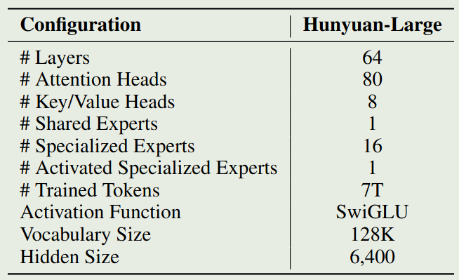
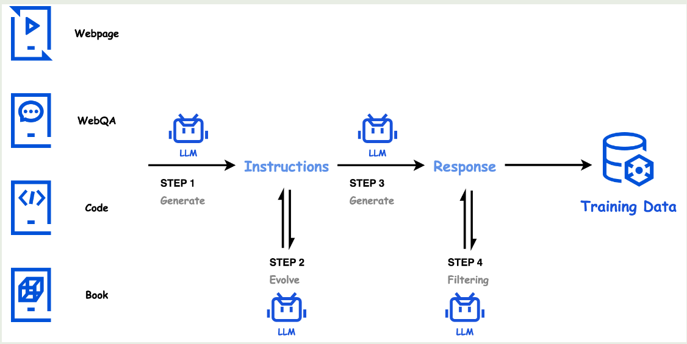
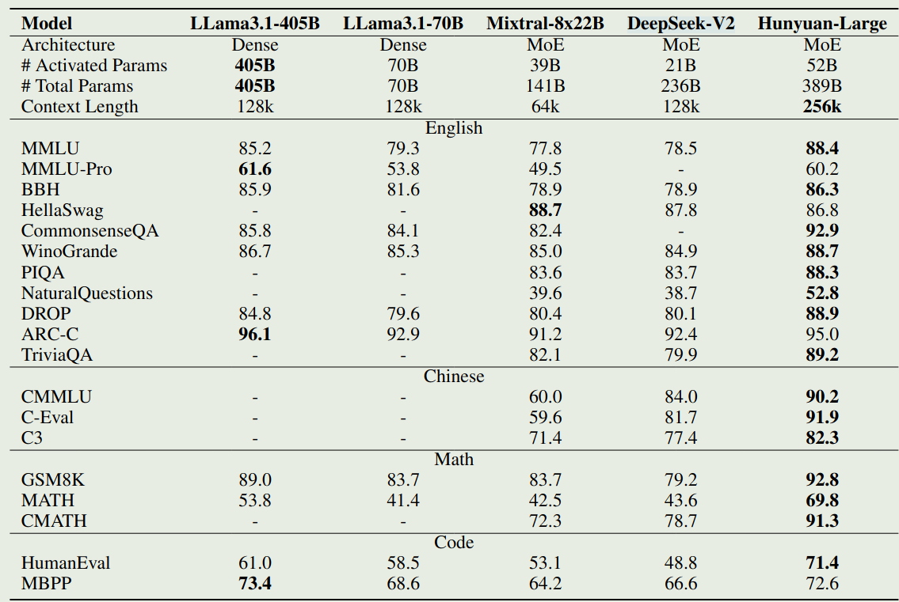
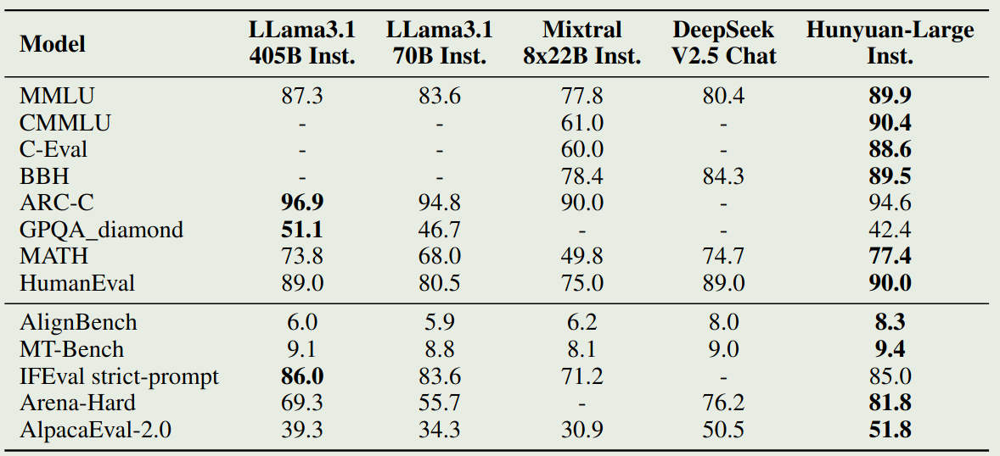

腾讯混元提出了 Hunyuan-Large, 一个 389B-A52B 的 MoE LLM, 上下文长度为 256K.

## Introduction

Hunyuan-Large 主要在三个方向进行了改进：

1. 使用了更高质量的合成数据：模型使用了 7T 的预训练数据，其中包含了 1.5T 的合成数据
2. 优化了模型的架构：作者提出了 KV cache compression, recycle routing, expert-specific learning rate scaling 策略来提高模型的表现
3. 探究了 MoE 模型的 scaling law: 作者探究了 MoE 模型的 scaling law

## Pre-training

### Architecture

Hunyuan-Large 是一个基于 MoE 的 transformer 架构，attention 部分使用了 GQA, position encoding 使用了 RoPE, MLP 的激活函数为 SwiGLU. 在 MoE layer 中，Hunyuan-Large 使用了 shared experts. 最终，模型的配置如下图所示

#### KV Cache Compression

为了减少 KV cache 的内存开销，作者使用了两个技巧：

1. GQA: 通过共享 KV projection 的参数，来减少内存访问次数
2. [[CLA]]: 在相邻的 layer 中共享 KV cache, 来进一步压缩 KV cache

在 Hunyuan-Large 中，作者将 GQA 的 group size 设置为 8, 然后相邻的 2 层 layer 共享 KV cache.

假设输入的 batch size 为 $B$, sequence 长度为 $L$, layers 个数为 $\ell$, attention heads 个数为 $h$, KV heads 个数为 $h_{kv}$, 每个 head 的 hidden size 为 $d_h$, 则每一层的 GQA 需要缓存 $K,V\in\mathbb{R}^{B\times _{kv}\times L\times d_h}$， KV cache 的总占用为

$$
2\times B\times h_{kv}\times L\times d_h \times \ell \times 2=4BLh_{kv}d_h\ell
$$

第一个 $2$ 是因为同时缓存 K 和 V, 第二个 $2$ 是因为一般使用 `bfloat16` 数据格式。

对于 CLA, 因为连续两层共享相同的 KV cache，因此结果除以 2; 对于 MHA, $h_{kv}=h$; 对于 MQA, $h_{kv}=1$. 最后，KV cache 的内存占用如下表所示

| Attention Mechanism | KV Cache Memory    |
| ------------------- | ------------------ |
| MHA                 | $4BLhd_h\ell$      |
| GQA                 | $4BLh_{kv}d_h\ell$ |
| MQA                 | $4BLd_h\ell$       |
| CLA                 | $2BLhd_h\ell$      |
| GQA+CLA             | $2BLh_{kv}d_h\ell$ |

可以看到，使用 GQA+CLA 之后，模型的 kv cache 占用相比于 MHA 变成了

$$
\frac{2BLh_{kv}d_h\ell}{4BLhd_h\ell}=\frac{1}{16}
$$

也就是说，Hunyuan-Large 的 KV cache 内存占用下降到了 MHA 的 1/16.

#### Expert Routing Strategy

作者采用了 shared expert + activated expert 的形式，其中包含 1 个 shared  expert, 然后从 16 个专家里激活 1 个专家。

为了解决 MoE 中 expert capacity 难以设定的问题，作者提出了一个 recycle routing 的策略，基本思想就是，当 activated expert 的容量超出限制时，会从其他没有超出容量限制的专家里重新进行激活。

#### Expert Specific Learning Rate Scaling

作者使用 AdamW 作为优化器，作者探讨了如何设定学习率。基于之前的工作，最优的学习率与 batch size 相关：

$$
\epsilon_{\mathrm{opt}}(B) = \frac{2\epsilon_{\max}}{\sqrt{\frac{\mathcal{B}_{\mathrm{noise}}}{B}}+\sqrt{\frac{B}{\mathcal{B}_{\mathrm{noise}}}}}
$$

这里 $\epsilon_{\max}$ 是 AdamW 的学习率, $\mathcal{B}_{\mathrm{noise}}$ 是训练速度与数据使用效率的一个平衡因子。

但是，在 MoE 模型中，不同专家处理的 token 是不一样的。基于 load balancing loss, shared expert 和 activated expert 处理的 token 个数比例大概是 $n :1$, 其中 $n=16$ 是总的专家个数。因此，对于 shared expert, 作者使用 $\epsilon_{\mathrm{opt}}(B)$ 作为学习率，然后对于 activated expert, 作者使用 $\epsilon_{\mathrm{opt}}(B/n)$ 作为学习率。

### Data

预训练数据包括收集和合成。收集的数据主要来自互联网，覆盖中英文两种语言。

合成数据包括 4 个步骤：

1. instruction generation: 作者使用高质量的语料作为 seed, 然后生成多样的 instruction 覆盖不同的 domain
2. Instruction evolution: refine 上一步生成的 instruction
3. Response generation: 使用 specialized model 来生成回答
4. response filtering: 对生成的回答进行过滤

数据合成的流程如下图所示

tokenizer 大小为 128K, 由 tittoken tokenizer 和额外的 28K token 组成。

### Pre-training Recipe

作者首先探究了一个针对 MoE 模型的 scaling law. 结果发现，最优的激活参数量为 58.1B, training token 个数为 5.6T. 经过平滑之后，作者最终将模型的激活参数两定为 **52B**, 训练 token 数定为 $7T$.

在训练时，作者将学习率分为了 3 个 stage:

1. warmup phase
2. gradual decay phase
3. concise annealing phase

上面的三个 stage 结束之后，作者加入了两个 stage 来扩展模型的上下文长度从 32K 扩展到 256K. 训练的数据包括 75% 的短文本和 25% 的长文本。两个 stage 训练的 token 数均为 $10B$ 左右。

## Post-training

post-training 分为 SFT 和 RLHF 两个阶段。

### SFT

SFT 数据副高 math, coding, logical reasoning 等 domain, 包含超过 1M 的数据。

SFT 训练了 3 个 epoch, 学习率从 2e-5 降低到 2e-6, 为了避免 overfitting, 作者使用了 0.1 的 attention dropout 和 0.2 的 hidden dropout.

> [!tip]
> 作者发现，MoE 模型可以从 dropout 中学习到更多

### RLHF

作者使用 DPO 来进行 RLHF, 作者同时使用了 offline 和 online 的数据来进行训练，前者是收集的数据，后者是当前 policy 生成的数据。与 LLaMA 3 和 Nemotron-4 一样，为了提高训练稳定性，对于 chosen reponse, 作者使用了 SFT loss.

作者还是用了 exponential moving average 策略来减少 reward hacking 现象，以及降低 alignment tax.

## Experiment

对于 base 版本，作者对比了 LLaMA 3, Mixtral, DeepSeek-V2,  实验结果如下图所示

Instruction 版本的表现如下图所示

## Conclusion

作者提出了 Hunyuan-Large, 一个 389B-A52B 的 LLM, 上下文长度为 256K. 作者详细介绍了模型的架构，数据和训练方式。

## References

- [arxiv](https://arxiv.org/pdf/2411.02265)
