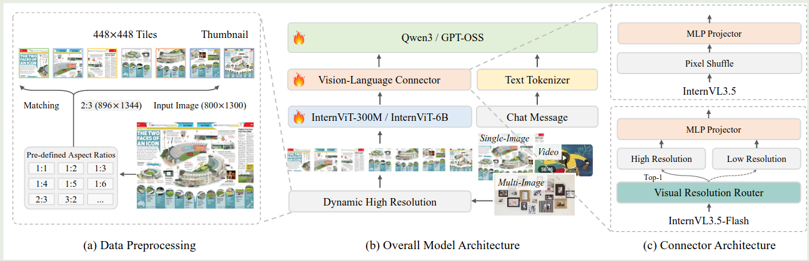
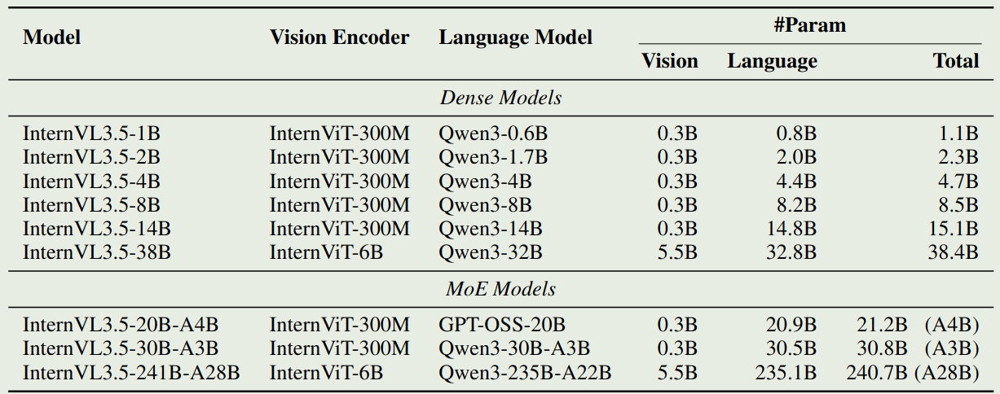
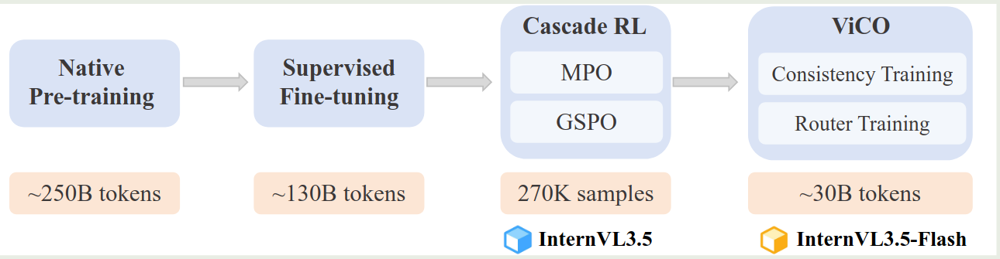
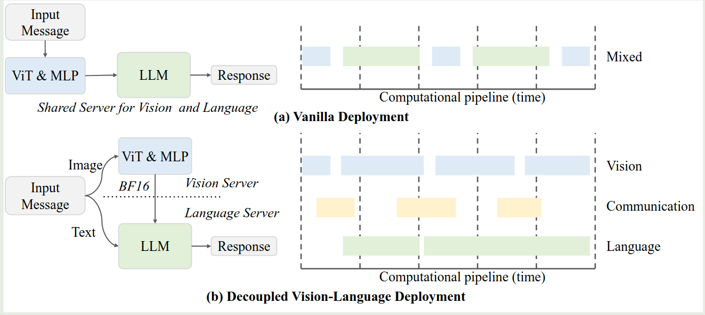
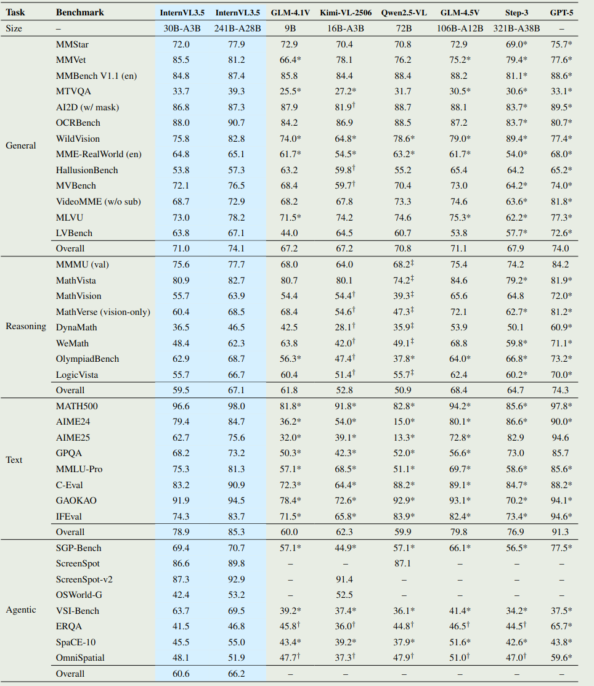
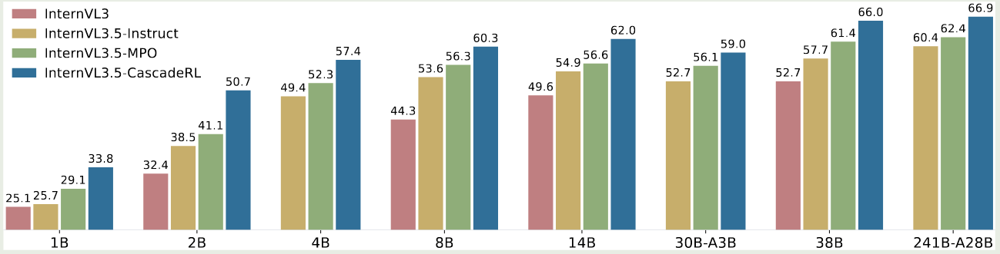
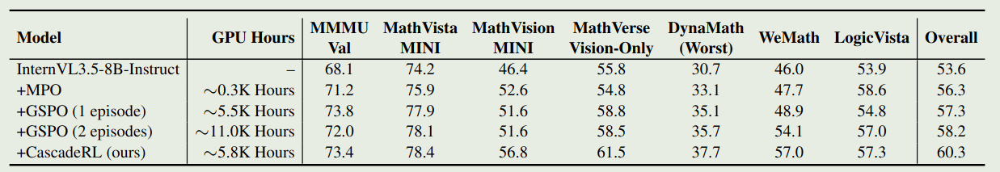
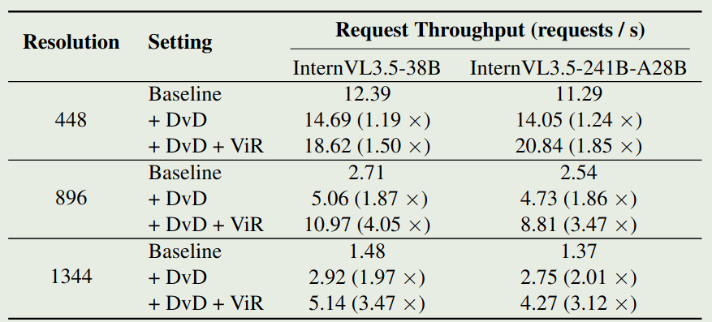

上海 AI LAB 提出了 InternVL 3.5 系列多模态大模型，InternVL 3.5 主要强调了模型的 reasoning 能力以及 inference 效率。

## Introduction

作者首先介绍了已有多模态大模型的进展，然后提到有两个未解决的问题：

1. 如何构建一个 stable, effective, scalable 的 RL 框架来训练 MLLM
2. 如何降低 MLLM 在长上下文场景下的计算开销过高的问题

为了解决这两个问题，作者提出了 InternVL3.5 多模态大模型系列，相比于 InternVL3, 模型在 reasoning 能力和 efficiency 上均进行了提升。作者主要通过 Cascade RL 框架来提高模型的 reasoning 表现，以及使用 Visual Resolution Router (ViR) 和 Decoupled Vision Language Deployment (DvD) 来提高模型的推理效率。

总结起来，InternVL3.5 模型的贡献如下：

1. 开源了 InternVL3.5 系列多模态大模型，模型拥有先进的 reasoning 能力以及推理效率
2. 提出了 Cascade RL, ViR 以及 DvD 等模块来提高模型的表现/推理效率
3. 系统性评估了模型的表现

## Method

### Architecture

InternVL3.5 的架构与 InternVL3 的架构基本一致，包括一个 ViT, 一个 MLP 和一个 LLM, 模型的架构如下图所示

模型配置如下表所示

InternVl3.5 延续了 InternVL 系列的做法，即 20B 以下的模型使用 InternViT-300M, 20B 以上的模型使用 InternViT-6B 作为 Visual encoder. 大语言模型基于 [Qwen3](https://maosong.website/p/notes-on-qwen3/) 和 [gpt-oss](https://maosong.website/p/notes-on-gpt-oss/).

在 InternVL3.5 的基础上，作者还构建了 InternVL3.5-Flash 模型，InternVL3.5-Flash 不同的地方在于，其在 MLP 之前加入了一个 Visual Resolution Router (ViR) 模块，来处理不同分辨率的图片。在 InternVL3.5 中，每个 image patch 由 1024 个视觉 token 来表示，然后通过 pixel shuffle 压缩至 256 个。 在 InternVL3.5-Flash 中，ViR 首先会判断每个 patch 的 semantic richness, 然后基于 semantic richness 来将对应的 token 路由到不同的 pixel shuffle 模块中，最高可以将视觉 token 压缩到 64 个，这样就可以大幅度提高模型的推理效率。

### Pre-training

Pre-training 使用 next-token-prediction loss 来更新模型权重，给定多模态 sequence $x=(x_1,\dots,x_L)$, 损失函数定义为

$$
\mathcal{L}(\theta) = -\sum_{x_i\text{ is text token}} \log p_{\theta}(x_i
\mid x_1,\dots,x_{i-1})
$$

与 InternVL2.5 一样，作者还对不同长度的 sequence 进行了加权，避免模型产生 bias, 加权后的 loss 为

$$
\mathcal{L}(\theta) = -\sum_{x_i\text{ is text token}}\frac{w_i}{\sum_j w_j} \log p_{\theta}(x_i
\mid x_1,\dots,x_{i-1}),\quad w_i = \frac{1}{N^{0.5}}
$$

其中 $N$ 是训练样本中需要计算损失的 token 个数。

训练数据蛀牙包含两部分：

1. 多模态数据，这部分数据基于 InternVL3
2. 纯文本数据，基于 InternLM 系列和开源的数据集

最终，预训练数据一共包含**116M** 样本，**250B** token. 纯文本数据和多模态数据的比例为 $1:2.5$. 模型上下文长度为 $32K$.

### Post-training

Post-training 包含三个阶段：

1. SFT： 使用高质量对话数据提高模型表现
2. Cascade RL: 提高模型的 reasoning 能力
3. Visual Consistency Learning: 训练 ViR 模块，提高模型处理动态分辨率图片的能力

训练 pipeline 如下图所示

SFT 阶段的训练数据包括三个方面：

1. InternVL3 的指令跟随数据
2. 多模态 reasoning 数据
3. 能力扩展数据，包括 GUI 交互，具身交互以及 SVG 理解与生成的数据

Cascade RL 阶段结合了 offline RL 和 online RL 的优点。基本思想是先使用 offline RL 来提高模型的能力，降低训练成本。然后再使用 online RL 进一步提高模型的 reasoning 表现。

offline RL 阶段使用的是 InternVL-MPO 算法，其损失函数为

$$
\mathcal{L}_{MPO} = w_p\mathcal{L}_p+w_q\mathcal{L}_q+w_g\mathcal{L}_g
$$

其中，$\mathcal{L}_p$ 为 DPO 的损失函数，$\mathcal{L}_q$ 为 Quality loss, $\mathcal{L}_g$ 为 SFT 使用的 next-token-prediction loss.

online RL 阶段使用的是 [GSPO](https://maosong.website/p/notes-on-gspo/) 算法，核心思想是在 sample 层面做归一化。这个阶段的目的是进一步提高模型的表现。

Cascade RL 的优势在于：

1. 训练更稳定：offline RL 可以避免模型产生 reward hacking 现象，online RL 阶段可以进一步提高模型的表现
2. 训练效率更高：offline RL 可以有效提高采样效率
3. 表现更好：先 MPO 再 RL 可以达到更好的表现

Visual Consistency Learning (ViCO) 的目的是降低 InternVL3.5 的推理开销。这个阶段主要训练 ViR 模块

ViCO 包括两个 stage:

Stage 1: Consistency training

这一阶段的目的是使得不同压缩率处理的视觉 token 对应的输出与 ground truth 尽可能一致，作者使用另外一个 InternVL3.5 模型作为 reference model, 然后损失函数为

$$
\mathcal{L}_{ViCO} = \mathbb{E}_{\xi\sim\mathcal{R}}\left[\frac{1}{N}\sum_{i=1}^N\mathrm{KL}\left(\pi_{\mathrm{ref}}(y_i\mid y_{<i}, I)\ \Vert\ \pi_{\theta}(y_i\mid y_{<i}, I_{\xi})\right)\right]
$$

$\xi\in\{1/4,1/16\}$ 为 compression rate, 训练是随机采样。$\xi=1/4$ 代表最终会有 256 个视觉 token, $\xi=1/16$ 代表最终会有 64 个 token.

Stage 2: Router training

这个阶段的目的是训练 ViR 来选取合适的精度/压缩率。ViR 此时作为一个 binary classifier 来进行训练，训练的损失函数为 cross-entropy loss. 模型其他部分参数冻结，仅训练 ViR 模块，首先，我们将计算压缩 16 倍后的损失与压缩 4 倍的损失的比例

$$
r_i = \frac{\mathcal{L}_{ViCO}(y_i\mid I_{1/16})}{\mathcal{L}_{ViCO}(y_i\mid I_{1/4})}
$$

该比例衡量了压缩 token 之后带来的性能下降程度，接下来，作者设定了一个阈值 $\tau$, 当性能下降超过阈值 $\tau$, 则认为应该使用高精度，也就是 $\xi=1/4$, 反之则说明不需要过度视觉 token, 可以使用低精度，也就是 $\xi=1/16$. 总结得到

$$
y_i^{router} = \begin{cases}
0, &r_i<\tau\\
1, &r_i>\tau
\end{cases}
$$

训练时，作者基于 sliding window 中的 $r_i$ 来动态调整 $\tau$ 的值。

post-training 的训练数据如下：

1. SFT 训练数据包括**56M** 样本，**130B** token, 纯文本数据与多模态数据的比例为 $1:3.5$.
2. Cascade RL 的训练数据主要基于 MMPR, 包含 200K 左右的样本，通过过滤最终得到**70K**左右的样本。online RL 同样使用这批数据进行训练
3. ViCO 的训练数据与 SFT 阶段的训练数据一致。主要是 OCR 以及 VQA 数据

### Test-time Scaling

test time scaling 主要基于两个方面：

1. deep thinking: 就是 reasoning mode
2. parallel thinking: 基于 VisualPRM 进行多次采样，然后基于 BoN 策略得到最终的输出。

### Infra

模型使用 XTuner 框架进行训练，使用了包括 FSDP, data packing, FP8, flashattention3 等策略。

作者还提出了 DvD 的策略来提高推理效率，核心思想就是将 ViT-MLP 模块放在一个 server 上，然后将 LLM 放在另一个 server 上，这样就也可以提高整体的通信效率。框架示意图如下所示

## Experiments

模型整体表现如下图所示

### Ablation Study

作者首先探究了 Cascade RL 对模型表现的影响

实验结果显示，SFT, MPO 和 offline RL 每个阶段都可以提高模型的多模态 reasoning 表现。

作者进一步探究了不同阶段的投入产出比，也就是训练时间与最终模型表现的变化情况，如下表所示

实验结果显示，尽管 GSPO 的效果提升比较明显，但是训练所需要的时间比较长。如果先 MPO 再进行 GSPO 的话，我们可以在较短的时间里取得较好的表现。

接下来，作者探究了 ViR 的有效性和效率。作者首先对比了 InternVL3.5 以及 InternVL3.5-flash 的表现。结果显示，大部分情况下，这两个模型的表现没有较大差距。说明 ViR 不会损害模型的性能。

作者进一步探究了 ViR 和 DvD 对提升模型效率的影响，实验结果如下图所示

实验结果说明，对于高精度图片输入，DvD 和 ViR 均可以提高模型的推理效率。

## Conclusion

在本文中，作者提出了 InternVL3.5 系列多模态大模型，作者提出了 Cascade RL 框架，该框架结合了 offline RL 以及 online RL 来提高模型的 reasoning 表现以及训练效率。作者还提出了 ViR 以及 DvD 模块来提高模型处理高分辨率图片的效率。

## References

- [Arxiv](http://arxiv.org/abs/2508.18265)
