## Introduction

作者首先就总结了本文的发现，主要有以下几点：

1. 损失与模型的 scale , 即除开 embedding 的模型参数，数据集大小以及算力强相关，与 model shape 比如 depth 或者 width 关系不大
2. scaling law 是非常光滑的，意味着 scaling law 是一个可预测的模型
3. overfitting 普遍存在，当参数和数据集大小同时增加时，模型的表现会增加，但是当其中一个量固定时，提升就比较小。并且当我们将模型参数提升 8 倍时，我们只需要将数据集的大小提升 5 倍就可以避免过拟合
4. 训练的损失函数曲线与 model size 无关，因此我们可以预测给定大小模型的表现
5. 模型在测试集和训练集上的表现高度相关，因此我们可以基于训练集的损失来预测模型的表现
6. 大模型比小模型拥有更高的 sample efficiency, 即更小的训练步数就可以达到相同的表现
7. convergence 不能说明一切，我们可以通过 early-stopping 来提高算力使用效率，避免模型花费过多的算力在较小的提升上
8. 最优的 batch size 与 loss 呈一个 power law 的关系

### Notation

| Symbol          | Notation                                                       |
| --------------- | -------------------------------------------------------------- |
| $L$             | cross entropy loss                                             |
| $N$             | non-embedding parametters                                      |
| $B$             | batch size                                                     |
| $S$             | number of training steps                                       |
| $C\approx 6NBS$ | estimate of total training compute                             |
| $D$             | dataset size in tokens                                         |
| $B_{crit}$      | critical batch size                                            |
| $C_{\min}$      | estimate of the minimum compute to reach a given value of loss |
| $S_{\min}$      | estimate of the minimum steps to reach a given value of loss   |
| $\alpha_X$      | power-law exponents for the scaling law of loss                |
| $d$             | hidden size of the model                                       |

为了简便，后续未经特殊说明，我们说模型参数均指的是 non-embedding 的参数

### Scaling Law Overview

1. 当数据集 $D$ 足够大时，损失与模型参数大小 $N$ 之间的关系为

$$
L(N) = \left(\frac{N_C}{N}\right)^{\alpha_N}, \alpha_N\sim 0.076, N_C\sim 8.8\times 10^{13}
$$

2. 给定模型参数大小 $N$ ,  损失与数据集大小 $D$ 之间的关系为

$$
L(D) = \left(\frac{D_C}{D}\right)^{\alpha_D}, \alpha_D\sim 0.095, D_C\sim 5.4\times 10^{13}
$$

3. 给定足够大的数据集 $D$ 和最优模型大小 $N$ 时，损失与算力 $C$ 之间的关系为

$$
L(C_{\min}) = \left(\frac{C_C^{\min}}{C_{\min}}\right)^{\alpha_D}, \alpha_C^{\min}\sim 0.050, C_C^{\min}\sim 3.1\times 10^{8}
$$

作者在不同大小的数据集，算力，模型大小下进行了测试，结果发现 scaling 与模型的 shape, transformer 的超参数之间的关系比较小。$\alpha_N,\alpha_D,\alpha_C^{\min}$ 等决定了当我们 scale up 数据及大小，模型大小和算力时损失的变化情况。比如当我们将模型参数提升至 2 倍时，模型的损失会降低至原来的 $0.95$.

基于发现 1 和 2, 作者发现当我们将模型的 size 提升至原来的 2 倍时，模型的数据集大小应该提升至原来的 $1.67$ 倍，具体关系为 $D\sim N^{0.74}$.

作者使用了一个统一的公式来描述损失与数据及大小和模型参数大小之间的关系

$$
L(N,D) = \left[\left(\frac{N_c}{N}\right)^{\frac{\alpha_N}{\alpha_D}}+ \frac{D_c}{D}\right]^{\alpha_D}
$$

4. 当数据集充分大时，损失与模型参数大小以及更新步数 $S$ 的关系如下

$$
L(N, S) = \left(\frac{N_C}{N}\right)^{\alpha_N} +\left(\frac{S_C}{S_{\min}(S)}\right)^{\alpha_S}
$$

这里 $S_C\approx 2.1\times 10^3$, $\alpha_S\approx 0.76$, $S_{\min}(S)$ 是估计出来的最小优化步数

5. 最优的 batch size 与损失函数之间的关系如下

$$
B_{crit}(L) = \frac{B_*}{L^{1/\alpha_B}}, B_*\sim 2*10^8 \text{ tokens}, \alpha_B\sim 0.21
$$

6. 给定算力 $C$ 且无其他限制时，模型参数，数据及大小，batch size 和更新参数与算力之间的关系如下

$$
N\propto C^{\alpha_C^{\min}/\alpha_N}, B\propto C^{\alpha_C^{\min}/\alpha_B}, S\propto C^{\alpha_C^{\min}/\alpha_S}, D=BS
$$

其中

$$
\alpha_C^{\min} = \frac{1}{\frac{1}{\alpha_S}+\frac{1}{\alpha_B}+\frac{1}{\alpha_N}}
$$

实验的结果为 $N\propto C_{\min}^{0.73}$, $B\propto C_{\min}^{0.24}$ , $S\propto C_{\min}^{0.03}$. 也就是说，当我们提升算力时，提升模型的参数大小带来的收益是最高的。

## Background

首先，transformer 的参数量通过计算可以得到

$$
N\approx 2dn(2d+d_{ff}) = 12nd^2
$$

这里 $d$ 是 hidden size, $n$ 是 layer 个数，$d_{ff}$ 是 MLP 的 hidden size, 这里我们 假设 $d_{ff}=4d$. 计算时我们丢掉了 bias 以及 LayerNorm 的参数量。具体计算过程见 [LLM parameter analysis](https://maosong.website/p/llm-parameter-computation/)

transformer 一次前向计算的 operations 数量大概为

$$
C_{forward}\approx 2N + 2nLd
$$

这里 $L$ 是输入的 token 长度。

由于反向传播所需要的 FLOPs 是前向传播两倍，因此 transformer 的计算量为

$$
C = C_{backward} + C_{forward} = 3C_{forward}\approx 6N
$$

具体计算过程见 [LLM FLOPs analysis](https://maosong.website/p/llm-flops-computation/)。也就是说，对于参数量为 $N$ 的 transformer model, 每个 token 所需要的 FLOPs 为 $C\approx 6N$

## Empirical Results and Basic Power Laws

### Transformer Shape and Hyper-parameter Independence

作者基于 $N=12nd^2$, 在保持总参数量 $N$ 不变的情况下，分别调整 $n$, $d_{ff}$ 和 number of attention heads 的个数 （变化 $d$ 用于维持总参数量不变），结果如下图所示

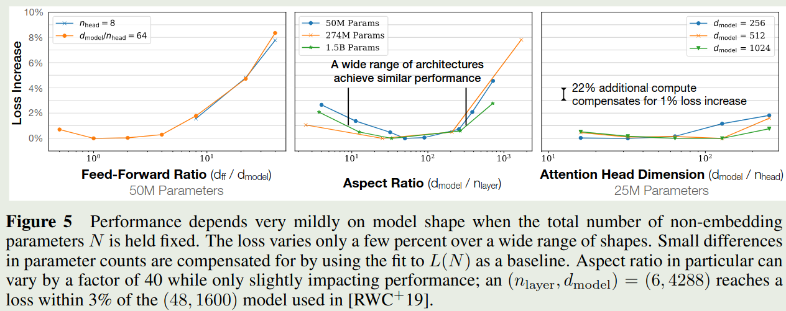

实验结果发现，损失对于 $d_{ff}/d$, $d/n$, $d/n_h$ 都比较 robust, 说明**模型的损失对模型的 shape 依赖性比较低。**

### Non-embedding Parameter Count

作者探究了以下 model size 对损失的影响，作者使用了不同的 $n$ 和 $d$, 然后训练得到的损失情况如下图所示

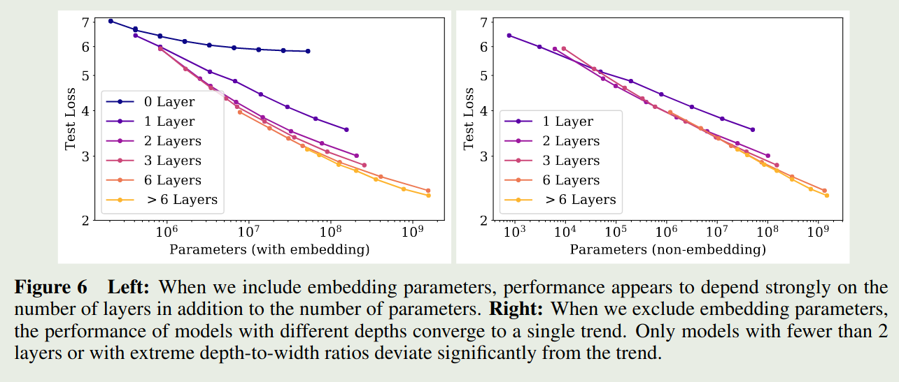

作者发现，当包含 embedding parameter 时，损失不仅依赖于模型参数量，还依赖于 layer 层数 $n$, 但是**当我们排除 embedding parameter 时，模型的损失便与 layer 层数 $n$ 关系不大**。这个趋势可以用以下模型来表示

$$
L(N) \approx \left(\frac{N_c}{N}\right)^{\alpha_N}
$$

最终拟合的曲线如下图所示

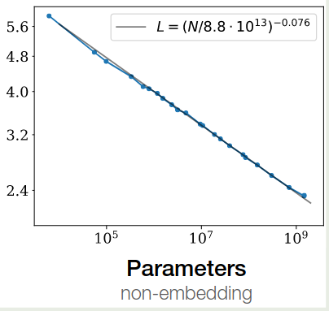

### Comparing to LSTMs and Universal Transformers

作者比较了 LSTM 和 Transformer 结构的损失，结果如下图所示

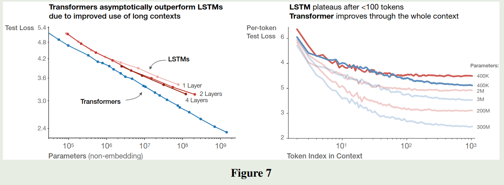

可以看到，**transformer 比 LSTM 拥有更强的学习能力**， LSTM 架构对于 early context 表现比较好，但是随着 context 增加，LSTM 的表现逐渐弱于 transformer. **即 transformer 的长上下文能力强于 LSTM 架构**。

### Generalization Among Data Distributions

模型是在 WebText2 数据集上训练的，作者进一步在其他数据集上评估了以下模型的泛化性，结果如下图所示

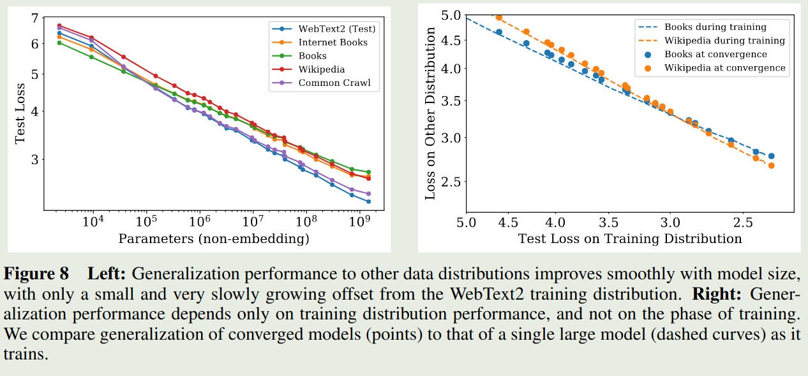

结果发现，模型在其他数据集上的泛化性很好。并且，**模型的泛化性能仅与训练阶段的表现相关（validation loss），而与训练阶段（是否收敛）无关**。

作者还评估了 model depth 对模型泛化性的影响，结果如下图所示

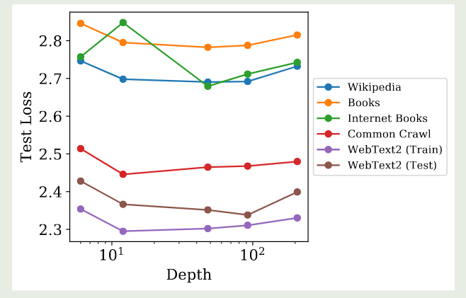

实验结果显示，**model depth 对模型泛化性基本没有影响**。

### Performance with Data Size and Compute

作者探究了损失与 dataset size $D$ 之间的关系。作者固定一个模型，然后当 test loss 不再下降时停止训练，结果发现 test loss 与 dataset size $D$ 之间存在如下关系

$$
L(D) \approx  \left(\frac{D_c}{D}\right)^{\alpha_D}
$$

拟合结果如下图所示

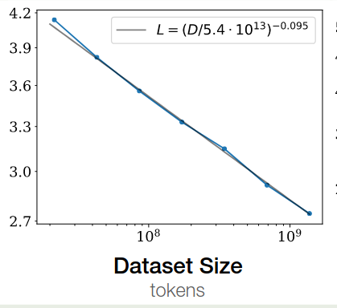

接下来，基于前面计算的结果，我们有 $C\approx 6ND=6NBS$, 这里 $B$ 是 batch size, $S$ 是训练步数。给定 $C$, 作者使用不同大小的模型进行训练，batch size $B$ 保持不懂，训练步数设置为 $S=C/6BS$,实验结果显示损失与算力 $C$ 之间满足如下关系

$$
L(C) \approx  \left(\frac{C_c}{C}\right)^{\alpha_C}
$$

拟合结果如下图所示

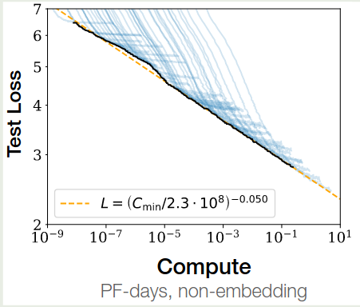

作者进一步探究了 sample efficiency 与 model size 之间的关系，实验结果如下图所示

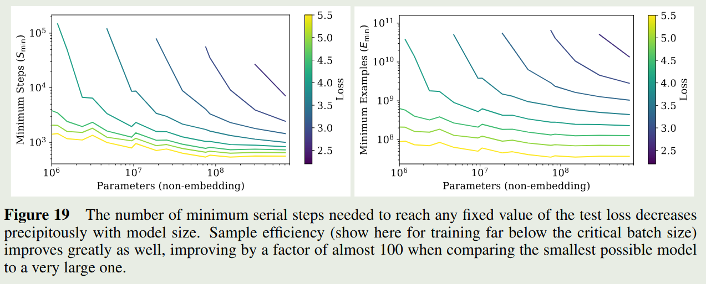

结果显示，**随着 model size 增加，sample efficiency 也在增加**

## Charting the Infinite Data Limit and Overfitting

作者在本节探讨了同时变化 $N$ 和 $D$ 对损失变化的影响。

### Proposed Equation

作者基于三个原则进行建模：

1. 改变 vocabulary size 或者 tokenization 会 rescale loss
2. 固定 $D$ 并且令 $N\to\infty$, 则最终损失应该接近 $L(D)$. 反之固定 $N$, 令 $D\to\infty$, 最终损失应该接近 $L(N)$
3. $L(N,D)$ 在 $D=\infty$ 处应该是可解析的

基于以上三条原则，将模型选择为如下形式

$$
L(N,D) = \left[\left(\frac{N_c}{N}\right)^{\frac{\alpha_N}{\alpha_D}}+ \frac{D_c}{D}\right]^{\alpha_D}
$$

作者基于不同配置进行训练，基于实验结果你和得到的参数如下

| Parameter | $\alpha_N$ | $\alpha_D$ | $N_c$               | $D_c$               |
| --------- | ---------- | ---------- | ------------------- | ------------------- |
| Value     | 0.076      | 0.103      | $6.4\times 10^{13}$ | $1.8\times 10^{13}$ |

接下来，作者探究了模型的过拟合程度，作者定义如下 metric

$$
\delta L(N,D) := \frac{L(N,D)}{L(N,\infty)} - 1
$$

带入 $L(N,D)$ 定义就得到

$$
\delta L(N,D)  = \left(1 + \left(\frac{N}{N_c}\right)^{\frac{\alpha_N}{\alpha_D}}\frac{D_c}{D}\right) - 1
$$

通过测试不同的模型，作者发现 $\delta L$ 的值在 $0.02$ 左右，将实验结果带入到上面的公式就得到

$$
D \geq (5\times 10^3)N^{0.7379}
$$

也就是说对于参数量为 $N$ 的模型，需要 data size $D \geq (5\times 10^3)N^{0.7379}$ 才能避免过拟合。

## Scaling Laws with Model Size and Training time

作者在本节构建了损失函数与 model size $N$ 以及训练时间的 scaling law

### Adjustment for Training at Critical Batch Size

已有结论说明，存在一个 critical batch size $B_{crit}$, 当 batch size 接近 $B_{crit}$ 时，增加 batch size 对计算效率影响比较小，但是当 batch size 大于 $B_{crit}$ 时，带来的提升比较小。另一方面，batch size 会影响梯度的噪声程度。因此，训练步数 $S$ 和处理的样本数 $E=BS$ 应该满足：

$$
\left(\frac{S}{S_{\min}}-1\right)\left(\frac{E}{E_{\min}}-1\right) = 1
$$

这里 $S_{\min}$ 是达到损失 $L$ 所需要的最小训练步数，而 $E_{\min}$ 是最小的训练样本数量。

作者的实验结果如下

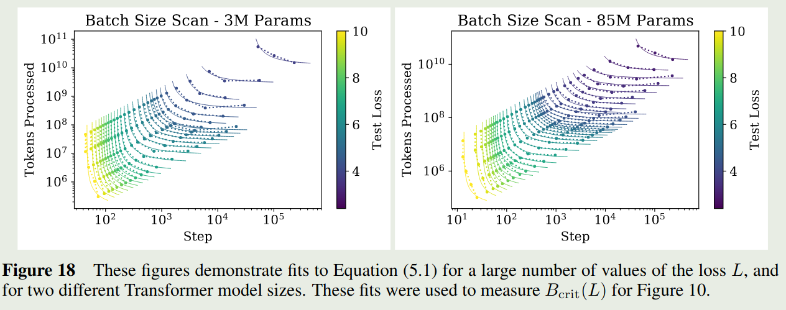

作者将 critical batch size 定义为

$$
B_{crit}(L) := \frac{E_{\min}}{S_{\min}}
$$

使用 critical batch size 进行训练可以在计算效率和算力之间达到一个平衡。

作者基于上面的实验结果探究了 critical batch size 和 model performance 之间的关系，实验结果如下图所示

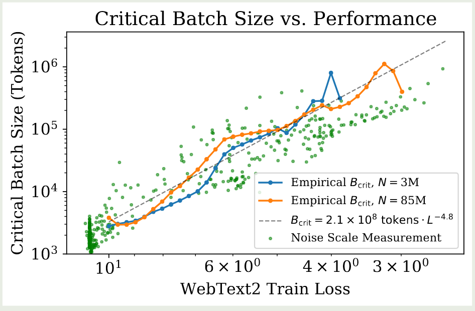

可以看到，critical batch size 与 model size 的关系不大，仅与损失 $L$ 有关。作者通过以下模型拟合 critical batch size:

$$
B_{crit}(L) \approx \frac{B_*}{L^{1/\alpha_B}}
$$

这里 $B_*\approx 2\times 10^8$, $\alpha_B\approx 0.21$.

给定一个 target loss $L$, 当 batch size $B>> B_{crit}$ 时，作者定义最小训练步数为

$$
S_{\min}(S) := \frac{S}{1+B_{crit}(L)/B}
$$

给定 target loss $L$ 和 model size $N$, 当 batch size $B<< B_{crit}$ 时，作者定义最小算力为

$$
C_{\min}(C) := \frac{C}{1+B_{crit}(L)/B}
$$

### Performance with Model Size and Compute

作者使用如下公式来探究损失与 model size 和 computer 之间的关系

$$
L(N, S_{\min}) = \left(\frac{N_C}{N}\right)^{\alpha_N} +\left(\frac{S_C}{S_{\min}(S)}\right)^{\alpha_S}
$$

拟合结果如下表所示

| Parameter | $\alpha_N$ | $\alpha_S$ | $N_c$               | $S_c$              |
| --------- | ---------- | ---------- | ------------------- | ------------------ |
| Value     | 0.077      | 0.76       | $6.5\times 10^{13}$ | $2.1\times 10^{3}$ |

基于这个拟合结果，作者得到了下图的结果

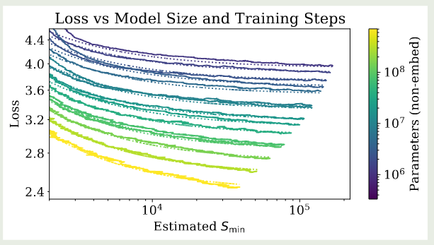

作者还使用了不同的可视化方式，如下图所示

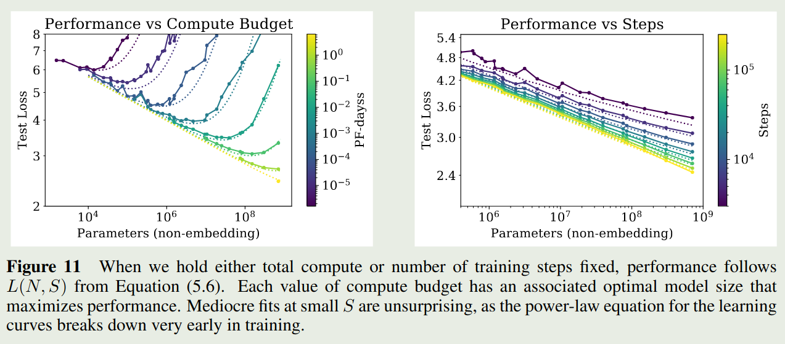

实验结果显示，上面的公式拟合的很好。

### Lower Bound on Early Stopping step

作者还探究了以下 early step 与模型大小以及数据集之间的关系，作者通过分析得到如下结果

$$
S_{stop}(N,D) \gtrsim \frac{S_c}{[L(N,D)-L(N,\infty)]^{1/\alpha_S}}
$$

其中 $L(N,\infty)$ 是在充分大数据集上的收敛损失。作者对实验结果进行了拟合，结果如下图所示

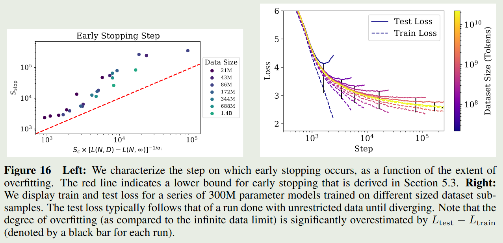

## Optimal Allocation of the Compute Budget

作者在本节探究了最优算力与 model size $N$ 和训练数据 $2B_{crit}S_{\min}$ 之间的关系

### Optimal Performance and Allocations

作者首先基于

$$
C_{\min}(C) := \frac{C}{1+B_{crit}(L)/B}
$$

绘制了如下曲线图

作者发现，相比于 loss 与算力 $C$ 之间的关系，使用 $C_{\min}$ 进行拟合效果更好。

接下来，作者基于 $L(C_{\min})$ 进一步探究了给定算力如何决定最优的 model size $N(C_{\min})$. 其实验结果如下图所示

实验结果显示，model size 和算力之间有如下关系

$$
N(C_{\min}) \propto (C_{\min})^{0.73}
$$

作者进一步探究了对于非最优模型大小与算力之间的关系，作者先构建了如下的关系

$$
\frac{C(N, N_{\mathrm{eff}})}{C(N_{\mathrm{eff}}, N_{\mathrm{eff}})}
= \frac{N}{N_{\mathrm{eff}}}
\left[
1 + \frac{\alpha_S}{\alpha_N}
\left( 1 - \left( \frac{N_{\mathrm{eff}}}{N} \right)^{\alpha_N} \right)
\right]^{-\!1 / \alpha_S}.
$$

对应的示意图为

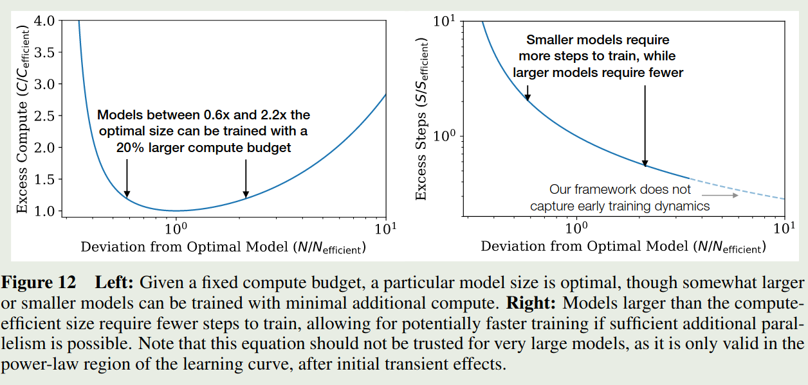

实现结果发现，大小为最优模型的 $0.6\sim 2.2$ 倍只需要额外 $20\%$ 的算力。作者强调，这个实验结果对于超大模型不一定适用。

作者进一步推导了 $S_{\min}$ 和 $C_{\min}$ 之间的关系，由于 $C_{\min}=6NB_{crit}S$, 且我们前面已经有 $B\propto L^{-4.8}$ 和 $L\propto C_{\min}^{-0.05}$, 因此 我们有

$$
B_{crit}\propto L^{-4.8} \propto (C_{\min})^{-0.05\times (-4.8)}\propto  (C_{\min})^{0.24}
$$

以及

$$
S_{\min} \propto \frac{C_{\min}}{6B_{crit}N(C_{\min})} \propto (C_{\min})^{0.03}
$$

拟合的结果如下图所示

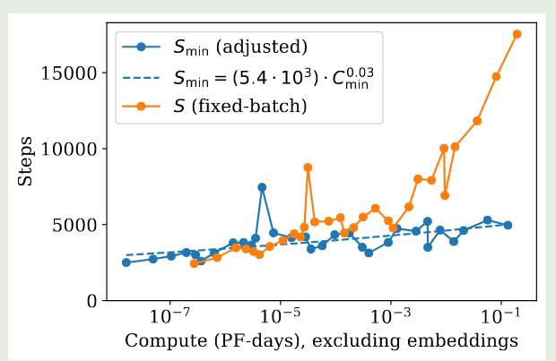

因此，基于上面的结果，当我们增加算力时，我们的主要精力应该放在增加模型大小和提高 batch size 上，而训练步数基本可以保持不变。

### Another way of Derivation

作者还给出了另一种建模 $L(C_{\min})$ 的方式，即从 $L(N,S_{\min})$ 中进行推导，作者将 $B_{crit}$ 和 $S_{\min}$ 的表达式带入到 $L(N,S_{\min})$ 然后求解最小值就得到

$$
L(C_{\min})= \left(\frac{C_C^{\min}}{C_{\min}}\right)^{\alpha_C^{\min}}
$$

其中

$$
\alpha_C^{\min} = \frac{1}{\frac{1}{\alpha_S}+\frac{1}{\alpha_B}+\frac{1}{\alpha_N}} \approx 0.054
$$

这和前面的结果基本是吻合的，进一步进行推导得到

$$
N(C_{\min})\propto (C_{\min})^{\alpha_C^{\min}/\alpha_N}\approx (C_{\min})^{0.71}
$$

这个结果也和上面的差不多。

### Contradiction and a Conjecture

作者发现，尽管拟合的 scaling law 曲线非常好，但是由于自然语言不可能达到 zero entropy, 因此该曲线最终一定会失效。作者基于更大的模型进行了实验，结果发现，模型在某一点开始就比预测的损失曲线下降的更慢。作者认为这是因为 transformer 模型已经达到了 maximal performance 导致的。

通过前面的分析，我们发现 $L(C_{\min})$ 比 $L(D)$ 下降的快，因此两者必然在某一点相交。

在前面的章节中，我们基于以下关系来决定数据集大小

$$
D\propto N^{0.74}\propto (C_{\min})^{0.74*0.73}\propto  (C_{\min})^{0.54}
$$

这里我们利用了 $N(C_{\min})$ 的结果

另一方面，我们有

$$
D(C_{\min}) = \frac{2C_{\min}}{6N(C_{\min})}\propto (C_{\min})^{0.26}
$$

可以看到，基于训练最优导出的数据集大小相比于拟合出来的数据集大小，实际上存在过拟合。

作者进一步分析出了 $L(D(C_{\min}))$ 和 $L(C_{\min})$ 这两条曲线的交点，结果得到

$$
C^*\approx 10^4 \text{ PF-Days}, N^*\approx 10^{12}\text{ parameters}, D^*\approx 10^12\text{ tokens}, L^*\approx 1.7\text{1.7nats/token}
$$

作者认为出现这种原因有以下几种情况：

1. $L^*$ 给出了自然语言的 entropy 的一个估计，因此当模型充分大之后，模型可能已经获取到了数据中的所有知识
2. $L(C_{\min})$ 可以作为数据集噪声的一个量化表现，其衡量了数据集的质量

## Learning Rate Schedule

附录中，作者还探究了 learning rate 与损失之间的关系，作者使用了不同 learning rate schedule 对模型损失的影响，结果如下图所示

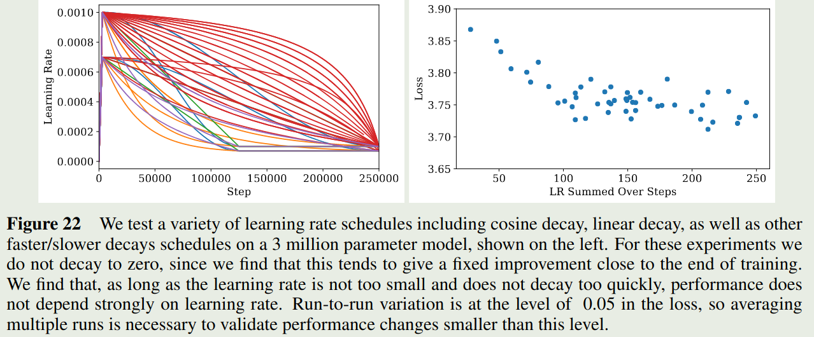

实验结果显示，**只要 learning rate 下降的不会太快，模型的表现基本上差不太多**。

作者基于实验结果得到了学习率和模型参数之间的关系如下

$$
\text{lr}(N)\approx 0.003239 - 0.0001395\log N
$$

也就是说，小模型用比较大的学习率，大模型用较小的学习率。

## Conclusion

作者在本文中训练了大量不同配置的大模型，然后构建了损失（损失）与模型参数，数据及大小以及算力之间的关系。实验结果发现，损失与架构和优化参数之间的关系比较小，主要由模型参数量决定，更大的模型拥有更高的采样效率。

作者认为，本文的局限在于损失函数不一定能够反应模型在其他语言任务上的表现。

## References

- [arxiv](http://arxiv.org/abs/2001.08361)
