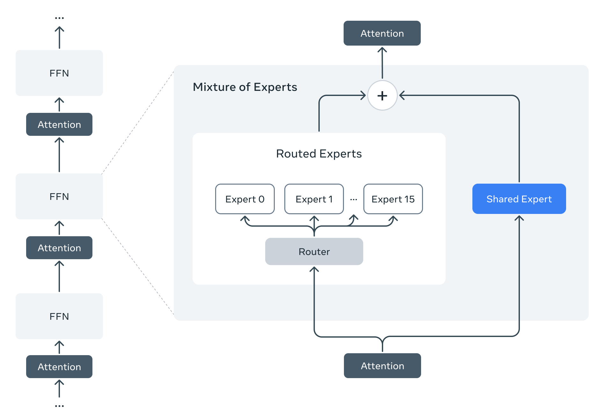

# 介绍

Meta在2025年4月10号发布了LLaMA4系列，包含三个模型：Llama 4 Scout, Llama 4 Maverick 以及Llama 4 Behemoth, 三个模型都基于MoE架构，且支持多模态

| Model | Layers | Heads (Q / KV) | Context Length | #Parameters (activated/total) | #Experts (activated/total)| #Tokens |
| ----- | ------------- | ---------- | ------------- | -------------------------- | --------------------------|-----|
| LLaMA 4 Behemoth | - |-| - | 288B / 2T | (1 shared + 1 routed) / 16 | -|
| LLaMA 4 Maverick | 48 |40/8| 1M | 17B / 109B | (1 shared + 1 routed) / 128 | ~22T |
| LLaMA 4 Scout | 48 |40/8| 10M | 17B / 400B | (1 shared + 1 routed) / 16 | ~40T |

训练数据截止到2024年8月。LLaMa4支持200多种语言，其中100多种语言的训练token数超过了1B

# 亮点

1. 原生多模态
LLaMA 4是一个原生多模态架构
2. 超长上下文
LLaMA 4的上下文超过了1M
3. iRoPE
通过交替dense和MoE MLP来提高整体推理效率
4. 基于MetaCLIP的vision encoder
5. MetaP
使用MetaP来调整超参数
6. FP8精度训练

# Pre-training

LLaMA 4 仍然是一个基于transformer的架构，但是引入了MoE，其示意图如下所示



MoE架构中包含1个shared expert以及1个routed expert. 并且，与其他LLM不同，LLaMA 4使用了一个交替MLP个MoE的架构，即iRoPE，即特定的transformer layer是MoE架构，其余的是MLP架构，其[核心代码](https://github.com/huggingface/transformers/blob/5f8d17268ced2ca5f51b0216782356b16be0d6f4/src/transformers/models/llama4/modeling_llama4.py#L380)如下：

```python
self.is_moe_layer = layer_idx in config.moe_layers
if self.is_moe_layer:  # the 128E model interleaves dense / sparse
    self.feed_forward = Llama4TextMoe(config)
else:
    self.feed_forward = Llama4TextMLP(config, intermediate_size=config.intermediate_size_mlp)
```

early fusion. LLaMA 4称其一个原生多模态大模型，但是其架构仍然是 Vision Encoder-MLP-LLM 的形式，其不同点在于patch embedding没有使用convolution, 而是使用 `nn.Unfold`直接进行展平，然后使用一个线性层与vision encoder进行对齐。[代码](https://github.com/huggingface/transformers/blob/5f8d17268ced2ca5f51b0216782356b16be0d6f4/src/transformers/models/llama4/modeling_llama4.py#L1409)如下

```python
class Llama4UnfoldConvolution(nn.Module):
    def __init__(self, config):
        super().__init__()
        kernel_size = config.patch_size
        if isinstance(kernel_size, int):
            kernel_size = (kernel_size, kernel_size)
        self.unfold = torch.nn.Unfold(kernel_size=kernel_size, stride=config.patch_size)
        self.linear = nn.Linear(
            config.num_channels * kernel_size[0] * kernel_size[1],
            config.hidden_size,
            bias=False,
        )

    def forward(self, hidden_states: torch.Tensor) -> torch.Tensor:
        hidden_states = self.unfold(hidden_states)
        hidden_states = hidden_states.permute(0, 2, 1)
        hidden_states = self.linear(hidden_states)
        return hidden_states
```

其他训练优化技巧如下：

1. MetaP：用于选择超参数
2. FP8 precision：与DeepSeek-V3一样，使用FP8精度进行训练
3. mid-training：在预训练阶段之后，额外增加了一个训练阶段，来提高模型的长上下文等关键能力

# Post-training

post-training包括三个阶段：

1. SFT
2. online RL
3. DPO

作者发现SFT和DPO会限制模型的探索能力，特别是在math, coding等domain。为了解决这个问题，作者使用LlaMA对问题进行难度分级，然后移除了50%的简单数据。

在online RL阶段，作者设计了一个continuous online RL策略，让模型在训练和筛选问题两种模式之间进行切换，以平衡效率和准确率。

DPO的目的是为了提升模型输出的质量

# 评测

|benchmark | LLaMA 4 Maverick |LLaMA 4 Maverick | LLaMA 4 Scout | Gemeni 2.0 Flash | GPT-4o |
|---| ---| ---|---|---|---|
|MMMU |76.1| 73.4 | 69.4| 71.7 | 69.1 |
|Math Vista | 73.7 | 70.7| 73.1 | 63.8 |
| ChartQA |-| 90.0 |88.8| 88.3 | 85.7|
|DocVQA | -|94.4 | 94.4| - | 92.8|
|LiveCodeBench|49.4| 43.4 |32.8| 34.5 | 32.3|
|MMLU Pro|82.2 |80.5 | 74.3| 77.6| -|
|GPQA Diamond|73.7| 69.8 |57.2| 60.1|53.6|

# 结论

LLaMA 4 采用了MoE架构，是一个原生的多模态大模型系列。在架构上，与DeepSeek-MoE, aria和OLMoE不同，LLaMA4并没有增加expert granularity，OLMoE分析认为，增加granularity可以提高模型的flexibility，
下面总结了一下相关模型的参数

| Model | Layers | Heads (Q / KV) | Context Length | #Parameters (activated/total) | #Experts (activated/total)| #Tokens |
| ----- | ------------- | ---------- | ------------- | -------------------------- | --------------------------|-----|
|DeepSeek-MoE(144.6B)|62|32/32|2048|22.2B/144.6B|(1 shared + 7 routed)/64|245B|
|DeepSeek-V3|61|128(MLA)|128K|37B/671B|(1 shared + 8 routed)/257|14.8T|
|Aria|28|20/20|64K|3.5B/24.9B|(2 shared+ 6 routed)/66|6.4T(text)|
|OLMoE|16|16/16|4096|1.3B/6.9B|8/64|5T|
| LLaMA 4 Maverick | 48 |40/8| 1M | 17B / 109B | (1 shared + 1 routed) / 128 | ~22T |
| LLaMA 4 Scout | 48 |40/8| 10M | 17B / 400B | (1 shared + 1 routed) / 16 | ~40T |

# Reference

- [LLaMA 4 Model Card](https://github.com/meta-llama/llama-models/blob/main/models/llama4/MODEL_CARD.md)
- [LLaMA 4 Blog](https://ai.meta.com/blog/llama-4-multimodal-intelligence/)
