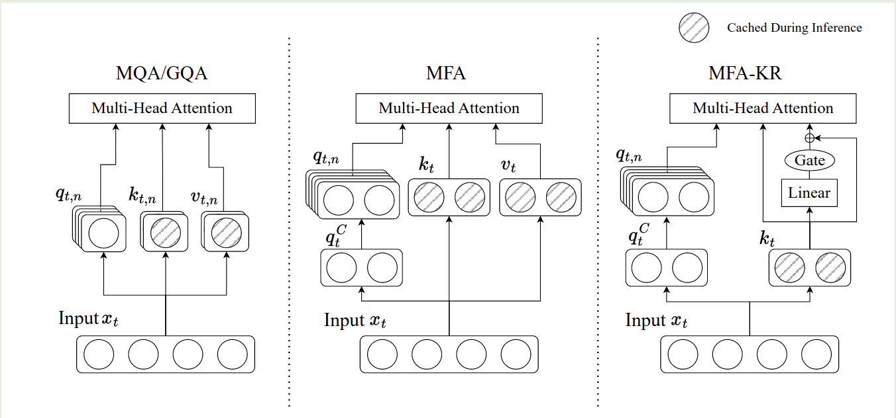

阶跃星辰等提出了 Multi-matrix Factorization Attention (MFA), 一个新型注意力机制，用于在 KV cache 限制下最大化模型的表现。

## Introduction

multi-head attention (MHA) 的问题在于，其 KV cache 的内存占用（memory footprint）随 sequence length 以及 batch size 线性增长，从而成为了 LLM 在 decoding 阶段的瓶颈。

为了解决 MHA 的内存占用过高问题，已有的工作如 [MQA](https://maosong.website/p/notes-on-mqa/), [GQA](https://maosong.website/p/notes-on-gqa/) 等通过共享 key, value projection 来降低 KV cache size. 而 [DeepSeek-V3](DeepSeek-V3.md) 提出的 MLA 则是通过对 key, value projection 进行 low-rank compression, 然后只存储 latents 的方法来降低 KV cache size.

但是，已有的这些方法的问题在于，当我们设置 KV cache budget 之后，它们的表现就比标准的 MHA 要差。

基于以上这些发现，作者首先分析了已有 attention 机制的 modeling capacity, 然后使用一个统一的框架来表示这些 attention 机制。作者发现，attention heads 的个数以及 dimension 对模型表现有较大影响。

基于这个发现，作者提出了 **Multi-matrix Factorization Attention (MFA)**,  以及其变体 **MFA-Key-Reuse (MFA-KR)**.  MFA 的主要目的是在有限的 KV cache size 下提高模型的表现。

## Background

作者首先介绍了 GMHA 的概念，GMHA 由三部分组成：

1. QK circuit: 决定了信息之间如何交互
2. valueoutput (VO) circuits：决定了信息如何传递
3. per-head softmax attention.

接下来，作者介绍了 Fully Parameterized Bilinear Attention (FPBA), FPBA 的定义如下：

$$
O = \sum_{c=1}^d\left(\sum_{j=1}^N\phi\left(\frac{xW_cx_j}{H}\right)x_jU_c\right)
$$

其中 $\phi$ 是 softmax 函数，$d$ 是模型的 hidden dimension,  $N$ 是 sequence length, $W_c,U_c\in\mathbb{R}^{d\times d}$ 每个 channel 上的参数矩阵

1. 每个 channel 都有各自的参数 $W_c, U_c$ 来获取 $x_i$ 与 $x_j$ 之间的信息
2. 提高泛化性，所有 channel 的 $U_c$ 组合起来可以遍历 $d$ 维空间中的任意一个 permutation, 这样就避免来的信息损失
3. 利用率高，FPBA 获取了 $x_i$ 与 $x_j$ 之间 $d$ 维空间可能的表示

基于以上这三个特点，作者认为 FPBA 是 GMHA 框架的一个 capacity upper bound. 此时每个 token 的 KV cache 占用为 $2d^2$ (key and value).

然后，作者分析了 MHA 及其变体与 GMHA 的关系，MHA 可以写作如下形式

$$
\begin{aligned}
O &= \sum_{c=1}^h\left(\sum_{j=1}^N\phi\left(\frac{xQ_c(x_jK_c)^T}{\sqrt{d}}\right)x_jV_c\right)O_c^T\\
&= \sum_{c=1}^h\left(\sum_{j=1}^N\phi\left(\frac{x(Q_cK_c^T)x_j^T}{\sqrt{d}}\right)x_jV_cO_c^T\right)
\end{aligned}
$$

其中 $Q_c,K_c,V_c\in\mathbb{R}^{d\times h_d}$, $O_c\in\mathbb{R}^{d\times h_d}$ 分别是 query, key, value, output projection layer 对应的权重矩阵，$n$ 是 attention head 的个数，令 $h_d$ 为每个 attention 的 head dimension，则我们有 $nh_d=d$.

可以看到，MHA 实际上是一个特殊的 FPBA, 其中，$W_c$ 和 $U_c$ 分别由秩为 $h_d$ 的低秩分解 $Q_cK_c^T$ 以及 $V_cO_c^T$ 近似。此时每个 token 的 KV cache 占用为 $2d$ (key and value).

MQA 可以看作是 GQA 的一个特殊情况。对于 GQA 来说，我们有一个 group size $g\in[1, h]$, 当 $g=1$ 时，GQA 就是 MHA. 当 $g=h$ 时，GQA 就是 MQA, 通常 $g$ 满足 $h\ \%\ g=0$.  GQA 的表达式与 MHA 基本相同，只是多个 head 会共享一个 $K_c$ 以及 $V_c$. 此时，每个 token 的 KV cache 占用为 $2gh_d$. 对于 MQA，其每个 token 的 KV cache 占用为 $2h_d$.

对于 MLA, 其表达式如下所示

$$
\begin{aligned}
O &= \sum_{c=1}^m\left(\sum_{j=1}^N\phi\left(\frac{xS_QQ_c(x_jS_KK_c)^T}{\sqrt{d}}\right)x_jS_VV_c\right)O_c^T\\
&= \sum_{c=1}^m\left(\sum_{j=1}^N\phi\left(\frac{x(S_QQ_cK_c^TS_K^T)x_j^T}{\sqrt{d}}\right)x_jS_VV_cO_c^T\right)
\end{aligned}
$$

其中，$S_Q,S_K,S_V\in\mathbb{R}^{d\times C}$ 在所有的 heads 中是共享的，$Q_c,K_c,V_c\in\mathbb{R}^{C\times h_d}$ 是每个 head 的 query, key, value projection layer 的参数， 是 latent factorization 的维度。与 FPBA 相比，我们可以看到，MLA 实际上是在 $d/m$ 个 head 上共享了参数，其中，$W_c$ 和 $U_c$ 分别由秩为  的低秩分解 $S_QQ_cK_c^TS_K^T$ 以及 $S_VV_cO_c^T$ 近似。尽管模型中 $C>h_d$, 但是最终的 rank 仍然是 $h_d$, 因此模型的表现也就受到了限制。

## Method

对已有的 attention 分析之后，作者认为，要提高模型的表现，attention 需要做到亮点：

1. 最小化 KV cache 占用和参数量
2. attention 的 capacity 尽可能接近 FPBA

基于这两个原则，作者提出了 MFA, MFA 主要依赖三个策略：

1. 提升 attention heads 的 head dimension, 通过提高 head dimension, 我们可以有效提高 attention head 的表达能力
2. 使用矩阵分解来降低参数量
3. 使用单一的 KV head 来降低 KV cache 内存占用

最终，MFA 的表达式如下所示

$$
\begin{aligned}
O &= \sum_{c=1}^m\left(\sum_{j=1}^N\phi\left(\frac{xS_QQ_c(x_jS_K)^T}{\sqrt{d}}\right)x_jS_V\right)O_c^T\\
&= \sum_{c=1}^m\left(\sum_{j=1}^N\left(\frac{x(S_QQ_cS_K^T)x_j^T}{\sqrt{d}}\right)x_jS_VO_c^T\right)
\end{aligned}
$$

其中 $S_Q,S_K,S_V\in\mathbb{R}^{d\times C}$ 是所有的 attention head 所共享的，$Q_c,O_c\in\mathbb{R}^{C\times C}$ 是每个 head 的 query up projection 和 output projection, $C$ 是 latent factorization 的维度。

在 inference 的时候，由于我们只需要保存 $x_jS_K$ 和 $x_jS_V$, 因此所需要的 KV cache size 为 $2C$. 与 FPBA 相比，MFA 分别使用 $S_QQ_cS_K^T$ 和 $S_VO_c^T$ 来近似 $W_c$ 和 $U_c$, 近似矩阵的 rank 为 $C$. 由于 $C>d$, 因此其表达能力也更强，MFA 有如下优势：

1. scalable head count: MFA 可以支持使用更多的 attention heads, 每增加一个 heads, 所需要的额外参数为 $2C^2$. 并且，增加 attention heads 个数不会增加 KV cache 占用
2. enhanced head expressiveness: MFA 近似矩阵的 rank 为 $C>d$, 因此表达能力更强
3. Compatibility with position encodings: MFA 可以无缝集成 position encoding.

为了进一步降低 MFA 的 KV cache 占用，作者提出了 MFA-Key-Reuse (MFA-KA). 核心思想是使用 $S_K$ 来表示 $S_V$, 这样可以额外降低 $50\%$ 的 KV cache 占用，表示方法如下所示

$$
S_V = S_K + \alpha\odot NS_K = (I +\mathrm{diag}(\alpha)N)S_K
$$

其中 $N\in\mathbb{R}^{N\times N}$, $\alpha\in\mathbb{R}^C$.

最终，MFA, MFA-KR 与 GQA 的对比如下图所示



不同 attention 的量化对比如下表所示

| Method | KV Cache | Parameter       | Heads | Factor. rank  per head | Shared latent subspace Dim. | Total effec. rank |
| ------ | -------- | --------------- | ----- | ---------------------- | --------------------------- | ----------------- |
| FPBA   | $2d^2$   | $2d^3$          | $d$   | $d$                    | $d$                         | $d^2$             |
| MHA    | $2d$     | $4d^2$          | $n$   | $h_d$                  | $d$                         | $nh_d$            |
| MQA    | $2h_d$   | $(2 + 2/n)d^2$  | $n$   | $h_d$                  | $h_d$                       | $nh_d$            |
| GQA    | $2gh_d$  | $(2 + 2g/n)d^2$ | $n$   | $h_d$                  | $gh_d$                      | $nh_d$            |
| MLA    | $2C$     | $5dC + d^2$     | $m$   | $h_d$                  | $C$                         | $mh_d$            |
| MFA    | $2C$     | $3Cd + 2mC^2$   | $m$   | $C$                    | $C$                         | $mC$              |

## Code

```python
class Step3vAttention(nn.Module):
    def __init__(self, config: Step3VLConfig, layer_idx):
        super().__init__()
        self.config = config
        self.layer_idx = layer_idx
        self.head_dim = getattr(config, "head_dim", config.hidden_size // config.num_attention_heads)
        self.num_key_value_heads = 1
        self.total_num_kv_heads = self.num_key_value_heads
        self.num_attention_heads = config.num_attention_heads
        self.num_key_value_groups = config.num_attention_heads // self.num_key_value_heads
        self.q_size = getattr(config, "share_q_dim", self.head_dim)
        self.kv_size = self.num_key_value_heads * self.head_dim
        self.scaling = self.head_dim**-0.5
        self.is_causal = True

        self.q_proj = nn.Linear(config.hidden_size, self.q_size , bias=False)
        self.k_proj = nn.Linear(config.hidden_size, self.head_dim, bias=False)
        self.v_proj = nn.Linear(config.hidden_size, self.head_dim, bias=False)
        self.o_proj = nn.Linear(config.num_attention_heads * self.head_dim, config.hidden_size, bias=False)
        # query down projection normalization
        self.inter_norm = Step3vRMSNorm(self.q_size, eps=config.rms_norm_eps)
        # query up projection
        self.wq = nn.Linear(self.q_size, self.head_dim * self.num_attention_heads, bias=False)

    def forward(
        self,
        hidden_states: torch.Tensor,
        position_embeddings: Tuple[torch.Tensor, torch.Tensor],
        attention_mask: Optional[torch.Tensor],
        past_key_value: Optional[Cache] = None,
        cache_position: Optional[torch.LongTensor] = None,
        **kwargs: Unpack[FlashAttentionKwargs],
    ) -> Tuple[torch.Tensor, Optional[torch.Tensor], Optional[Tuple[torch.Tensor]]]:
        input_shape = hidden_states.shape[:-1]

        query_states = self.q_proj(hidden_states)
        key_states = self.k_proj(hidden_states).view((*input_shape, -1, self.head_dim)).transpose(1, 2)
        value_states = self.v_proj(hidden_states).view((*input_shape, -1, self.head_dim)).transpose(1, 2)

        query_states = self.inter_norm(query_states)        
        query_states = self.wq(query_states).view((*input_shape, -1, self.head_dim)).transpose(1, 2)
        
        cos, sin = position_embeddings
        query_states, key_states = apply_rotary_pos_emb(query_states, key_states, cos, sin)

        ...
```

## Conclusion

作者在本文中提出了 MFA 以及 MFA-KR, 一个在 KV cache 有限的条件下最大限度提高 attention 表达能力的 attention 机制。

## References

- [Multi-matrix Factorization Attention](http://arxiv.org/abs/2412.19255)
- [Step v3 code](https://huggingface.co/stepfun-ai/step3/blob/main/modeling_step3.py)
