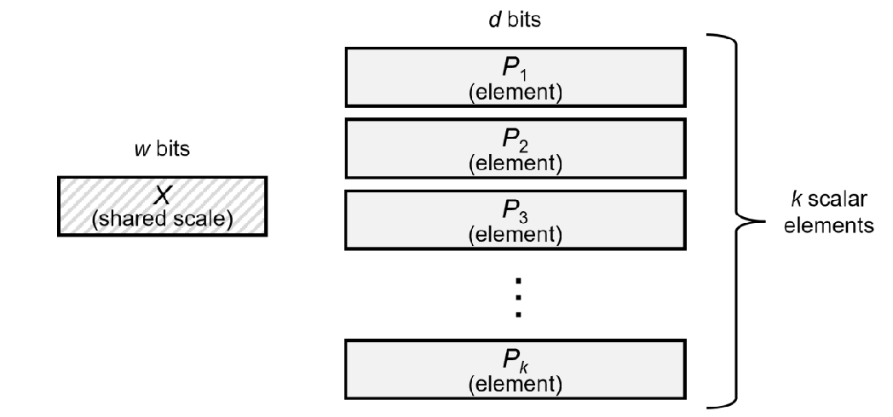

MX format 是一个表示数据的数据格式，在 LLM 中主要用于量化。相比于直接对整个张量进行量化，MX format 可以在更细粒度的层面控制量化，从而提高模型的表现

## Microscaling

Microscaling (MS) format 如下图所示



MX format 包括三个部分：

1. elements $P_1,\dots,P_k$ 未 scale 的数据，要求 $P_1,\dots,P_k$ 的数据类型相同
2. shared scale $X$,  对 element 进行的 scale 参数，所有的 $k$ 个 bits 共享一个 $X$
3. block size, 决定 element block 的大小

在存储时，我们只需要存储 $X$ 以及 $P_1,\dots,P_k$, 我们假设 $X$ 需要 $w$ bits 来表示，$P_i$ 需要 $d$ bits 来表示，则我们一共需要 $w+kd$ bits 来表示这 $k$ 个元素。

## Concrete MX-compliant Formats

MX-format 包含了一下几种数据格式：

| Format Name | Element Data Type | Element Bits(d) | Scaling Block Size(k) | Scale Data Type | Scale Bits(w) |
| ----------- | ----------------- | --------------- | --------------------- | --------------- | ------------- |
| MXFP8       | FP8 (E5M2)        | 8               | 32                    | E8M0            | 8             |
| MXFP8       | FP8 (E4M3)        | 8               | 32                    | E8M0            | 8             |
| MXFP6       | FP6 (E3M2)        | 6               | 32                    | E8M0            | 8             |
| MXFP6       | FP6 (E2M3)        | 6               | 32                    | E8M0            | 8             |
| MXFP4       | FP4 (E2M1)        | 4               | 32                    | E8M0            | 8             |
| MXINT8      | INT8              | 8               | 32                    | E8M0            | 8             |

## GPT-oss Quantization

[gpt-oss](https://maosong.website/p/notes-on-gpt-oss/) 中使用了 MXFP4 来表示 MoE 中的 down projection 以及 up projection weight matrix 的权重。

其具体操作过程如下：

1. 我们将参数分为大小为 32 的 block
2. 每个 block 由一个 scale $X$ 来表示，其精度为 E8M0, 即 8bits, 表示范围为 $[-127,127]$, 以及 $32$ 个元素 $P_i$ 来表示，每个元素的精度为 E2M1, 即 4bits, 表示范围为 $[-6.0,6.0]$.
3. 由于每个元素由 4bits 来表示，因此我们将两个元素合并在一起来表示

在加载时，我们可以用如下代码来恢复 $P_i$ 的值到 FP8

```python
FP4_VALUES = [+0.0,+0.5,+1.0,+1.5,+2.0,+3.0,+4.0,+6.0,-0.0,-0.5,-1.0,-1.5,-2.0,-3.0,-4.0,-6.0]


def convert_moe_packed_tensors(
    blocks,
    scales,
    *,
    dtype: torch.dtype = torch.bfloat16,
    rows_per_chunk: int = 32768 * 1024,
) -> torch.Tensor:
    import math
    # scales are represented with uini8
    scales = scales.to(torch.int32) - 127

    assert blocks.shape[:-1] == scales.shape, f"{blocks.shape=} does not match {scales.shape=}"

    lut = torch.tensor(FP4_VALUES, dtype=dtype, device=blocks.device)

    *prefix_shape, G, B = blocks.shape
    rows_total = math.prod(prefix_shape) * G

    blocks = blocks.reshape(rows_total, B)
    scales = scales.reshape(rows_total, 1)
    
    # each byte representing 2 elements and represented with unit8
    out = torch.empty(rows_total, B * 2, dtype=dtype, device=blocks.device)

    for r0 in range(0, rows_total, rows_per_chunk):
        r1 = min(r0 + rows_per_chunk, rows_total)

        blk = blocks[r0:r1]
        exp = scales[r0:r1]

        # nibble indices -> int64
        idx_lo = (blk & 0x0F).to(torch.long)
        idx_hi = (blk >> 4).to(torch.long)

        sub = out[r0:r1]
        sub[:, 0::2] = lut[idx_lo]
        sub[:, 1::2] = lut[idx_hi]

        torch.ldexp(sub, exp, out=sub)
        del idx_lo, idx_hi, blk, exp

    out = out.reshape(*prefix_shape, G, B * 2).view(*prefix_shape, G * B * 2)
    # to match for now existing implementation
    return out.to(torch.float8_e5m2)
```

## References

- [gpt-oss code](https://github.com/huggingface/transformers/blob/242bb2cafccec9f90479f5f688bca9d240b1031f/src/transformers/models/gpt_oss/convert_gpt_oss_weights_to_hf.py#L78)
- [report](https://www.opencompute.org/documents/ocp-microscaling-formats-mx-v1-0-spec-final-pdf#page=4.11)
