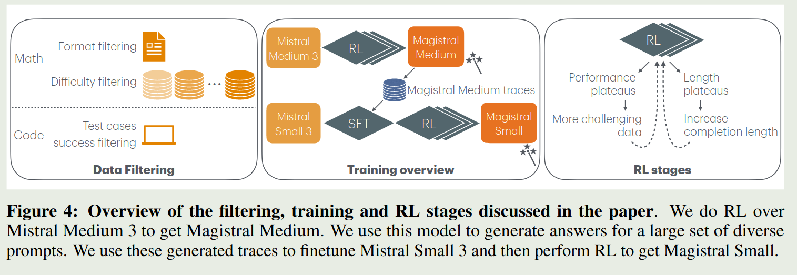
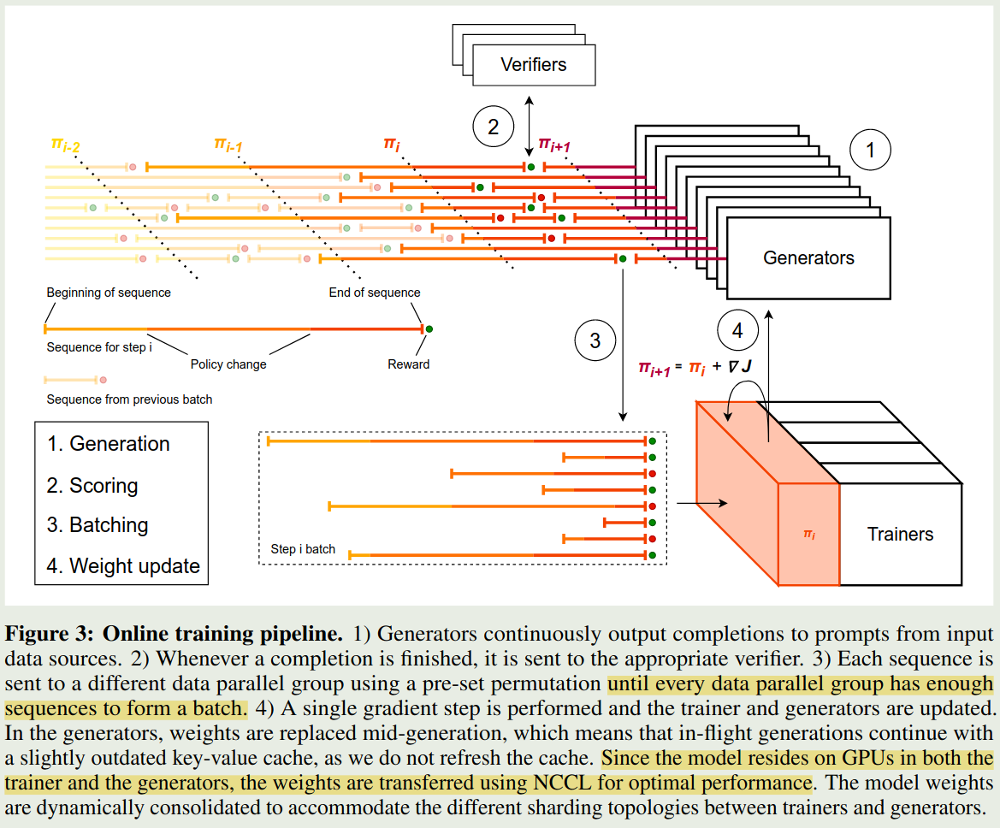
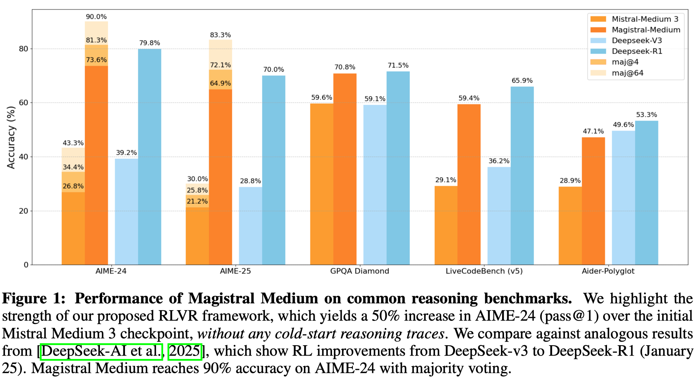
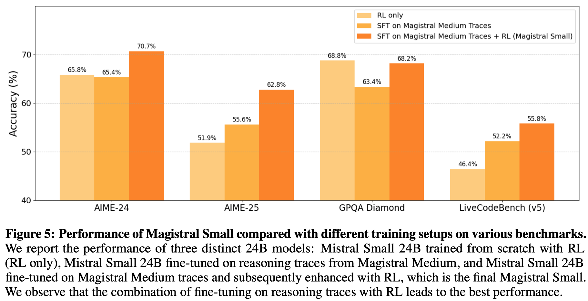
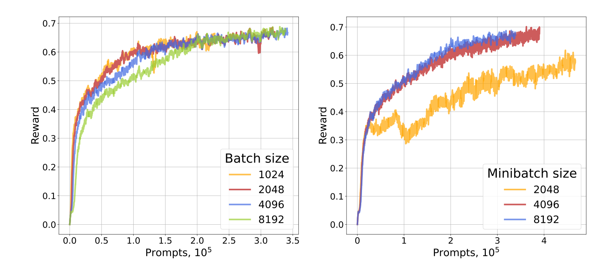
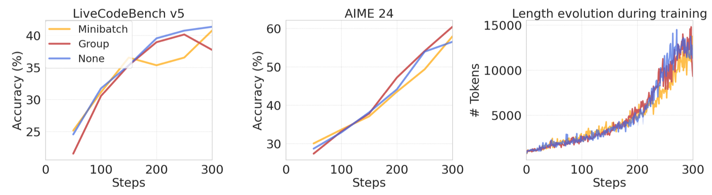
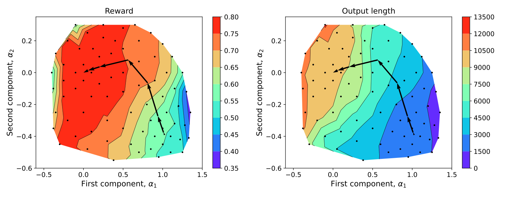
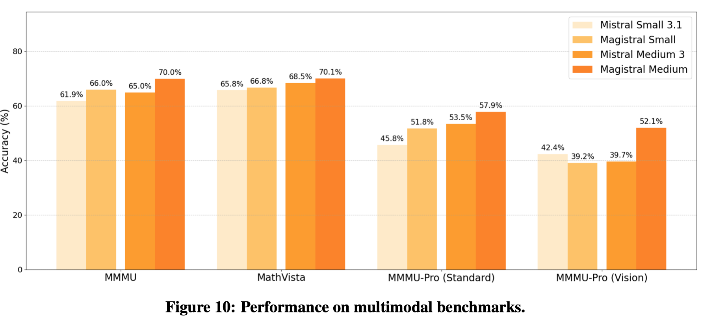

Magistral 是 Mistral 提出的一个 reasoning model 系列，主要针对 math 和 code 两个 domain

## Introduction

Mistral 在 2025 年 6 月 12 日发布了 Magistral ，一个 reasoning model, 包含两个模型，一个是由纯 RL 训练得到的 *Magistral Medium*, 另一个是由 SFT 和蒸馏 Magistral Medium 得到的 **Magistral Small**

作者首先介绍了一下本文的贡献：

1. 介绍了如何仅使用 RL (而不是用蒸馏) 来训练 Magistral Medium
2. infra 上的改进，主要使用最新的权重来更新 generator
3. 多语种能力，支持多种语言
4. 系统性探究了 RLVR 的能力边界
5. 开源了 Magistral small (24B)

## Method

### RL

RL 算法基于 GRPO 改进，主要有以下几点：

1. 去掉了 KL Divergence loss, 这一点跟 [DAPO](https://maosong.website/p/notes-on-dapo/) 是一致的，提升模型的探索能力
2. Loss Normalization，在 sample 层面做平均，还是跟 DAPO 一致，减少不同长度输出对训练造成的影响
3. Advantage Normalization, 作者首先将每个 token 的 Advantage 定义为 $\hat{A}_i=R_i-\mu$,  其中 $\mu$ 是每个 group 的 reward 均值， 然后在每个 mini-batch 里对 advantage 进行 Normalization (这里 $\hat{A}_{mean}$ 和 $\hat{A}_{std}$ 分别为 mini-batch advantage 的均值和方差)：

$$
 \hat{A}_{i,t}^{norm}=\frac{\hat{A}_i-\hat{A}_{mean}}{\hat{A}_{std}}
$$

4. CLIP-Higher, 跟 DAPO 一致，提高稀有 token 的被采样概率
5. Eliminating non-divsere groups, 跟 DAPO 一致，去掉过于简单和过于难的题目

最终 RL 阶段训练的损失函数为：

$$
\mathcal{L}(\theta) = \mathbb{E}_{q\sim P(Q),\{o_i\}_{i=1}^G\sim \pi_{old}(\cdot\mid q)}\frac{1}{\sum_{i=1}^G|o_i|}\sum_{i=1}^G\sum_{t=1}^{|o_i|}\min\left[r_{i,t}(\theta)\hat{A}_{i,t}^{norm}, \mathrm{clip}(r_{i,t}(\theta), 1-\epsilon_{low}, 1+\epsilon_{high})\hat{A}_{i,t}^{norm}\right], \mathrm{s.t.}, \exists 1\leq m < n \leq G, r_m\neq r_n.
$$

其中

$$
r_{i,t}(\theta) = \frac{\pi_{\theta}(o_{i,t}\mid q, o_{i,<t})}{\pi_{old}(o_{i,t}\mid q, o_{i,<t})}
$$

### Reward Shaping

作者还基于四个维度来构建 reward: formatting, correctness, length, 以及 language consistency

**Formatting**
针对数学和代码问题，作者要求模型输出符合特定的格式

- Tag requirements: 思考过程用 `<think></think>` 包含，且只能包含一个 tag
- mathematical responses: 对于数学问题，结果用 `\boxed{}` 包含
- code response：包含一个 markdown block

> [!tip] Future
> 最新的 [GLM-4.1V-Thinking](https://maosong.website/p/notes-on-glm-4.1v-thinking/) 认为，不应该在 RL 训练阶段加入 format reward

**correctness**
基于答案的正确性分配奖励

- math correctness：使用 rule-based verifier 进行打分，使用 parser 和 Sympy 来比较模型输出以及 ground truth
- code correctness: 构建单元测试，评估输出代码是否能通过所有的单元测试

**Length penalty**
与 DAPO 一致，使用 Length penalty 来惩罚过长的回答。

**Language consistency**
减少模型混合语言输出的问题。作者的做法是将 10% 的问题从英语转化为其他语种，然后使用 fastText 进行分类，确保内容都是一个语言。作者发现，通过这个简单的修改，就提高了模型的语言跟随能力。

> [!tip] Recall
> MiMo 中也遇到了混合语言输出的问题，但是其并没有给出解决办法。

作者还在 system prompt 中规定了输出的格式以及语言。

> [!tip] Observation
> 作者发现，RL 的训练对于 system prompt 非常的敏感，因为 system prompt 会提高 model 的 entropy, 然后提高模型的探索能力。

## Data

数据包括 math problems 以及 code problems

### Math

作者首先收集了 700K 样本，然后作者通过预处理以及过滤来保证数据的质量：

**format filtering**
要求问题完整，答案准确且可验证；去掉证明题和 multi-part 的问题；改写多项选择题为解答题，提高难度防止 reward hacking

**difficulty filtering**
使用两阶段的过滤策略。

1. 第一阶段使用 LLM 进行多次采样，然后去除掉比较简单或者比较复杂的
2. 第二阶段使用 RL checkpoint 进行多次采样，去除掉标准答案可能会存在问题的题目

最终一共得到 **38K** 的样本

### Code

首先去掉没有 solution 和 test 的问题；然后去除掉标准答案不能通过所有 test 的问题。最终一共得到 **35K** 的样本，包含 Python 和 C++ 两种语言

## Training

训练框架如下图所示

对于两个模型，作者采用了不同的方式进行训练

- Magistral Medium: 使用 pure RL 进行训练
- Magistral small: 使用 SFT + RL 进行训练

Magistral Medium 训练时满足的要求：

1. dataset is not too easy: 太简单的题目对模型提升没有帮助
2. Generation length does not stop growing: 逐步提升模型的最大输出长度
3. KV-cache memory burden is not too large: 降低 batch size 来减少 KV-cache 的内存占用

Magistral small 训练

**SFT**
数据集包括两部分，一部分是 Magistral Medium 回答正确的这部分数据，第二部分是公开数据集，包括 [[OpenThoughts]] 和 [[OpenR1]] 两个数据集，作者使用 Magistral Medium 来生成回答。作者还加入了 10% 的 instruction tuning 数据来保持模型的通用能力。

**RL**
RL 的训练与 Magistral Medium 一致。

## Infra

作者首先介绍了一下 RL 训练的 infra, infra 主要包括三个模块：

- Trainers: 用于更新模型的权重
- Generators: 用于采样，生成 roll-out
- Verifiers: 对模型输出的结果进行打分

分布式 RL 训练的主要问题在于，不同长度的 roll-out 花费的时间不一致，作者发现，最长的 roll-out 和最短的 roll-out 的时间相差超过 5 倍以上。

因此，作者就提出了异步生成这个方法。具体的做法就是

1. 首先由 Generator 生成多条 roll-out
2. 当 roll-out 完成之后，立马用 Verifiers 对轨迹进行打分
3. 收集 roll-out 以及对应的 reward, 直到达到给定的 batch 大小
4. 使用 Trainer 更新 Generator 的权重, 将更新后的权重同步给 Generator，这样其他 generator 在生成新的 token 时用的就是新的权重

> [!tip] Recall
> MiMo 里的做法是，当我们收集到给定数量的 roll-out 之后，我们就基于这些 roll-out 更新权重，然后进行下一次采样

训练时，对于每个 rank, 只要其收集到足够的 roll-out, 就会进行一次梯度更新。

## Evaluation

## Ablation

**RL 的泛化性**
作者探究了 RL 的 cross-domain generalization 能力，实验结果如下

| Model               | AIME’24      | LiveCodeBench v5 |
| ----------------------- | ------------ | ---------------- |
| Starting Checkpoint | 32.2         | 22.7             |
| RL (Math only)      | 62.5         | 38.3 (+15.6)     |
| RL (Code only)      | 49.7 (+17.5) | 42.7             |

可以看到，不管是使用 math 还是 code 数据单独进行训练，模型在另一个 domain 上的表现都有所提升。

> [!tip] Future
> 这个结论与最新的 GLM-4.1V-Thinking 结论一致

**Distillation v.s. RL for small models**
作者探究了对于小语言模型，使用 RL 进行训练的效果更好，还是使用蒸馏的效果更好。

> [!tip] Observation
> 实验结果发现，仅使用 RL 的效果与蒸馏差不多，甚至更好

**Batch size**
作者还探究了 batch size $n_{batch}$ 以及 mini-batch size $n_{mini}$ 的影响。这里 batch size 指的是用于更新梯度的 roll-out 数量，mini-batch size 指的是计算梯度的 roll-out 数量，作者还定义了并行生成 roll-out 的数量 $n_{async}$. 当 $n_{async}>> n_{batch}$ 时，生成的 sequence 就很可能是 off-policy 的。作者固定 $n_{async}=4096$, 然后对比了不同的 $n_{batch}$ 和 $n_{mini}$ 对模型表现的影响，结果如下：

> ![tip] Observation
> 当 $n_{batch}=n_{mini}$ 时，模型表现差不太多（左图）；当 $n_{batch}$ 为常数，而 $n_{mini}$ 逐渐减小时，模型表现会逐渐变差。

**Advantage normalization**
作者对比了三种针对 advantage 的 normalization 方式：

- mini-batch: 在每个 mini-batch 里对模型进行 normalization
- Group normalization: 在每个 group 里进行 normalization
- no normalization: 没有 normalization

实验结果如下

作者发现，三种方式的区别并不是很大。

## Analysis

**length dimension**
作者首先保存模型的 weight, 然后使用 PCA 进行降维，并在 2 维上进行可视化，作者对权重进行扰动，然后记录模型的 reward 以及输出长度。结果发现，模型存在一个 length dimension. 可视化结果如下图所示

**multimodal extension**
由于 Magistral medium 和 Magistral small 都是基于 MLLM 中的 LLM 开发得到的，作者还探究了更换 LLM 的 checkpoint 之后，原始 MLLM 的表现，结果发现，模型在多模态 reasoning 相关任务上的表现也得到了提升，结果如下图所示：

**Impact on other capabilities**
作者还探究了 RL 训练对模型其他表现的影响，结果发现，RL 训练可以提高模型的 tool calling 和指令跟随能力，实验结果如下表所示

| Category              | Benchmark      | Mistral Medium 3 | Magistral Medium |
| --------------------- | -------------- | ---------------- | ---------------- |
| Function calling      | Internal bench | 87.2             | 87.4             |
| Instruction following | IFEval         | 86.8             | 87.4             |

**failed approaches**
作者还介绍了一些尝试失败的做法：

1. partial Reward: 对于 coding 任务，作者使用 test 的通过率作为奖励，结果发现效果并不好，这是因为一些错误的解法的 test 通过率也很高
2. entropy bonus loss: 作者发现在损失函数中加入 entropy bonus loss 之后，模型的训练变得不稳定，而且效果不如使用更高的 $\epsilon_{high}$
3. 作者还进一步验证在 PPO loss 中加入 KL divergence loss, 结果发现效果并不好，这与 DAPO 的结论一致
4. 作者还尝试先 SFT Magistral Medium, 再进行 RL, 结果发现 RL 可以大幅度提高 SFT checkpoint 的表现。

## Conclusion

本文中，作者提出了 Magistral, 一个针对 math 和 code 的 reasoning model, 作者介绍了训练细节。但是，从方法层面来看，和 DAPO 区别不是很大。关键点应该是作者详细介绍了各种消融实验，为后来相关探索提供了经验。

## References

- [arxiv](https://arxiv.org/abs/2506.10910v1)
