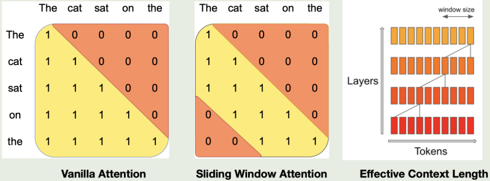
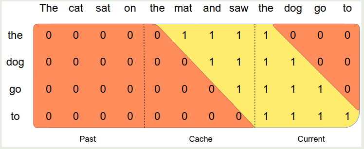

## Introduction

作者主要强调 Mistral 7B 的表现超过了 LLaMA 2 7B 和 LLaMA 34B 的表现。

Mistral 7B 主要使用了 [GQA](https://maosong.website/p/notes-on-gqa/) 以及 SWA 两个方法来加速推理和减少内存占用，进而提高 batch size 和 throughput.

## Method

Mistral 7B 的模型配置如下表所示

| Parameter     | Value |
| ------------- | ----- |
| `dim`         | 4096  |
| `n_layers`    | 32    |
| `head_dim`    | 128   |
| `hidden_dim`  | 14336 |
| `n_heads`     | 32    |
| `n_kv_heads`  | 8     |
| `window_size` | 4096  |
| `context_len` | 8192  |
| `vocab_size`  | 32000 |

SWA 的示意图如下所示

对于第 $k$ 层，模型可以感知到 $W\times k$ 的 tokens, 进而可以在提高训练效率的同时保持模型的表现。作者发现，在 [flash attention](https://maosong.website/p/notes-on-flashattention/) 中使用 SWA 之后，模型的效率提升了 2 倍左右。

并且使用了 SWA 之后，我们的 kv cache 也就随之固定了，因此我们可以使用一个 rolling buff cache, 其大小为 $W$, 对于第 $i$ 个 token, 我们将其保存在 cache 中的第 $i \% M$ 个位置。

作者还进一步将 sequence 分割为多个 chunk, 每个 chunk 的大小都是 window size $M$, 这样在计算 attention 的时候，对于当前的 chunk, 我们使用 self-attention, 对于 cache 中的 attention, 我们使用 SWA, 然后对于 past token, 由于这部分不在 sliding window 内因此不参与计算

## Conclusion

作者在本文中提出了 Mistral 7B, 一个基于 GQA 和 SWA 的大语言模型。

## References

- [Arxiv](https://arxiv.org/abs/2310.06825v1)
