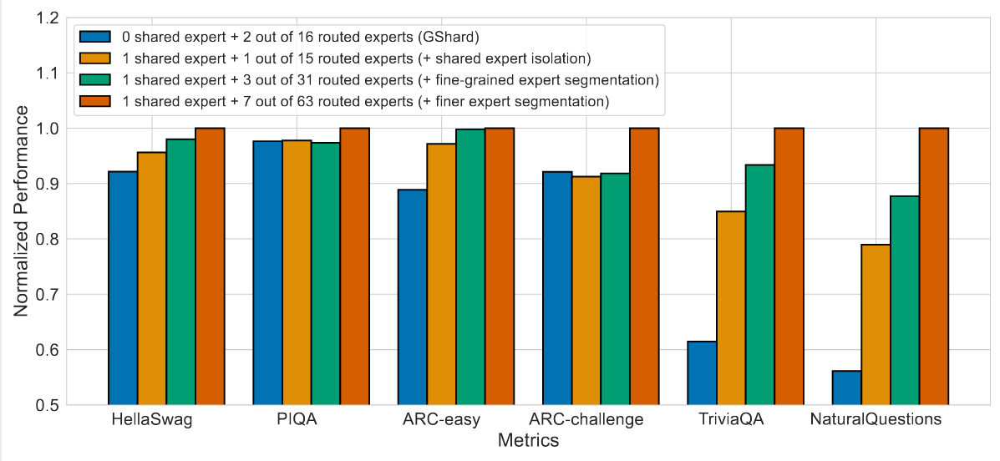
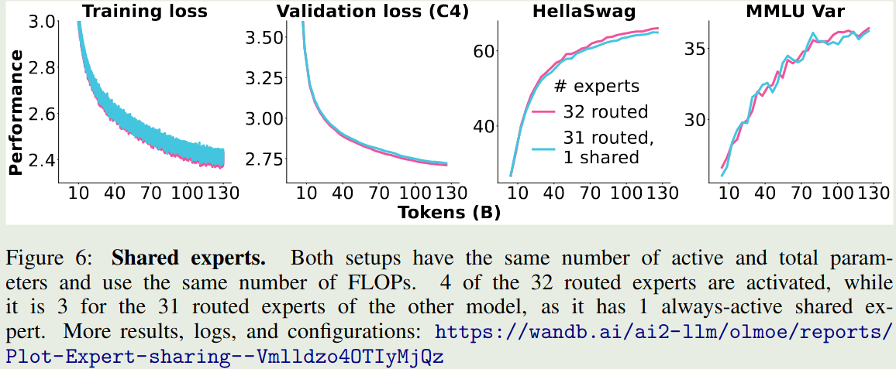
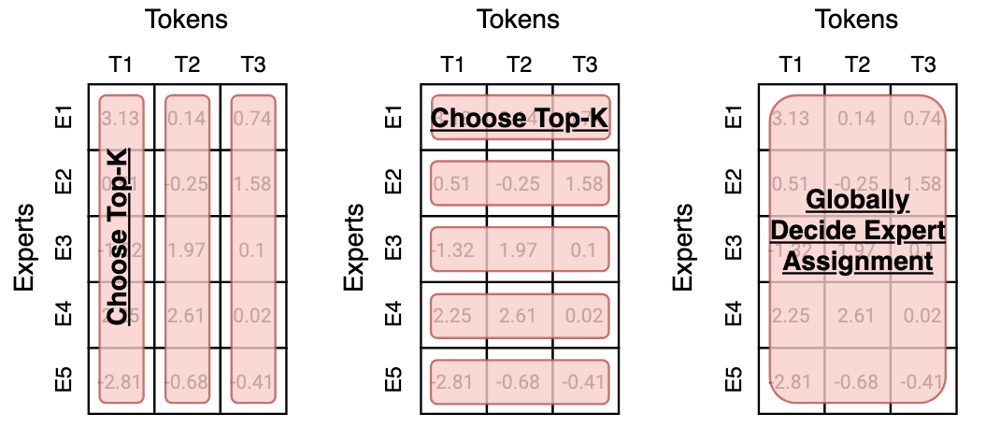
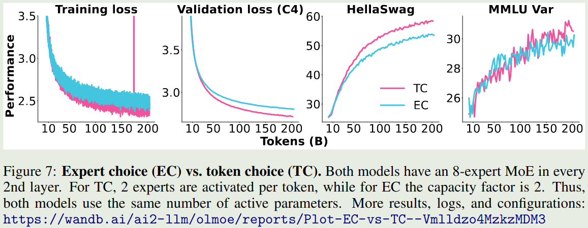

本 blog 详细介绍了 MoE 模型的一些关键设计与相关实验结果，为 MoE 模型的学习提供基础。

## Introduction

### Motivation

现有大部分大语言模型均是基于 [Transformer](Transformer.md) 架构，[Kaplan scaling law](https://maosong.website/p/kaplan-scaling-law/) 通过实验说明，大语言模型的表现与算力，数据，模型参数量息息相关。但是，对于 dense 模型来说，我们提高模型参数量时，必须同时提高所使用的算力。这就限制了大模型的 scaling law.

而 MoE 模型的解决方法为在计算时只激活部分参数，这样，我们就可以在同等激活参数量/算力下训练更大参数量的模型，从而达到更好地表现。

因此，MoE 模型的核心思想在于

> 使用相同的激活参数量/算力，提高模型总参数量，从而达到更好的表现。

### Definition

MoE 模型和 dense 模型的示意图如下，图源 [olmoe](https://maosong.website/p/notes-on-olmoe/)


一个 MoE layer 包括两个模块：

1. Router：Router 负责为 token 指定合适的专家
2. Expert：Expert 负责处理 token

对于输入 $x\in\mathbb{R}^d$, 我们假设有 $N$ 个 Expert，router 一般是一个 linear layer 再加上一个 gating function (softmax 或者 sigmoid， 我们本文中使用 softmax), 其构建了 $\mathbb{R}^d\to\mathbb{R}^N$ 的映射，定义为：

$$
G(x) =[G_1(x),\dots,G_N(x)] = \mathrm{softmax}(W_gx + b)\in\mathbb{R}^N
$$

其中 $W_g\in\mathbb{R}^{N\times d}$, $b\in\mathbb{R}^N$ 是可学习的参数。$G_{i}(x)$ 代表了当前 token $x$ 选择第 $i$ 个 Expert 的概率。

 一般来说，Expert 会使用和 dense 模型一样的 MLP, 我们记为

$$
E_i(x) = \mathrm{FFN}(x), \quad i = 1,\dots,N
$$

接下来，基于 $G(x)$ 和 $E(x)$, 我们会使用合适的方法来挑选 $K<N$ 个 Expert 出来，其中 $K$ 是给定的超参数，我们记挑选出来的 $K$ 个 Expert 的 index 为 $e_1,\dots,e_K$, 即

$$
e_i \in \{i\mid G_i(x)\in \mathrm{TopK}(G_i(x), K)\},\ i=1,\dots,K
$$

最终 MoE layer 的输出为

$$
y = \sum_{i=1}^K\mathrm{Normalize}(G_{e_i}(x)) E_{e_i}(x)
$$

这里 $\mathrm{Normalize}(\cdot)$ 代表我们对于输出进行归一化，即

$$
\mathrm{Normalize}(G_{e_i}) = \frac{\exp(G_{e_i})}{\sum_{i=1}^K \exp(G_{e_i})},\quad i=1,\dots,K
$$

### Why MoE

选择 MoE 的原因有三点：效率, scaling law 以及表现。

#### Efficiency

MoE 训练更加高效，如下图所示


[Switch Transformer](https://maosong.website/p/switch-transformer/) 的 实验结果说明，MoE model 的训练效率比 dense model 快 7 倍左右。其他模型也有类似结论。总的来说，MoE 模型相比于 dense 模型，训练效率更高。

#### Scaling Law

MoE 模型可以突破传统 scaling law 的限制，在算力固定的情况下，我们可以通过提高 MoE 模型的稀疏度来进一步提高模型的表现


如上图所示，在 FLOPs 给定的情况下，随着模型稀疏度的提高，模型的表现和效率都有提升

#### Performance

MoE 模型的表现更强，如下图所示，MoE 模型的训练，验证损失以及在下游任务上的表现均超过了 dense 模型


### Timeline

激活参数比例变化图如下图所示


可以看到，当前大部分模型的激活比例都在 $5\%$ 左右。

另一方面，从专家的激活比例变化图如下图所示


可以看到，现在大部分模型总专家数都在 200-400 左右，[Kimi-k2](https://maosong.website/p/notes-on-kimi-k2/) 认为提高专家个数可以提高模型表现，而 [LongCat](LongCat.md) 则是使用了 phantom expert 机制

## MoE Design

### Experts Design

#### Number of Experts

一般来说，专家个数越多，模型越稀疏，模型表现越好。扩展专家个数有两个方式：

1. 直接增加专家个数，这会导致模型参数量上升，如 [Switch Transformer](https://maosong.website/p/switch-transformer/)
2. 对已有的专家进行切分，将大专家切分为小专家，如 [DeepSeekMoE](https://maosong.website/p/notes-on-deepseekmoe/)

[Switch Transformer](https://maosong.website/p/switch-transformer/) 也通过实验发现，增加专家个数可以显著提高模型的训练效率和表现，结果如下图所示


可以看到，当我们增加专家个数的时候，模型的表现是持续提升的。并且当我们增加专家个数之后，模型的训练效率也有所提升。

[DeepSeekMoE](https://maosong.website/p/notes-on-deepseekmoe/) 提出了 fine-granularity expert 的概念，其做法是通过减少 expert 的大小在相同参数量的场景下使用更多的专家。实验结果如下图所示



可以看到，在稀疏度 (激活专家个数占总专家个数比例) 不变的情况下，提高专家的粒度，可以提高模型的表现。

[olmoe](https://maosong.website/p/notes-on-olmoe/) 对 [DeepSeekMoE](https://maosong.website/p/notes-on-deepseekmoe/) 的这个观点进行了验证，结果如下图所示，


结果显示，当专家粒度从 8E-1A 扩展到 32E-4A 时，模型在 HellaSwag 上的表现提升了 $10\%$, 但是进一步扩展到 64E-8A 时，模型的表现提升不到 $2\%$, 这说明了无限制提升专家粒度对模型的提升越来越有限。

[Kimi-k2](https://maosong.website/p/notes-on-kimi-k2/) 探究了针对 MoE 模型 sparsity 的 scaling law, 结果也说明，提升 sparsity 可以提高模型的表现。因此，其相对于 [DeepSeek-V3](https://maosong.website/p/notes-on-deepseek-v3/) 使用了 $50\%$ 额外的的专家数。[Ling-mini-beta](https://maosong.website/p/notes-on-ling-mini-beta/) 进一步验证了这个观点。

#### Shared Experts

Shared Expert 由 [DeepSeekMoE](https://maosong.website/p/notes-on-deepseekmoe/) 提出，其基本思想为，固定某几个专家，响应所有的 token，这样可以让某些专家学习到共有的知识，而让其他的专家学习到特定的知识。这个方法随后被 [Qwen1.5](https://maosong.website/p/notes-on-qwen1.5/), [Qwen2](https://maosong.website/p/notes-on-qwen2/) , [Qwen2.5](https://maosong.website/p/notes-on-qwen2.5/) 以及 [DeepSeek-V3](https://maosong.website/p/notes-on-deepseek-v3/) 所采用。

[DeepSeekMoE](https://maosong.website/p/notes-on-deepseekmoe/) 给出的实验结果如下


作者发现，当使用 shared experts 之后，模型在大部分 benchmark 上的表现都有所提升。

[olmoe](https://maosong.website/p/notes-on-olmoe/) 在 32 个专家下进行了实验，比较了 4 个激活专家和 3 个激活专家 +1 个共享专家两种设置的表现，结果如下：



作者认为，加入 shared experts 之后，组合的可能性有所减少，这会降低模型的泛化性。因此，在 olmoe 中，作者没有使用 shared experts.

> 虽然 [Qwen1.5](https://maosong.website/p/notes-on-qwen1.5/), [Qwen2](https://maosong.website/p/notes-on-qwen2/) 和 [Qwen2.5](https://maosong.website/p/notes-on-qwen2.5/) 都使用了 shared experts, 但是后续的 [Qwen3](https://maosong.website/p/notes-on-qwen3/) 中却并没有使用。

[Ling-mini-beta](https://maosong.website/p/notes-on-ling-mini-beta/) 通过实验得出的结论为，shared expert 应该是一个非零的尽可能小的值，作者认为将 shared expert 设置为 1 是一个比较合理的选择。

### Activation Function

一般来说，在选取 top-K 专家时，我们会对 gating layer 的输出进行归一化，通常我们会使用 softmax function:

$$
G(x) = \mathrm{softmax}(W_gx + b)\in\mathbb{R}^N
$$

但是，在 [Loss-Free Balancing](https://maosong.website/p/notes-on-loss-free-balancing/) 中，作者通过实验发现，使用 sigmoid 作为激活函数效果更好，即

$$
G(x) = \mathrm{sigmoid}(W_gx + b)\in\mathbb{R}^N
$$

其对应的实验结果如下图所示


实验结果显示，sigmoid function 对于超参数更加 robust, 且表现也更好一些。 下面是一些使用不同激活函数的模型例子

| Activation function | Models                          |
| ------------------- | ------------------------------- |
| softmax             | Step 3, Kimi-K2, gpt-oss-120B   |
| sigmoid             | GLM-4.5, dots.llm1, DeepSeek-V3 |

### Routing Z-loss

Routing Z-loss 由 [ST-MoE](https://maosong.website/p/st-moe/) 提出， [Switch Transformer](https://maosong.website/p/switch-transformer/) 发现在 gating layer 中使用 `float32` 精度可以提高训练稳定性，但是这还不够，因此 [ST-MoE](https://maosong.website/p/st-moe/) 使用了如下的 router Z-loss:

$$
\mathcal{L}_z(x) = \frac1B\sum_{i=1}^B\left(\log\sum_{j=1}^N e^{x_j^{(i)}}\right)^2
$$

其中 $B$ 是 batch size ，$x_j^{(i)}=[W_gx_i+b]_j$ 代表了第 $j$ 个专家对 $i$ 个 token 的激活 logits. [olmoe](https://maosong.website/p/notes-on-olmoe/) 实验验证结果如下


可以看到，加入 router Z-loss 之后，模型训练的稳定性有所提升，因此 Olmoe 采取了这个改进，但是后续的 MoE 模型使用 Z-loss 较少，个人猜测原因是 [Loss-Free Balancing](https://maosong.website/p/notes-on-loss-free-balancing/) 中提出的加入额外的 loss 会影响 nex-token prediction loss

### Routing Strategy

routing 策略直接决定了 MoE 模型的有效性。在为专家分配 token 的时候，我们有如下方式：

1. 为每个 token 选取若干个专家
2. 为每个专家选取若个个 token
3. 动态分配 token 与专家之间的关系

三种选择方式如下图所示，图源 [MoE survey](https://arxiv.org/pdf/2209.01667)



#### Expert Choice

每个专家选取 top-k 的 token，此时每个专家处理的 token 个数是相同的，这个方法的好处是自带 load balance。缺点是自回归生成的方式没有完整序列长度的信息，从而导致 token dropping，也就是某些 token 不会被任何专家处理，某些 token 会被多个专家处理。

目前采用这个策略的有 [OpenMoE-2](OpenMoE-2.md)， 核心思想是 dLLM 的输出长度固定，expert choice 策略更有效

#### Token Choice

每个 token 选取 top-k 的专家，好处是每个 token 都会被处理，缺点是容易导致负载不均衡。因此，一般需要加上负载均衡或者 token dropping 策略来提高负载均衡

**Capacity Factor**
由 [Switch Transformer](https://maosong.website/p/switch-transformer/) 提出，其定义为

$$
\text{expert capacity} = \left(\frac{\text{tokens per batch}}{\text{number of experts}}\right) * \text{capacity factor}
$$

设置 capacity factor 之后，当某个专家处理的 token 个数超过 capacity 之后，概专家的计算就会直接跳过，退化为 residual connection. 后续 [DeepSeek-V2](https://maosong.website/p/notes-on-deepseek-v2/) 也采用了这种策略，但是 [DeepSeek-V3](https://maosong.website/p/notes-on-deepseek-v3/) 弃用

**Load balancing Loss**
在训练目标中加入负载均衡损失，要求每个专家处理的 token 个数的分布尽可能均匀。

这部分具体见 [Load Balancing loss](https://maosong.website/p/load-balancing-tutorial/)

#### Global Choice

全局分配决定 token 和专家的匹配关系，后续 Qwen 提出了 [Global-batch load balancing](https://maosong.website/p/notes-on-global-batch-load-balancing/) 使用了这种方式来提高专家的特化程度

#### Dynamic Routing

根据输入 token 的难度动态决定激活专家的个数。[LongCat](LongCat.md) 使用了一个 Phantom expert 的方法来实现根据 token 的难度动态分配专家。具体来说，除了 $N$ 个专家之外，MoE 还包括 $Z$ 个 zero-computation expert (现在一共有 $N+Z$ 个专家参与计算), 其计算方式如下

$$
\begin{aligned}
y &= \sum_{i=1}^{K}\mathrm{Normalize}(G_{e_i}) E_{e_i}(x), e_i \in \{i\mid G_i(x)\in \mathrm{TopK}(G_i(x), K)\}\\
E_{e_i}(x) &= \begin{cases}
FFN_{e_i}(x), & \text{ if }1\leq i\leq N\\
x, & \text{ otherwise }\\
\end{cases}
\end{aligned}
$$

> 注：LongCat 还是用了 [Loss-Free Balancing](https://maosong.website/p/notes-on-loss-free-balancing/), 我们这里省略掉了。

#### Overview

现在几乎所有的模型都选择方式 1，即每个 token 选取 top-k 的专家。 [olmoe](https://maosong.website/p/notes-on-olmoe/) 对比了以下方式 1 和方式 2 的表现，如下图所示



可以看到，加入 load balancing loss 之后，相比于 Expert Choice, Token Choice 的表现更好。但是，expert choice 更加高效，作者认为 expert choice 更适用于多模态，因为丢掉 noise image tokens 对 text token 影响会比较小。因此，在 olmoe 中，作者使用 token choice 作为 routing 策略


### Upcycling

upsampling 是一个将 dense model 转化为 MoEmodel 的方法，具体做法就是我们复制 dense model 中的 FFN layer 得到对应 MoE layer 中的 Expert，然后我们再结合 router 训练，这样可以提高整体的训练效率。相关模型有 [MiniCPM](MiniCPM.md), [Qwen1.5](https://maosong.website/p/notes-on-qwen1.5/) 和 [Mixtral MoE](https://maosong.website/p/mixstral-8x7b/) (疑似)

实验结果如下图所示


从已有的结果来看，MoE 模型会被 dense 模型的一些超参数所限制，且训练不是很稳定。因此，现在一般不采用这种方法

## Analysis on MoE

### Specialization of Experts

[OpenMoE](OpenMoE.md) 分析了 MoE 模型的特化程度，其结论如下

1. 作者发现，大部分专家对于不同的 domain 没有出现 specialization 情况，对于 math domain, specialization 现象比较明显，作者认为这是因为 math domain 包含更多的 special tokens
2. 对于不同的语言，有部分专家出现 specialization 现象
3. 部分专家对于 position ID 有 specialization 现象，并且连续的 token 更偏好相同的专家
4. 作者还发现，部分专家对于 Token ID 有 specialization 现象，作者将这种现象称为 **Context-independent  Specialization**.
5. 专家还会对语义相似的 token 进行聚类，并且这种聚类在训练早期就已经发生，作者认为其原因在于重新分配 token 会增加最终的 loss
6. 对于 token dropping, 作者发现越靠后的 token, 其被 drop 的概率比例也越高。并且对于指令跟随数据，更多的 token 都会被丢掉，因此作者认为指令跟随数据是 MoE 模型的一种 OOD 数据

### Saturation of Experts

[olmoe](https://maosong.website/p/notes-on-olmoe/) 探究了训练过程中激活的专家和训练结束后激活的专家的匹配程度，结果如下图所示


实验结果说明，训练 $1\%$ 的数据之后，就有 $40\%$ 的 routing 和训练完毕的 routing 一致，当训练 $40\%$ 的数据之后，这个比例提升到了 $80\%$. 作者认为，这是专家特化的结果，初始的 routing 如果改变的话会带来表现下降，因此模型倾向于使用固定的专家处理特定的 token

作者还发现，later layers 比 early layers 饱和更快，early layer, 特别是 layer 0, 饱和的非常慢。作者认为，这是 [DeepSeekMoE](https://maosong.website/p/notes-on-deepseekmoe/) 放弃在第一层使用 MoE layer 的原因，因为 load balancing loss 收敛更慢。后续 [DeepSeek-V2](https://maosong.website/p/notes-on-deepseek-v2/) 和 [DeepSeek-V3](https://maosong.website/p/notes-on-deepseek-v3/) 均在 early layer 上使用 dense layer 替换掉了 MoE layer

## Optimization

MoE 模型的优势在于表现好，但是模型参数往往非常大，为了方便使用，我们需要对训练好的 MoE 模型进行优化，目前主要有蒸馏，专家剪枝/合并以及量化等优化方法

蒸馏是一个将大模型能力传递给小模型的做法，目前已有的包括：

1. [Switch Transformer](https://maosong.website/p/switch-transformer/) 通过蒸馏，在仅使用 $1/20$ 参数的情况下，保留了稀疏教师模型 $30\%$ 的表现
2. [Gemini2.5](https://maosong.website/p/notes-on-gemini2.5/) 通过蒸馏 Gemini2.5 Pro 得到 Gemini2.5 Flash
3. [DeepSeek-R1](https://maosong.website/p/notes-on-deepseek-r1/) 通过蒸馏来提升小语言模型的 reasoning 能力
4. [Qwen3](https://maosong.website/p/notes-on-qwen3/) 对于小语言模型的训练使用了 off-policy distillation 和 on-policy distillation 来训练小语言模型

## Code

我们这里展示基于 [olmoe](https://maosong.website/p/notes-on-olmoe/) 的代码，代码如下

```python
class OlmoeSparseMoeBlock(nn.Module):
    def __init__(self, config):
        super().__init__()
        self.num_experts = config.num_experts
        self.top_k = config.num_experts_per_tok
        self.norm_topk_prob = config.norm_topk_prob
        self.gate = nn.Linear(config.hidden_size, self.num_experts, bias=False)
        self.experts = nn.ModuleList([OlmoeMLP(config) for _ in range(self.num_experts)])

    def forward(self, hidden_states: torch.Tensor) -> torch.Tensor:
        batch_size, sequence_length, hidden_dim = hidden_states.shape
        # hidden_states: (batch * sequence_length, hidden_dim)
        hidden_states = hidden_states.view(-1, hidden_dim)
        # router_logits: (batch * sequence_length, n_experts)
        router_logits = self.gate(hidden_states)

        routing_weights = F.softmax(router_logits, dim=1, dtype=torch.float)
        # routing_weights: (batch * sequence_length, top_k)
        # selected_experts: indices of top_k experts
        routing_weights, selected_experts = torch.topk(routing_weights, self.top_k, dim=-1)
        if self.norm_topk_prob:
            routing_weights /= routing_weights.sum(dim=-1, keepdim=True)
        # we cast back to the input dtype
        routing_weights = routing_weights.to(hidden_states.dtype)

        final_hidden_states = torch.zeros(
            (batch_size * sequence_length, hidden_dim), dtype=hidden_states.dtype, device=hidden_states.device
        )

        # One hot encode the selected experts to create an expert mask
        # this will be used to easily index which expert is going to be selected
        expert_mask = torch.nn.functional.one_hot(selected_experts, num_classes=self.num_experts).permute(2, 1, 0)

        # Loop over all available experts in the model and perform the computation on each expert
        for expert_idx in range(self.num_experts):
            expert_layer = self.experts[expert_idx]
            idx, top_x = torch.where(expert_mask[expert_idx])

            # Index the correct hidden states and compute the expert hidden state for
            # the current expert. We need to make sure to multiply the output hidden
            # states by `routing_weights` on the corresponding tokens (top-1 and top-2)
            current_state = hidden_states[None, top_x].reshape(-1, hidden_dim)
            current_hidden_states = expert_layer(current_state) * routing_weights[top_x, idx, None]

            # However `index_add_` only support torch tensors for indexing so we'll use
            # the `top_x` tensor here.
            final_hidden_states.index_add_(0, top_x, current_hidden_states.to(hidden_states.dtype))
        final_hidden_states = final_hidden_states.reshape(batch_size, sequence_length, hidden_dim)
        return final_hidden_states, router_logits
```

## Infra

针对 MoE 模型的 infra 主要涉及 expert parallelism (EP), EP 将 MoE layer 的计算分为了三个阶段：

1. all-to-all dispatch: 基于 gating layer 的结果，将 token 通信传输到对应专家所在的 GPU 上
2. computation: 执行计算，即 $E_i(x)$.
3. all-to-all combine: 收集专家计算的结果，即 $y = \sum_{i=1}^K\mathrm{Normalize}(G_{e_i}(x)) E_{e_i}(x)$.

其框架图如下所示


具体见 [Expert Parallelism](Expert%20Parallelism.md).

## Challenges

- 构建针对 MoE 模型的 infra 比较困难，相关工作有 DeepSeek 提出的 DeepEP.
- 训练不稳定，特别是负载均衡。负载均衡做不好容易导致模型崩塌。

## Conclusion

在本文中，我们系统性回顾了 MoE 的相关概念，MoE 模型已经是现在大语言模型的主流架构，比如商业模型 [Gemini2.5](https://maosong.website/p/notes-on-gemini2.5/), 开源领先的模型 [DeepSeek-V3](https://maosong.website/p/notes-on-deepseek-v3/) , [LLaMA4](https://maosong.website/p/notes-on-llama4-blog/) 以及 [Qwen3](https://maosong.website/p/notes-on-qwen3/) 等都采用了 MoE 的架构，如何进一步优化 MoE 的训练方式是当前研究的一个重点方向。

## Appendix

MoE model information

| Model        | Year    | total parameters | activated parameters | shared expert | Routed experts | activated experts |
| ------------ | ------- | ---------------- | -------------------- | ------------- | -------------- | ----------------- |
| ST-MoE       | 2022/4  | 269B             | 32B                  | 0             | 64             | 2                 |
| Mistral      | 2024/1  | 47B              | 13B                  | 0             | 8              | 2                 |
| DeepSeek-MoE | 2024/1  | 145B             | 22B                  | 4             | 128            | 12                |
| DeepSeek-V2  | 2024/5  | 236B             | 21B                  | 2             | 160            | 6                 |
| LLaMA4       | 2025/4  | 400B             | 17B                  | 1             | 128            | 1                 |
| DeepSeek-V3  | 2024/12 | 671B             | 37B                  | 1             | 256            | 8                 |
| Qwen3        | 2025/5  | 235B             | 22B                  | 0             | 128            | 8                 |
| dots.llm1    | 2025/6  | 142B             | 14B                  | 2             | 128            | 6                 |
| Step 3       | 2025/7  | 316B             | 38B                  | 1             | 48             | 3                 |
| Kimi-K2      | 2025/7  | 1043B            | 32B                  | 8             | 384            | 1                 |
| GLM-4.5      | 2025/8  | 355B             | 32B                  | 1             | 160            | 8                 |
| gpt-oss      | 2025/8  | 116B             | 5B                   | 0             | 128            | 4                 |
| LongCat      | 2025/9  | 560B             | 27B*                 | 0             | 768*           | 12                |
| Ling-1T      | 2025/10 | 1000B            | 51B                  | 1             | 256            | 8                 |

> Remark
> LongCat 采用了动态激活的方式，因此其结果有一个浮动范围。

## References

- [Switch Transformer](https://arxiv.org/pdf/2101.03961)
- [MoE Survey](https://arxiv.org/pdf/2209.01667)
- [olmoe](https://openreview.net/forum?id=xXTkbTBmqq)
- [GShard](https://arxiv.org/pdf/2006.16668)
- [blog](https://www.cnblogs.com/rossiXYZ/p/18800825)
- [MoE a big data perspective](https://arxiv.org/pdf/2501.16352v1)
- [Mixture of Experts Explained](https://huggingface.co/blog/moe)
- [MoE Fundamentals: Sparse Models Are the Future](https://www.cerebras.ai/blog/moe-guide-why-moe)
- [MoE router](https://www.cerebras.ai/blog/moe-guide-router)
- [Ling-Mini-beta](http://arxiv.org/abs/2507.17702)
