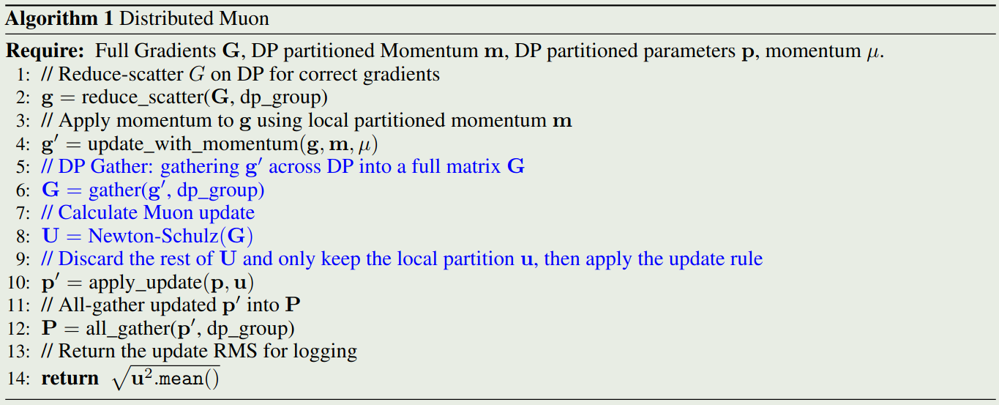
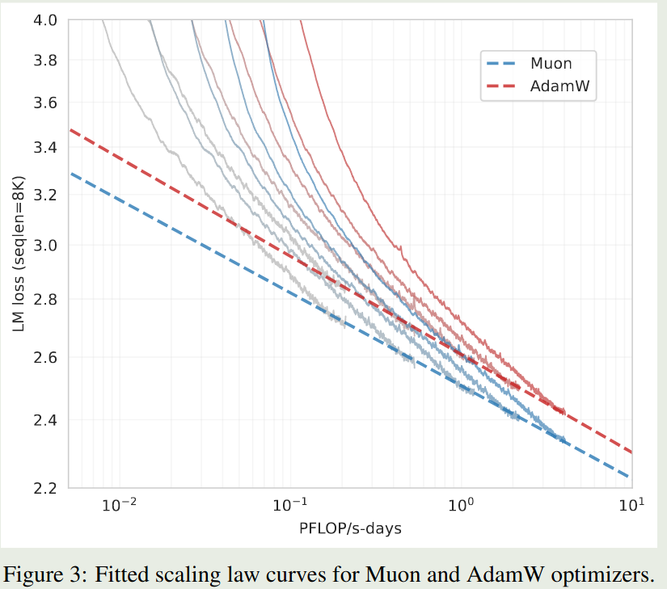
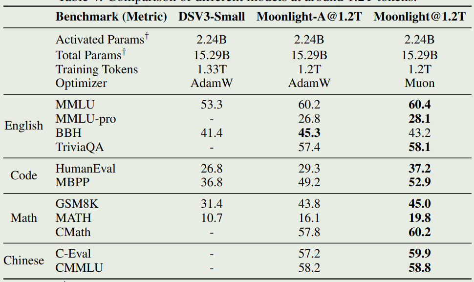
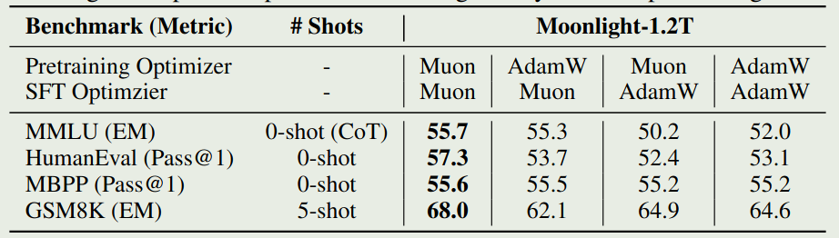

Kimi 提出了 Moonlight, 一个基于 Muon optimizer 训练得到的 16B-A3B MoE LLM. 作者详细介绍了如何 scale up muon optimizer.

## Introduction

[Muon](https://maosong.website/p/notes-on-muon-blog/) 验证了 Muon optimizer 在小语言模型 nanoGPT 上的表现，但是对于更大规模 LLM 的表现，尚未有人探究。因此 Kimi 就希望在大规模 LLM 上验证 Muon optimizer 的表现。作者主要进行了两点改进：

1. 加入 weight decay
2. 调整了不同参数更新的 scale

基于改进后的 Muon optimizer, 其训练效率相比于 AdamW 提升了 2 倍。作者基于 Muon Optimizer 训练得到了 Moonlight, 一个 16B-A3B 的 MoE LLM.

作者主要作出了三点贡献：

1. 探究了 weight decay 在 scaling Muon 时的作用
2. 分布式 Muon optimizer 的实现
3. 验证了 Muon optimizer 的 scaling law

## Method

### Background

作者首先介绍了一下 Muon optimizer, 给定步数 $t$, 参数矩阵 $W_{t-1}$, momentum $\mu$, 学习率 $\eta_t$ 以及目标函数 $\mathcal{L}_t$, Muon optimizer 的更新方式如下：

$$
\begin{aligned}
M_t &= \mu M_{t-1} + \nabla\mathcal{L}_t(W_{t-1})\\
O_t &= \mathrm{Newton-Schulz}(M_t)\\
W_t &= W_{t-1} - \eta_t O_t
\end{aligned}
$$

这里 $M_t$ 是 gradient 的 momentum, 初始化为 $M_0=0$. 在上面的更新公式中，Newton-Schulz 的作用是求解 $(M_tM_t^T)^{-1/2}M_t$. 令 $M_t=U\Sigma V^T$ 为 SVD 分解， 我们有

$$
(M_tM_t^T)^{-1/2}M_t = UV^T
$$

这是一个半正交矩阵，即 $(UV^T)^T(UV^T)=I$.

Newton-Schulz 迭代的具体公式如下：

$$
X_0 = \frac{M_t}{\|M_t\|_F},\quad X_k = aX_{k-1} + b(X_{k-1}X_{k-1}^T)X_{k-1} + c(X_{k-1}X_{k-1}^T)^2X_{k-1}
$$

其中，normalization 是为了保证 Newton-Schulz 的收敛性。 $a,b,c$ 是三个超参数，在 Muon 中设置为 $(a,b,c)=(3.4445, 4.7750, 2.0315)$.

### Scaling up Muon

作者发现，尽管 Muon 在小规模场景下 work 的很好，但是大规模性场景下的收益就非常有限了。作者发现，这是因为模型的参数以及每一层输出的 RMS 变得很大，这可能会影响模型的性能。因此，作者就和 AdamW 一样使用 weight dacay 来避免这个问题，即

$$
W_t =W_{t-1} - \eta_t(O_t + \lambda W_{t-1})
$$

作者通过实验对比了 AdamW, vanilla Muon 和 Muon w/ weigth decay 三者的表现，实验结果如下图所示

实验结果显示，尽管 vanilla Muon 手链最快，但是由于其权重增长很快，因此最后模型的表现不如 AdamW 和 Muon w/ weigth decay.

接下来，作者分析了以下更新矩阵的 Root Mean Square (RMS), 结论是 Muon optimizer 的 RMS 与参数矩阵的形状相关：

> Lemma
> For a full-rank matrix parameter of shape $[A, B]$, its theoretical Muon update RMS is $\sqrt{1/\max(A, B)}$.

证明如下：通过 Newton-Schulz 迭代，我们得到 $O_t=UV^T$, 其中 $M_t=U\Sigma V^T$ 是 SVD 分解，我们有

$$
\mathrm{RMS}(O_t) = \sqrt{\frac{\sum_{i=1}^A\sum_{j=1}^BO_{t,i,j}^2}{AB}}=\sqrt{\frac{r}{AB}}
$$

其中, $r=\mathrm{rank}(M_t)$ , 这样就完成了证明。

而 Adam 和 AdamW 的 RMS 都在 $1$ 附近。作者认为 RMS 也会影响模型表现：

1. 当 $\max(A,B)$ 过大时，如 dense MLP matrix, 其更新就会变得很小，限制了模型的表现
2. 当 $\max(A,B)$ 过小时，如 [GQA](https://maosong.website/p/notes-on-gqa/) 中的 KV head 或者 [DeepSeek-V3](https://maosong.website/p/notes-on-deepseek-v3/) 中的 MLA, 更新又会变得很大，导致训练不稳定。

因此，作者就提出了一个 rescaling 的技巧，来消除 Muon optimizer 的影响。

作者通过实验发现，AdamW 的 RMS 通常在 $0.2\sim0.4$ 左右，因此，作者将 Muon optimizer 的更新设置如下

$$
W_t = W_{t-1} - \eta_t(0.2\cdot O_t\cdot \sqrt{\max(A,B)} + \lambda W_{t-1})
$$

基于这个改变， Muon 和 AdamW 可以共享学习率以及 weight decay 参数。

### Distributed Muon

ZeRO-1 天然适合 AdamW, 因为 AdamW 都是 element-wise 进行计算的。但是 Muon 则需要梯度矩阵的全部信息。因此，作者就针对 ZeRO-1 进行适配， 提出了 **Distributed Muon**,  分布式版本将优化器的状态进行切分，然后加入了两个额外的操作：

1. DP gather: 将 ZeRO-1 切分的梯度矩阵 gather 为一个完整的矩阵
2. Calculate Full Update: 对完整的梯度矩阵执行 Newton-Schulz 迭代

最终，Distributed Muon 的算法如下图所示

最后，作者分析了一下 distributed Muon 和 distributed AdamW 的内存和算力占用：

1. 内存开销：Muon 只有一阶矩，而 AdamW 有二阶矩，因此 Muon 的额外内存开销为 AdamW 的一半。
2. 通信开销：对于 ZeRO-1，通信开销来源于三个过程：All-Gather 参数 $P$ 用于前向传播, Reduce-Scatter 梯度 $G$ 用于反向传播, All-Gather 更新后的参数 $P$ 用于下一轮的前向传播。AdamW 不引入额外通信，所以其每个参数的通信量为 $4+4=8$, 分别代表 $G$ 和 $P$ 的通信量。而 Muon 则需要额外的一次通信来得到 full matrix, 因此每个参数通信量为 $4+4+2=10$, 分别代表 $P, G$ 和 full matrix. 也就是说，分布式 Muon 的通信量最高为 AdamW 的 $1.25$ 倍。实际上由于我们使用 multiple DP, 这个比例会更接近于 $1.0$.
3. latency：Distributed Muon 相比于 AdamW latency 更高，这是因为 Muon 需要进行 DP gather 以及计算 Newton-Schulz 迭代。但实际上，latency 很小，因为 Newton-Schulz 迭代只需要迭代 5 次，并且 optimizer 的 end-to-end latency 相比于 forward-backward 过程是可以忽略的。一些额外的技巧也可以降低 latency.

实际在训练的过程中，作者发现 Distributed Muon 相比于 AdamW 并没有太明显的 latency.

## Experiments

### Scaling Law of Muon

作者分析了一下 Muon Optimizer 的 scaling law, 实验结果如下图所示

实验结果表明，在最优设置下，Muon Optimizer 只需要 $52\%$ 的 FLOPs 就可以达到 AdamW 的表现

### Pretraining with Muon

作者分贝使用 AdamW 和 Muon 训练模型，然后评测了以下模型在不同 benchmark 上的表现，结果如下图所示

可以看到，在相同的设置下，Muon optimizer 的表现更好。

### Dynamics of Singular Spectrum

Muon optimizer 的核心思想就是让比较难更新的方向也能被更新到，本节作者就探究了 Muon 是否满足这个性质，作者对参数矩阵进行 SVD 分解，然后定义 SVD entropy 如下

$$
H(\sigma) = -\frac{1}{\log n}\sum_{i=1}^n\frac{\sigma_i^2}{\sum_{j=1}^n\sigma_j^2}\log\frac{\sigma_i^2}{\sum_{j=1}^n\sigma_j^2}
$$

作者对 SVD entropy 可视化如下

可以看到，Muon optimizer 的 SVD entropy 比 AdamW 更大，这说明 AdamW 的更新方向更多更广，验证了 Muon optimizer 的核心思想

### SFT with Muon

作者还在 SFT 阶段验证了 Muon optimizer 的有效性。实验结果如下图所示

结论主要有两个：

1. 预训练阶段与 SFT 阶段使用不同的优化器时，模型表现没有明显区别
2. SFT 阶段使用 Muon 可以达到与 AdamW 差不多的表现，但是最好还是在 pre-training 阶段使用 Muon

## Conclusion

作者探究了如何 scale up Muon Optimizer. 通过改进，作者在 16B-A3B 的 MoE LLM 上验证了 Muon Optimizer 的性能。实验结果发现，Muon Optimizer 的训练效率比 AdamW 提升了 2 倍左右。

作者提出了三个未来可行的研究方向：

1. 目前 Muon 只能针对 2D 参数进行优化，其他参数仍然依赖于 AdamW 优化器，是否可以使用 Muon 优化所有参数？
2. Muon optimizer 可以理解是 spectral norm 下的 steepest descent 方法，如何将其扩展到 Schatten norm 是一个可以研究的方向
3. 实验里提到，预训练和 SFT 阶段使用不同的 optimizer, 表现不是最优的，如何解决这个因为不同 optimizer 导致的性能差距是一个需要解决的问题。

## References

- [Muon is Scalable for LLM Training](http://arxiv.org/abs/2502.16982)
