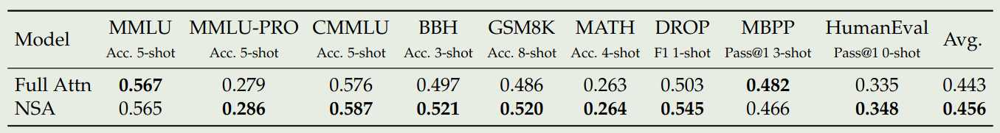

DeepSeek 在 25 年 1 月提出了 Natively trainable Sparse Attention (NSA), 一个软硬件结合的稀疏注意力机制，NSA 可以在提高模型推理效率的同时提高计算效率。

## Introduction

现有的大模型主要是基于 [Transformer](Transformer.md) 提出的 softmax attention, 其主要问题在于随上下文长度增加，其 latency 也上升更快。理论估计，对于 64k 上下文长度的输出，softmax attention 部分的计算占 $70\%\sim80\%$ 的 latency.

为了解决 softmax 的 high latency 问题，，一个做法就是使用稀疏注意力机制，如 [MInference](MInference.md) 等，但是这些系数注意力机制大多没有实际部署，且它们一般只在 inference 阶段使用

作者认为解决这个问题有两个挑战：

1. Hardware-aligned inference speedup: 降低 inference latency 需要算法与硬件结合，不能只关注算法层面的改进
2. Training-aware algorithm design: 需要在训练阶段也支持算法，从而可以降低训练的算力消耗并且保持模型的表现

为了解决这两个问题，作者就提出了 natively trainable sparse attention (NSA) 架构。NSA 通过将 key 和 value 分割为不同的 block, 然后基于三种 path: compressed coarse-grained tokens, selectively retrained fine-grained tokens 以及 sliding windows for local contextual information 来进行处理和过滤。NSA 提出了两点观点改进：

1. Hardware-aligned system: 优化了 blockwise sparse attention 来平衡 arithmetic intensity.
2. Training-aware design: 支持端到端的训练和部署

## Method

### Overview

作者首先回顾了 attention 的定义如下：

$$
\mathbf{o}_t=\mathrm{Attn}(\mathbf{q_t},\mathbf{k}_{:,t}, \mathbf{v}_{:,t})=\sum_{i=1}^t \frac{\alpha_{t,i}}{\sum_{t,i}\alpha_{t,i}}\mathbf{v_i},\ \alpha_{t,i} = \exp\left(\frac{\mathbf{q_t}^T\mathbf{k}_{i}}{\sqrt{d_k}}\right)
$$

其中 $\mathbf{q_t}\in\mathbb{R}^{d_k}$.

接下来是 Arithmetic Intensity. Arithmetic intensity 指的是 FLOPs 与内存访问次数之比。由于现在的 GPU 都是计算密集型设备，理想情况下应该是 Arithmetic intensity 越高越好。这部分具体介绍见 [GPU-introduction](GPU-introduction.md).

对于 causal self-attention 来说，在训练以及 prefilling 阶段，由于 batch 较大，因此整体的 Arithmetic intensity 较高，因而这两个阶段是 computer-bound. 但是在 decoding 阶段，由于其 token-by-token generation 的性质，每次生成新的 token 时都需要重新加载 KV cache, 因而是 memory-bound.

从而我们的优化目标也变得不一致：在训练阶段，我们希望降低计算消耗，而在推理 (decodng) 阶段，我们希望降低内存访问次数。

基于这两个目标，作者提出了使用 $\mathbf{k}_{:,t}, \mathbf{v}_{:,t}$ 的子集 $\tilde{K}_t, \tilde{V}_t$ 来参与计算，其对应的 attention 如下所示

$$
\tilde{K}_t=f_K(\mathbf{q_t},\mathbf{k}_{:,t}, \mathbf{v}_{:,t}), \tilde{V}_t=f_V(\mathbf{q_t},\mathbf{k}_{:,t}, \mathbf{v}_{:,t}), \mathbf{o}_t=\mathrm{Attn}(\mathbf{q_t},\tilde{K}_t, \tilde{V}_t)
$$

我们还可以结合不同的方法来进行组合：

$$
\mathbf{o}_t^*=\sum_{c\in\mathcal{C}}g_t^c\mathrm{Attn}(\mathbf{q_t},\tilde{K}_t^c, \tilde{V}_t^c)
$$

作者在本文中使用了三种方法 $\mathcal{C}=\{\mathrm{cmp},\mathrm{slc},\mathrm{win}\}$, 分别代表了 compression, selection 以及 sliding window, $g_t^c\in[0,1]$ 代表了不同方法对应的 gating score, 类似于 MoE 的 gating layer, $g_t^c$ 由一个 MLP 和一个 sigmoid activation 生成。最终 NSA 的架构如下图所示

作者定义 $N_t$ 代表参与计算的 KV 的总个数：

$$
N_t = \sum_{c\in\mathcal{C}} \mathrm{size}[\tilde{K}_t^c].
$$

作者使用了一个较高的 sparsity ratio 来保证 $N_t<<t$.

### Design

接下来作者分别介绍了每一部分的设计

#### Token Compression

对于 token compression, 其定义如下：

$$
\tilde{K}_t^{\mathrm{cmp}} = f_K^{\mathrm{cmp}}(\mathbf{k}_{:,t})=\left\{\phi(\mathbf{k}_{id+1:id+l})\mid 0\leq i\leq \left\lfloor\frac{t-l}{d}\right\rfloor\right\}\in\mathbb{R}^{d_k\times \left\lfloor\frac{t-l}{d}\right\rfloor}
$$

其中 $l$ 是 block size, $d$ 是 sliding stride, $\phi:\mathbb{R}^{l\times d_k}\to \mathbb{R}^d_k$ 是一个 MLP 用于将 block key 映射为一个单一的 key.  对于 $\tilde{V}_t^{\mathrm{cmp}}$ 作者也使用了类似的做法。

#### Token Selection

仅使用 compressed token 的话，可能会丢失一些细粒度的信息。因此，作者额外提出了 token selection 机制来解决这个问题。

作者使用的做法是 blockwise selection. 这样做的原因有两点：

1. hardware efficiency. 这样做的原因是 GPU 访问内存是在 block 层面进行的，因而更加高效
2. inherent distribution patterns of attention scores. [MInference](MInference.md) 证明了 attention score 在空间上存在连续性。即相邻的 key 对应的重要性非常相似

为了实现 block-wise selection, 作者首先将 key value sequences 分割为 blocks, 然后针对每个 blocks 分配 Importance score.

作者首先介绍了如何计算不同 block 的 importance score.

如果 selection block size 与 compression block size ，即 $l'=l$ 相同的话，则我们可以直接用 compression block 提供的信息：

$$
\mathbf{p}_{t}^{\mathrm{cmp}} = \mathrm{sotmax}\left(\mathbf{q}_t^T\tilde{K}_t^{\mathrm{cmp}}\right)
$$

其中 $\mathbf{p}_{t}^{\mathrm{cmp}}\in\mathbb{R}^{\left\lfloor\frac{t-l}{d}\right\rfloor+1}$ 代表了 $\mathbf{q}_t$ 和 compressed key $\tilde{K}_t^{\mathrm{cmp}}$ 之间的 attention score.

如果 $l'\neq l$ 的话，作者通过空间关系来进行计算，假设 $l\leq l'$, $d\mid l$, $d\mod l'$, 则我们有

$$
\mathbf{p}_{t}^{\mathrm{slc}}[j] = \sum_{m=0}^{l'/d-1}\sum_{n=0}^{l/d-1}\mathbf{p}_{t}^{\mathrm{cmp}}\left[\frac{l'}{d}j-m-n\right]
$$

对于 [GQA](https://maosong.website/p/notes-on-gqa/) 和 [MQA](https://maosong.website/p/notes-on-mqa/), 由于其 KV-cache 在 heads 之间共享，因此我们必须保证不同 heads 之间的 consistency, 因此作者提出了 shared importance score 如下：

$$
\mathbf{p}_{t}^{\mathrm{slc}'} = \sum_{h=1}^H\mathbf{p}_{t}^{\mathrm{slc},(h)}
$$

接下来，对于每个 block 及其对应的 Importance score, 作者保存 top-$n$ sparse blcoks, 如下所示

$$
\begin{aligned}
\mathcal{I}_t &= \{i\mid \mathrm{rank}(p_t^{\mathrm{slc}'}[i])\leq n\}\\
\tilde{K}_t^{\mathrm{slc}}  &= \mathrm{Cat}\left[\{\mathbf{k}_{il'+1:(i+1)l'}\mid i\in \mathcal{I}_t\}\right]
\end{aligned}
$$

其中 $\mathrm{rank}(\cdot)$ 代表了降序排列的 importance scores. $\mathcal{I}_t$ 是选择出来的 block indices, $\mathrm{Cat}(\cdot)$ 表示了 concatenation operation. $\tilde{K}_t^{\mathrm{slc}}\in\mathbb{R}^{d_k\times il'}$ 代表了选择出来的 key.

#### Sliding Window

为了避免 local pattern 对 compression token 以及 selection token 的学习产生影响，作者额外使用了一个 branch 来学习这个 local pattern. 其具体做法就是维持一个 sliding window 用于最近的若干个 token, 即

$$
\tilde{K}_t^{\mathrm{win}} = \mathbf{k}_{t-w:t}, \tilde{V}_t^{\mathrm{win}} = \mathbf{v}_{t-w:t}
$$

这里 $w$ 是 window size.

为了进一步避免 shortcut learning, 对于三个 branch 作者提供了不同的 key 和 values

#### Kernel Design

接下来是针对硬件设计进行的优化。由于 [flash attention 2](flash%20attention%202.md) 对 compression attention 以及 sliding window attention 已经支持的比较好，作者这里介绍了如何针对 selection attention 进行优化。

## Experiments

作者构建了一个 27B-A3B 的 MoE 模型，attention 基于 GQA, MoE 基于 [DeepSeekMoE](https://maosong.website/p/notes-on-deepseekmoe/). 模型配置如下表所示

| field                | value |
| -------------------- | ----- |
| layers               | 30    |
| hidden dimension     | 2560  |
| head groups          | 4     |
| attention heads      | 64    |
| query head dimension | 192   |
| value head dimension | 128   |
| routed experts       | 72    |
| shared experts       | 2     |
| activated experts    | 6     |
| dense layers         | 1     |

NSA 配置如下

| field | value |
| ----- | ----- |
| $l$   | 32    |
| $d$   | 16    |
| $l'$  | 64    |
| $n$   | 16    |
| $w$   | 512   |

其中 selection blocks 包含初始的一个 block 以及最近的 2 个 block.

模型先在 8K 的上下文长度下使用 270B token 进行预训练，接下来在使用 [YARN](https://maosong.website/p/notes-on-yarn/) 将模型上下文通过 continual pre-training 以及 SFT 扩展到 32K. 训练过程的损失如下图所示

作者从 general performance, long-context performance 以及 CoT reasoning performance 三个层面来评估 NSA 的表现。

首先是 NSA 与其他 sparse attention 以及 baseline 在通用任务上表现的对比，结果如下图所示

接下来是 NSA 在 LongBench 上的表现：

作者还使用了 [DeepSeek-R1](https://maosong.website/p/notes-on-deepseek-r1/) 中的知识蒸馏方法，结果如下表所示

| Generation token limit | 8192  | 16384 |
| ---------------------- | ----- | ----- |
| Full Attention-R       | 0.046 | 0.092 |
| NSA-R                  | 0.121 | 0.146 |

上面的结果均验证了 NSA 的有效性

## Analysis

接下来，作者分析了 NSA 的性质。作者首先对比了 NSA 和 [flash attention 2](flash%20attention%202.md) 的训练速度，结果如下图所示

可以看到，相比于 flash attention 2, NSA 在 forward 过程和 backward 过程的的效率分别提升了 9 倍和 6 倍。作者认为这是由于两个优点：

1. NSA 使用了 block-wise memory access, 提高了 tensor core 的利用率
2. loop scheduling 减少了 KV transfer 时的 kernel 冗余

作者还对比了不同 attention 的解码速度，在 NSA 中，每次只需要 $\left\lfloor\frac{s-l}{d}\right\rfloor+nl'+w$ 个 token 就可以完成计算，作者对比不同 attention 所需余姚的 token 如下表所示如下表所示

| Context Length | 8192 | 16384 | 32768 | 65536 |
| -------------- | ---- | ----- | ----- | ----- |
| Full attention | 8192 | 16384 | 32768 | 65536 |
| NSA            | 2048 | 2560  | 3584  | 5632  |
| speedup        | 4x   | 6.4x  | 9.1x  | 11.6x |

## Discussion

## Conclusion

作者在本文中提出了 NSA, 一个通过软硬件协同结合 compression, selection 以及 sliding window 的稀疏注意力机制，作者通过实验验证了其有效性。

## References

- [arxiv](http://arxiv.org/abs/2502.11089)
