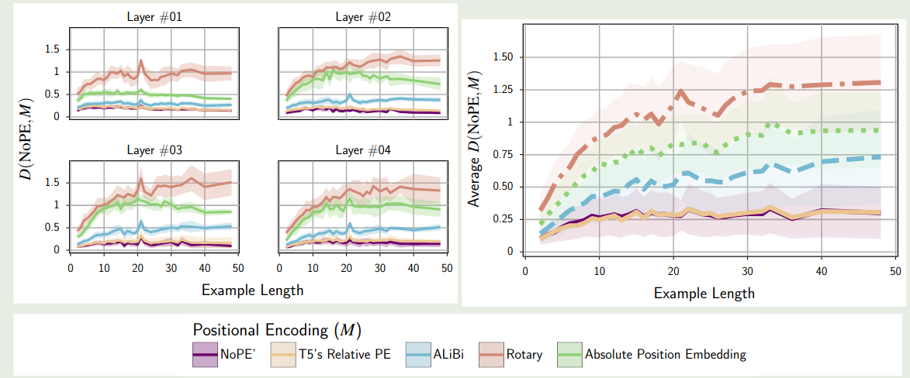
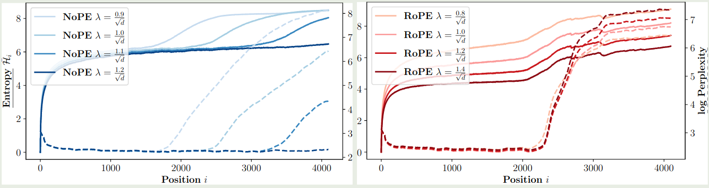

## Introduction

【参考文献 1】中系统性对比了 [AliBi](https://maosong.website/p/notes-on-alibi/), [RoPE](https://maosong.website/p/notes-on-position-encoding/) , [T5](https://maosong.website/p/notes-on-t5/) 提出的 T5 bias 以及 [Transformer](Transformer.md) 提出的绝对位置编码 (APE).

作者发现，常用的方法在 length generalization 上表现并不是最好的，而 NoPE 不需要额外的计算开销反而效果最好。

【参考文献 2】 进一步探究了 NoPE 长度外推的泛化性。作者有三点发现：

1. NoPE 相比于 RoPE, 其长度外推泛化能力更强
2. 对于 NoPE 来说，模型会在还没有到达预训练上下文长度之前，表现就出现下降的情况
3. 通过调整 softmax 的温度超参数，我们可以提高 NoPE 的长度外推泛化性能力。

## Method

【参考文献 1】对比了不同 position encoding 的相似度，结果如下图所示

实验结果表明，NoPE 与 [T5](https://maosong.website/p/notes-on-t5/) 提出的 T5 bias 最相似。

作者在理论上推导出了 NoPE 的两个性质：

**Theorem 1 (Absolute Encoding)**
Let $x$ be an input sequence of length $T + 1$ to the model.  Then, the first layer of $f_θ$ can recover absolute positions $[1, . . . , T + 1]$ in the hidden state $H^{(1)}$. That is, there exist $W_Q, W_K , W_V , W_O, W_1$, and $W_2$ such that the self-attention and  feedforward operations in the first layer compute absolute positions and write it to the next  hidden state.

**Theorem 2 (Relative Encoding)**
Suppose that the hidden state $H^{(1)}$ contains absolute  positional information, as stated in Theorem 1, and assume that it is not overwritten by any  subsequent layers. Then, the self-attention in all subsequent layers can implement a relative  positional encoding: there exists a parameterization of fθ such that, for $\ell ≥ 2$, the attention dot  product between query $q_n$ and key $k_m$ at positions n and m can be expressed as:

$$
\langle q_n, k_m\rangle = f_{cnt}(q, k) + f_{rel}(n − m)
$$  

where $f_{cnt}$ is a function of their content, and $f_{rel}$ is a function of their relative distance.

【参考文献 2】探究了 softmax 中 normalization factor 对模型表现的影响，作者定义 attention 为

$$
\mathrm{Attn}(q,k,v) = \mathrm{softmax}\left(\lambda q^Tk\right)v
$$

实验结果如下图所示

结果说明，通过调整 $\lambda$ 我们可以有效提高 NoPE 的上下文扩展泛化能力

## Conclusion

NoPE 说明在 transformer 中我们可以不需要加入位置编码模块，这两篇论文均验证了 NoPE 的有效性。

## References

- [The Impact of Positional Encoding on Length Generalization in Transformers](https://openreview.net/forum?id=Drrl2gcjzl)
- [Length Generalization of Causal Transformers without Position Encoding](https://aclanthology.org/2024.findings-acl.834)
