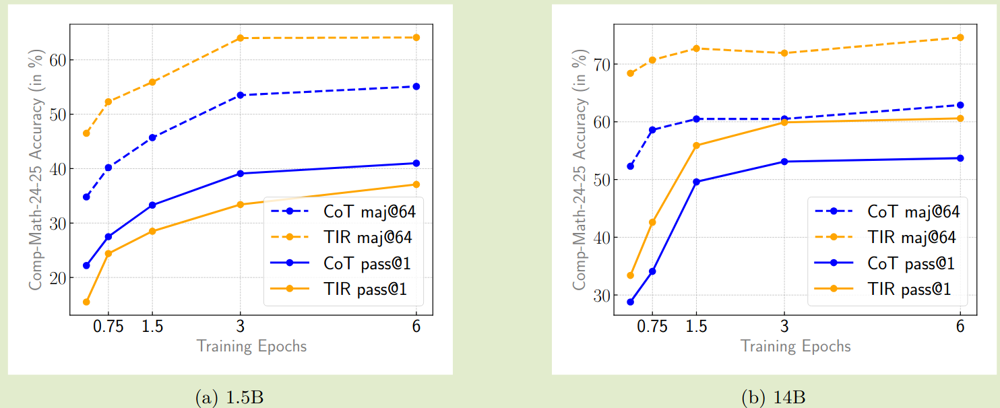

NVIDIA 在 AIMO-2 比赛中的 winning solution.

## Introduction

AIMO 是一个专门针对 AI 模型的数学奥林匹克竞赛，参赛选手需要训练模型在有限的计算资源下解决 50 个高难度数学问题。

NVIDIA 主要进行了三点改进：

1. 构建了包含 540K 高质量的数学推理数据集以及 3.2M long reasoning solutions
2. 构建了一个集成 code execution 的方法来合成 1.7M TIR solutions
3. 构建了一个 pipeline 来训练模来从多个 candidates 中选出最好的答案

最终，NVIDIA 的方案解决了 34 个数学问题。

## Methods

### Data Preparation

首先作者从 AoPS 上收集得到大量数学问题，然后剔除掉初中级别的数学题目，接下来，作者构建了一个 pipeline 用于提取问题以及对应的答案，这里作者使用了 Qwen2.5-32B-Instruct 模型来完成这个任务，处理流程有：

1. 使用 LLM 来识别并提取所有的问题
2. 对问题进行分类：proof, MCQ, binary, valid
3. transformation: 将证明题展缓为 answer based question
4. answer extraction: 提取最终答案
5. decontamination: 移除与 math benchmark 高度相似的数据

经过数据处理之后，每个阶段的数据量如下表所示

| Pipeline Stage             | Data Size |
| -------------------------- | --------- |
| Original forum discussions | 620K      |
| Extracted problems         | 580K      |
| Removing “bad” problems    | 550K      |
| Benchmark decontamination  | 540K      |

最终数据集的统计如下

| Subset                | Size |
| --------------------- | ---- |
| Converted proofs      | 260K |
| With extracted answer | 190K |
| No extracted answer   | 90K  |
| Total                 | 540K |

接下来，作者基于 AIME 和 HMMT 构建了一个验证集，验证集包含了 256 个问题。

为了生成 cot solution, 作者首先使用 `Qwen2.5-72B-Math-Instruct` 来给数据进行难度分级，接下来作者使用 `DeepSeek-R1` 和 `QwQ-32B` 来生成 32 个 candidate solution. 最后作者使用 `Qwen2.5-32B-Instruct` 来 judge 生成的答案，最终的数据汇总如下所示

| Model       | all  | after filtering |
| ----------- | ---- | --------------- |
| QwQ-32B     | 1.0M | 0.5M            |
| DeepSeek-R1 | 4.2M | 2.7M            |
| Total       | 5.2M | 3.2M            |

### Tool Integrated Reasoning

作者认为对于 instruction model, 我们可以在 long reasoning 过程中保持其 instruction following 能力，然后作者使用 `LIMO-Qwen-32B` 来生成带有 python code execution 的 solution, 最终得到了 1.2M solution.

然而，作者发现合成的数据里有一部分工具调用是无效的，为了过滤数据，作者使用了 `Qwen2.5-32B-Instruct` 来对 code block 进行分类，分类使用了两个标准：

1. novel calculation/verification: 代码执行是否产生了比较好的结果或者简化了之前的步骤
2. significant/modrate/trivial. 代码是否完成了 solution 比较重要的一部分

作者还移除了结果不对的数据以及包含 2 个以上 code block 的数据，经过这个过程后，得到了 `stage-0 TIR data`, 包含 15k samples.

然后，作者使用 `QwQ-32B` 来在 `stage-0 TIR data` 上微调 7 个 epoch, 再生成 700K 样本并过滤得到 260K 样本。

作者最后使用了一个 14B 的模型重复上面的过程，这个模型训练使用了 `QwQ-32B` 生成的答案。

最终，TIR 数据集包含了 1.7M 样本。为了控制模型工具调用的次数，作者还在 prompt 里说明了可用的工具调用次数

### Generative Solution Selection

在本节中，作者构建了一个从 candidate solution summaries 中挑选最优答案的方法。作者发现从多个 solution 中进行对比然后挑选出最优答案比给单独答案进行打分效果更好。

首先，作者使用 `Qwen-2.5-32B-Instruct` 来给 solution 生成 summary, summary 的 max length 为 2028 token. 如果 Summary 的答案和预测答案不一致，样本会被丢掉。

为了实现 GenSelect inference, 作者首先随机采样 多个 candidate solution summary 组成 sample group, 然后使用 `QwQ-32B` 来进行挑选过滤得到 565K 数据集

为了进一步减少计算消耗，作者使用 summary 来进行训练，结果发现模型的准确率下降不到 $1-2\%$. 作者通过实验发现 GenSelect 可以有效提高模型 CoT 以及 TIR 场景下的准确率。

## Experiments

作者基于 Qwen-2.5-Base 系列模型进行训练，包括 1.5B, 7B, 14B 和 32B.

为了有效提高模型上下文，作者将 RoPE 的 base frequency 提高到 500K.

训练使用了三个任务：

1. COT solution generation
2. TIR solution generation
3. GenSelect

最终数据集包含了 5.5M 样本（3.2M CoT,  1.7M TIR, 566K GenSelect)

使用了 NeMo-Aligner 来加速训练，使用 model merging 来得到更好的效果。

试验结果如下图所示

作者还构建了一个更难问题的数据集，包含了 2.2M 样本，作者使用了 32B 的模型进行训练，结果如下图所示

| Model    | First SFT | Second SFT |
| -------- | --------- | ---------- |
| 1.5B CoT | 55.1      | 58.2       |
| 1.5B TIR | 64.1      | 64.5       |
| 7B CoT   | 61.3      | 62.5       |
| 7B TIR   | 71.1      | 70.7       |
| 14B CoT  | 62.9      | 65.2       |
| 14B TIR  | 74.6      | 73.4       |

## Submission

针对 Kaggle 竞赛，作者进一步进行了改进

首先，作者使用 `Qwen2.5-14B-Base` 在 2.2M CoT solutions 上进行训练 8 epoch. 然后作者在 15K Stage-0 TIR samples 上轻量化微调，最后作者对 CoT checkpoint 以及 TIR checkpoint 进行 model merging. 作者并没有使用 GenSelect.

|Model|maj@16|pass@16|length|code|
|---|---|---|---|---|
|CoT|62.9|76.2|11203|-|
|TIR|66.8|80.1|15834|2.73|
|CoT_0.3 + TIR_0.7|69.1|81.3|12489|0.85|

在推理上，作者使用了 TensorRT-LLM 将模型转换为 TensorRT 格式

作者还使用了 ReDrafter 来实现 speculative decoding.

## Conclusion

作者在本文中构建了一个大规模的数学推理数据集 OpenMathReasoning, 包含了 540K 问题，3.2M long CoT solutions, 1.7M TIR solutiosn 以及 566K GenSelect traces.

作者还训练得到了 OpenMath-Nemotron 模型系列，该模型系列在 AIMO-2 上取得了 SOTA 的成绩。

## References

- [AIMO-2 winning solution: building state-of-the-art mathematical reasoning models with OpenMathReasoning dataset](http://arxiv.org/abs/2504.16891)
- [AI Mathematical Olympiad - Progress Prize 2](https://www.kaggle.com/competitions/ai-mathematical-olympiad-progress-prize-2)
