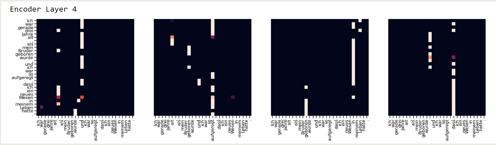
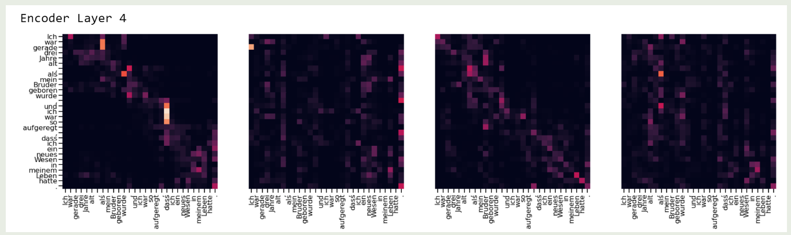

作者提出了 QK norm, 一个解决 softmax 注意力权重不稳定的 scaling 算法。

## Problem Definition

Softmax 可以用于将 logits 转化为一个概率分布，但是 softmax 问题是输入的微小差别会对输出产生巨大影响，甚至会 mask 掉其他信号。因此我们需要选取合适的缩放因子，来解决 softmax 的极端值问题。SDPA 的可视化结果如下图所示

## Method

作者首先提出了 QKNorm, 其使用了一个可学习的 scaling 参数来控制 $QK^T$ 的范围，进而让 attention 的 pattern 更加分散。

作者首先回顾了以下已有的进展，主要是三点：

1. FixNorm: 将 word embedding 限制为单位长度
2. PerNorm: 使用 Pre-norm 替换 Post-norm
3. ScaleNorm: 使用 $\ell_2$ normalization 替换 LayerNorm, 并乘以一个可学习的 scaling 参数。

作者基于这三点进行了改进，改进后的 attention 定义如下

$$
\mathrm{softmax}\left(g\cdot \hat{Q}\hat{K}^T\right)V
$$

其中,

$$
\hat{Q} = [\frac{q_1}{\|q_1\|_2},\dots,\frac{q_m}{\|q_m\|_2}], \hat{K} = [\frac{k_1}{\|k_1\|_2},\dots,\frac{k_n}{\|k_n\|_2}]
$$

是对原始的 $Q, K$ 按列进行 $\ell_2$ normalization 得到的结果， $g$ 是一个可学习的参数，其初始化值为

$$
g_0 = \log_2(L^2-L)
$$

这里 $L$ 是训练数据 $97.5$ 分位。

使用这种动态缩放之后，attention 的分布变得更加分散了，结果如下图所示：

## References

- [Query-Key Normalization for Transformers](https://aclanthology.org/2020.findings-emnlp.379.pdf)
