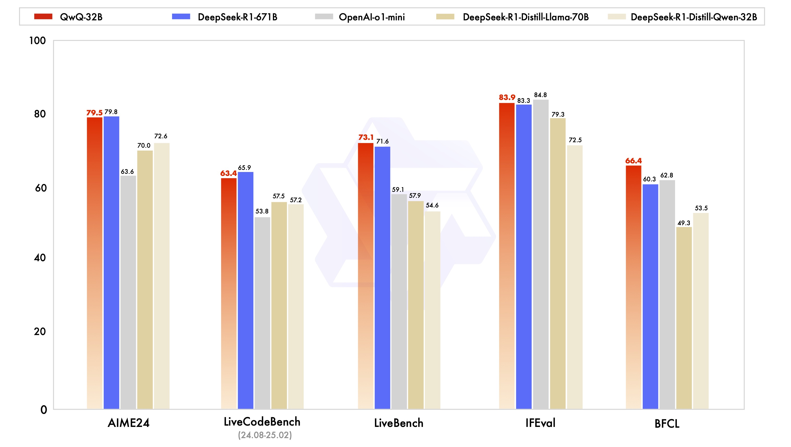

# Introduction

通义团队在3月6号发布了QwQ-32B，一个基于RL的，32B参数的reasoning model，QwQ-32B的表现可以与DeepSeek-R1相比

# 模型架构

QwQ-32B基于Qwen2.5-32B开发。主要通过基于outcome-based rewards的RL进行训练。训练过程包括两个stage

1. Stage 1：本阶段在math和coding domain上进行RL的训练，作者使用了一个verifier来保证最终数学问题结果的正确性，使用了一个code execution server来保证最终生成代码的正确性。
2. Stage 2：本阶段在通用领域上进行RL的训练。模型基于general reward model和一些rule-based verifier进行训练。应该是类似DeepSeek-R1的规则。

# 实验结果

实验结果如下图所示

# Reference

- [blog](https://qwenlm.github.io/blog/qwq-32b/)
- [demo](https://chat.qwen.ai/?models=Qwen2.5-Plus)
