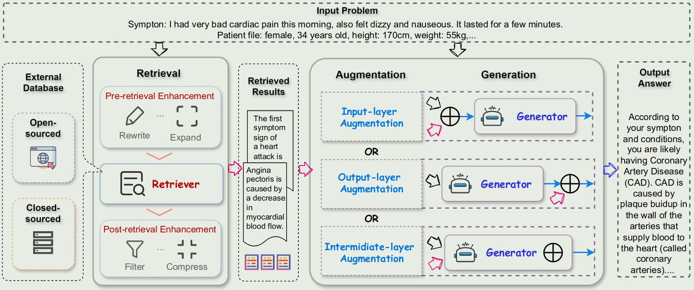
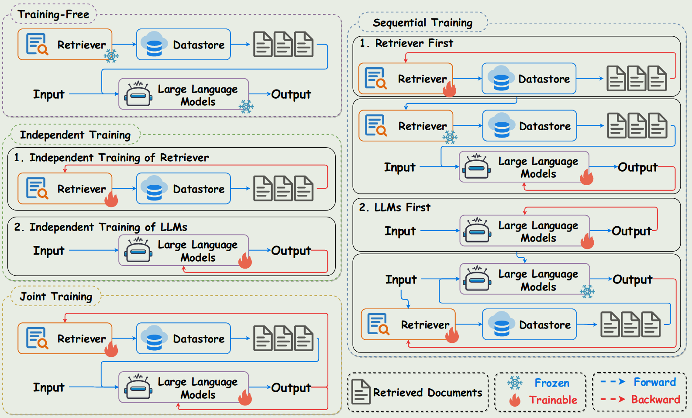

# Problems of LLM

- Out of date knowledge: the model cannot gain knowledge after training
- Humiliation: the model may generate nonsense output
- Specific domain: the generalized model is difficult to adapt to specific domain
- Enthetic problems: the model may encounter

# Fine-tuning

Fine-tuning is used to improve performance of foundation model on specific tasks with the help with some supervised data

Fine-tuning methods can be classified into:

1. Based on range of updated parameters:
    - Full Model fine-tuning: update the parameters of the whole model
    - Partial fine-tuning: freeze the top layer; freeze the bottom layer
2. Based on special technology:
    - Adapter tuning
    - LoRA
    - Continual Learning fine-tuning
3. Based on input:
    - Instruction tuning
4. Based on objective
    - Multi-task fine-tuning

Problems of fine-tuning:

1. Requires task-specific labeled data, may cause overfitting and catastrophic forgetting。
2. The generalization ability is limited, and fine-tuning are required when adapting to new tasks
3. The performance may be destroyed after fine-tuning, for example, safety.

# RAG

RAG consists of three major processes of *retrieval*, *augmentation*, and *generation*. The framework of RAG in LLM can be described as follows:

## Retrieval

### Retriever type

Retrieval methods can be generally categorized into two types: sparse and dense, based on the information encoding methods.

1. sparse retrieval usually relies on inverted index matching along with the raw data input, for example TF-IDF and BM25. The limitation of sparse retrieval in RAG is
   1. its no-training nature, which makes the retrieval performance heavily rely on the quality of database construction and query generation.
   2. Moreover, such fixed term-based methods only support similarity retrieval, while cannot be adapted for other retrieval considerations demanding in LLM applications, such as the diversity
2. dense retrieval, on the contrary, embeds the query and documents into continuous vector space with certain criteria, for example, semantic similarity. Examples include BERT, Dense Passage Retriever (DPR), etc.

### Retrieval Granularity

Retrieval granularity denotes the retrieval unit in which the corpus is indexed, e.g., document, passage, token, or other levels like entity.

1. Chunk retrieval.
2. Token retrieval.
3. Entity retrieval.

### Pre-retrieval and Post-retrieval Enhancement

Pre-retrieval and post retrieval strategies can be added to improve the quality of the retriever.

Pre-retrieval methods include:

1. Query rewrite. This method aims to close the gaps between the input text and the needed knowledge in retrieval, to reformulate the original question into a more conducive version to retrieve.
2. Query augmentation. This method aims to combine the original query and the preliminary generated outputs as a new query, which is further used to retrieve relevant information from the external database

Post-retrieval enhancement denotes the procedure to process the extracted top-k documents from the retriever before feeding them to the generator for the sake of better alignment between the retrieval and generation stages.

### Database

1. Wikipedia
2. Domain specific database
3. search engine

## Generation

1. Parameter-Accessible Generators (White-box). Allow parameter optimization.
2. Parameter-Inaccessible Generators (Black-box). Focus more on retrieval and augmentation processes, trying to enhance the generator by augmenting the input with better knowledge, guidances or examples for the generation.

## Augmentation

1. Input layer integration
2. Output layer integration
3. Intermediate layer integration

## Retrieval Frequency

If it is necessary to retrieve? Self-RAG

retrieval frequency:

1. One-time.
2. Every-n-token
3. Every token

# RAG training

1. Training Free
2. Independent training
3. Sequential training
4. Joint training

# Advance RAG

# Module RAG

# Applications

1. NLP applications
   - QA systems: REALM
   - Chatbot:
   - Fact Verification: self-RAG
2. Downstream tasks:
   - Recommendations
   - Software engineering
3. Domain-specific Applications
   - AI for science
   - Finance: ChatDOC

## Limitations of RAG

problems of RAG

1. The quality of retrieval
    - The retrieved text cannot be aligned with the queried text.
    - The queried text are not retrieved all.
    - Redundancy or out-dated data may cause inaccuracy.
2. the quality of response generation
    - Model Humiliation
    - Irrelevance
    - Organize the output to make it reasonable
    - Depends on the external information

Futures:

1. Trustworthy RA-LLMs
2. Multi-lingual RA-LLMs
3. Multi-modal RA-LLMs
4. Quality of External Knowledge

# Other technologies

1. Query transformations
2. Sentence window retrieval
3. Fusion retrieval/ hybrid search
4. multi-document agents

# Reference

- [A Survey on RAG Meets LLMs: Towards Retrieval-Augmented Large Language Models](https://www.semanticscholar.org/paper/A-Survey-on-RAG-Meets-LLMs%3A-Towards-Large-Language-Ding-Fan/0576e9ab604ba4bf20cd5947f3c4a2c609ac2705)
