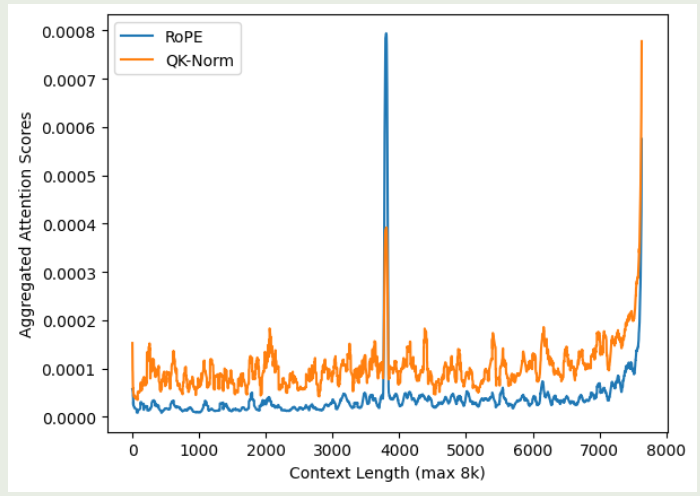
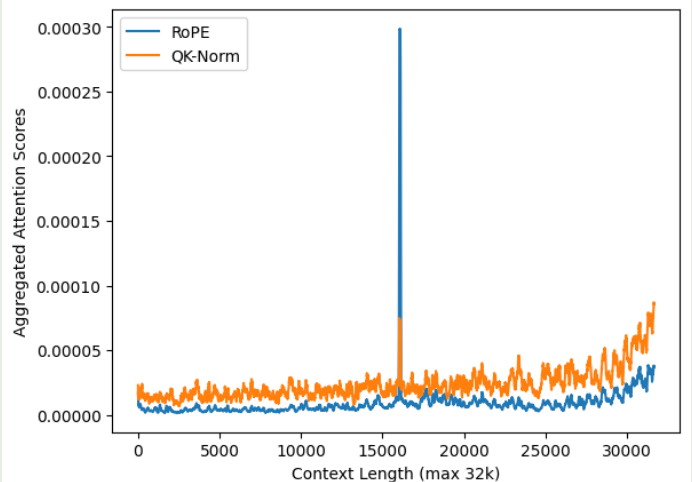
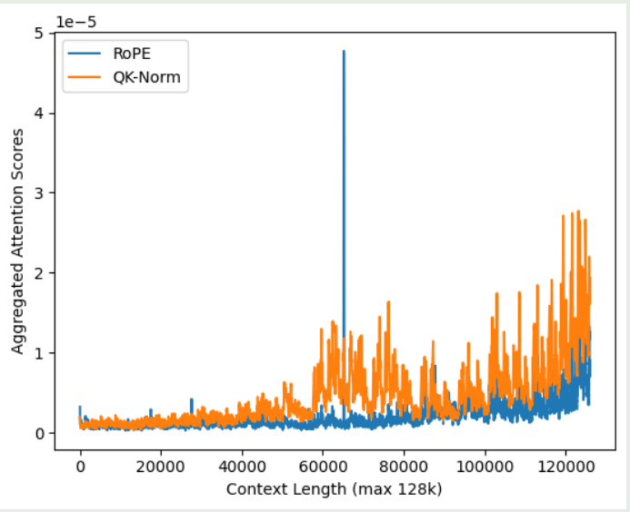

作者系统性分析了已有的 attention 机制，然后作者提出了混合的 attention 机制，来提高模型在长上下文的表现以及维持模型在短上下文场景下的表现。

## Introduction

作者首先强调了提升 LLM 上下文长度面临的问题：

1. 如何有效处理长上下文输入
2. 如何训练长上下文 LLM
3. 如何降低长上下文 LLM 在 inference 时的 latency 以及 memory usage

对于建模长上下文输入，我们可以从 attention 机制或者位置编码来入手。前者类似的工作有 Landmark Attention 和 Focused Transformer, 但是这些方法的问题在于训练不稳定。 [QK norm](https://maosong.website/p/notes-on-qk-norm/) 可以比较好解决 softmax 分布过于极端的问题，但是其问题在于训练时的数值不稳定性，并且可能会影响模型的长上下文能力。

另一方面，对于位置编码，已有的工作如 APE, AliBi, [RoPE](https://maosong.website/p/notes-on-position-encoding/) 等都可以提供位置信息。但是，这些方法很有可能回影响模型最终的 attention score 分布。另外，NoPE 探究了移除 position encoding 的可能性。

还有一些工作目的是降低 softmax attention 的时间复杂度和空间复杂度。比如 sliding window attention, sparse attention, [attention sink](https://maosong.website/p/notes-on-streamingllm/) 等都可以降低整体的时间/空间复杂度。但是这些方法最终的表现都有所下降。

## Observation

作者首先对比了以下不同方法对模型长上下文能力的影响。

作者训练了一个 8B 的模型，然后分别对比了三种方法：

1. RoPE: base frequency 设置为 10,000, SFT 阶段扩展到 2M
2. QK-Norm: 在 RoPE 的基础上，对 query 和 key 先进行 normalization 再进行 RoPE
3. NoPE: 移除 attention 中的位置编码信息

作者分别评估了三种方法的表现，实验结果如下表

| Model   | Val Loss | MMLU  | HellaSwag | CommonsenseQA | ARC-E | ARC-C | Needles 65k |
| ------- | -------- | ----- | --------- | ------------- | ----- | ----- | ----------- |
| RoPE    | 1.52     | 48.55 | 73.74     | 68.30         | 81.05 | 39.13 | 9.82        |
| QK-Norm | 1.53     | 48.21 | 73.68     | 68.23         | 80.54 | 38.98 | 7.93        |
| NoPE    | 1.58     | 47.61 | 72.16     | 66.42         | 76.94 | 37.12 | 9.03        |

实验结果显示，对于通用任务，RoPE 和 QK-Norm 的表现差不多，而 NoPE 的表现较差。对于长上下文任务，QK-Norm 的表现最差。

接下来，作者分析了三种方法的 attention 分布情况。作者将上下文分为四个 segments：

- begin: 开始的 10 个 token
- needle: 与 needle 相关的 tokens
- context: 通用的上下文 token
- qc: question/completion token, 语文题答案相关的 token

作者将 needle 放置在 50% 深度的位置。评测的实验结果如下

|Context Length| Model Variants| begin| needle |context |qc |
|---|---|---|---|---|---|
|8k | RoPE| 0.3863 |0.0328| 0.3809 |0.2000  |
||QK-Norm |0.0242 |0.0173 |0.8020| 0.1565|
||NoPE |0.3058| 0.0454 |0.4501| 0.1987 |
|32k  |RoPE| 0.3541 |0.0201 |0.4343 |0.1915  |
||QK-Norm |0.0064 |0.0056 |0.8517 |0.1364|
||NoPE| 0.2807 |0.0325 |0.4981| 0.1886 |
|128k|  RoPE |0.3463| 0.0010| 0.4751 |0.1776  |
||QK-Norm| 0.0010 |0.0004 |0.8993| 0.0994  |
||NoPE |0.0846| 0.0073 |0.8156 |0.0925|

实验结果显示：

1. NoPE 是最关注 needle token 信息的，RoPE 次之，QK-Norm 最差
2. QK-Norm 更关注上下文信息，对其他的信息关注度较少

作者发现 QK-Norm 对初始的 token 信息关注度较少，作者认为这是因为 normalization 会让模型更关注邻近的 token 信息。为了验证这个观点，作者在不同的上下文长度下，分别计算了不同方法的 attention 分布情况，为了避免噪声，作者将开始的 10 个 token 以及最后的 $3\%$ token 排除在外，实验结果如下图所示

实验结果说明，相比于 softmax attention, QK-Norm 的 attention score 分布更平滑，其对于 need  token 的注意力不如 RoPE, 这也说明了为什么 QK-Norm 的长上下文能力比较差。并且，QK-Norm 的 recency bias 更严重。

作者通过计算 RoPE 和 QK-Norm 的 attention distribution 的 entropy 来进一步说明这一点，结果如下表所示

| Model   | 8k    | 32k   | 128k  |
| ------- | ----- | ----- | ----- |
| RoPE    | 6.02  | 6.95  | 7.62  |
| QK-Norm | 10.71 | 12.46 | 14.14 |

结果显示 QK-Norm 的熵更高，这意味着 QK-Norm 的 attention score 分布更分散，也就证明了 Qk-Norm retrieval 能力比较差。

## Method

考虑到 NoPE 和 RopE 各自的优点，作者提出了一个混合架构，来结合 NoPE 与 RoPE. 具体做法就是 NoPE layer 和 RoPE layer 交替进行。作者将这个模型架构记为 RNoPE.

RNoPE 不同 layer 与不同 base frequency 产生的 attention score 分布如下

| Model         | NoPE Layers - begin | NoPE Layers - needle | NoPE Layers - context | NoPE Layers - qc | RoPE Layers - begin | RoPE Layers - needle | RoPE Layers - context | RoPE Layers - qc | needles-128k |
|---------------|---------------------|----------------------|-----------------------|------------------|---------------------|----------------------|-----------------------|------------------|--------------|
| RoPE          | -                   | -                    | -                     | -                | 0.3541              | 0.0201               | 0.4343                | 0.1915           | 7.395        |
| RNoPE-10k     | 0.3275              | 0.0765               | 0.5672                | 0.0287           | 0.0049              | 0.0004               | 0.6805                | 0.3142           | 8.036        |
| RNoPE-100k    | 0.3263              | 0.0778               | 0.5633                | 0.0327           | 0.0241              | 0.0005               | 0.6782                | 0.2972           | 7.461        |
| RNoPE-2M      | 0.3250              | 0.0712               | 0.5735                | 0.0303           | 0.1111              | 0.0046               | 0.6233                | 0.2611           | 7.022        |
| RNoPE-4M      | 0.3486              | 0.0369               | 0.5981                | 0.0165           | 0.0960              | 0.0039               | 0.6774                | 0.2227           | 6.203        |
| RNoPE-10k-swa | 0.3303              | 0.0742               | 0.5634                | 0.0321           | -                   | -                    | -                     | -                | 9.562        |

实验结果显示，在 RNoPE 架构中，

1. 提升 base frequency 带来的增益逐渐递减
2. NoPE layer 的 retrieval 能力比较强，表现在 attention sink 现象以及对于 needle token 的 spike. 但是其 recency bias 比较弱
3. RoPE 的 retrieval 能力比较弱，但是其 attention sink 现象比较小
4. 当 base frequency 增加止呕，RoPE 的 recency bias 会降低，表现在 qc token 的权重降低

作者发现，RoPE 的 receptive field 会影响 NoPE layer 的 retrieval 能力。作者总结得到两个 insight

1. NoPE layer 对于 retrieval 任务比较擅长，而 RoPE layer 对于处理 local Information 比较擅长
2. 限制 RoPE 的 receptive field 可以保证 NoPE layer 的 retrieval 能力

基于这两个 insight, 作者构建了 RNoPE-SWA 架构，RNoPE-SWA 相比于 RNoPE, 将 full attention 变成了 sliding window attention, 来避免 RoPE layer 对下游的 NoPE layer 产生影响。

最终，作者基于 Command R+ 构建了模型，作者去除了 QK-Norm, 对于 NoPE layer, 作者使用了 full attention, 对于 RoPE layer, 作者使用了 window size 为 4096 的 sliding window attention. 作者通过实验验证了 NoPE layer 和 RoPElayer 的比例，实验结果发现 $1:3$ 的比例是最优的。最终每 4 个 layer 为一组，前三组为 SWA, 最后一层为 full attention.

最终，在通用任务上评测的结果如下

| Model     | MMLU | HellaSwag | ARC-E | ARC-C | SATEn | SATMath | GSM8K | Winogrande | MBPP |
| --------- | ---- | --------- | ----- | ----- | ----- | ------- | ----- | ---------- | ---- |
| Baseline  | 57.5 | 75.8      | 84.6  | 48.5  | 70.0  | 30.9    | 40.9  | 68.5       | 39.1 |
| RNope-SWA | 59.5 | 76.2      | 82.5  | 48.8  | 71.9  | 30.5    | 42.7  | 69.5       | 39.3 |

在 Ruler retrieval 上评测的结果如下

| Model     | 8k   | 16k  | 32k  | 64k  | 128k | 256k |
| --------- | ---- | ---- | ---- | ---- | ---- | ---- |
| Baseline  | 96.6 | 94.4 | 95.1 | 89.1 | 83.0 | 57.1 |
| RNope-SWA | 96.1 | 96.1 | 94.9 | 92.0 | 90.0 | 74.8 |

在 Ruler QA 上评测的结果如下

| Model     | 8k   | 16k  | 32k  | 64k  | 128k | 256k |
| --------- | ---- | ---- | ---- | ---- | ---- | ---- |
| Baseline  | 53.5 | 50.0 | 52.5 | 45.5 | 36.0 | 30.0 |
| RNope-SWA | 55.5 | 52.5 | 55.5 | 49.0 | 46.0 | 42.5 |

实验结果说明，模型在通用任务任务上与 baseline 模型表现差不多，且长上下文能力更强

## Conclusion

作者提出了 RNope-SWA, 一个混合 NoPE, RoPE position embedding 和 sliding window attention 的 attention 机制。RNope-SWA 可以在保持模型表现的同时提高计算效率和降低 KV cache 占用。

尽管本文和已有的工作如 YoCo, Jamba-1.5 和 MiniMax-01 均证明了混合 attention 架构的有效性。但是，目前对于其工作机制尚缺乏一个比较系统性的理解。作者认为这是一个需要探究的方向。另外，作者还认为如何更好的汇总上下文信息与位置信息也是一个可以探究的方向。

## References

- [arxiv](https://arxiv.org/pdf/2501.18795)
