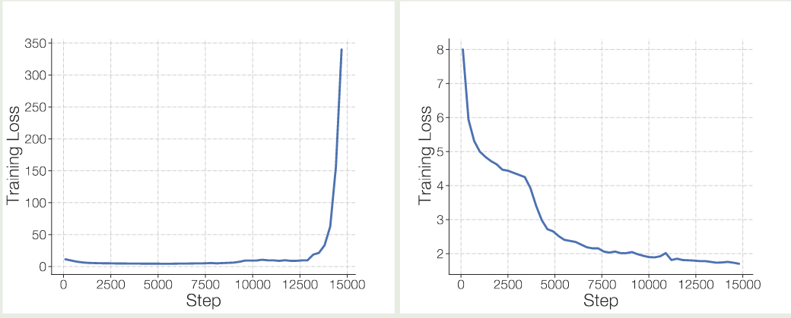
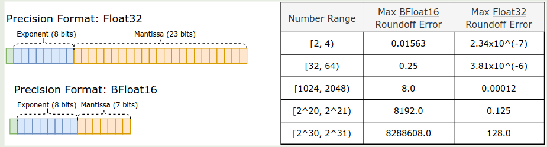
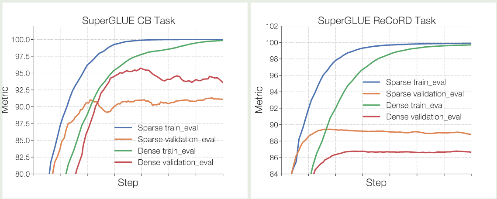
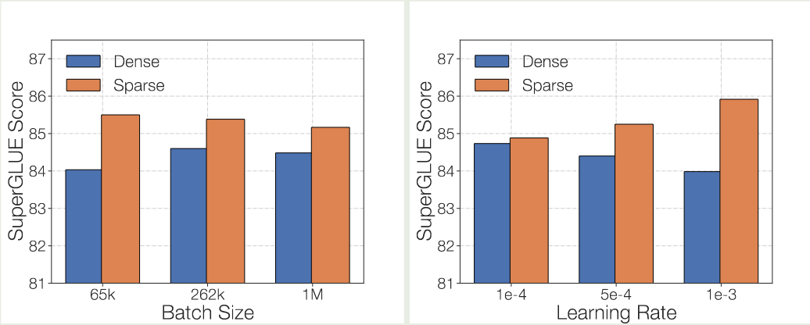

## Introduction

已有的工作如 [GShard](https://maosong.website/p/GShard.md) 和 [Switch Transformer](https://maosong.website/p/switch-transformer/) 均验证了 MoE 模型的有效性，但是他们的问题在于训练不稳定。

因此，在本文中，作者就提出了 ST-MoE 来解决这个问题。作者的主要贡献如下：

1. 探究了如何平衡模型的表现与训练稳定性
2. 提出了 router Z-loss 来解决训练的不稳定性
3. 探究了如何设定 MoE 模型 fine tuning 时的超参数
4. 对 MoE 的性质进行了分析

## Training Stability

作者发现，直接训练 MoE 模型会面临训练不稳定性的问题，实验结果如下图所示

可以看到不同的实验，一次训练崩溃，一次训练正常。

作者接下来探究了如何提高训练的稳定性，作者有三点发现：

1. 大多数方法都可以提高训练稳定性，但是也会是的模型表现更差
2. router Z-loss 可以在不损失模型表现的情况下提高训练的稳定性
3. multiplicative components 如 RMSNorm 等可以提高模型表现，但是训练稳定性更差

作者构建了一个 baseline 的 MoE 模型，总专家个数为 $N=32$, 激活专家个数为 $K=2$, Transformer block 按照 4 个 block 为一组，每组里包含一个 MoE layer.  为了避免初始化带来的误差，作者使用 6 个随机数种子进行训练。

### Multiplicative Components

multiplicative components 指的是 GEGLU 和 RMSNorm 这些操作，其实验结果如下所示

| Method                       | Fraction Stable | Quality          |
| ---------------------------- | --------------- | ---------------- |
| Baseline                     | 4/6             | $-1.755 \pm0.02$ |
| Remove GEGLU                 | 3/3             | $-1.849 \pm0.02$ |
| Remove RMS Norm. Scale Param | 3/3             | $-2.020 \pm0.06$ |

结果发现，移除掉 multiplicative components 之后，模型训练变得稳定，但是效果也变差了。

### Adding Noise

接下来作者尝试了 [Switch Transformer](https://maosong.website/p/switch-transformer/) 中的 jitter noise 和 dropoout 方法，实验结果如下图所示

| Method                   | Fraction Stable | Quality           |
| ------------------------ | --------------- | ----------------- |
| Baseline                 | 4/6             | $-1.755 ± 0.02$   |
| Input jitter ($10^{-2}$) | 3/3             | $-1.777 \pm 0.03$ |
| Dropout (0.1)            | 3/3             | $-1.822 \pm0.11$  |

实验结果显示，加入噪声对模型的表现存在负面影响。

### Constraining Activations

作者接下来分析了以下 [Switch Transformer](https://maosong.website/p/switch-transformer/) 中 router 存在的问题，作者发现尽管在 router 中使用 `float32` 可以提高训练稳定性，但是这还不够，因此作者使用了如下的 router Z-loss:

$$
\mathcal{L}_z(x) = \frac1B\sum_{i=1}^B\left(\log\sum_{j=1}^N e^{x_j^{(i)}}\right)^2
$$

其中 $B, N$ 分别是 batch size 和专家个数，$x_j^{(i)}$ 代表了第 $j$ 个专家对 $i$ 个 token 的激活 logits. 通过增加这个 loss, 我们可以让 routing layer 的 logits 都在一个合理的范围内。

| Method                       | Fraction Stable | Quality ($\uparrow$) |     |
| ---------------------------- | --------------- | -------------------- | --- |
| Baseline                     | $4/6$           | $-1.755 \pm 0.02$    |     |
| Update clipping (clip = 0.1) | $3/3$           | $-4.206 \pm 0.17$    |     |
| Router Z-Loss                | $3/3$           | $-1.741 \pm 0.02$    |     |

可以看到，加入 router Z-loss 之后，模型的稳定性和表现都有了提升。

因此，在本文中，作者使用的损失函数为

$$
\mathcal{L} = \mathcal{L}_{CE} + \alpha \mathcal{L}_B + \beta \mathcal{L}_z
$$

其中 $\mathcal{L}_{CE}, \mathcal{L}_B$ 分别是 cross-entropy loss 和 Load Balancing loss, $\alpha,\beta$ 是对应 loss 的权重。

### Numerical Precision

接下来作者探究了数值精度对训练效率和稳定性的影响，作者发现使用低精度进行训练的优势有：

1. 通信开销更小
2. 计算消耗更小
3. 内存需求更小

但是低精度进行训练的问题是存在严重的 roundoff error, 其示意图如下所示

## Fine-tuning

作者在本节探究了如何 fine-tune 一个 MoE 模型。

作者首先通过实验给出了 MoE 模型容易过拟合的结论，实验结果如下图所示

可以看到，在两个人呢误伤，MoE 模型相比于 dense 模型都更容易过拟合。

接下来作者探究了超参数特别是 batch size 和 learning rate 对模型表现的影响，结果如下图所示

可以看到，与 dense 模型相反，MoE 模型需要更大的 batch size 以及更小的 learning rate.

## Design Sparse Models

首先作者分析了专家个数 $N$ 的设置，作者认为当专家个数超过 $256$ 之后，带来的收益就微乎其微了。并且，当专家个数增加之后，虽然算力没有变化，但是通信开销以及计算优化会变得更加困难。作者还认为，在 TPU 上，每个 core 应该进放置一个 expert

作者还对 capacity factor 进行了实验，实验结果显示，提升 capacity factor 可以提高模型的表现。但是同时也会带来计算开销，从而让模型训练更慢，实验结果如下图所示

| Model      | Train CF | Step Time (s) ($\downarrow$) |     |
| ---------- | -------- | ---------------------------- | --- |
| ST-MoE-L   | 1.25     | $2.397$                      |     |
| ST-MoE-L   | 2.0      | $2.447 (+7\%)$               |     |
| ST-MoE-32B | 1.25     | $4.244$                      |     |
| ST-MoE-32B | 2.0      | $4.819 (+14\%)$              |     |

最终结论如下：

> 1. 使用 top-2 routing, 即激活 $K=2$ 个专家，capacity factor 设置为 $1.25$, 每个 core 上最多放置一个专家
> 2. 在评估时可以动态调整 capacity factor

## Tracing Tokens through the Model

在这一节里，作者分析了 MoE 模型专家的性质。

首先，作者发现，每一层里，至少有一个专家对于 sentinel token 比较敏感。并且，encoder 里的专家 specialization 更强，比如某些专家会负责 punctuation, verbs, proper names 等

接下来，作者发现，专家的 specialization 在 decoder 里几乎没有，作者认为这是因为 target token distribution 不同导致的，即：

1. decoding 是只有一小部分 token 被一个专家处理
2. decoding 过程中大部分 token 都是 sentinel token

因此，每个 group 相比于 encoder 来说通常只 cover 一小部分的 semantic space

encoder 和 decoder 专家的 specialization 实验结果如下

|         | Layer 1 | Layer 2 | Layer 3 | Layer 4 | Layer 5 | Layer 6 | Uniform (32-experts) |
| ------- | ------- | ------- | ------- | ------- | ------- | ------- | -------------------- |
| Encoder | 2.2     | 1.8     | 1.6     | 1.7     | 1.7     | 1.2     | 3.5                  |
| Decoder | 3.4     | 3.4     | 3.4     | 3.4     | 3.4     | 3.4     | 3.5                  |

可以看到，decoder 的专家分布和均匀分布差不多，这说明 decoder 里的专家 specialization 更弱。

作者还探究了不同专家对于不同语言的敏感程度，结果发现，专家对于不同语言并没有出现明显的 specialization 现象，作者分析原因认为，输入一般只含有一种语言，因此各个专家均需要去处理对应语言的 token, 这就导致了专家对于不同语种的数据处理基本上没有太大差别。

## Conclusion

在本文中，作者提出了 ST-MoE 系列 MoE 大语言模型，作者通过实验优化了 MoE 模型训练的不稳定性问题。

## References

- [Arxiv](http://arxiv.org/abs/2202.08906)
