Hugging Face 在 2025 年 7 月 8 号发布了 SmolLM3, 一个 3B 的，128K 上下文，支持 6 种语言，支持 dual mode reasoning 的小语言模型。

## Pre-training

### Architecture

SmolLM3 是一个基于 transformer 的小语言模型，其模型架构与 SmolLM2 相似，SmolLM3 做了以下改进：

1. 使用 GQA 代替 multi-head attention. 作者通过消融实验发现 GQA 和 MHA 的效果差不多，并且还可以减少 KV cache 的 size
2. NoPE: 作者使用了NoPE, 来选择性（每 4 个 layer）移除 position embedding. 这个方法可以在不损害模型短文本能力的同时，提高模型长上下文的表现
3. Intra-Document Masking: 不同的文档之间使用 attention masking 隔开
4. Training stability: 与 olmo 2 一样，作者移除了 embedding layer 的 weight decay, 来提升训练的稳定性。

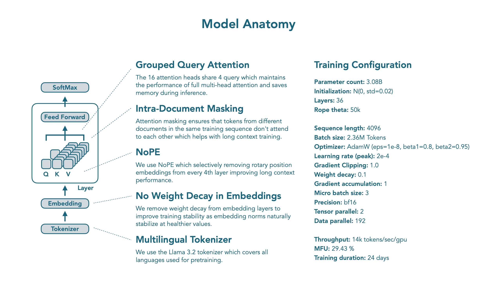

### Data

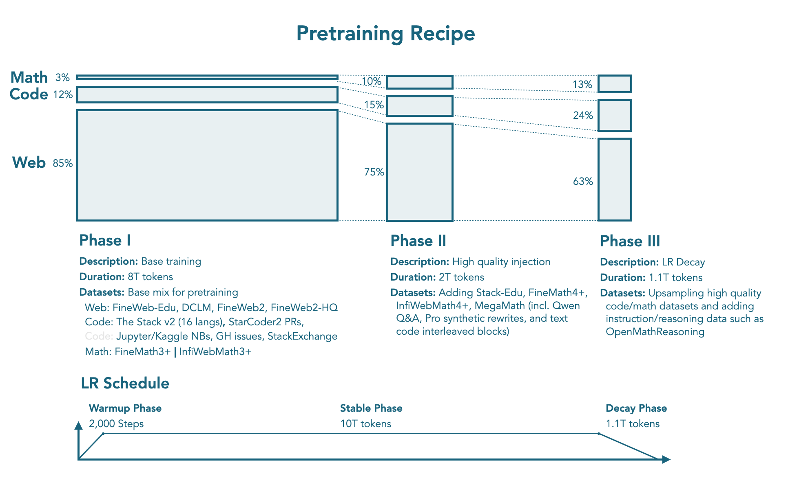

与 SmolLM2 一样，作者使用了**11.2T** token 进行训练，训练包括 3 个 stage。作者针对数据混合策略进行了消融实验，实验配置如下：

| Stage       | Stable phase      | Stable phase      | Decay phase       |
| --------- | ------------ | ----------- | ------------ |
| Description | Base training       | High quality injection         | LR Decay          |
| Tokens      | 8T        | 2T     | 1.1T              |
| Web         | 85%       | 75%    | 63%               |
| Code        | 12%       | 15%    | 24%               |
| Math        | 3%        | 10%    | 13%               |
| datasets    | **web**: FineWeb-Edu, DCLM, FineWeb2, Fineweb2-HQ **code**: The Stack v2, StarCoder2 PRS, Jupyter and Kaggle notebooks, Github issues, StackExchange **math**: FineMath3, InfiWebMath3+ | Adding Stack-Edu, FineMath4+, InfiWebMath4+,  MegaMath | upsampling of high-quality code data upsampling math data and introducing instruction and reasoning datasets such as OpenMathReasoning |

其中，Web data 包含 12% 的多语种数据。

### Training Recipe

训练过程中，作者使用了 2.36M tokens 的 batch size, 上下文长度为 4096. 优化器为 AdamW

作者使用了 nanotron 进行训练， datatrove 来处理数据， lighteval 来评估模型的表现。

模型在 384 张 H100 上训练了 24 天。分布式训练的配置如下

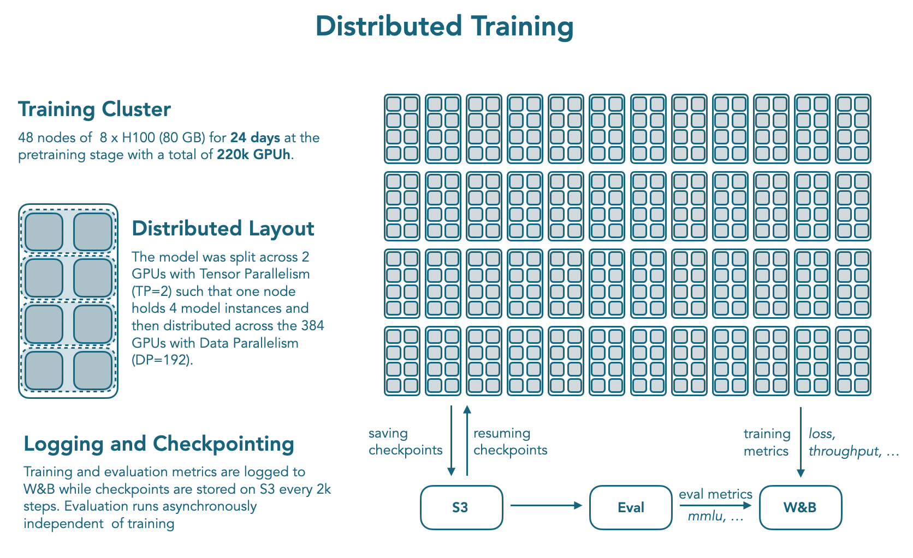

## Mid-training

Mid-training 的主要目标为扩展模型的上下文以及提升模型的 reasoning 能力。

### Long Context Extension

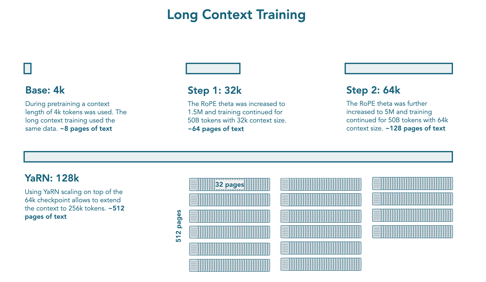

在预训练阶段结束之后，作者使用了额外的 **100B** tokens 来扩展模型的上下文。作者将扩展过程分为两个 stage:

1. Stage 1: 将模型的上下文从 4K 提升到 32K. 具体做法是将 RoPE 的 base frequency 提升到 1.5M
2. Stage 2: 将，模型的上下文从 32K 提升到 64K. 具体做法是将 RoPE 的 base frequency 提升到 5M

训练过程中，作者对 math, code 和 reasoning data 进行了上采样。作者发现，对长文本数据进行上采样并不会提高模型在 RULER 和 HELMET 上的表现。

> [!tip] Recall
> [Qwen2.5-1M](https://maosong.website/p/qwen2.5-1m-%E6%8A%80%E6%9C%AF%E6%8A%A5%E5%91%8A%E6%80%BB%E7%BB%93/) 里也分析了长文本数据的问题，也就是大部分长文本数据依然是局部相关性强，而全局相关性弱

与 [Qwen2.5](https://maosong.website/p/qwen2.5-%E6%8A%80%E6%9C%AF%E6%8A%A5%E5%91%8A%E6%80%BB%E7%BB%93/) 一样，作者还是用了 [YARN](https://maosong.website/p/yarn%E5%AD%A6%E4%B9%A0%E7%AC%94%E8%AE%B0/) 来在推理阶段进一步提高模型的上下文长度，作者发现模型可以处理 128K 上下文长度的文本。

### Reasoning Mid-training

扩展模型上下文长度之后，作者还额外增加了一个 mid-training stage 来提高模型的 reasoning 能力。这个阶段的目标在于提升模型的通用能力。作者希望模型不针对特定的 domain, 如 math 或者 code 等。

训练过程中，作者使用了 **35B** 的 token. 数据来源包括 Open-Thoughts3-1.2M 以及 NVIDIA 的 Llama-Nemetron-Post-Training-Dataset-v1.1. Reasoning trace 由 DeepSeek-R1 生成。作者使用了 ChatML 的格式，还使用了 Packing 来提升训练效率。训练持续了 4 个 epoch.

## Post-training

如何构建 dual instruction model 来同时支持 reasoning 和 non-reasoning 任务并没有一个共识，大部分模型的数据都是非公开的。因此，作者就构建了一个 training pipeline, 用于提升模型在两种模式下的能力。

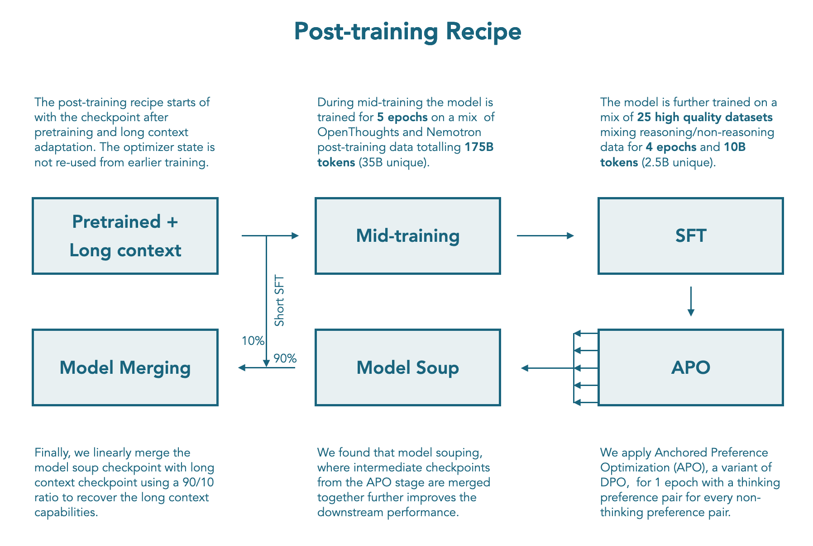

### Chat Template

作者首先构建了一个 chat template, 用于支持 reasoning 和 non-reasoning 两种模式。该 chat template 支持用户使用 `/think` 和 `/no_think` flag 来控制模型的思考模式。在 non-reasoning 模式下，作者还在模型输出中 prefill 了 `<think>\n\n</think>`, 这一点与 Qwen3 一致。

SmolLM3 还支持工具调用，其在 chat template 中加入了两种描述方式：XLM tools 和 Python tools.

SmolLM3 还在 system prompt 中加入了 metadata, 如知识的截止时间，当前的 reasoning mode 等。

### SFT

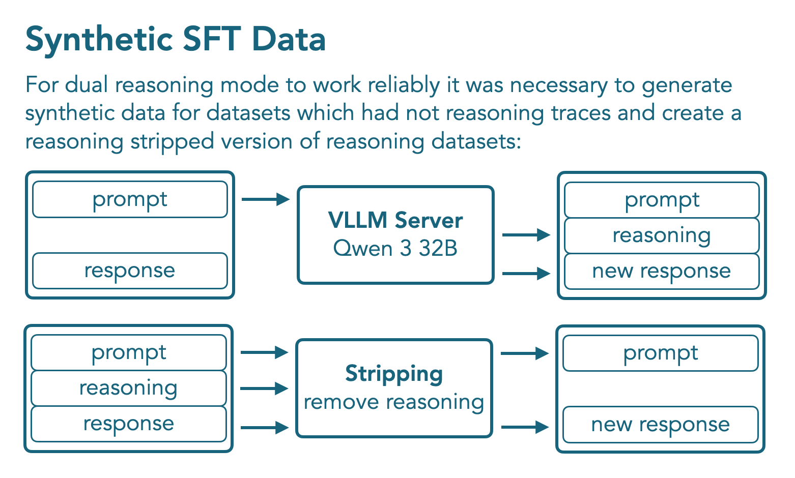

作者针对 math, code, general reasoning, instruction following, 以及 multilinguality 这几个领域来提升模型的表现。

作者首先使用 reasoning mode 的 Qwen3-32B 来合成数据，合成数据的过程如上图所示。

最终，SFT 阶段的数据包括 **1.8B** token, 其中 **1B** 为 non-reasoning mode 的 token, 覆盖 12 个数据集， **0.8B** 为 reasoning token, 覆盖 10 个数据集。作者训练了 4 个 epoch, 使用了 Packing 的技巧。

### APO

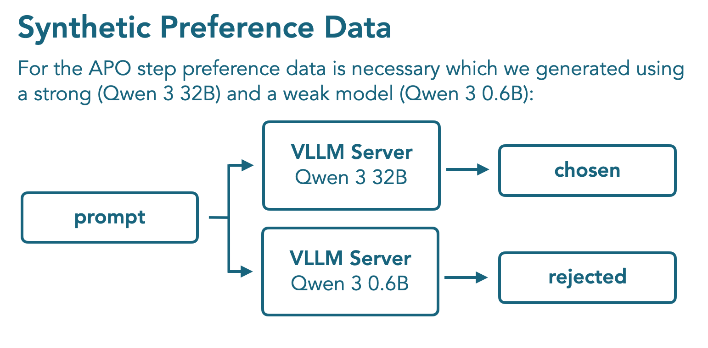

SFT 阶段之后，作者使用了 Tulu3 的 preference dataset 用于 non-reasoning mode 的训练，然后合成了一批数据用于 reasoning mode 的训练，这批合成数据使用 Qwen3 32B 和 Qwen3 0.6B 生成得到，具体做法就是 Qwen3 32B 输出的结果定义为正样本，Qwen3 0.6B 输出的结果定义为负样本。

作者使用了 APO 算法来进行训练，APO 是 DPO 的一个变体， DPO 的目标函数为

$$
\mathcal{L}_{DPO}(x,y_w,y_{l}; \theta) = -\log \sigma(r_\theta(x,y_w) - r_\theta(x, y_l))
$$

其中

$$
r_\theta(x,y) = \beta\log \frac{\pi_{\theta}(y\mid x)}{\pi_{ref}(y\mid x)}
$$

$\beta>0$ 是一个超参数。APO 的目标函数如下

$$
\mathcal{L}_{APO}(x,y_w,y_l;\theta) = -\sigma(r_\theta(x,y_w)) + \sigma(r_\theta(x,y_l))
$$

作者发现，模型的 reasoning 能力提升之后，其长上下文能力反而下降了。作者认为这是因为在 reasoning mid-training stage 的训练中，提升 reasoning 能力损害了模型的 long context 能力。并且，APO 的训练数据上下文长度大多都在 24K 左右。为了解决这个问题，作者提出了 Model merging 的方法

### Model Merging

作者使用 MergeKit 来完成 model merging 的任务。merge 的过程包括两步：

1. 构造一个 model soup, 包括 APO 的每个 checkpoint
2. 将 model soup 与 mid-training 的一个拥有强上下文能力的 checkpoint 结合起来，作者使用了 linear merge, APO model soup 和 mid-training checkpoint 的权重分别为 0.9 和 0.1.

> [!tip] Recall
> [Kimi-k1.5](https://maosong.website/p/kimi-k1.5-%E6%8A%80%E6%9C%AF%E6%8A%A5%E5%91%8A%E6%80%BB%E7%BB%93/) 也使用了 model merging 的方法，来将 long CoT 模型的能力迁移到 short-CoT 模型上去

## Evaluation

作者首先评估了一下 base model 的表现，评估使用了 12 个 benchmark, 对比的模型包括 [Qwen3](https://maosong.website/p/qwen3-%E6%8A%80%E6%9C%AF%E6%8A%A5%E5%91%8A%E6%80%BB%E7%BB%93/), Gemma3, LLaMA 3.2.  结果如下图所示

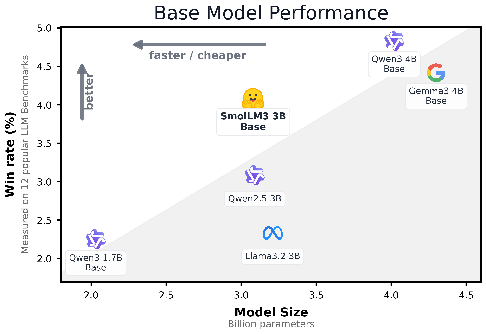

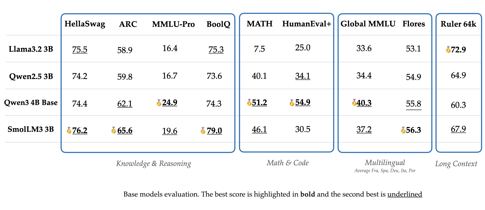

模型的多语种表现如下

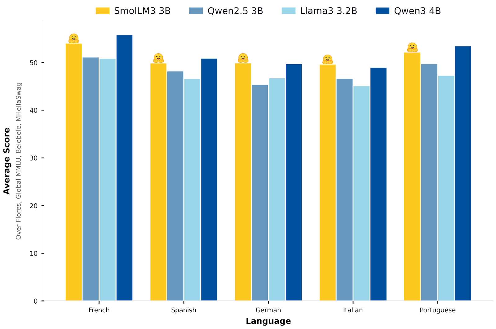

Instruction (non-reasoning) 版本的评估结果如下

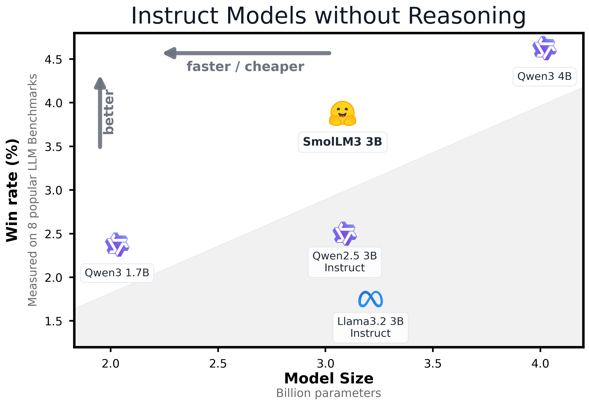

Reasoning 版本的评估结果如下

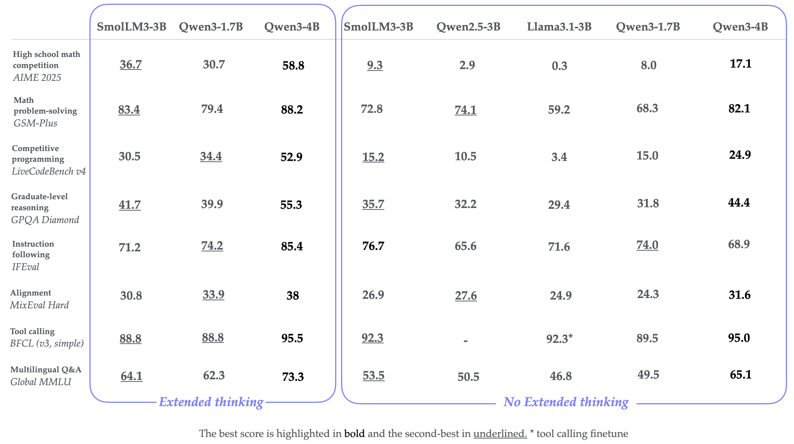

可以看到，Qwen3-4B 的表现是最好的。而 SmolLM3 的表现在 3B 左右也是非常强劲的

## Conclusion

作者提出了 SmolLM3, 一个拥有长上下，文多语种以及 dual mode reasoning 能力的大语言模型，作者详细介绍了数据，训练以及 model merging 的技巧，来提高模型的表现。

## References

- [blog](https://huggingface.co/blog/smollm3)
