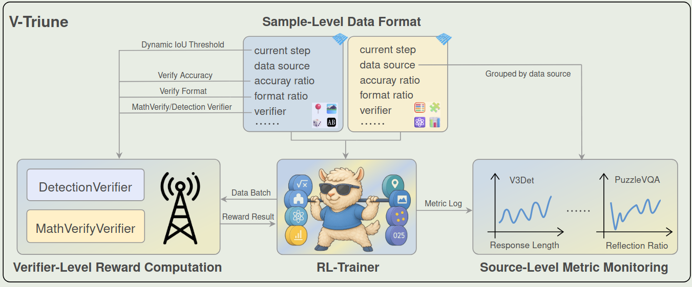
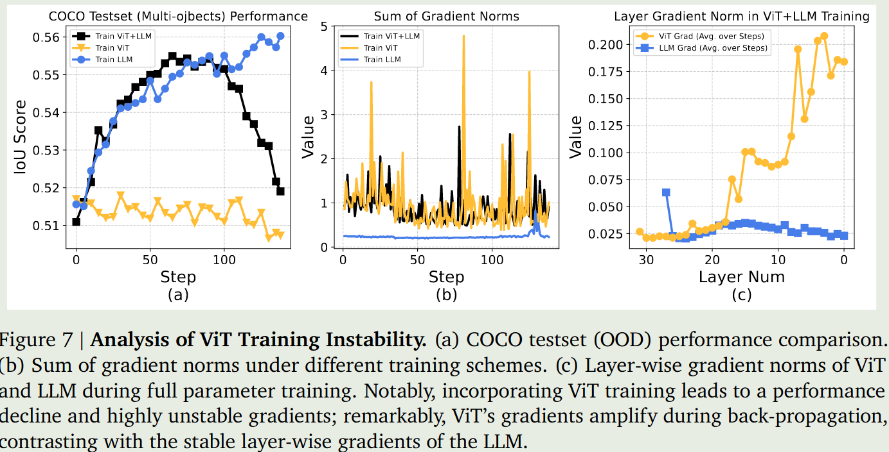
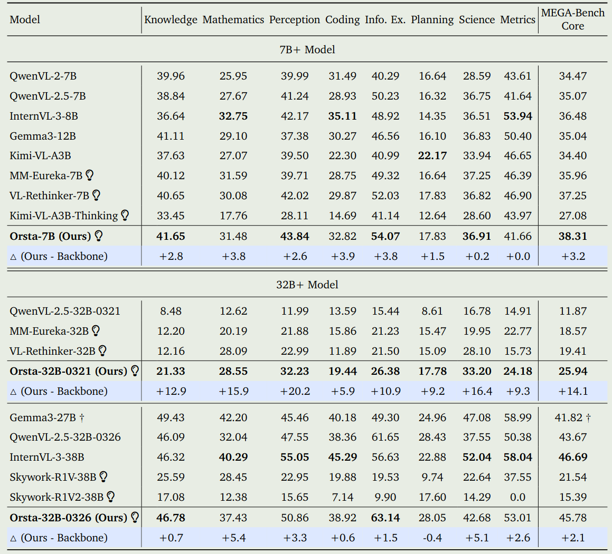
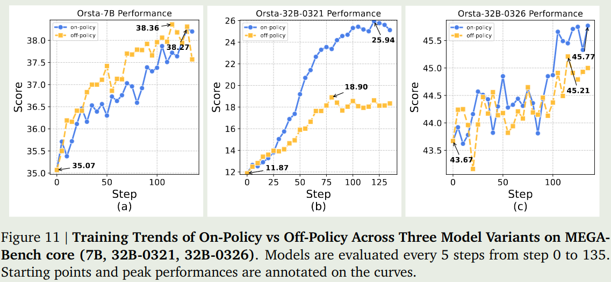
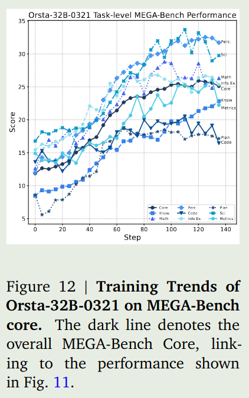
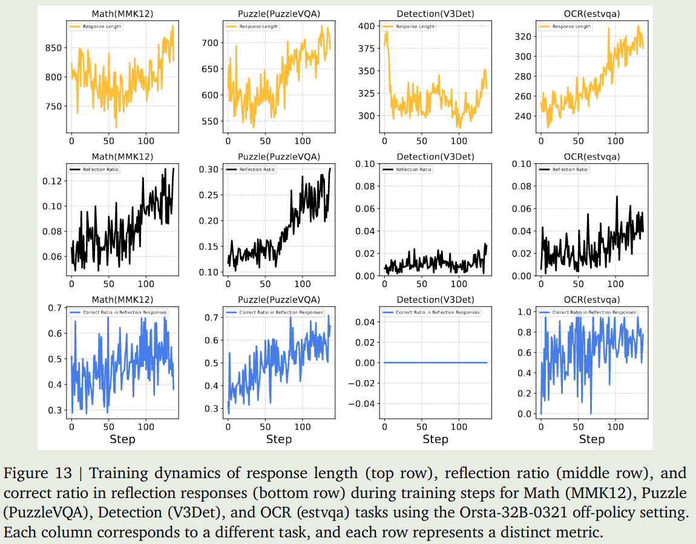
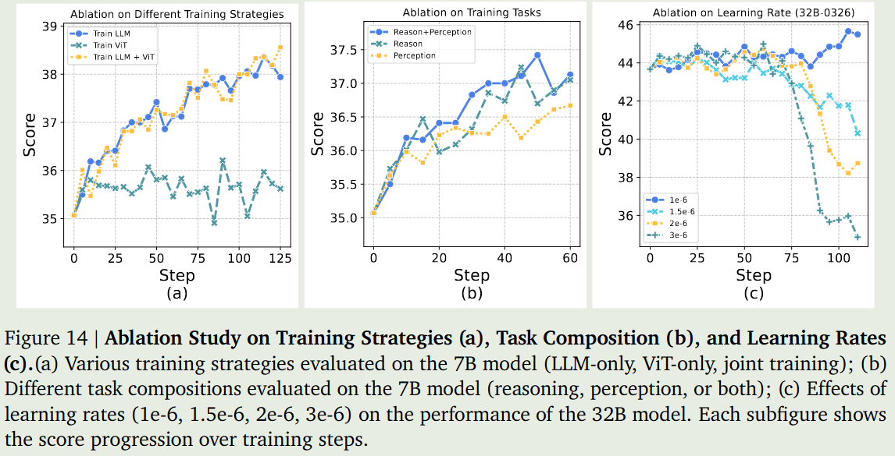

V-Triune 探究了如何使用一套统一的 RL 训练框架，来同时提高模型的 perception 和 reasoning 能力。

## Introduction

已有的 RL 训练方法主要提升模型在特定 domain 上的能力，比如 MM-Eureka, Vision-R1 等专注于提升 MLLM 的 reasoning 能力，而 R1-V, DeepPerception 等专注于提升模型的 perception 能力。

因此，本文的 motivation 就是，如何用一套统一的 RL 训练框架，来同时提高模型的 perception 和 reasoning 能力。

V-Triune 包含 3 个关键模块：

- Sample-Level data formatting: 即在 sample 的层面定义 reward 等信息
- Verifier-Level Computation: 即分离 verifier 和 generator, 提高整体效率
- Source-Level Metric Monitoring: 基于 data source 来监控模型的表现

作者还提出了 Dynamic IoU reward, 来提高训练的稳定性。

基于 V-Triune 和 [Qwen2.5-VL](https://maosong.website/p/notes-on-qwen2.5-vl/), 作者提出了 Orsta,一个在 reasoning 和 perception 任务上均有提升的多模态大模型。

论文的主要贡献为：

1. 提出了 V-Triune, 一个统一的 RL 训练框架，来同时提高模型的 reasoning 和 perception 能力
2. 在 infra 上进行了改进，提高整体的训练效率和稳定性
3. 基于 V-Triune, 构建了 Orsta, 相比于 Baseline, 模型的 perception 和 reasoning 能力均有了提升。

## Preliminary

作者首先回顾了一下 GRPO 和 [DAPO](https://maosong.website/p/notes-on-dapo/) , 我们这里就不再赘述。

然后，作者介绍了一下 reward function, reward function 由两部分组成， 第一部分是 format reward, 第二部分是 accuracy reward,.

对于 format reward, 作者采取了和 OpenR1 相同的做法，也就是要求输出仅包含 1 个给定的 token, 这里特定的 token 为 $s_1=\texttt{<think>}$,  $s_2=\texttt{</think>}$,  $s_3=\texttt{<answer>}$,  $s_4=\texttt{</answer>}$,  reward 的定义如下：

$$
R_{\mathrm{format}}(o_q) = 0.25\sum_{i=1}^4 \mathbb{1}(\mathrm{count}(o_q,s_i)=1)
$$

这里 $\mathbb{1}(\cdot)$ 是示性函数。

对于 accuracy reward, 作者根据不同的任务分别进行处理。

对于 reasoning 任务，reward function 的定义如下

$$
R_{\mathrm{acc}}(\hat{a},a) = \begin{cases}
1, &\text{ if }\texttt{verify(parse($\hat{a}$), parse($a$))}\text{ is True}\\
0, &\text{ else}
\end{cases}
$$

这里 $\hat{a}$, $a$ 分别是 prediction 和 ground truth.

对于 perception 任务，reward function 与我们要处理的子任务相关。如果是 OCR 和 counting 任务，则我们采取和 reasoning 一样的 reward function. 如果我们要处理的是 grounding 和 detection 任务，则我们可以使用 IoU 以及 mAP 两种 reward 形式。

IoU reward 的定义如下：

$$
R_{\mathrm{acc}}(\hat{a},a) = \begin{cases}
\mathrm{IoU}(\hat{a}, a), &\text{ if }\mathrm{IoU}(\hat{a},a)\geq \epsilon\\
0, &\text{ else}
\end{cases}
$$

这里 $\epsilon>0$ 为超参数， IoU 定义如下

$$
\mathrm{IoU}(\hat{a},a) = \frac{\mathrm{Area}(\hat{a}\cap a)}{\mathrm{Area}(\hat{a}\cup a)}
$$

mAP 的定义如下

$$
\mathrm{AP}_c = \int_0^1 \max_{\tilde{r}\geq r}P_c(\tilde{r}) dr,\quad mAP=\frac1C\sum_{c=1}^C \mathrm{AP}_c
$$

最终的 reward 是 format reward 和 accuracy reward 的加权求和：

$$
R = \alpha_{\mathrm{acc}}R_{\mathrm{acc}} + \alpha_{\mathrm{format}}R_{\mathrm{format}}
$$

## V-Triune

V-Triune 框架如下图所示，其包含三个模块

### Sample-Level Data Formatting

核心思想就是不同的任务的 reward function 可能是不一样的，如果在 task 层面设计 reward function 的话，RL 训练就没有了 flexibility, 因此，在本文中，作者在 sample 层面设计 reward function. 具体做法就是，每个样本除了 QA 相关信息，还有 reward model 的相关参数，这样就可以更加灵活地调整不同 sample 的损失了。

### Verifier-Level Reward Computation

核心思想就是构建多个不同的 Verifier, 来分别处理不同的 sample, 因为我们 reward model 也是在 sample 层面构建的，因此我们可以基于 sample 的 metadata 来动态分配对应的 verifier, 这样就提升了 veriier 的可扩展性。本文作者使用了 MathVerifier 和 DetectionVerifier 两种。

### Source-Level Metric Monitoring

核心思想就是根据 sample 的 metadata 信息来监控不同的 metric, 这样可以防止训练不稳定。

### Dynamic IoU Reward

核心思想就是根据训练进程，动态调整 IoU 的阈值。

作者发现，如果将 IoU 阈值设置的比较低的话，模型很容易拿到比较高的 reward; 如果将 IoU 阈值设置的比较高的话，模型又很难拿到奖励。

因此，作者的解决方案就是，使用课程学习，随着训练的进行，逐步提高 IoU 的阈值。

## Data

数据集列举如下：

- Math: mm_math, geometry3K, mmk12
- Puzzle: PuzzleVQA, AlgoPuzzleQA, VisualPuzzles
- Science: ScienceQA, SciVQA, ViRL39K (Broader STEM topics, (GradeSchool) Science)
- Chart: ChartQAPro, ChartX, Table-VQA, ViRL39K (Tables/Diagrams/Charts)
- Detection: V3Det, Object365
- Grounding: D3
- Counting: CLEVR
- OCR:  LLaVA-OV (OCR questions), EST-VQA

**Rule-based filtering**
对于 visual reasoning 数据，作者的过滤如下：

- 多项选择题以及判断题，防止 reward hacking
- 答案包含特殊符号如 "=", "\[" 等的数据
- 答案字符数超过 20 个，防止答案太复杂

对于 visual perception 数据，作者过滤流程如下：

- Detection: 超过 10 个 bounding box 的，或者 box 占 50% 以上面积的数据，保持 single BB 和 multi BB 的比例为 1:2
- Grounding: box 占 50% 以上面积的数据, label 过于复杂的数据
- Counting: 保持类别平衡，仅使用英文数据
- OCR: 保留英文数据，对 labels 进行 verify

**Difficulty-based filtering**
主要是移除比较简单的问题。

经过这两个阶段的过滤之后，得到了 **20.6K** perception samples 以及 **27.1K** reasoning samples. 数据保存在 Parquet 格式

## Training Recipe

### Disable ViT Training

作者首先发现，全量微调会导致训练崩溃。作者分析原因发现，主要是 ViT 在反向传播过程中，存在 gradient amplify 的问题，第一层与最后一层的梯度的 norm 相差 5-10 倍。作者认为有两点原因：

1. RL 会强制要求模型的不同模态之间进行对齐
2. 对比学习训练得到的 VIT 可能使得其不适合 RL 的训练。

基于这两点考虑，作者再进行训练的时候，冻结了 ViT 模块，结果如下图

### Spurious Image Special Tokens

作者发现，模型的输出可能会包含一些 `<image_pad>` 等 token, 因此，作者对输出进行了过滤，然后再进行计算。

### CoT Prompt Pool

作者还发现，多样化的 CoT prompt 会损害模型的表现。因此，作者构建了 20 个 prompt 模版，每次随机挑选其中一个加入到 instruction 中。

### Training Configuration

模型基于 Qwen2.5-7B-instruct 和 Qwen2.5VL-32B 来进行开发

作者探究了 on-policy 和 off-policy 两种配置。roll-out batch size 设置为 1024, 使用 GRPO 进行训练，GRPO 的 group size 设置为 8

作者还设置 $\epsilon_{high}=0.28$ 以及 $\epsilon_{low}=0.2$ 来提高 token 的采样率。作者去除了 KL divergence loss, 并且在 token 层面上进行平均

## Evaluation

### Performance

### Analysis

**on-policy v.s. off-policy**
作者首先对比了以下 on-policy RL 和 off-policy RL 两种训练方式的表现， 结果如下图所示

结果有两点发现：

1. on-policy 的表现基本上都是比 off-policy 要好的。
2. 小模型通过 RL 带来的表现提升更明显，大模型的表现则更慢

**generalization**
作者还评估了以下模型的泛化性，结果如下图所示

结果发现，RL 的训练更像是对齐，而不是泛化。也就是说，模型在 in-domain 的任务上表现较好，在 OOD 的任务上表现就一般。这与已有的结论是不一样的

> [!tip] Recall
> [Magistral](https://maosong.website/p/notes-on-magistral/) 发现模型在 math domain 上进行训练，在 code domain 上的表现也会提升

**Training Dynamics**
作者还分析了不同任务不同指标随训练进行的变化情况，如下图所示

结果显示，reasoning 和 OCR 任务岁训练进行其输出长度和正确率都有所提升。但是 detection 相关任务则变化不是很明显。

### Ablation Study

作者进行了三个消融实验：

1. 训练策略：冻结 ViT, 冻结 LLM, 两者都不冻结
2. 任务分解策略：仅使用 reasoning 数据进行训练，仅使用 perception 数据进行训练，同时使用两种数据进行训练。
3. learning rate: 不同的学习率

实验结果如下图所示

结果发现，

1. 仅训练 ViT 对表现没有任何帮助，只有训练 LLM 才会带来性能的提升。
2. 同时使用两种数据进行训练的效果是最好的，其次是仅使用 reasoning 数据进行训练，最后是仅使用 perception 数据进行训练
3. 较大的学习率会损害模型的表现。

## Conclusion

本文中，作者提出了 V-Triune, 一个使用 RL 来同时提高 MLLM 的 reasoning 和 perception 能力的 RL 训练框架。

作者发现 RL 对于 VLM 来说更像是一种 Alignment 策略，而不是一种 Generalization 策略，也就是模型并没有引入新的能力，而是提升模型本身的 utility 以及 robustness.

作者认为本文有以下 Limitation:

1. 在 perception 任务上没有看到明显的 test-time scaling 现象。作者认为，探究使用 o3 类似的方法或许能提高模型的表现
2. 探究 RL-zero 在 VLM 中的应用，也就是直接在 base model 上进行 RL 的训练。

## References

- [arxiv](http://arxiv.org/abs/2505.18129)
