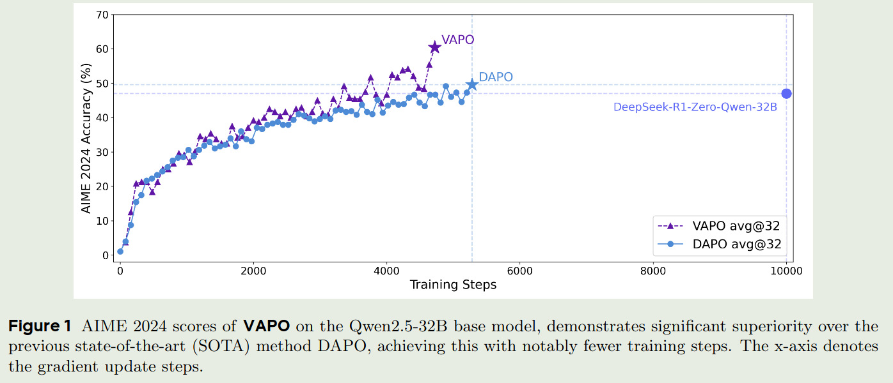
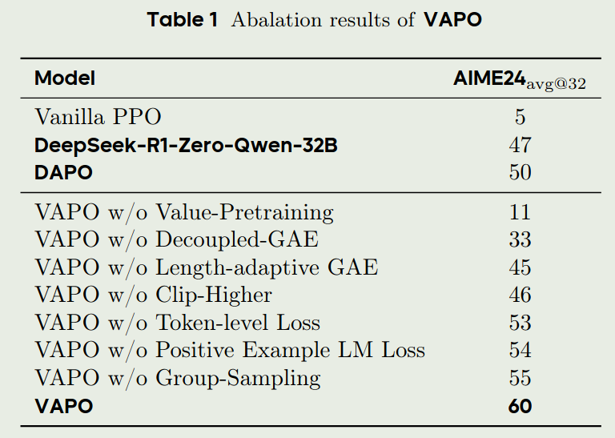
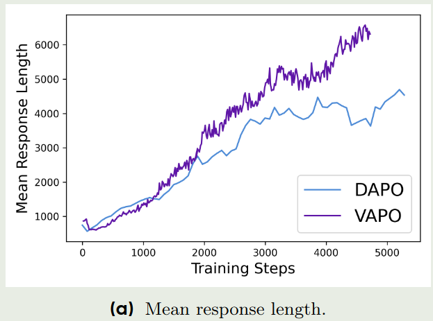
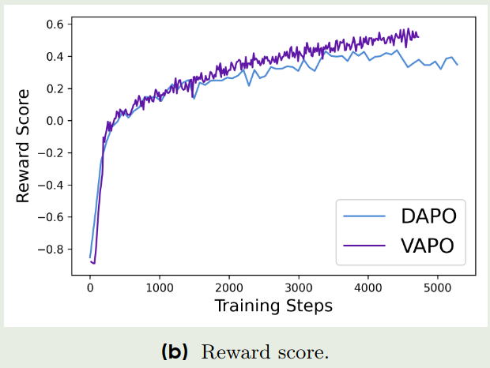
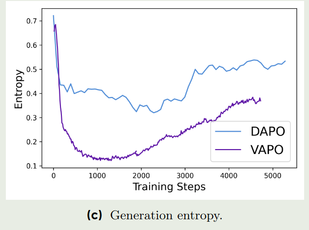

# Abstract

字节Seed团队提出了 Value-based Augmented Proximal Policy Optimization (VAPO), 用于提高 reasoning model 的表现。 VAPO 通过集成 DAPO 和 VC-PPO 的优点，进一步提高了 value-based 方法的表现。

# Introduction

现有的RL 训练方法可以分为 value-free 和 value-based 两大类。
其中 value-free 方法不需要使用 value model, 比如 GRPO 和 GRPO 的变体 DAPO, 这类方法通过多次采样，然后使用 leave-one-out estimate 来代替 value model. 这类方法的优点是不需要训练value model, 但是缺点是在复杂的任务中表现不是很稳定。

另一方面，value-based 方法需要训练一个 value model, 比如 VC-PPO, 这类方法的优点是：

1. 提供更细粒度的奖励信号
2. 提供lower-varaince value estimation, 从而提高训练的稳定性
3. 拥有更好的泛化能力

但是，value-based 方法在训练过程中存在一些问题：

1. 训练一个low-bias 的 value model 比较困难， 尤其是在long trajectory 上，因为 bias 会随着 trajectory 的长度增加而增加
2. 在heterogeneous sequence lengths during training 中表现不佳，对于短文本和长文本，我们需要考虑 bias-variance 的trade-off
3. 在sparse reward signal 中表现不佳

为了解决这些问题，字节Seed团队提出了 VAPO, 一个基于value-based 的 RL 训练方法，VAPO 通过结合 DAPO 和 VC-PPO 的优点，进一步提高了 value-based 方法的表现。

# Preliminary

Preliminary包括 token-level MDP, RLHF, PPO 三个部分，这部分请参考 [VC-PPO](https://maosong2022.github.io/p/vc-ppo%E5%AD%A6%E4%B9%A0%E7%AC%94%E8%AE%B0/). 这里不做重复。

# VAPO

作者针对value-based 方法在训练过程中存在的三个问题，在VAPO中分别进行了解决。

## Mitigating Value Model Bias over Long Sequences

在 [VC-PPO](https://maosong2022.github.io/p/vc-ppo%E5%AD%A6%E4%B9%A0%E7%AC%94%E8%AE%B0/) 中，作者提到了 value model 和 reward model 的不一致性，这种不一致性会导致 bias, 尤其是在long sequences上。 在VAPO中，作者就直接使用了 VC-PPO的做法，包括value pretraining 和 decoupled GAE 来解决这个问题。

## Managing Heterogeneous Sequence Lengths during Training

针对heterogeneous sequence的问题，作者提出了 **Length-Adaptive GAE**. 在VC-PPO中， $\lambda_{\mathrm{policy}}$ 被设置为 $0.95$. 但是当 sequence 非常长时， TD-error会迅速下降，导致GAE被一部分TD-error所主导，从而不利于模型的训练。

为了解决这个问题，作者将 $\lambda_{\mathrm{policy}}$ 与 sequence 的长度 $\ell$ 联系起来，具体来说， 两者的关系如下：

$$
\sum_{t=0}^{\infty}\lambda_{\mathrm{policy}}^t = \frac{1}{1-\lambda_{\mathrm{policy}}} := \alpha\ell
$$

其中 $\alpha$ 是一个超参数，用来控制 bias-variance 的trade-off. 给定 $\ell$, $\lambda_{\mathrm{policy}}$ 可以被计算为：

$$
\lambda_{\mathrm{policy}} = 1 - \frac{1}{\alpha\ell}
$$

同时，为了平衡短文本和长文本的贡献，基于 [DAPO](https://maosong2022.github.io/p/dapo%E5%AD%A6%E4%B9%A0%E7%AC%94%E8%AE%B0/), 作者构建了 token-level policy gradient loss， 其具体形式如下：

$$
\mathcal{L}_{\mathrm{PPO}}(\theta) = \frac{1}{\sum_{t=1}^G|o_i|}\sum_{i=1}^G\sum_{t=1}^{|o_i|}\min\left(r_{i,t}(\theta)\hat{A}_{i,t},\mathrm{clip}\left(r_{i,t}(\theta), 1-\epsilon, 1+\epsilon\right)\hat{A}_{i,t}\right)
$$

## Dealing with Sparsity of Reward Signal in Verifier-based Tasks

与DAPO一致，为了解决reward signal的稀疏性问题，作者提出了Clip-Higher, 来让更小概率的输出也能获得较大的更新概率。其更新公式如下：

$$
\mathcal{L}_{\mathrm{PPO}}(\theta) = \frac{1}{\sum_{t=1}^G|o_i|}\sum_{i=1}^G\sum_{t=1}^{|o_i|}\min\left(r_{i,t}(\theta)\hat{A}_{i,t},\mathrm{clip}\left(r_{i,t}(\theta), 1-\epsilon_{low}, 1+\epsilon_{high}\right)\hat{A}_{i,t}\right)
$$

Clip-Higher的介绍见[DAPO](https://maosong2022.github.io/p/dapo%E5%AD%A6%E4%B9%A0%E7%AC%94%E8%AE%B0/)

然后，作者还将next-token prediction loss 和 PPO loss 结合起来，来降低奖励的稀疏程度。

$$
\mathcal{L}_{\mathrm{NTP}}(\theta) = -\frac{1}{N}\sum_{o_i\in\mathcal{T}}\sum_{t=1}^{|o_i|}\log \pi_{\theta}(a_{i,t}|s_{i,t})
$$

其中 $\mathcal{T}$ 是正确答案的集合。 最终的loss为：

$$
\mathcal{L}_{\mathrm{VAPO}}(\theta) = \mathcal{L}_{\mathrm{PPO}}(\theta) +\mu \mathcal{L}_{\mathrm{NTP}}(\theta)
$$

其中 $\mu$ 是一个超参数，用来平衡PPO loss和NTP loss。

# Experiments

模型使用Qwen-32B来进行训练, 大部分细节与VC-PPO和DAPO一致，这里不再赘述。最后与DAPO以及R1的对比结果如下：

## Ablation study

针对本文使用的模块，作者进行了消融实验，结果如下：

从实验结果可以看到：

1. value pretraining 和 decoupled GAE 可以显著提高模型的表现
2. clip-higer 可以提升模型的探索能力
3. length-adaptive GAE 可以平衡模型在短文本和长文本上的表现

## Training Dynamics

与DAPO类似，作者也分析了VAPO的训练动态，结果如下：

从上面三张图可以看到：

1. VAPO相比于DAPO来说，其训练更加稳定
2. 从response length来看，VAPO的response length更长，说明VAPO的length scaling更强
3. 从reward score来看，VAPO的reward score更高，说明VAPO的reward signal提供的指导信息更多
4. 从generation entropy来看，在训练末期，VAPO的generation entropy更低，说明VAPO的生成多样性要更低一些，但这也说明了VAPO的生成更加稳定。 作者认为这个时候稳定性更重要。

# Conclusion

作者在DAPO和VC-PPO的基础上，提出了VAPO，一个基于value-based 的 RL 训练方法，VAPO 通过结合 DAPO 和 VC-PPO 的优点，进一步提高了 value-based 方法的表现。 后续，作者又提出了Seed-thiking-1.5的技术报告。可以说，这一系列论文的连贯性是非常高的。

# Reference

1. [Arxiv VAPO: Efficient and Reliable Reinforcement Learning for Advanced Reasoning Tasks](http://arxiv.org/abs/2504.05118)
2. [Notes onDAPO](https://maosong2022.github.io/p/dapo%E5%AD%A6%E4%B9%A0%E7%AC%94%E8%AE%B0/)
3. [Notes on VC-PPO](https://maosong2022.github.io/p/vc-ppo%E5%AD%A6%E4%B9%A0%E7%AC%94%E8%AE%B0/)
