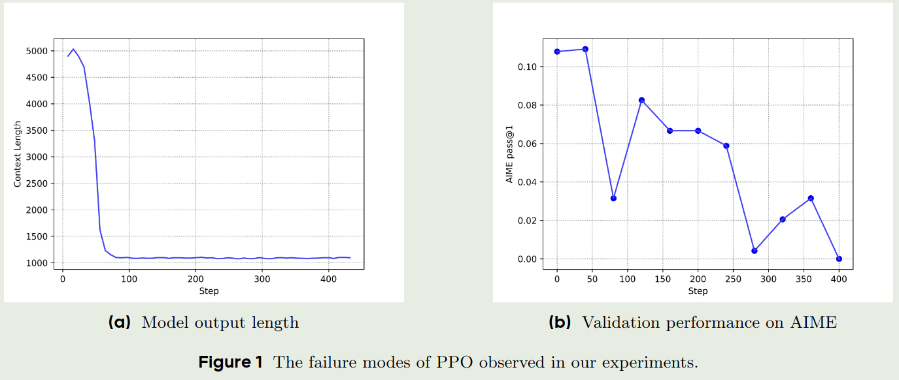
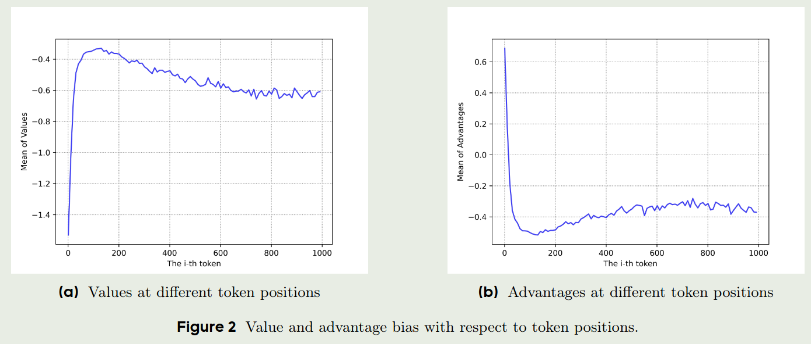
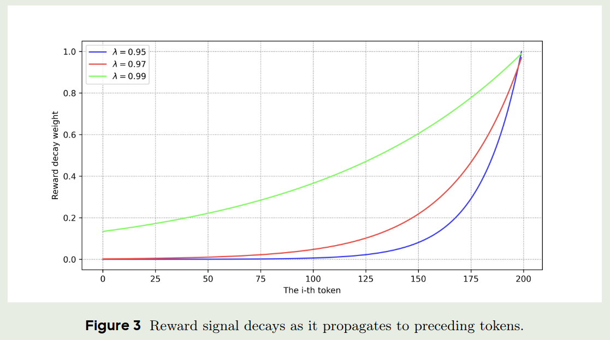
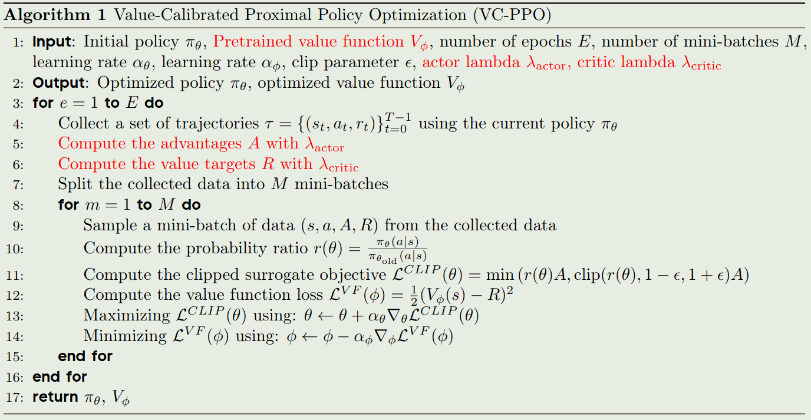
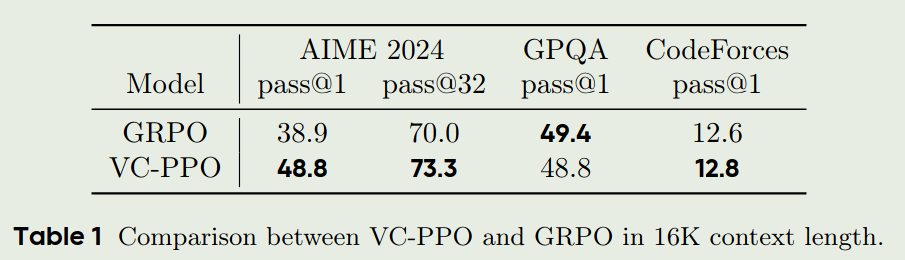
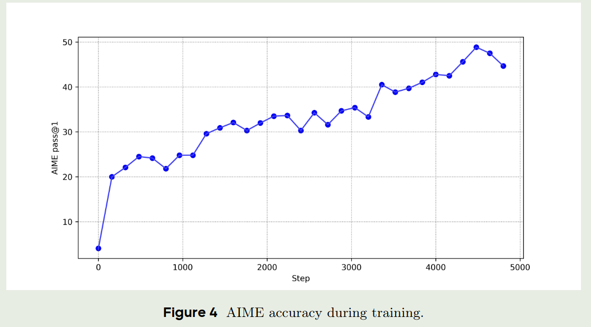
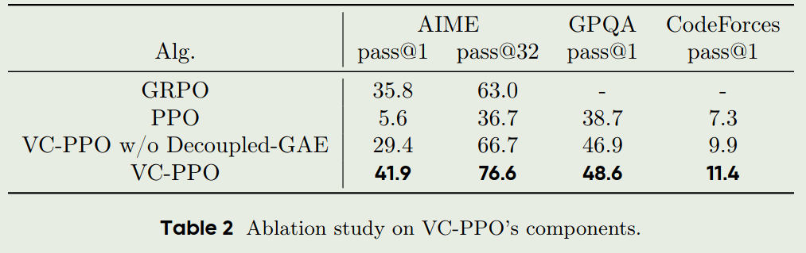
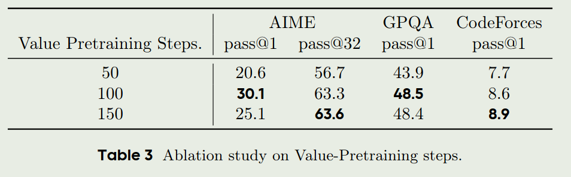
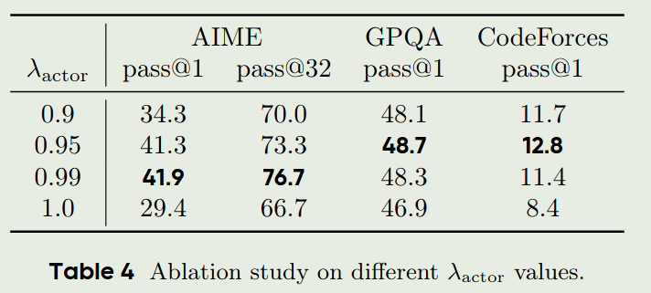
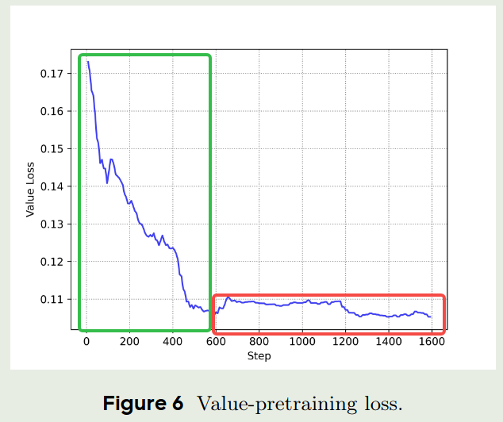

# Abstract

字节Seed团队提出了 Value-Calibrated PPO (VC-PPO), 用于解决PPO的value initialization bias 以及 reward signal decay 问题. 具体来讲：

1. VC-PPO增加了 value pretraining 来解决 value initialization bias 的问题
2. VC-PPO分离了 actor 和 critic 的GAE的计算，避免了 reward signal decay 的问题

# Introduction

已有的reasoning model的训练方法，主要包括两个个stage:

1. SFT: 这个阶段主要使用了一些标注好的long CoT数据，初步激活模型的reasoning能力(参考KImi-VL)
2. RL: 这个阶段使用收集到的数据使用RL算法进行训练，任务包括math, code, logic reasoning等

已有PPO算法在处理Long CoT任务时，存在的问题在 [DAPO](https://maosong.website/p/notes-on-dapo/) 中已经介绍过了，GRPO的解决方式为
使用leave-one-out estimate来替换value model. 但是GRPO相比于PPO能够提供token级别的奖励来说，只能提供response level的奖励，因此限制了模型的性能。

# Preliminary

Preliminary包括MDP, RLHF, PPO三个部分，RLHF和PPO我们在 [DAPO](https://maosong.website/p/notes-on-dapo/) 中已经介绍过了，这里不再赘述。

## Token-level MDP

给定prompt $x$ 和 response $y$, 我们可以将 $x$ 和 $y$ 分解为 token 序列，比如 $y = y_1, y_2, \cdots, y_n$, 其中 $y_i\in\mathcal{A}$, $\mathcal{A}$ 是我们的词表。

我们将 token-level MDP定义为：

$$
\mathcal{M} = \langle \mathcal{S}, \mathcal{A}, P, r, d_0, \omega \rangle
$$

其中：

- $\mathcal{S}$ 是状态空间，表示当前的token序列， $t$时刻的状态可以表示为 $s_t = (x, y_1, y_2, \cdots, y_t)$
- $\mathcal{A}$ 是动作空间，表示下一个token， $t$时刻的动作可以表示为 $a_t = y_{t+1}\in\mathcal{A}$
- $P$ 是状态转移概率，表示在 $t$时刻，从状态 $s_t$ 转移到状态 $s_{t+1}$ 的概率
- $r$ 是奖励函数，表示在 $t$时刻，从状态 $s_t$ 采取动作 $a_t$ 转移到状态 $s_{t+1}$ 的奖励
- $d_0$ 是初始状态分布，表示初始状态 $s_0$ 的概率分布
- $\omega$ 是终止状态分布，表示终止状态 $s_n$ 的概率分布，通常表示 `<eos>` token

# 方法

首先作者分析了一下为什么 PPO 在处理 long CoT 任务时效果不佳。

PPO的传统设置为：

- 将GAE的参数 $\lambda$ 设置为 0.95
- 使用一个 reward model 来初始化 value model

一方面，作者认为，$\lambda=0.95$ 是为了减少模型在 Mujoco 以及 Atari 等环境中的variance，但是对于Long CoT任务，这个设置会导致模型缺乏足够的探索能力。

另一方面，作者认为 reward model 和 value model 虽然都是提供关于 response 的信息，但是他们之间还是存在一些差距的。作者给出了使用PPO来进行 long CoT 任务相关的实验结果

可以看到，随着训练的进行，模型的context length以及在AIME benchmark上的表现都出现了下降。

在本文中，作者主要是在 verifiable tasks 上进行实验，答案的正确性与 response length 长度关系不大，因此, response length 可以反应模型的训练情况。 作者绘制了训练过程中， value 和 advantage 与 token position 的关系图

从上图可以看到，value 和 advantage 更倾向与给最初的 token 更高的 bias, 作者认为出现这个情况的原因是 value model 和 reward model 的目标并不匹配。 reward model 的目标是给 $\omega$ 也就是 `<eos>` token reward, 对于一开始的 token, reward model会给出比较低的奖励；而 value model 的目标是给整个 response 一个奖励，因此，value model 会倾向于给最初的 token 更高的奖励。我们对 GAE 进行改写得到：

$$
\hat{A}_t = \sum_{i=t}^{T-t-1} \lambda^{i} \left( r_{t+i} + V(s_{t+i+1}) - V(s_{t+i}) \right)
$$

从上式可以看到，一开始 $r_{t+i}$ 的值会比较小，而 $V(s_{t+i})$ 的变化比较大，因此，一开始的 token 的 advantage 会比较大，这个 bias 会持续影响整个 trajectory。

为了解决这个问题，作者提出了 value-pretraining, 也就是对value model 进行离线与训练，直到其收敛到一个具体的 policy 上。具体训练步骤为：

1. 基于一个policy， 如  $\pi_{\mathrm{sft}}$ 进行采样，然后更新value model ($\lambda=1.0$)
2. 基于收集到的数据训练 value model, 直到 value loss 或者 explain variance 收敛

接下来，在训练 value model 时，我们还需要考虑 variance reduction 的问题。作者首先改写了 GAE 的公式：

$$
\hat{A}_t = \begin{cases}
    \sum_{i=0}^{T-t-1} \lambda^{i} \left( r_{t+i} + V(s_{t+i+1}) - V(s_{t+i}) \right)+V(s_t) & \text{if } \lambda < 1.0 \\
    \sum_{i=0}^{T-t-1} r_{t+i} & \text{if } \lambda=1.0
\end{cases}
$$

可以看到，当 $\lambda < 1.0$ 并且 $T-t-1$ 比较大时，`<eos>` token 的reward就非常接近于0了，作者通过实验验证了这一点。

可以看到，当我们降低 $\lambda$ 时，reward signal 的稀疏性会显著增加，从而提高了模型的训练难度。

但是，我们又不能不使用 variance reduction, 因为这会导致训练的不稳定性。 作者从 TD error 的角度分析了 variance:

$$
\begin{aligned}
    \mathrm{Var}[A_{t}^{\lambda}] &= \mathrm{Var}\left[\sum_{i=0}^{T-t-1} \lambda^{i}\delta_{t+i}\right] \\
    &= \sum_{i=1}^{T-t-1} \lambda^{2i} \mathrm{Var}[\delta_{t+i}] + 2\sum_{i=1}^{T-t-1}\sum_{j=0}^{i-1} \lambda^{i+j} \mathrm{Cov}[\delta_{t+i}, \delta_{t+j}]
\end{aligned}
$$

因为 $\lambda\in[0,1]$, 因此未来的 TD error 会衰减的更快，因此就降低了 advantage 的 variance.

那么如何在降低variance的同时，又不至于使得 reward signal 过于稀疏呢？作者的解决方案是分离GAE的计算，也就是将 GAE 的计算分为两部分：

$$
G_{t:t+h} = \begin{cases}
    \sum_{i=0}^{h-1} r_{t+i} + \bar{V}(s_{t+h}) & \text{if } t+h<T \\
    \sum_{i=0}^{T-h} r_{t+i} & \text{if } t+h=T
\end{cases}
$$

基于这个公式，我们可以写出policy gradient的公式：

$$
\begin{aligned}
    \nabla_{\theta} J(\theta) &= \mathbb{E}_{t}[\nabla_{\theta} \log \pi_{\theta}(a_t|s_t)A_t] \\
    &= \mathbb{E}_{t}\left[\nabla_{\theta} \log \pi_{\theta}(a_t|s_t) \sum_{i=0}^{T-t-1} \lambda^{i}\left( r_{t+i} + \bar{V}(s_{t+i+1}) - \bar{V}(s_{t+i}) \right)\right] \\
    &= \mathbb{E}_{t}\left[\nabla_{\theta} \log \pi_{\theta}(a_t|s_t) \left((1-\lambda) \sum_{i=1}^{T-t-1} \lambda^{i-1}G_{t:t+i}+\lambda^{T-t-1}G_{t:T}- \bar{V}(s_{t})\right)\right] \\
    &= \mathbb{E}_{t}\left[\nabla_{\theta} \log \pi_{\theta}(a_t|s_t) \left((1-\lambda) \sum_{i=1}^{T-t-1} \lambda^{i-1}G_{t:t+i}+\lambda^{T-t-1}G_{t:T}\right)\right]
\end{aligned}
$$

通过这种方式，我们就可以避免 value function 对 policy gradient 的影响，因而我们可以对 value model 和 policy model 使用不同的 $\lambda$ 进行训练。

最终，我们就可以得到 VC-PPO 的算法：

# 实验

## setup

1. 作者在AIME, GPQA 以及Codeforces三个数据集上进行评测
2. 作者首先进行了code-start，作者构建了一批样本然后要求模型在 `<thinking>` 和 `</thinking>` 之间生成推理过程，然后使用Verifier来针对答案部分提供奖励，正确则奖励为1，错误则奖励为-1
3. RL的Baseline使用的是PPO
4. value pretraining 时，作者将 GAE的 $\lambda$ 设置为 1.0， 其他参数与PPO一致
5. 对于decoupled GAE，作者使用 $\lambda_{\text{critic}}=1.0$, $\lambda_{\text{actor}}=0.95$

## 实验结果

实验结果如下图所示

作者还分析了以下模型在AIME数据集上随着训练步数增加准确率的变化情况

## Ablation Study

作者首先探究了 value pretraining 以及 decoupled GAE 对于模型性能的影响

从上图可以看到，直接使用PPO并不能提升模型的表现，而使用value pretraining 以及 decoupled GAE 能够显著提升模型的表现。

作者接下来探究了不同的value pretraining steps对模型的影响，结果如下图

从上表可以看到，value pretraining 的训练步数并不是越多越好，随着训练步数的增加，模型可能会出现过拟合的现象。

最后作者还分析了以下 $\lambda_{\text{actor}}$ 对于模型性能的影响，结果如下图

可以看到， $\lambda_{\text{actor}} =1.0$ 的效果是最差的，但是 $\lambda_{\text{actor}}$ 也不是越小越好，实验发现当 $\lambda_{\text{actor}} \in [0.95, 1.0)$ 时结果比较好

## Findings

作者还提供了一些发现。

1. 作者认为，在LLM中进行RL的训练与传统的RL训练不同，我们不再是从一个随机policy开始，而是从一个SFT之后的policy开始，因此，这就会引入 prior，我们需要将 value model 与 policy model 进行对齐，才能使得训练更加稳定。
2. 作者认为，value pretraining 可以王value model 中注入先验知识，作者通过实验发现，value pretraining 的过程可以分为两个阶段，第一个阶段是random alignment，这个和传统的RL训练类似，第二个阶段是knowledge injection，这个阶段，value model 开始学习如何给重要的token 更高的权重。

3. 作者发现， value model 倾向于更大的 $\lambda$, 因此结果会导致更小的 bias 和 更大的 variance. 而 policy model 倾向于更小的 $\lambda$. 这种差异启发我们需要使用一些基于policy gradient 的目标来训练 value model.

# 结论

本文提出了VC-PPO，一个通过使用value-pretraining 以及 decoupled GAE 来解决PPO 的 value initialization bias 以及 reward signal decay 问题的算法。

# 参考文献

- [VC-PPO](http://arxiv.org/abs/2503.01491)
- [DAPO](https://maosong.website/p/notes-on-dapo/)
