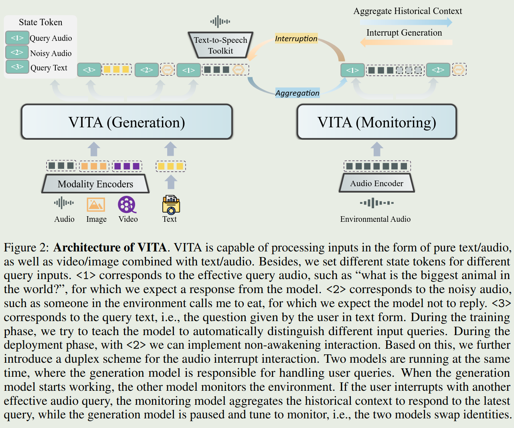
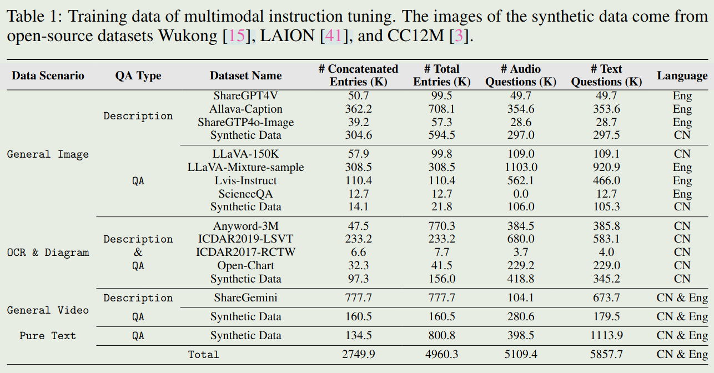
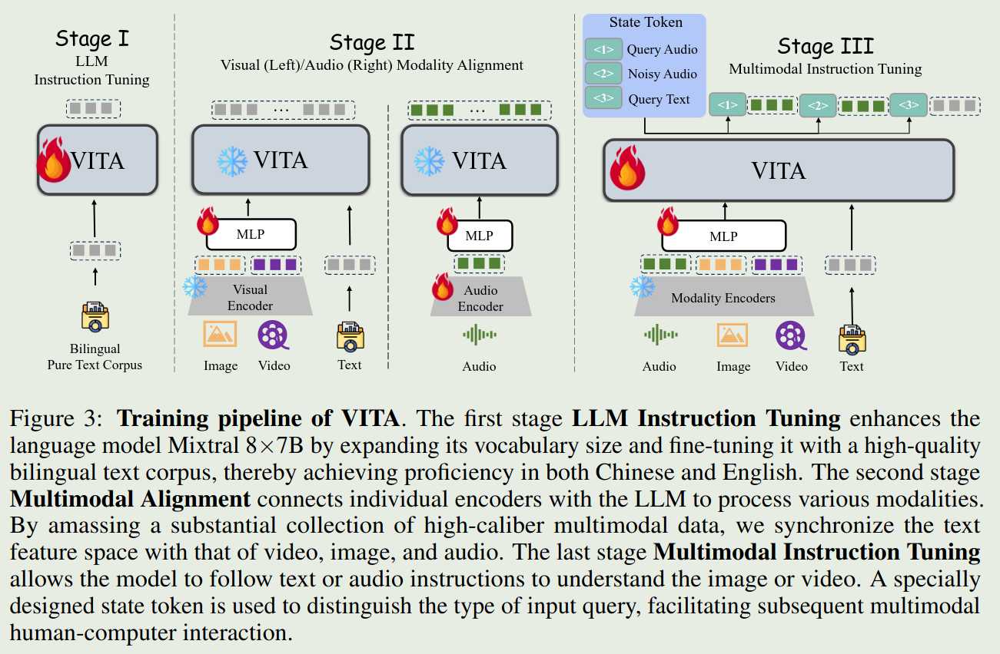
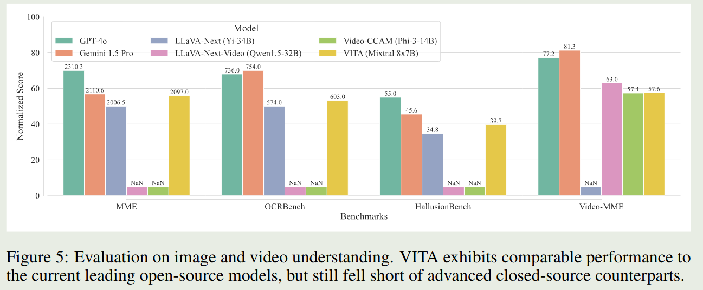

# TLDR

This paper proposes a Multimodal Large Language Model VITA (Video, Image, Text, Audio).
VITA supports non-awakening interaction and audio interruption for better interactive experience.
VITA aims to be an open-sourced version of GPT-4o.

# Introduction

Features of GPT-4o:

1. a unified framework that processes text, vision, and audio signals in an end-to-end manner,
2. the capability to enable natural multimodal human-computer interaction.

Similar to Mini-GPT4, this paper tries to proposed an open-sourced version of GPT-4o.

# Method

## Model

The architecture of VITA is shown as follows:

- LLM: Mixtral $8\times 7$ B
- Visual Encoder: InternViT-300M-448px
- Audio Encoder: Mel Filter Bank block

To support audio interruption, the author uses two model at the same time, where the generation model is responsible for handling user queries and the other model monitors the environment. The other models starts to work is there is an audio interruption.

## Data

### multimodal instruction tuning

Training data of multimodal instruction tuning is given as follows:

Improvements are made:

1. The questions are randomly (about half) replaced with their audio versions, using TTS technique such as GPT-SoVITS
2. Different system prompts are set to avoid conflicts between different types of data

To support human-AI interaction, the noisy audio data are also constructed. Noisy audio samples are generated from existed QA data. These negative sample texts aim to improve the ability of VITA to not respond to non-query-related content.

To distinguish three types of queries, the author uses three state tokens:

- Token `<1>` denotes that the question input is the query audio
- Token `<2>` denotes that the question input is the noisy audio.
- Token `<3>` signifies the question of pure text.

## Training pipeline

Training pipeline of VITA consists of three stages:

### Non-awakening Interaction

There are following requirements and solutions:

1. Real-time Tracking of Environmental Sounds. This paper uses SileroVAD to complete the Voice Activity Detection (VAD) task.

2. Filtering out noisy audio. This is done by making use of token `<2>`.

### Audio Interrupt Interaction

There are following requirements and solutions:

1. Real-time Tracking and Filtering of External Queries. This is done by use another VITA model as stated in Model section.

# Evaluation

# Conclusion

The paper points out three limitations of VITA:

1. Enhancement of Foundational Capabilities.
2. Refinement of Noisy Audio Construction.
3. Building end-to-end TTS in conjunction with LLM.

# Reference

- [Arxiv paper](http://arxiv.org/abs/2408.05211)
- [Github](https://vita-home.github.io)
