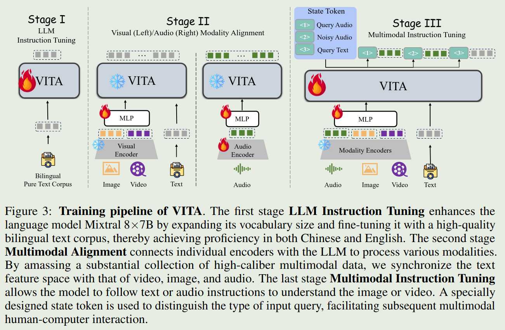

# TLDR

This paper proposes a Multimodal Large Language Model VITA (Video, Image, Text, Audio).
VITA supports non-awakening interaction and audio interruption for better interactive experience.
VITA aims to be an open-sourced version of GPT-4o.

# Introduction

Features of GPT-4o:

1. a unified framework that processes text, vision, and audio signals in an end-to-end manner,
2. the capability to enable natural multimodal human-computer interaction.

Similar to Mini-GPT4, this paper tries to proposed an open-sourced version of GPT-4o.

# Method

## Model

The architecture of VITA is shown as follows:

- LLM: Mixtral $8\times 7$ B
- Visual Encoder: InternViT-300M-448px
- Audio Encoder: Mel Filter Bank block

## Training pipeline

Training pipeline of VITA consists of three stages:

## Data

1. multimodal instruction tuning
2. Non-awakening Interaction
3. Audio Interrupt Interaction

# Conclusion

The paper points out three limitations of VITA:

1. Enhancement of Foundational Capabilities.
2. Refinement of Noisy Audio Construction.
3. Building end-to-end TTS in conjunction with LLM.

# Reference

- [Arxiv paper](http://arxiv.org/abs/2408.05211)
- [Github](https://vita-home.github.io)
