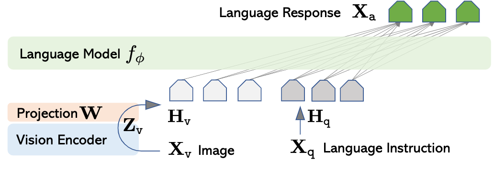

# Introduction

A multimodal large language model (MLLM) usually consists of three parts: an encoder $E$ that ingests the information from different modality, a large language model (LLM) that is corresponds to complete various of downstream tasks given multimodal input such as image and text, and an adaption layer $C$ that aligns features of different modality to word embedding space of the LLM.
Below is an example MLLM adopting aforementioned architecture: LLaVA [1]



Efforts have been made to improve the performance of MLLMs. In this post, we aim to review the design of adaption layer and its potential effect on the downstream tasks.

# Method

Suppose the hidden size of the LLM is $d$, the feature produced by encoder $E$ is $V\in\mathbb{R}^{P\times d_v}$, where $P$ is the number of features (number of visual patches if $E$ is an visual encoder) and $d_v$ is the channel dimension.
The adaption layer $C$ then aligns the feature $V$ with the word embedding space with $x=C(V)\in\mathbb{R}^{Q\times d}$, where $Q$ is the number of tokens. As we can see, $C$ is actually a mapping from $\mathbb{R}^{P\times d_v}$ to $\mathbb{R}^{Q\times d}$.

Based on relationship between $d_v$ and $d$, we can divide projection layers into two types:

1. Feature-preserving adaption layer, where $P=Q$
2. Feature-compressing adaption layer, where $P>Q$.

## Feature-preserving adaption layer

Feature-preserving adaption layer does not change the number of features extracted by $E$. It is used by LLaVA [1] and LLaVA 1.5 [2].
In LLaVA, the adaption layer is a linear layer [2], which is given by
$$ x = VW^T, \text{ where } W\in\mathbb{R}^{d\times d_v}$$
the code reads as:

```python
# one-layer MLP
adaption_layer = nn.Linear(config.hidden_size, config.num_features)
```

In LLaVA 1.5 , the adaption layer is a two-layer MLP, which is adopted be various of following works. It is given by
$$ x = \phi(VW_1^T)W_2^T$$
where $W_1\in\mathbb{R}^{d\times d_v}$, $W_2\in\mathbb{R}^{d\times d}$, $\phi$ is a activation function, specified as `nn.GELU()`. The code reads as:

```python
# two-layer MLP
adaption_layer = nn.Sequential(
    nn.Linear(config.num_features, config.hidden_size),
    nn.GELU(),
    nn.Linear(config.hidden_size, config.hidden_size)
)
```

## Feature-compressing adaption layer

The feature compression adaption layers can be categorized into three types:

1. average pooling
2. attention pooling
3. convolution mapping

They usually comprise two steps:

1. reduce the number of features from $P$ to $Q$ with a pooling operation:
   $$ f' = \mathcal{P}(f)\in\mathbb{R}^{Q\times d_v} $$
2. project compressed features $f'$ to word embedding space with a transformation $\mathcal{T}$:
   $$ x = \mathcal{T}(f')\in\mathbb{R}^{Q\times d} $$

**Average pooling** This type of adaption layers use an average pooling as $\mathcal{P}$ to reduce the number of tokens, followed by a two-layer MLP as $\mathcal{T}$, which is the same as LLaVA 1.5:
$$ f'_i = \frac{1}{n}\sum_{j=1}^{n}f_{(i-1)n+j}, i=1,\dots,Q $$

**Q-former** This type of adaption layers use an cross-attention layer as $\mathcal{P}$, the transformation $\mathcal{T}$ is also the same as LLaVA 1.5.
$$ K = W_kf\in\mathbb{R}^{d_c}, V=W_vf\in\mathbb{R}^{d_c}, f'=\mathrm{softmax}\left(\frac{QK^T}{\sqrt{d_c}}\right)V\in\mathbb{R}^{Q\times d_v} $$
where $W_k, W_v\in\mathbb{R}^{d_c\times d_v}$ and $Q\in\mathbb{R}^{Q\times d_c}$ is a learnable query.

```python
class Qformer(nn.Module):
    def __init__(self, num_queries, hidden_size, num_features, num_heads):
        self.num_queries = num_queries
        self.hidden_size = hidden_size
        self.num_features = num_features

        self.query_tokens = nn.Parameter(
            torch.zeros(self.num_queries, self.num_features)
        )
        self.query_tokens.data.normal_(mean=0.0, std=0.02)

        self.attention = nn.MultiheadAttention(hidden_size, num_heads)
        self.layer_norm_kv = nn.LayerNorm(hidden_size)
        self.layer_norm_q = nn.LayerNorm(hidden_size)

    def forward(self, x, attention_mask=None):
        x = self.layer_norm_kv(x)
        x = x.permute(1, 0, 2)

        N = x.shape[1]
        q = self.layer_norm_q(self.query)
        q = q.unsqueeze(1).repeat(1, N, 1)
        out = self.attention(q, k, v, attention_mask=attention_mask)[0]

        out = out.permute(1, 0, 2)
```

**C-Abstractor** This type of adaption layers use a combination of convolution layer and averaging pooling as $\mathcal{P}$. $\mathcal{T}$ is defined as an additional convolution layers.
$$ f_i' = \frac{1}{n}\sum_{j=1}^n w_jf_{(i-1)n+j},\quad x_i = \sum_{k=-K}^Kw_k'f_{i+k}' $$
where $W=[w_1,\dots,w_n]^T\in\mathbb{R}^n$ and $W'=[w_1,\dots,w_n]^T\in\mathbb{R}^{2K}$ are the weights of the convolution layers.

**D-Abstractor** aa

**MEQ-Former**

**LDPv2**

**VSS**

# Usages

# Comparisons

# References

1. [LLaVA](https://papers.nips.cc/paper_files/paper/2023/hash/6dcf277ea32ce3288914faf369fe6de0-Abstract-Conference.html)
2. [LLaVA 1.5](https://openaccess.thecvf.com/content/CVPR2024/papers/Liu_Improved_Baselines_with_Visual_Instruction_Tuning_CVPR_2024_paper.pdf)
3. [LLaVA adaption layer code](https://github.com/haotian-liu/LLaVA/blob/main/llava/model/multimodal_projector/builder.py)
4. [survey](https://arxiv.org/pdf/2405.10739v1)
