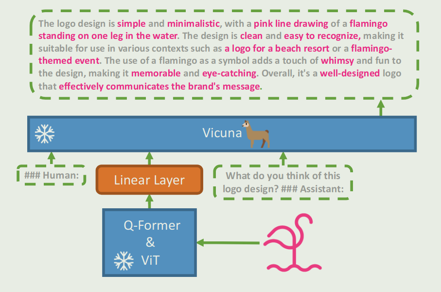

# TLDR

This paper proposed an open-sourced, GPT-4 liked multimodal language model (MLLM), mini-GPT4, aiming to provide inspiration of how to build an MLLM.

# Introduction

GPT-4 has exhibited remarkable vision language abilities, however, due to it is not open sourced, it is hard to explore the construction and how the GPT-4 is trained.

To solve this problem, this paper builds mini-GPT4, which utilizes an advanced LLM, Vicuna and BLIP-2, to build an open sourced MLLM. The result show that mini-GPT4 possesses numerous capabilities similar to those demostrated by GPT-4.

# Method

The architecture of mini-GPT4 is shown as follows:

mini-GPT4 consists of three parts:

1. Vision Encoder same as used in BLIP-2, which is built upon a ViT backbone and a Q-former network.
2. A single projection layer, which aligns the encoded visual features with the Vicuna language model.
3. Language decoder: Vicuna.

## Training

mini-GPT4 only trains the linear projection layer, this includes two stages:

1. First pre-training stage: in this stage, the language decoder and vision encoder are remain frozen, only the linear projection layer is trained. The training dataset contains Conceptual Caption, SBU and LAION. The problem is that the output may be incoherent like repetitive words or sentences.
2. Fine-tune dataset generation: the pre-trained mini-GPT4 is used to generate image-text pair as fine-tune data, to improve the text quality, the generated text is polished with the help of ChatGPT. Finally, the dataset is manually refined.
3. Second-stage fine-tuning: Fine-tune the mini-GPT-4 with the high quality fine-tune data.

# Reference

- [Github](https://github.com/Vision-CAIR/MiniGPT-4/tree/main)
- [Paper](https://openreview.net/forum?id=1tZbq88f27)
- [Homepage](https://minigpt-4.github.io/)
