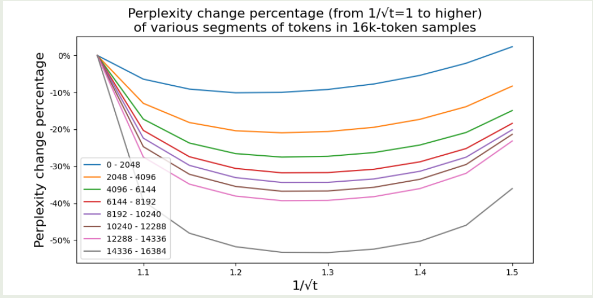
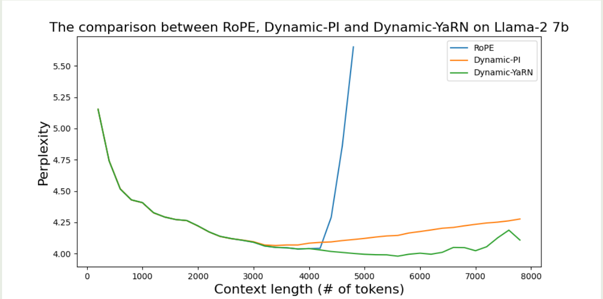

# Introduction

YaRN (Yet Another RoPE extentionN method) 时23年9月EleutherAI等提出来的一个扩展LLM上下文长度的方法，后来被Qwen系列模型所应用。


# Preliminary

作者首先回顾了一下RoPE, 具体内容请参见上一篇[blog](https://maosong.website/p/position-encoding%E6%80%BB%E7%BB%93/)。并使用了 $f_{W}(x_m, m, \theta_d)$ 来表示RoPE：

$$
f_{W}(x_m, m, \theta_{d}) = \Theta_{\theta, m}^d W x_m
$$

其中 $\Theta_{\theta, m}^d\in\mathbb{R}^{d\times d}$ 是多维旋转矩阵, $\theta_d=[\theta_{0,d},\dots,\theta_{(d-2)/2,d}]\in\mathbb{R}^{d/2}$,  $\theta_{i,d}=\theta^{2i/d}$, $\theta>0$ 是一个超参数，RoPE中设置为 $\theta=10000$,  $W\in\{W_q,W_k\}\subset\mathbb{R}^{d\times d}$ 是对应的query/key projection layer的权重矩阵， $x\in\mathbb{R}^{d}$ 是输入的hidden states.

接下来，作者定义了两个新的变量：

**scaling factor**
假设预训练的上下文长度为 $L$, 扩展的上下文长度为 $L'>L$, 则我们定义scaling factor 为

$$
s = \frac{L'}{L}
$$

易知 $s>1$.

**wavelength**
我们将 $\lambda_d$ 定义为 $i$-th 维的RoPE embedding对应的 wavelength：

$$
\lambda_{i,d} = \frac{2\pi}{\theta_{i,d}} = 2\pi\theta^{2i/d}, \ i=0,\dots,(d-2)/2
$$

wavelength描述了对于第$i$ 个维度，RoPE旋转一周 ($2\pi$) 所需要的上下文长度。

# Unified Perspective on Related Work

基于 $f_{W}(x_m, m, \theta_d)$, 作者统一了已有的扩展上下文长度的方法，作者将不同的扩展方法使用一个通用函数 $f_W(x_m,g(m), h(\theta_d))$  来表示，这里 $g(m)$ 和 $h(\theta_d)$ 分别代表了不同的长度外推方法所使用的变换。

## Position Interpolation

Position Interpolation (PI) 的核心思想在于，我们可以通过Interpolation，将超过预训练长度的文本给压缩到当前最大长度，以此来避免RoPE外推产生的问题，其对应的公式为

$$
f'_W(x_m,m,\theta_d) = f_W(x_m, \frac{mL}{L'}, \theta_d)
$$

其中 $L'>L$ 为我们扩展之后的上下文长度， $L$ 为我们预训练的上下文长度。使用通用函数表示的话，我们有

$$
g(m) = \frac{m}{s},\quad h(\theta_d) = \theta_d
$$

## NTK-aware Interpolation

PI的问题是，并没有考虑不同维度的wavelength。
基于NTK理论，DNN当输入维度比较低，且embedding缺少高频内容时，模型就会很难学习到高频信息。对应到RoPE里面，输入的token position id是低位信息（1维），而输出的RoPE是一个 $d$ 维的复杂向量。因此，当输入token非常相似却距离非常近时，RoPE就会丢失高频的细节信息

因此，为了解决这个问题，作者对不同的维度使用了不同的缩放策略：**维度比较小时，其缩放的更多，维度比较大是，其缩放的更少。**

基于这个策略，作者提出了NTK-aware interpolation，其定义如下：

$$
g(m) = m, \quad h(\theta_{i,d}) = \theta'^{-2i/d}, i=0,\dots,(d-2)/2
$$

其中

$$
\theta' = \theta\cdot s^{\frac{d}{d-2}}
$$

实际中，这种方法会产生out-of-bound的值，因此最终结果会比PI要差一点，为了解决这个问题，一般会使用比 $s$ 更大的scaling factor.

> 上式的推导基于一个简单的假设：我们希望最后一个维度的wavelength在scaling之后，是线性变化的，即 $\theta'_{(d-2)/2,d}=s\theta_{(d-2)/2,d}$,  求解之后，我们就得到了上面的定义

PI 和NTK-aware interpolation的问题在于，我们对不同的维度的处理都是一样的。这类不在乎wavelength的方法被称为**blind interpolation methods**, 接下来要介绍的就是基于wavelength的方法，即**target interpolation methods**.

## NTK-by-parts Interpolation

与NTK-aware interpolation， NTK-by-parts interpolation基于wavelength来考虑不同维度上所做的变换。

对于低维度，其 $\theta_{i,d}$ 非常大，因此旋转一周所需要的上下文长度也非常大。实际上就导致某些维度的embedding并不是均匀分布的，（比如说只有 $0\sim\pi$ 这个区间的embedding），这个时候，模型就只能访问到绝对位置信息，而访问不到相对位置信息。
另外，当我们对所有的维度都进行scale的时候，所有的token都会与彼此更加靠近，这损害了模型对于局部信息的获取能力。
基于这些认知，作者基于wavelength，对不同的维度分别进行处理：

1. 如果wavelength远小于上下文长度 $L$， 则我们不做任何处理
2. 如果wavelength等于或者大于上下文长度 $L$， 则我们使用NTK-aware interpolation 进行处理
3. 对于中间的其他维度，我们进行了一个trade off

作者定义了一个ratio $r$ 来描述原始上下文长度 $L$ 和 wavelength 之间的关系

$$
r(i,d) = \frac{L}{\lambda_{i,d}} = \frac{L}{2\pi\theta'^{2i/d}}
$$

基于这个ratio，我们可以定义上面的三种处理方式对应的权重

$$
\gamma(r) = \begin{cases}
0, &\text{if } r < \alpha\\
1, &\text{if } r > \beta\\
\frac{r-\alpha}{\beta-\alpha}, &\text{otherwise}
\end{cases}
$$

其中， $\beta>\alpha>0$ 是超参数， $r<\alpha$, $r<\beta$ 分别代表了上面的第1种，第2种情况。

最后，NTK-by-parts interpolation的定义如下

$$
g(m) = m, \quad h(\theta_i) = \left(1-\gamma(r(i,d)\right)\frac{\theta_i}{s} + \gamma(r(i,d))\theta_i
$$

作者通过实验发现，在LLaMA上，$\alpha=1$ 和 $\beta=32$ 是一个比较好的选择

## Dynamic NTK Interpolation

在实际中，一个经常遇到的场景就是sequence length会从1逐步上升到最大上下文长度，比如说inference的时候。对于这种情况，我们有两种解决方法：

1. 在整个inference周期中，RoPE的scaling factor都设置为 $s=K'/L$, 其中$L'$ 是扩展后的上下文长度
2. 在每次foward的过程汇总，都更新sclaing factor $s=\max(1, \ell'/L)$, 这里 $\ell'$ 是当前sequence的长度

作者发现，方案1在sequence长度小于 $L$的时候性能会下降，并且当上下文长度超过 $L'$ 时，性能下降的更快。
但是，方案2可以让模型的性能下降曲线更平缓。因此，作者将这种inference-time方法称为 **Dynamic Scaling method**, 当其与NTK-aware方法结合时，就得到了 **Dynamic NTK interpolation**

作者通过实验发现，Dynamic NTK interpolation在$L'=L$ 时，效果非常好

# YaRN

在YaRN中，作者针对Dynamic NTK interpolation做了进一步改进，也就是在计算attention softmax时，加入了一个温度参数 $t>0$, 这样attention的计算就变成了

$$
\mathrm{Attn}(Q, K, V) = \mathrm{softmax}\left(\frac{QK^T}{t\sqrt{d}}\right)V
$$

作者发现，通过这种scaling的方式，YaRN可以在不改变代码的前提下，更改attention的机制。并且，其不增加训练和推理的cost

作者将YaRN定义为**结合了NTK-by-parts interpolation和上述scaling技巧的方法**

对于LLaMA，作者推荐使用如下参数：

$$
\sqrt{\frac{1}{t}} = 0.1\ln(s) + 1.
$$

实验结果如下



作者发现：

1. 对于合适的 $t$, 扩展上下文之后，perplexity会变的更好
2. 最好的$t$ 对于不同的位置和样本提升都是一样的

# Evaluation

实验结果如下

| Extension Method     | Trained Tokens | Context Window |     |          |          | Evaluation Context Window Size |      |          |
| -------------------- | -------------- | -------------- | --- | -------- | -------- | ------------------------------ | ---- | -------- |
|                      |                |                |     | 2048     | 4096     | 6144                           | 8192 | 10240    |
| PI (s = 2)           | 1B             | 8k             |     | 3.92     | 3.51     | 3.51                           | 3.34 | 8.07     |
| NTK ($\theta$ = 20k) | 1B             | 8k             |     | 4.20     | 3.75     | 3.74                           | 3.59 | 6.24     |
| YaRN (s = 2)         | 400M           | 8k             |     | **3.91** | **3.50** | **3.51**                       | 3.35 | **6.04** |

可以看到，YaRN使用的数据更少，并且当模型扩展到10240的时候，其表现下降的最慢，这说明了YaRN在扩展上下文长度时的有效性

原始RoPE，dynamic-PI和dynamic-YaRN的对比



可以看到，RoPE的上下文扩展能力很差，Dynamic-YaRN的表现最好。

# Code

YaRN的实现在[HuggingFace/src/transformers/modeling_rope_utils.py](https://github.com/huggingface/transformers/blob/main/src/transformers/modeling_rope_utils.py) 里的 `_compute_yarn_parameters` 函数里，其返回 `inv_freq` 以及 `attention_factor` 两个量，前者代表了 $\theta_d$, 后者代表 $t\sqrt{d}$.

```python

def get_mscale(scale):
    if scale <= 1:
        return 1.0
    return 0.1 * math.log(scale) + 1.0

def find_correction_dim(num_rotations, dim, base, max_position_embeddings):
    """Inverse dimension formula to find the dimension based on the number of rotations"""
    return (dim * math.log(max_position_embeddings / (num_rotations * 2 * math.pi))) / (2 * math.log(base))

def find_correction_range(low_rot, high_rot, dim, base, max_position_embeddings):
    """Find dimension range bounds based on rotations"""
    low = math.floor(find_correction_dim(low_rot, dim, base, max_position_embeddings))
    high = math.ceil(find_correction_dim(high_rot, dim, base, max_position_embeddings))
    return max(low, 0), min(high, dim - 1)

def linear_ramp_factor(min, max, dim):
    if min == max:
        max += 0.001  # Prevent singularity

    linear_func = (torch.arange(dim, dtype=torch.float32) - min) / (max - min)
    ramp_func = torch.clamp(linear_func, 0, 1)
    return ramp_func


class YaRNRotaryEmbedding(nn.Module):
    def __init__(self, config):
        beta_fast = config.get("beta_fast") or 32
        beta_slow = config.get("beta_slow") or 1
        dim = config["head_dim"]
        factor = config.max_position_embeddings / original_max_position_embeddings
        pos_freqs = base ** (torch.arange(0, dim, 2) / dim)
        inv_freq_extrapolation = 1.0 / pos_freqs
        inv_freq_interpolation = 1.0 / (factor * pos_freqs)

        low, high = find_correction_range(beta_fast, beta_slow, dim, base, original_max_position_embeddings)

        # Get n-dimensional rotational scaling corrected for extrapolation
        inv_freq_extrapolation_factor = 1 - linear_ramp_factor(low, high, dim // 2)
        inv_freq = (inv_freq_interpolation * (1 - inv_freq_extrapolation_factor) + inv_freq_extrapolation * inv_freq_extrapolation_factor)

        attention_factor = get_mscale(factor)

    def forward(self, x, position_ids):
        ...
        return cos, sin
```

实际的transformers代码中，Qwen使用的还是默认的RoPE，在inference时如果我们需要扩展上下文，可以通过修改config的形式：

```python
from transformers import pipeline

model_name_or_path = "Qwen/Qwen3-8B"

generator = pipeline(
    "text-generation", 
    model_name_or_path, 
    torch_dtype="auto", 
    device_map="auto",
    model_kwargs={
        "max_position_embeddings": 131072,
        "rope_scaling": {
            "rope_type": "yarn",
            "factor": 4.0,
            "original_max_position_embeddings": 32768,
        },
    }
)
```

# Conclusion

在本文中，作者首先构建了一个统一的表征不同上下文长度扩展的形式，接下来作者分析了不同上下文长度扩展的不足，并提出了YaRN这种上下文长度扩展方式，结果发现，YaRN不仅在短上下文长度下面表现很好，当上下文长度扩展之后，其表现依然非常优秀。

# References

- [arxiv YaRN](http://arxiv.org/abs/2309.00071)
- [arxiv PI](https://arxiv.org/pdf/2306.15595)
- [Qwen documentation](https://qwen.readthedocs.io/en/latest/inference/transformers.html#enabling-long-context)
