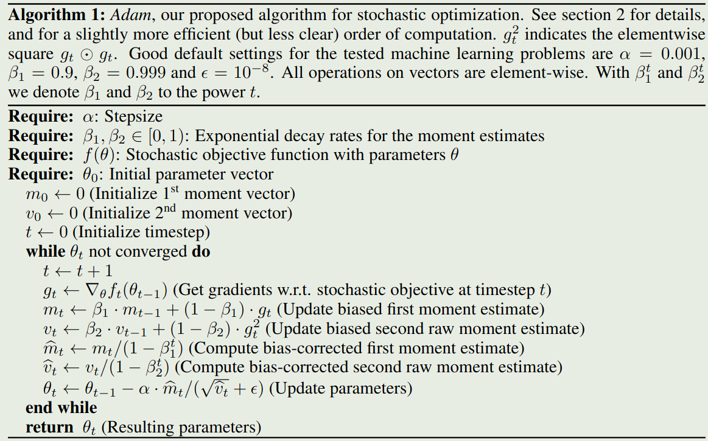

作者提出了 Adam, 一个一阶的优化方法，Adam 更加高效，且具有 scaling invariant 的性质。

## Introduction

作者首先回顾了一下已有优化器的进展，其中主要是 SGD. 在本文中，作者提出了 Adam, 一个针对高维参数空间的一阶优化器，Adam 基于 gradient 的一阶和二阶信息为不同的参数安排不同的学习率。Adam 的来源是 *adaptive moment estimation*. Adam 主要是结合了 AdaGrad 和 RMSProp 两个算法的优点。

Adam 与 RMSProp 的区别在于：

1. RMSProp 在 rescaled gradient 上进行 momentum 的计算然后更新，而 Adam 直接使用一阶和二阶矩来进行估计
2. RMSProp 没有 bias-correction 项

Adam 的主要优势为：

1. 参数更新的量级与 gradient 的 scaling 无关
2. 步长被 stepsize 超参数限制
3. 不要求目标函数 stationary
4. 对于稀疏梯度 work 的比较好
5. 优化器自带 annealing

## Algorithm

Adam 的算法如下图所示

我们优化的目标函数如下

$$
\min_{\theta}\quad f(\theta)
$$

这里 $f$ 一般是一个神经网络。我们记 $f(\theta)$ 在 $\theta_t$ 处的梯度为 $g_t=\nabla_{\theta}f(\theta_t)$.

算法运行时，会更新梯度 $m_t$ 以及梯度二阶矩 $v_t$ 的 exponential moving average. 超参数 $\beta_1,\beta_2$ 负责控制 exponential decay rates. 这里 $m_t$ 和 $v_t$ 分别是一阶动量（均值）和二阶动量（未中心化的 variance）的估计。由于 $m_t$ 和 $v_t$ 的初始化都是 0, 因此他们会引入 bias, 作者在后续通过修正解决了这个问题。

假设 $\epsilon=0$, 如果除了当前时刻 $t$ 之外，之前所有时刻的梯度 $g_i=0,i<t$, 此时

$$
m_t = (1-\beta_t)g_t, v_t=(1-\beta_2)g_t^2
$$

修正后的一阶和二阶矩分别为

$$
\Delta_t = \alpha \frac{(1-\beta_1)\sqrt{1-\beta_2^t}}{(1-\beta_1^t)\sqrt{1-\beta_2}}
$$

当 $t$ 足够大的时候， $\beta_1^t\to0, \beta_2^t\to0$, 此时

$$
\Delta_t = \alpha \frac{1-\beta_1}{\sqrt{1-\beta_2}}
$$

如果之前所有时刻的梯度不全为 0, 则依据 Cauchy-Schwarz 不等式，我们有 $(\mathbb{E}[XY])^2\leq \mathbb{E}[X^2]\mathbb{E}[Y^2]$. 令 $X=1$, $Y=g$, 则我们有

$$
(\mathbb{E}[g])^2\leq \mathbb{E}[g^2] \Rightarrow \frac{|\mathbb{E}[g]|}{\sqrt{\mathbb{E}[g^2]}}\leq 1
$$

此时，我们有

$$
\mathbb{E}[g_t] = \hat{m}_t, \mathbb{E}[g_t^2] = \hat{v}_t
$$

因此，

$$
|\Delta_t| = \left|\alpha\frac{\hat{m}_t}{\sqrt{\hat{v}_t}}\right|=\alpha \left|\frac{|\mathbb{E}[g]|}{\sqrt{\mathbb{E}[g^2]}}\right|\leq\alpha
$$

从而我们有

$$
|\Delta_t| \leq\begin{cases}
\alpha \frac{1-\beta_1}{\sqrt{1-\beta_2}} & \text{ if }1-\beta_1>\sqrt{1-\beta_2}\\
\alpha &\text{ otherwise}
\end{cases}
$$

实际上，$\Delta_t$ 可以理解为一个 trust region, 可以用来保证当前更新的参数不会离原始参数太远。

作者定义 signal-noise ratio (SNR) 为

$$
SNR = \frac{\hat{m}_t}{\sqrt{\hat{v}_t}}
$$

当 SNR 较小时，说明此时的不确定性比较大，因此 $\Delta_t$ 也比较小。这就避免了模型朝错误的方向更新。也就是*automatic annealing*.

$\Delta_t$ 还对 gradient 的 scaling 有不变的性质，这是因为，

$$
\frac{c\cdot\hat{m}_t}{\sqrt{c^2\cdot\hat{v}_t}} = \frac{\hat{m}_t}{\sqrt{\hat{v}_t}}
$$

## Bias Correction

上一节提到，Adam 算法的初始化是存在 bias 的，作者在本届就对齐进行了分析。令 $g$ 为目标函数 $f$ 的梯度，我们希望估计其二阶动量的期望.令 $g_1,\dots,g_T$ 分别为 $\theta_1,\dots,\theta_T$ 处的梯度估计，其中 $g_t\sim p(g_t)$ 是对应时刻梯度的分布。令 $v_0=0$, 在 $t$ 时刻，我们有

$$
v_t = \beta_2 v_{t-1} + (1-\beta_2)g_t^2 = (1-\beta_2)\sum_{i=1}^t\beta_2^{t-i} g_i^2
$$

我们希望计算 $\mathbb{E}[v_t]$ 与 $\mathbb{E}[g_t^2]$ 之间的关系，我们有

$$
\begin{aligned}
\mathbb{E}[v_t]  &= \left[(1-\beta_2)\sum_{i=1}^t\beta_2^{t-i} g_i^2\right]\\
&= \mathbb{E}[g_t^2]\cdot (1-\beta_2)\sum_{i=1}^t\beta_2^{t-i}+\zeta\\
&= \mathbb{E}[g_t^2](1-\beta_2^t)+\zeta
\end{aligned}
$$

其中当 $\mathbb{E}[g_i^2]$ 为 stationary 时，$\zeta=0$, 否则我们可以通过控制 $\beta_2$ 来让 past gradient 保持在一个较小的规模。最后，我们剩下的就是 $1-\beta_2^t$, 这也是我们在算法中进行修正的地方。

对于一阶动量 $m_t$ 的修正也是同理。

## Convergence Analysis

作者在本节中使用了 online learning framework 来分写 Adam 的收敛性。给定一系列 convex cost function $f_1(\theta),\dots,f_T(\theta)$. 在 $t$ 时刻，我们的目标是基于上一个 cost function $f_t(\theta)$ 来预测 $\theta_t$.

作者在这里使用 regret 来分析，记 $f_t(\theta^*)$ 为 $t$ 时刻最优的参数对应的 cost function, regret 定义为

$$
R(T) = \sum_{t=1}^T [f_t(\theta_t) - f_t(\theta^*)]
$$

其中，

$$
\theta^* = \arg\min_{\theta\in\mathcal{X}}\sum_{t=1}^Tf_t(\theta)
$$

则我们有如下的结论

> Theorem 1
> 假设
>
> 1. 函数 $f_t$ 的梯度是有界的，即 $\|\nabla f_t(\theta)\|_2\leq G$, $\|\nabla f_t(\theta)\|_{\infty}\leq G_{\infty}$ 对任意 $\theta\in\mathbb{R}^d$ 都成立
> 2. $\{\theta_1,\dots,\theta_T\}$ 中任意两个参数的距离都是有界的，即 $\|\theta_m-\theta_m\|_2\leq D$, $\|\theta_m-\theta_n\|_{\infty}\leq D_{\infty}$ 对任意 $m,n\in\{1,\dots,T\}$ 都成立
> 3. $\beta_1,\beta_2\in[0,1)$ 满足 $\frac{\beta_1^2}{\sqrt{\beta_2}}<1$
> 令 $\alpha_t=\alpha/\sqrt{t}$, $\beta_{1,t}=\beta_1\lambda^{t-1}$, $\lambda\in(0,1)$, 则我们有
>
> $$
> R(T)\leq \frac{D^2}{2\alpha(1-\beta_1)}\sum_{i=1}^d\sqrt{T\hat{v}_{T,i}}+\frac{\alpha(1+\beta_1)G_{\infty}}{(1-\beta_1)\sqrt{1-\beta_2}(1-\gamma)^2}\sum_{i=1}^d\|g_{1:T,i}\|_2+\sum_{i=1}^d\frac{D_{\infty}^2G_{\infty}\sqrt{1-\beta_2}}{2\alpha(1-\beta_1)(1-\lambda)^2}
> $$

结果说明，当我们的 data feature 稀疏且梯度有界时我们有

$$
\sum_{i=1}^d\|g_{1:T,i}\|_2<< dG_{\infty}\sqrt{T}
$$

以及

$$
\sum_{i=1}^d\sqrt{T\hat{v}_{T,i}}<< dG_{\infty}\sqrt{T}
$$

实际上，对于 Adam 以及 Adamgrad，这个上界可以优化到 $O(\log d\sqrt{T})$.

最终，我们可以证明 Adam 的收敛性

> Corollary 1
> 假设
>
> 1. 函数 $f_t$ 的梯度是有界的，即 $\|\nabla f_t(\theta)\|_2\leq G$, $\|\nabla f_t(\theta)\|_{\infty}\leq G_{\infty}$ 对任意 $\theta\in\mathbb{R}^d$ 都成立
> 2. $\{\theta_1,\dots,\theta_T\}$ 中任意两个参数的距离都是有界的，即 $\|\theta_m-\theta_m\|_2\leq D$, $\|\theta_m-\theta_n\|_{\infty}\leq D_{\infty}$ 对任意 $m,n\in\{1,\dots,T\}$ 都成立
> 则对 $T\geq1$, 我们有
>
> $$
>  \frac{R(T)}{T}=O\left(\frac{1}{\sqrt{T}}\right)
> $$

## Experiment

作者在 logistic regression, MLP, CNN 等三种模型架构上进行了实验。

## Conclusion

作者在本文中提出了 Adam optimizer， 一个基于 AdaGrad 和 RMSProp 优点的优化器，作者通过理论验证了 Adam 的收敛性，然后通过实验验证了 Adam 的有效性。

## References

- [arxiv](https://arxiv.org/pdf/1412.6980)
