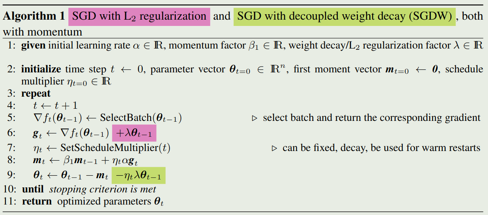
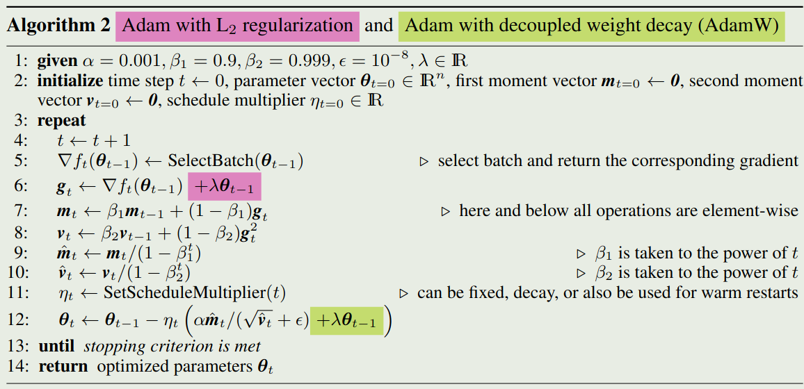

作者提出了一个针对 [Adam](https://maosong.website/p/notes-on-adam/) 优化器的 weight decay 方法

## Introduction

作者首先回顾了动态梯度算法如 AdaGrad, RMSProp, [Adam](https://maosong.website/p/notes-on-adam/) 的进展。已有工作表明动态梯度算法的泛化性要比 SGD with momentum 要差。作者在本文中探究了在 SGD 和 Adam 中使用 L2 regularization 和 weight decay 对最终模型表现的影响。结果表明，模型泛化性较差的原因在于对于 Adam, L2 regularization 的效果要比 SGD 差。

作者有如下发现：

1. L2 regularization 和 weight decay 不等价。在 SGD 中，L2 regularization 是等价的，但是在 Adam 中这个结论不成立。具体来说，L2 regularization 对历史参数的惩罚要小于 weight decay
2. L2 regularization 对 Adam 效果提升有效
3. weight decay 对于 SGD 和 AdamW 都很有效，在 SGD 中，weight decay 与 L2 regularization 等价
4. 最优的 weight decay 取决于 batch, batch 越大，最优的 weight decay 越小
5. 通过 learning rate scheduler 可以进一步提高 Adam 的表现

作者在本文中的主要贡献是通过解耦梯度更新中的 weight decay 来提高 Adam 的 regularization.

作者的主要 motivation 是提升 Adam 表现，让其可以和 SGD with momentum 相比

## Method

Weight decay 的定义如下

$$
\theta_{t+1} = (1-\lambda)\theta_t - \alpha \nabla f_t(\theta_t) \tag{1}
$$

其中 $\lambda$ 是 weight decay rate, $\nabla f_t(\theta_t)$ 是第 $t$ 个 batch 的梯度，$\alpha$ 是学习率。

首先，对于标准的 SGD 来说，weight decay 与 L2 regularization 等价

> Proposition 1
> 对于标准的 SGD 来说，对损失函数 $f_t(\theta_t)$ 执行 weight decay （公式 $(1)$）与对损失函数 $f_t(\theta_t)+\lambda'/2\|\theta_t\|_2^2$ 执行梯度下降算法是等价的，这里 $\lambda'=\lambda/\alpha$。

证明比较简单，只需要写出损失函数的梯度下降更新公式即可。

基于这个结论，大部分优化算法都将 L2 regularization 和 weight decay 看做是等价的。但实际上，这个结论对于 adaptive gradient 方法来说是不成立的。结论如下

 > Proposition 2
> 令 $O$ 为一个 optimizer, 其目标函数为 $f_t(\theta)$,  当不考虑 weight decay 时，梯度更新过程为 $\theta_{t+1}\gets \theta_t-\alpha M_t\nabla f_t(\theta_t)$. 当考虑 weight decay 时，梯度更新过程为 $\theta_{t+1}\gets (1-\lambda)\theta_t-\alpha M_t\nabla f_t(\theta_t)$. 如果 $M_t\neq kI$, 则不存在 $\lambda'$, 使得 $O$ 在优化目标函数 $f_t^{reg}(\theta)=f_t(\theta)+\lambda'/2\|\theta\|_2^2$ 时，不考虑 weight decay 的梯度更新与 $O$ 在优化目标函数 $f_t(\theta)$ 时，考虑 weight decay 的梯度更新等价。

证明比较简单，只需要写出两个目标函数对应的梯度更新公式即可。

作者通过分析发现，在 adaptive gradient 方法中，对于 L2 regularization，梯度和 regularization 是打包在一起考虑的。而 weight decay 是分开考虑的。这就导致了对于梯度比较大的权重，L2 regularization 的学习率较小，从而 regularization 效应减弱。而 weight decay 中，这种效应则不存在。因此 weight decay 的 regularization 效应更强。

作者通过这个分析，给出了一个 weight decay 与 L2 regularization 相等的条件

 > Proposition 3
> 令 $O$ 为一个 optimizer, 其目标函数为 $f_t(\theta)$,  当不考虑 weight decay 时，梯度更新过程为 $\theta_{t+1}\gets \theta_t-\alpha M_t\nabla f_t(\theta_t)$. 当考虑 weight decay 时，梯度更新过程为 $\theta_{t+1}\gets (1-\lambda)\theta_t-\alpha M_t\nabla f_t(\theta_t)$. 如果 $M_t= \mathrm{diag}(s)^{-1}$ ($s_i>0,\forall i$), 则 $O$ 在优化目标函数
>
> $$
>  f_t^{reg}(\theta)=f_t(\theta)+\frac{\lambda'}{2\alpha}\|\theta\odot \sqrt{s}\|_2^2
> $$
>
> 时，不考虑 weight decay 的梯度更新与 $O$ 在优化目标函数 $f_t(\theta)$ 时，考虑 weight decay 的梯度更新等价。

上面的结论显示，对于比较大的 preconditioner $s_i$, 其在相比于 L2 regularization 被 regularized 的效应更强。

为了解耦这两个参数，作者提出了 SGDW 算法，其 weight decay 和梯度更新同时进行，算法如下图所示

在算法中，为了支持同时给 $\alpha$ 和 $\lambda$ 做 scheduling, 作者提出了一个 scaling factor $\eta_t$, $\eta_t$ 由用户定义的 scheduler `SetScheduleMultiplier(t)` 决定。此时，针对 SGD with momentum 的 weight decay 与 L2 regularization 是等价的

同理，我们也可以对 Adam 算法实行同样的操作，算法如下图所示

## Conclusion

作者在本文中分析了 adaptive gradient 方法中 L2 regularization 与 weight decay 的不一致性。基于分析，作者提出了 SGDW 和 AdamW 两个优化算法。

## References

- [arxiv](http://arxiv.org/abs/1711.05101)
