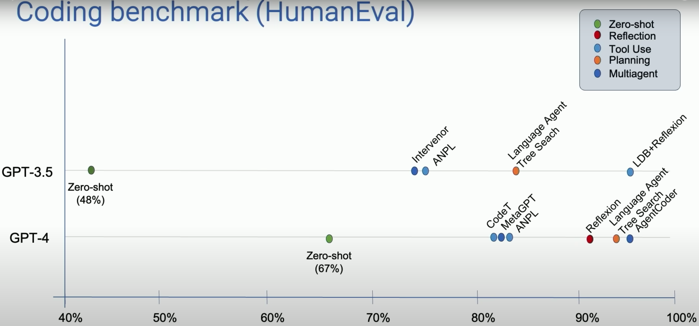

In AI Ascent, Andrew Ng shared his opinion about the agentic workflow, specifically, his talk focused on designs and future works on agentic workflows.

# What is Agent
LLM based agents can be classified into two categories: non-agentic and agentic.
- Non-agentic workflow requires LLM do something in a sequence of steps, usually this requires the "zero-shot" learning ability of LLM.
- Agentic workflow requires LLM do something step by step, and revise its action by thinking or reflection.

Andrew then posts an image shows the agentic workflow can improve the performance of LLM on HumanEval benchmark.

# Agentic Design Reasoning Design Pattern
Agentic design pattern can be divided into following kinds. Where the first two design patterns are robust and the latter two are emerging. 
### Reflection
- Self-Refine: Iterative Refinement with Self-Feedback
- Reflexion: Language Agents with Verbal Reinforcement Learning

## Tool Use
- Gorilla: Large Language Model Connected with Massive APIs
- MM-REACT: Prompting ChatGPT for Multimodal Reasoning and Action

## Planning
- Chain-of-Thought Prompting Elicits Reasoning in Large Language Models
- HuggingGPT: Solving AI Tasks with ChatGPT and its Friends in Hugging Face

## Multi-agent collaboration
- Communicative Agents for Software Development
- AutoGen: Enabling Next-Gen LLM Applications via Multi-Agent Conversation

# Future Perspective
- The set of tasks that AI can do expand dramatically because of agentic workflows.
- We have to get used to delegating tasks to AI agent and wait patiently for response.
- Fast token generation is important. Generating more tokens even from a a lower quality LLM can achieve a good result.

# Reference
- [What's next for AI agentic workflows ft. Andrew Ng of AI Fund](https://www.youtube.com/watch?v=sal78ACtGTc&list=PLOhHNjZItNnOoPxOF3dmq30UxYqFuxXKn)