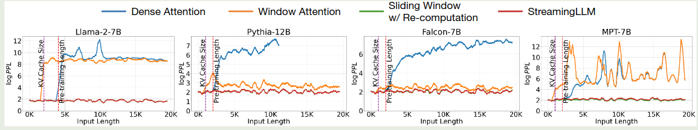
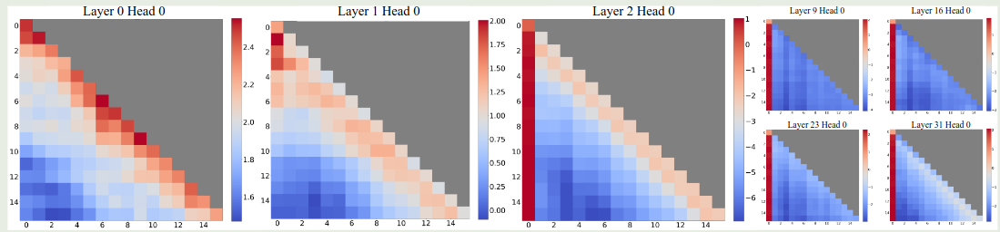
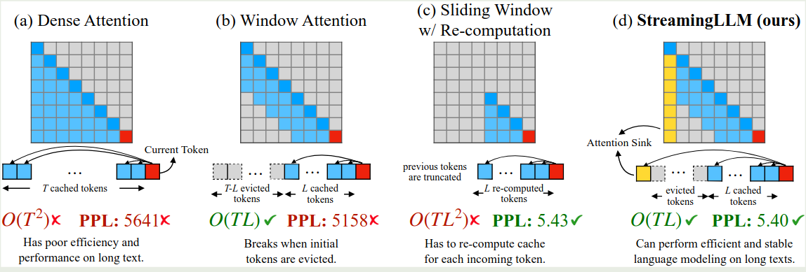
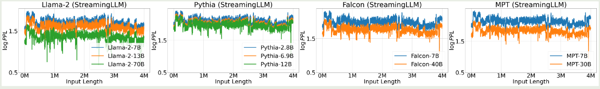
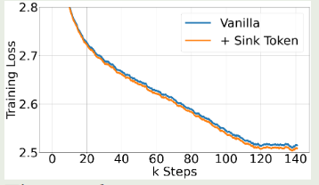
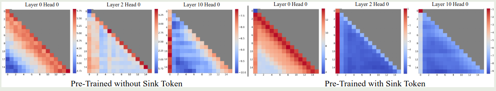
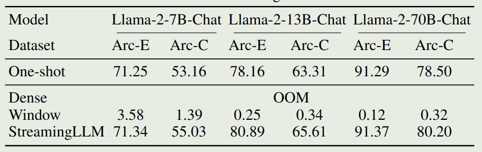

作者提出了 StreamingLLM, 一个基于 attention sink 来提高 sliding window attention 在超长上下文场景下表现的方法。

## Introduction

已有的基于 softmax attention 的架构的问题在于很难扩展到长上下文的场景，主要原因有两点：

1. KV cache 会随着序列长度增加而商城，从而提高 decoding 的 latency
2. 序列长度超过预训练的 context length 之后，模型表现会急剧下降

为了解决这个问题，已有的方法可以分为三类：

1. length extrapolation: 使用 RoPE 或者 AliBi 等方法来扩展 LLM 的 context length, 这类方法的问题是扩展的上下文长度仍然有限，对于 streaming 的场景作用有限
2. context window attention: 扩展 LLM 的上下文长度，如 [flash attention](https://maosong.website/p/notes-on-flashattention/) 等来降低 attention 的计算和内存开销。这类方法也是只在有限的上下文场景下 work
3. Improving LLMs’ Utilization of Long Text: 更好利用长上下文的数据

基于已有的工作的发现，作者提出了本文研究的核心问题：

> 如何在不损失模型表现和效率的情况下，提高模型在无限长上下文场景下的表现。

为了解决这个问题，作者首先分析了 sliding window attention 的不足，作者发现，sliding window attention 在超过 KV cache size 之后，表现也会急剧下降。作者通过实验发现，sliding window attention 表现急剧下降的原因在于 **attention sink**, 也就是模型损失了对于初始 token 的关注，从而导致模型表现下降。

基于 attention sink, 作者设计了 StreamingLLM, 用于提高 sliding window attention 在长上下文场景下的表现，结果发现，模型的表现有了大幅度的提升。

作者还进一步在预训练阶段加入了 sink token 充当初始 token, 进一步提高模型的表现。

## Method

### Attention Sink

作者首先探究了一下 softmax attention 以及 sliding window attention 性能下降的节点，实验结果如下图所示

可以看到，softmax attention 性能急剧下降的节点为 pre-training 的 context length; 而 sliding window attention 性能急剧下降的节点为 KV cache size.

接下来，作者分析了一下不同 layer 的 attention 分布情况，如下图所示

可以看到，初始的 2 层 layer 里 attention logits 的分布比较均匀。但是在后续的 layer 里，第一个 token 的权重都大幅度上升。

作者分析原因认为，sliding window attention 在超过 KV cache size 之后性能急剧下降的主要原因是初始 token 不再参与 softmax 的计算，这导致了 softmax 的计算出现了比较大的变化，从而模型的表现开始下降。

为了探究初始 token 对最终模型表现的影响因素是语义层面还是位置层面的，作者将初始的 token 替换为 `\n`, 并比较了模型的表现，结果如下表所示

| Llama-2-13B      | PPL (↓) |
| ---------------- | ------- |
| 0 + 1024(Window) | 5158.07 |
| 4 + 1020         | 5.40    |
| 4"\n"+1020       | 5.60    |

可以看到，把初始的四个 token 替换为 `\n`, 并不影响模型最终的表现，这说明是初始 token 的位置信息在发挥作用。

作者接下来探究了一下模型架构的影响，实验结果如下表所示

| Cache Config | 0+2048  | 1+2047 | 2+2046 | 4+2044 | 8+2040 |
| ------------ | ------- | ------ | ------ | ------ | ------ |
| Falcon-7B    | 17.90   | 12.12  | 12.12  | 12.12  | 12.12  |
| MPT-7B       | 460.29  | 14.99  | 15.00  | 14.99  | 14.98  |
| Pythia-12B   | 21.62   | 11.95  | 12.09  | 12.09  | 12.02  |
| Cache Config | 0+4096  | 1+4095 | 2+4094 | 4+4092 | 8+4088 |
| Llama-2-7B   | 3359.95 | 11.88  | 10.51  | 9.59   | 9.54   |

可以看到，不同的模型架构都存在这个问题，这说明 sliding window attention 的影响与架构无关。并且，作者认为，使用初始 4 个 token 就可以有效的避免模型的性能下降，进一步增加初始 token 的数量不会有进一步提升。

作者分析 attention sink 出现的原因在于，

1. 初始的 token 对于后续所有的 token 都是可见的，因此其会携带一些信息
2. 在预训练阶段，模型并没有一个一致的初始 token 来标注起始信息，这导致模型会默认使用第一个 token 来储存一些信息。

为了解决这个问题，作者就提出了缓存初始 token 的方法，具体做法就是，在 sliding window attention 的基础上，我们还会加上初始 token 的信息，作者展示示意图如下所示

也就是说，我们初始 token 始终会参与计算（论文中初始 token 数量为 4），然后我们会维持一个大小为 3 的 KV cache 队列来进行最终 sliding window attention 的计算，这样，每次计算 attention 的时候，我们就会使用 $\# \text{iniital token} + \# \text{sliding window token}$ 这么多的 token 来计算 attention. 作者对比了不同 attention 的计算方式，如下图所示

前面是在 inference 阶段进行优化的，作者现在进一步探究在 pre-training 阶段加入 attention sink 参与训练对模型表现的影响。

[[softmax-off-by-one]] 提出了我们应该加入一个 zero sink token, 其计算公式如下

$$
\mathrm{softmax}_1(x)_i = \frac{\exp(x_i)}{1 + \sum_{j=1}^N \exp(x_j)}
$$

这里 $x\in\mathbb{R}^N$ 是输入的序列。我们可以将 sink token 视为一个 key 以及 value 都是 0 向量的特殊 token.

在本文中，作者使用了一个可学习的 sink token. 作者对比了原始 softmax attention, 使用 zero sink attention, learnable sink attention 三种方法的表现，结果如下表所示

| Cache Config   | 0+1024 | 1+1023 | 2+1022 | 4+1020 |
| -------------- | ------ | ------ | ------ | ------ |
| Vanilla        | 27.87  | 18.49  | 18.05  | 18.05  |
| Zero Sink      | 29214  | 19.90  | 18.27  | 18.01  |
| Learnable Sink | 1235   | 18.01  | 18.01  | 18.02  |

可以看到 zero sink 仍然需要一部分初始 token 来维持模型的表现。作者在论文中推荐使用 learnable sink.

## Experiments

作者首先验证了 StreamlingLLM 在不同架构上的表现，结果如下图所示

实验结果显示，StreamingLLM 可以扩展到 4M 的上下文

接下来，作者探究了以下在 Pretraining 阶段加入 learnable sink token 对模型表现的影响，结果如下图所示

可以看到，加入 sink token 之后对模型的表现没有显著影响。并且，模型在下游任务上的表现与标准的 softmax attention 表现差不多。

作者还对 StreamlingLLM 进行了可视化，结果如下图所示

作者进一步评估了 StreamingLLM 在下游任务上的表现，我们主要关注一下 ARC 上的表现，结果如下图所示

可以看到，full attention 出现了 OOM error, 而 sliding window attention 虽然避免了 OOM 的问题，但是其表现非常差。而 StreamingLLM 则进一步提高了 Sliding Window attention 的表现。

## Conclusion

作者在本文中提出了 StreamingLLM, 一个在 Sliding window attention 中加入 sink token 来避免超过 cache size 之后模型表现急剧下降的问题。作者详细介绍了 attention sink 现象以及解决方法。

## References

- [Efficient Streaming Language Models with Attention Sinks](https://openreview.net/forum?id=NG7sS51zVF)
