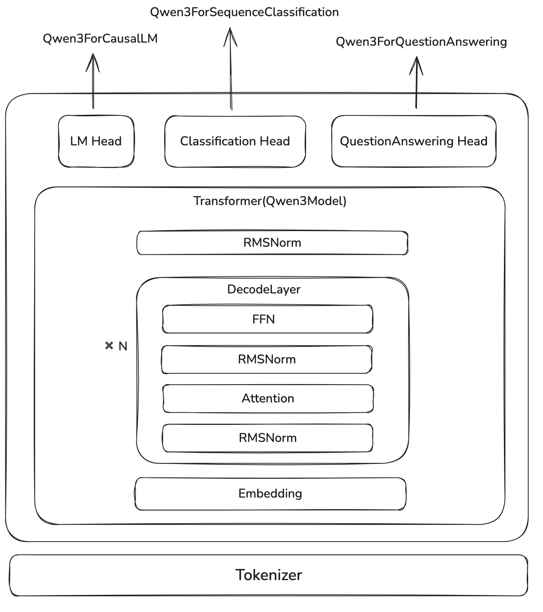

# CS336 Assignment 1

Transformer实现

我们采用top-down的形式构建transformer的代码

---

# 架构



我们以Qwen3的代码为例子讲解Assignment1的代码实现

---
我们通过在transformer架构上加上一个linear layer就可以完成不同的下游任务，比如：

- `Qwen3ForQuestionAnswering`
- `Qwen3ForCausalLM`
- `Qwen3ForSequenceClassification`

因此，大语言模型是transformer的一个附加产物

---

## CausalLM

编写大语言模型的第一步为定义`Qwen3ForCausalLM`

```python
class CausalLM(nn.Module):
    def __init__(self, config):
        self.model = Transformer(config)
        self.lm_head = nn.Linear(config.hidden_size, config.vocab_size, bias=False)

    def forward(self, ...):
        outputs = self.model(***)
        logits = self.lm_head(outputs)

        return logits
```

这里`lm_head`的作用就是构建embedding space到vocabulary的映射，即 $\mathbb{R}^d\to\mathbb{R}^{|V|}$

---

## Transformer

transformer部分包括四个部分：

1. Embedding Layer：将token映射到embedding space
2. layers：Transformer的主体部分，由 $n$ 个 `DecodeLayer` 组成
3. Norm：在输出之前，进行一次Normalization
4. Position Embedding：由于输入的sequence长度是固定的，因此我们提前计算好每一层的position embedding

---
`Transformer`部分的代码

```python
class Transformer(nn.Module):
    def __init__(self, config):
        self.embedding = nn.Embedding(config.vocab_size, config.hidden_size, config.pad_token_id)
        self.layers = nn.ModuleList(
           [DecodeLayer(config, layer_idx) for layer_idx in range(config.num_hidden_layers)]
          )
        self.norm = RMSNorm(config.hidden_size, eps=config.rms_norm_eps)
        self.rotary_emb = RotaryEmbedding(config)

    def forward(self, input_ids,...):
        input_embeds = self.embedding(input_ids)
  
        hidden_states = input_embeds
        position_embeddings = self.rotary_emb(hidden_states, position_ids)

        for decode_layer in self.layers:
            layer_outputs = decode_layer(hidden_states, position_ids, position_embeddings)
            hidden_states = layer_outputs[0]

        hidden_states = self.norm(hidden_states)
  
        return logits
```

---

## DecodeLayer

`DecodeLayer` 就是transformer的核心部分，里面包含四个模块：

1. Pre-Normalization：一般是RMSNorm或者LayerNorm
2. Attention：self-attention
3. Post-Normalization：与Pre-Normalization一致
4. MLP：FFN，SwiGLU或者MoE

`DecodeLayer` 还会使用residual connection来防止梯度消失

---
`DecodeLayer`部分的代码

```python line_numbers
class DecodeLayer(nn.Module):
    def __init__(self, config, layer_idx):
        self.attn = Attention(config, layer_idx)
        self.mlp = MLP(config)
        self.pre_norm = RMSNorm(config.hidden_size, eps=config.rms_norm_eps)
        self.post_norm = RMSNorm(config.hidden_size, eps=config.rms_norm_eps)

    def forward(self, hidden_states, position_ids, position_embeddings):
        residual = hidden_states
        hidden_states = self.pre_norm(hidden_states)
        hidden_states = self.attn(hidden_states, position_ids, position_embeddings)
        # residual
        hidden_states = hidden_states + residual

        residual = hidden_states
        hidden_states = self.post_norm(hidden_states)
        hidden_states = self.mlp(hidden_states)
        # residual
        hidden_states = hidden_states + residual

        return hidden_states
```

---

我们接下来按照

1. Normalization
2. MLP
3. Attention
4. Position embedding

的顺序来介绍

---

## RMSNorm

RMSNorm的作用和LayerNorm是一样的，但是实现上更简单

$$
\mathrm{LayerNorm}(x) = \frac{x-\mathbb{E}[x]}{\sqrt{\mathrm{var}[x]+\epsilon}}\odot \beta + \gamma
$$

其中 $\beta,\gamma\in\mathbb{R}^d$ 是可学习的参数

$$
\mathrm{RMSNorm}(x) = \frac{x}{\sqrt{\|x\|_2^2+\epsilon}}\odot \gamma
$$

其中 $\gamma\in\mathbb{R}^d$是可学习的参数

---
RMSNorm代码实现

```python
class RMSNorm(nn.Module):
    def __init__(self, d, eps):
        self.weight = nn.Parameter(torch.ones(d))
        self.eps = eps

    def forward(self, x):
        input_dtype = x.dtype
        x = x.to(torch.float32)
        variance = x.pow(2).mean(-1, keepdim=True)
        x = x * torch.rsqrt(variance + self.eps)
        return self.weight * x.to(input_dtype)
```

---

## MLP

现在大语言模型的MLP使用的激活函数一般都是SwiGLU, 其定义为

$$
\mathrm{SwiGLU}(x) = x\odot \sigma(x)
$$

其中 $\sigma(\cdot)$ 是sigmoid函数
MLP的定义为

$$
y = W_2(W_3x\odot \mathrm{SwiGLU}(W_1x))
$$

其中 $W_3,W_1\in\mathbb{R}^{d_{ff}\times d}$, $W_2\in\mathbb{R}^{d\times d_{ff}}$

一般地，由于FFN只有两个权重矩阵，且 $d_{ff}=4d$, 在SwiGLU中，为了保证参数量一致，其隐藏层大小设置为 $d_{ff}'=\frac23d_{ff}=\frac83 d$.

---
MLP的代码如下所示

```python
def SwiGLU(x):
    return x * torch.sigmoid(x)

class MLP(nn.Module):
    def __init__(self, d, d_ff):
        self.gate_proj = nn.Linear(d, d_ff, bias=False)
        self.up_proj = nn.Linear(d, d_ff, bias=False)
        self.down_proj = nn.Linear(d_ff, d, bias=False)

    def forward(self, x):
        return self.down_proj(SwiGLU(self.gate_proj(x)) * self.up_proj(x))
```

---

## Attention

我们先不考虑position embedding，直接看attention，attention定义为

$$
\mathrm{Attention}(X) = \mathrm{softmax}\left(\frac{QK^T}{\sqrt{d}}\right)V\in\mathbb{R}^{m\times d}
$$

其中$X\in\mathbb{R}^{m\times d}$,

$$
Q = W_QX\in\mathbb{R}^{m\times d},\quad
K =W_KX\in\mathbb{R}^{n\times d},\quad
V = W_VX\in\mathbb{R}^{n\times d}
$$

---
在自回归模型里，我们还会加上mask, 让每个token只能看见前面的token的信息

$$
\mathrm{Attention}(X) = \mathrm{softmax}\left(\frac{QK^T}{\sqrt{d}}\odot M\right)V
$$

其中

$$
M = [M_{ij}] = \begin{cases}
1, &\text{ if } i < j\\
0, &\text{ otherwise}
\end{cases}
$$

---

self-attention的代码如下：

```python
def scaled_dot_product_attention(Q, K, V, mask) -> torch.Tensor:
    d_k = Q.shape[-1] # d_k
    scaled_factor = 1 / d_k**0.5

    scores = torch.einsum("... s_q d_k, ... s_k d_k -> ... s_q s_k", Q, K)
    scores *= scaled_factor

    if mask is not None:
        scores = scores.masked_fill(mask == 0, float("-inf"))

    scores = scores.softmax(dim=-1)

    return torch.einsum("... s_q s_k, ... s_k d_v -> ... s_q d_v", scores, V)
```

---

## Multi-Head Attention

Multi-Head Attention定义如下
$$
\mathrm{MultiHeadAttention}(X) = [\mathrm{Attention}_1(X),\dots,\mathrm{Attention}_h(X)]W_o\in\mathbb{R}^{m\times d}
$$
其中 $W_o\in\mathbb{R}^{d\times d}$, 且每一个Attention heads的维度会从 $d\to d/h$.

Multi-Head Attention的主要作用为：

1. 让不同的head关注不同的信息
2. 并行计算，提高计算效率

---
MHA代码

```python
class MultiHeadAttention(nn.Module):
    def __init__(self, d_model: int, num_heads: int) -> None:
        self.q_proj = Linear(d_model, d_model)
        self.k_proj = Linear(d_model, d_model)
        self.v_proj = Linear(d_model, d_model)
        self.output_proj = Linear(d_model, d_model,)

    def forward(self, x, position_embeddings, mask):
        Q = rearrange(self.q_proj(x), "... seq_len (num_heads head_dim) -> ... num_heads seq_len head_dim", 
            num_heads=self.num_heads, head_dim=self.head_dim)
        K = rearrange( self.k_proj(x), "... seq_len (num_heads head_dim) -> ... num_heads seq_len head_dim", 
            num_heads=self.num_heads, head_dim=self.head_dim)

        if mask is None:
            mask = torch.ones(Q.shape[-2], K.shape[-2])
            mask = torch.tril(mask)

        if position_embeddings is not None:
            sin, cos = position_embeddings
            Q = apply_rotary_pos_emb(Q, sin, cos)
            K = apply_rotary_pos_emb(K, sin, cos)

        V = rearrange(self.v_proj(x), "... seq_len (num_heads head_dim) -> ... num_heads seq_len head_dim", 
            num_heads=self.num_heads, head_dim=self.head_dim)

        output = scaled_dot_product_attention(Q, K, V, mask=mask)
        output = rearrange(output, "... num_heads seq_len head_dim -> ... seq_len (num_heads head_dim)")
        return self.output_proj(output)
```

---

## Position Encoding

Attention对于输入的顺序是不敏感的，也就是
$$
\mathrm{Attention}(Q, \Pi K, \Pi V) = \mathrm{Attention}(Q, K, V)
$$
这里 $\Pi\in \{0,1\}^{d\times d}$ 是一个置换矩阵(permutation matrix)

[[Transformer]]的解决方法是在query和key上加上位置信息：

$$
Q' = Q + PE(Q),\ K'=K + PE(K)
$$

这样

$$
\mathrm{Attention}(Q, K, V) = \mathrm{softmax}\left(\frac{(Q + PE(Q))(K + PE(K))^T}{\sqrt{d}}\right)V\in\mathbb{R}^{m\times d}
$$
就包含了位置信息

---

### 绝对位置编码

[[Transformer]]的使用的位置编码如下所示

$$
PE(pos, 2i) = \sin\left(\frac{pos}{10000^{2i/d}}\right)
$$
$$
PE(pos, 2i+1) = \cos\left(\frac{pos}{10000^{2i/d}}\right)
$$

---

### RoPE

苏剑林老师提出了[[RoPE]]，现在已经被广泛使用

$$
q' = R_{\theta,m}^dq, k' = R_{\theta,n}^d k
$$

这样 $\langle q, k\rangle$ 就**仅**包含两者的相对位置信息

$$
\langle q_m, k_n\rangle = x^TW_qR_{\theta, n-m}^d W_kx_n
$$

---
RoPE的矩阵定义如下

$$
R_{\theta,m}^d = \mathrm{diag}(M_1,\dots,M_{d/2})
$$
其中

$$
M_i = \begin{bmatrix}
    \cos m\theta_i & -\sin m\theta_i\\
    \sin m\theta_i & \cos m\theta_i
\end{bmatrix}
$$
这里
$$
\theta_i = \frac{1}{10000^{2(i-1)/d}}, i\in\{1,2,\dots,d/2\}
$$

---
简化后得到

$$
R_{\theta,m}^dq = \begin{bmatrix}
\cos m\theta_0\\
\cos m\theta_0\\
\vdots\\
\cos m\theta_{d/2}\\
\cos m\theta_{d/2}\\
\end{bmatrix}\odot \begin{bmatrix}
x1\\
x2\\
\vdots\\
x_{d-1}\\
x_d\\
\end{bmatrix} + \begin{bmatrix}
\sin m\theta_0\\
\sin m\theta_0\\
\vdots\\
\sin m\theta_{d/2}\\
\sin m\theta_{d/2}\\
\end{bmatrix}\odot
\begin{bmatrix}
-\ x_2\\
x_1\\
\vdots\\
-x_d\\
x_{d-1}\\
\end{bmatrix}
$$

---

### RoPE代码naive实现

`RotaryEmbedding`代码

```python
class RotaryEmbedding(nn.Module):
    def __init__(self, dim):
        self.inv_freq = 1.0 / (theta ** (torch.arange(0, dim, 2)[: (dim // 2)].float() / dim))

    def forward(self, x, position_ids):
        freqs = einsum(torch.arange(self.max_seq_len), 
      self.inv_freq, "seq_len, d_k_half -> seq_len d_k_half")[token_positions]

        sin = torch.sin(freqs)
        cos = torch.cos(freqs)

        return sin, cos
```

---
计算部分代码

```python
def apply_rotary_pos_emb(x: torch.Tensor, sin: torch.Tensor, cos: torch.Tensor) -> torch.Tensor:
    x_even = x[..., ::2]  # (seq_len, d_k_half)
    x_odd = x[..., 1::2]  # (seq_len, d_k_half)
    odds = cos * x_even - sin * x_odd  # (...,seq_len, d_k_half)
    evens = sin * x_even + cos * x_odd  # (...,seq_len, d_k_half)
    stacked = torch.stack((odds, evens), -2)  # (...,seq_len, 2, d_k_half)
    stacked_trans = rearrange(
        stacked, "... seq_len double d_k_half -> ... seq_len d_k_half double"
    )  # (...,seq_len, d_k_half, 2)
    out = rearrange(
        stacked_trans, "... seq_len d_k_half double -> ... seq_len (d_k_half double)"
    )  # (..., seq_len, d_k)
    return out
```

---

### RoPE 标准实现

`RotaryEmbedding`代码 (LLaMA)

```python
class LlamaRotaryEmbedding(nn.Module):
    def __init__(self, config: LlamaConfig, device=None):
        inv_freq = inv_freq = 1.0 / (base ** (torch.arange(0, dim, 2, dtype=torch.int64) / dim)) # d_k_half

    def forward(self, x, position_ids):
        # (bsz, d_k_half, 1)
        inv_freq_expanded = self.inv_freq[None, :, None].expand(position_ids.shape[0], -1, 1) 
        # (bsz, 1, seq_len)
        position_ids_expanded = position_ids[:, None, :]
        # (bsz, seq_len, d_k_half)
        freqs = (inv_freq_expanded @ position_ids_expanded).transpose(1, 2)
        emb = torch.cat((freqs, freqs), dim=-1) # (..., seq_len, d_k)
        cos = emb.cos() # (..., seq_len, d_k)
        sin = emb.sin() # (..., seq_len, d_k)

        return cos, sin
```

---
计算部分代码

```python
def rotate_half(x):
    x1 = x[..., : x.shape[-1] // 2]
    x2 = x[..., x.shape[-1] // 2 :]
    return torch.cat((-x2, x1), dim=-1)


def apply_rotary_pos_emb(q, k, cos, sin, position_ids=None, unsqueeze_dim=1):
    cos = cos.unsqueeze(unsqueeze_dim)
    sin = sin.unsqueeze(unsqueeze_dim)
    q_embed = (q * cos) + (rotate_half(q) * sin)
    k_embed = (k * cos) + (rotate_half(k) * sin)
    return q_embed, k_embed

```

---

# 参考文献

1. [Qwen3 transformer source code](https://github.com/huggingface/transformers/blob/main/src/transformers/models/qwen3/modeling_qwen3.py)
2. [position encoding blog](https://huggingface.co/blog/designing-positional-encoding)
