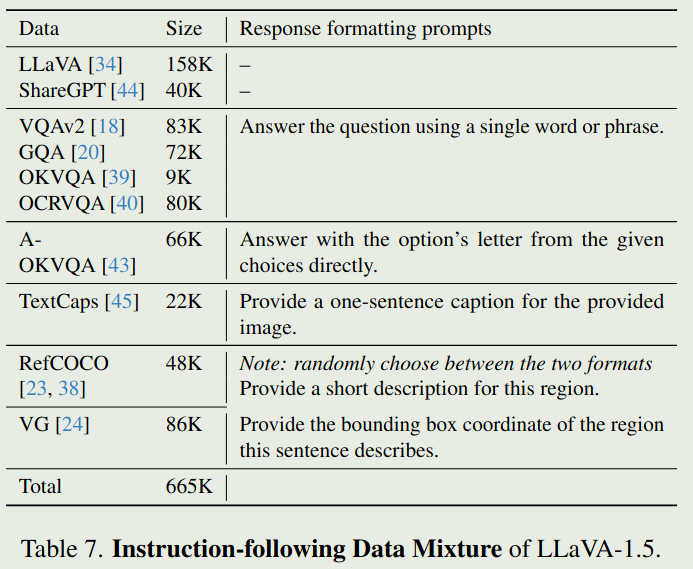
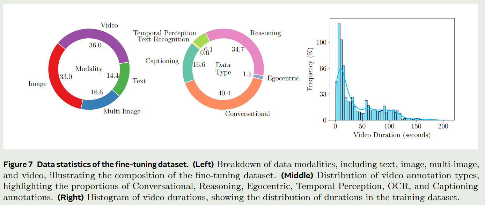
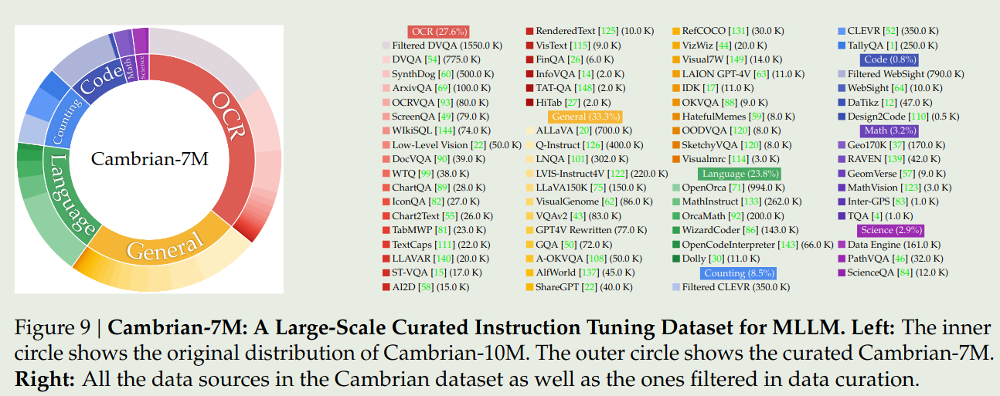
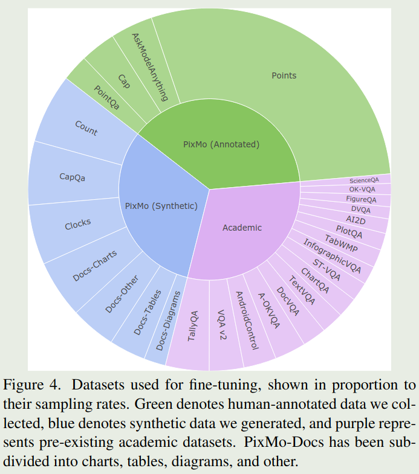
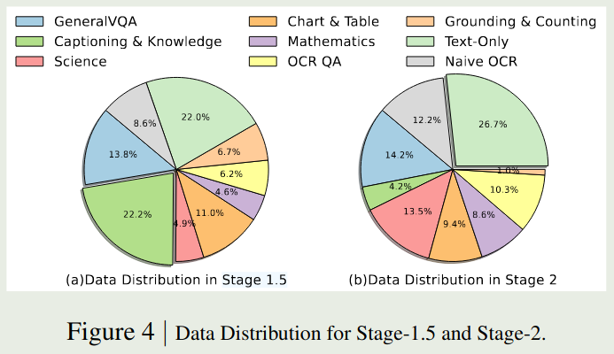
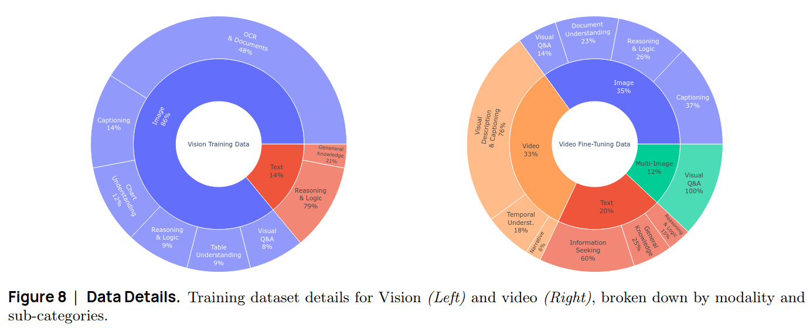
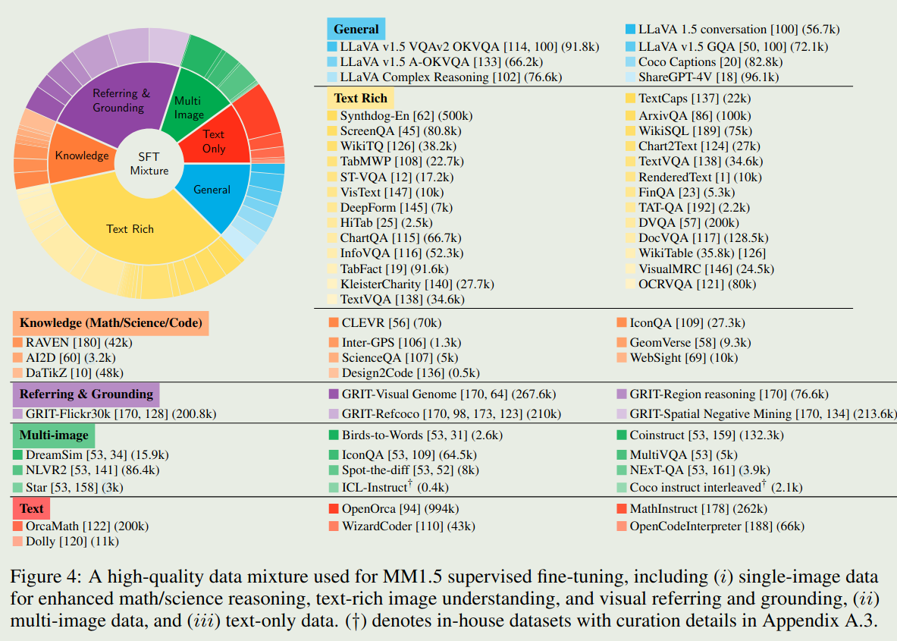

# 介绍

简单总结一下已有的介绍了训练数据配比的多模态大模型，方便后续使用。
根据之前看的一些论文进行总结，如有缺漏，欢迎批评指正。

# 相关工作

## LLaVA

[LLaVA 1.5](https://arxiv.org/abs/2310.03744) SFT数据配比如下：

## LLaVA-OneVision

[LLaVA OneVision](http://arxiv.org/abs/2408.03326) 的数据集统计在表16里，这里总结一下数据配比(总量为3.15M)

| Category        |   Ratio |
|:----------------|--------:|
| general vqa     |   36.1 |
| Doc/Chart/Screen      |    20.6 |
| Math/Reasoning             |   20.1 |
| general OCR   |   8.9 |
| text only       |   14.3 |

## Apollo

[Apollo](http://arxiv.org/abs/2412.10360) 是Meta发布的一个视频理解多模态大模型，其数据集没有开源，论文中给出了其训练数据配比

## Cambiran-1

[Cambiran-1](http://arxiv.org/abs/2406.16860) 是纽约大学提出了一个多模态大模型系列，论文发表在了 NeurIPS 2024(Oral) 上，作者给出了 Cambrain-10M 和 Cambrain-7M 两个数据集，Cambrain-7M 的数据分布如下

## Idefics

Idefics系列(1/2/3)是huggingface提出的视觉多模态大模型系列，在 [Idefics2](https://arxiv.org/abs/2405.02246) 中，作者构建了The Cauldron数据集，其数据配比在表14里面。总结如下：

| Category        |   Ratio |
|:----------------|--------:|
| general vqa     |   11.02 |
| captioning      |    5.14 |
| OCR             |   17.47 |
| chart/figures   |   14.05 |
| table           |   11.3  |
| reasoning       |   10.32 |
| textbook        |    1.58 |
| difference      |    2.38 |
| screenshot2code |    0.31 |
| text only       |   26.41 |

在 [Idefics3](http://arxiv.org/abs/2408.12637) 中，作者基于The Cauldron进行了扩展，最终数据集的比例如下：

## Molmo

[Molmo](http://arxiv.org/abs/2409.17146) 是Allen AI发布的一个多模态大模型，其SFT数据配比如下

## Eagle 2/2.5

Eagle (1/2/2.5) 是NVLab提出了系列多模态大模型，[Eagle 2](http://arxiv.org/abs/2501.14818) 给出了 stage 1.5 和 stage 2的数据配比

[Eagle 2.5](http://arxiv.org/abs/2504.15271) 在 Eagle 2的基础上加入了一些 long context 数据，其数据列表在表11里

## SmolVLM

[SmolVLM](http://arxiv.org/abs/2504.05299) 是huggingface开发的一款轻量化视觉多模态大模型，论文中的数据配比如下：

## MM1/1.5

[MM1](http://arxiv.org/abs/2403.09611) 通过实验确定了训练数据的配比：

| Category        |   Ratio |
|:----------------|--------:|
| interleaved image-text     |   45 |
| imagetext       |    45 |
| text only       |   10 |

[MM1.5](http://arxiv.org/abs/2409.20566) 的SFT数据配比如下：

## InternVL

[InternVL2.5](http://arxiv.org/abs/2412.05271) 在论文里总结了其使用的pretraining数据和SFT数据，但是没有具体的数据配比，请参考论文的表4和表5

SFT数据配比

| Category      | Ratio   |
|:--------------|:--------|
| single-image  | 45.92%  |
| multi-image   | 9.37%   |
| video        | 39.79%  |
| pure-text    | 4.92%   |

## MiniCPM V

[MiniCPM V](http://arxiv.org/abs/2408.01800) 是 OpenBMB发布的轻量化多模态大模型，其在表1和表2列出了ptraining和SFT数据的具体量级和类别。

## Flash-VL

| Category            | Ratio |
|:--------------------|------:|
| Special Enhancement |    4% |
| Text                |   21% |
| Caption             |    4% |
| Chart               |   16% |
| Math                |   11% |
| OCR                 |    3% |
| Code                |    8% |
| General             |   33% |

具体数据参见[原论文](http://arxiv.org/abs/2505.09498)

# 参考文献

- [LLaVA 1.5](https://arxiv.org/abs/2310.03744)
- [LLaVA OneVision](http://arxiv.org/abs/2408.03326)
- [Apollo](http://arxiv.org/abs/2412.10360)
- [Cambiran-1](http://arxiv.org/abs/2406.16860)
- [Idefics2](https://arxiv.org/abs/2405.02246)
- [Idefics3](http://arxiv.org/abs/2408.12637)
- [Molmo](http://arxiv.org/abs/2409.17146)
- [Eagle 2](http://arxiv.org/abs/2501.14818)
- [Eagle 2.5](http://arxiv.org/abs/2504.15271)
- [SmolVLM](http://arxiv.org/abs/2504.05299)
- [MM1](http://arxiv.org/abs/2403.09611)
- [MM1.5](http://arxiv.org/abs/2409.20566)
- [InternVL2.5](http://arxiv.org/abs/2412.05271)
- [MiniCPM V](http://arxiv.org/abs/2408.01800)
