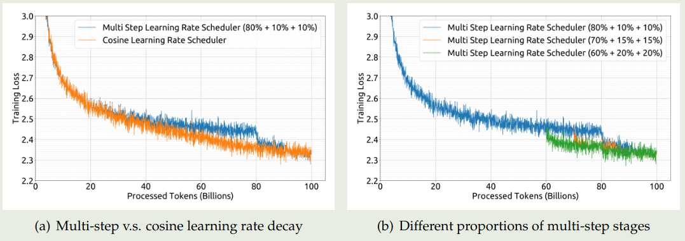
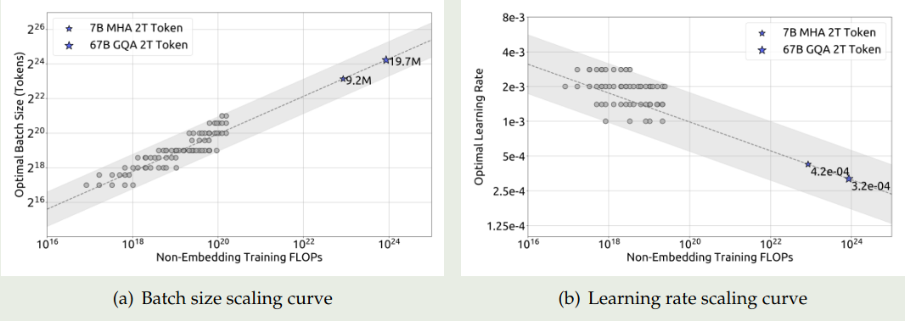
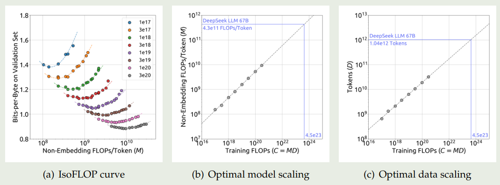
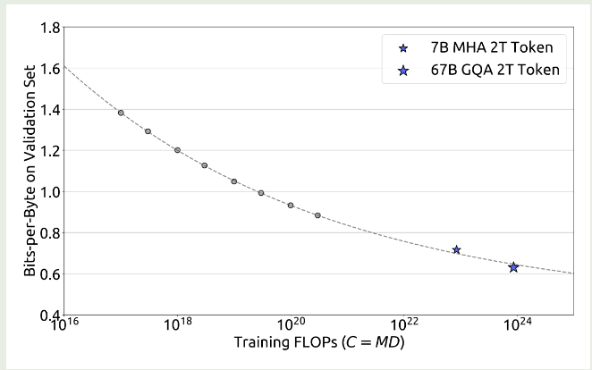
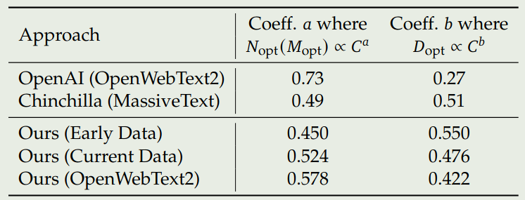

DeepSeek 在 2024 年 1 月 5 日发布了 DeepSeek LLM, 包括 7B 和 67B 两个 size, 作者主要强调了对于 scaling law 的探究

## Introduction

已有的 scaling law 如 [Kaplan](https://maosong.website/p/kaplan-scaling-law/) 和 [Chinchilla](https://maosong.website/p/chinchilla-scaling-law/) 介绍了 model size, dataset size, compute budget 与模型表现之间的关系。在本文中，作者进一步探究了 learning rate 和 batch size 等超参数与模型表现之间的关系。基于发现的 scaling law, 作者为不同大小的模型设置了最优的超参数。并且，作者还发现不同数据集与模型表现之间的关系。

最终，基于这些实验结果，作者提出了 DeepSeek LLM, 模型使用 **2T token** 进行预训练，使用 1M samples 进行后训练，后训练包括 SFT 以及 [DPO](https://maosong.website/p/notes-on-dpo/).

## Pre-training

### Architecture

DeepSeek-LLM 的架构与 LLaMA 基本相同，作者在 67B 的模型上使用了 [GQA](https://maosong.website/p/notes-on-gqa/) 来提高 inference 效率。最终模型的配置如下表所示

| Params              |    7B  |   67B  |
|---------------------|--------|--------|
| $n_{\text{layers}}$             | $30$     | $95$     |
| $d_{\text{model}}$              | $4096$   | $8192$   |
| $n_{\text{heads}}$            | $32$     | $64$     |
| $n_{\text{kv\_heads}}$           | $32$     | $8$      |
| Context Length      | $4096$   | $4096$   |
| Sequence Batch Size | $2304$   | $4608$   |
| Learning Rate       | $4.2e-4$ | $3.2e-4$ |
| Tokens              | 2T     | 2T     |

### Data

作者主要从 Common Crawl 构建预训练数据，数据处理过程包括：去重，过滤以及 remixing 三个步骤。

对于 tokenizer, 作者使用了 [BBPE](https://maosong.website/p/hands-on-llm1-tokenizer/) 算法，tokenizer 的大小设置为 100,000, 最终的 tokenizer 大小为 102400.

### Hyper Parameters

作者主要对比了一下不同 learning rate schedule 的表现：

1. cosine learning schedule
2. multi-step learning rate schedule: 包含三个 Stage, 第一个 stage 保持最大学习率，第二个 stage 将学习率降低为最大学习率的 $31.6\%$, 第三个 stage 降低为最大学习率的 $10\%$.

对比的实验结果如下图所示

实验结果显示，multi-step learning rate scheduler 的表现与 cosine learning rate 表现差不多。并且，multi-step learning rate scheduler 对于 continue pretraining 支持更好。因此在本文中作者使用了 multi-step learning rate scheduler.

### Infra

作者使用了数据并行，张量并行，序列并行以及 1F1B pipeline 并行。作者还使用了 [flash attention](https://maosong.website/p/notes-on-flashattention/) 来提高硬件利用率。

## Scaling Law

本节中，作者分析了 scaling law, 主要有以下三点：

1. 构建了针对 learning rate 和 batch size 的 scaling law
2. 作者使用 non-embedding FLOPs/token $M$ 来表示 model scale
3. 预训练数据的质量对最后中的 scaling 影响很大

作者首先构建了针对 batch size 和 learning rate 的 scaling law, 结果显示最优的 learning rate 和 batch size 范围都比较广，这个结论与 [Kaplan](https://maosong.website/p/kaplan-scaling-law/) 一致。

接下来，作者构建了 batch size $B$, learning rate $\eta$ 与 compute budget $C 之间的关系，实验结果如下图所示

拟合得到的曲线为

$$
\begin{aligned}
\eta_{opt} &= 0.3118* C^{-0.1250}\\
B_{opt} &= 0.2920 * C^{0.3271}
\end{aligned}
$$

可以看到，随着 compute budget 增加，$B_{opt}$ 也逐渐增加，而 $\eta_{opt}$ 逐渐减小。并且，最优参数的范围都比较广。

接下来，作者进一步探究了 batch size 与 generalization error $L$ 之间的关系。作者希望找到 model scale $N$, data scale $D$ 与 compute budget $C$ 之间的关系，即

$$
N_{opt} \varpropto C^a,D_{opt} \varpropto C^b
$$

compute budget 与 model scale, data scale 之间的关系可以近似表示为 $C=6ND$, 这个公式的推导见 [LLM FLOPs computation](https://maosong.website/p/llm-flops-computation/)。我们用 $N_1,N_2$ 分别表示模型的 non-embedding parameter 以及 complete parameters, 则我们可以用 $6N_1$ 或者 $6N_2$ 来近似 model scale, 但是 $6N_1$ 和 $6N_2$ 均没有考虑 attention 的计算开销，因此这两种近似的误差都比较大。

为了解决这个问题，作者提出了一个新的 model scale 表示形式，即 non-embedding FLOPS/token $M$, 其中 $M$ 包含 attention 的计算开销但是不包含 vocabulary computation. 基于这种表示，compute budget 可以近似表示为 $C=MD$. $M$ 与 $6N_1,6N_2$ 的区别表示如下所示

$$
\begin{aligned}
6N_1 &= 72nd^2\\
6N_2 &= 72nd^2 + 6Vd\\
M &= 72nd^2+12ndl
\end{aligned}
$$

其中, $d$ 是 hidden size, $n$ 是 layers 个数, $V$ 是 vocabulary size, $l$ 是 sequence length. 作者在不同 scale 的模型上比较了三种表示方式，结果发现 $6N_1$ 和 $6N_2$ 要么低估，要么高估了模型的参数量。

基于 model scale 的表示方式，作者构建了如下的优化问题

$$
M_{opt}(C), D_{opt}(C) = {\arg\min}_{M,D\ s.t.\ C=MD} L(N,D)
$$

作者使用了 [Chinchilla](https://maosong.website/p/chinchilla-scaling-law/) 提出来的 IsoFLOP 曲线进行拟合，实验结果如下图所示

拟合的曲线为

$$
M_{opt}(C) = 0.1715*C^{0.5243}, D_{opt}(C) = 5.8316*C^{0.4757}
$$

作者还进一步拟合了 compute budget 与 optimal generalization error 之间的关系，结果如下图所示

实验结果显示，作者提出的 scaling law 可以很好预测模型的表现。

最后，作者探究了以下不同数据集的 scaling law, 作者使用 early in-house data, current in-house data 以及 OpenWebText2 来将进行实验，结果如下图所示

结果显示，scaling law 与数据质量高度相关。当数据质量提升时，model scaling exponent $a$ 逐步提升，data scaling exponent $b$ 逐步下降，说明 compute budget 更多由模型参数量决定。因此，作者认为提升 compute budget 之后，我们应该优先提高模型的 model size.

## Post-training

作者构建了 1.5M 的中英文指令数据。其中安全性的数据有 300K, 有帮助性的数据有 1.2M, 其中包括 $31.2\%$ 的通用数据，$46.6\%$ 的数学相关数据，$22.2\%$ 的代码数据。

post-training 包含两个阶段：

1. SFT:7B 的模型训练了 4 个 epoch, 67B 的模型训练了 2 个 epoch, 作者发信进一步训练 67B 的模型会导致过拟合。作者发现，模型在训练过程中会出现重复输出的情况，特别是数学 SFT 数据，为了解决这个问题，作者使用了一个两阶段的 SFT 以及 DPO.
2. [DPO](https://maosong.website/p/notes-on-dpo/): 提高模型的能力，作者发现 DPO 可以提高模型 open-ended generation skill.

## Evaluation

我们主要关注一下消融实验。

首先作者探究了分阶段 SFT 对模型表现的影响。作者发现，小模型在 math 和 code 数据集上需要训练更长时间，但是这也损害了模型的对话能力。为了解决这个问题，作者使用两阶段的训练模式，第一个阶段使用所有的数据进行训练，第二个阶段仅使用对话数据进行训练，实验结果如下表所示

| Model                       | HumanEval | GSM8K | Repetition | IFEval |
| --------------------------- | --------- | ----- | ---------- | ------ |
| DeepSeek LLM 7B Chat Stage1 | 48.2      | 63.9  | 0.020      | 38.0   |
| DeepSeek LLM 7B Chat Stage2 | 48.2      | 63.0  | 0.014      | 41.2   |

可以看到，经过第二阶段训练之后，模型的表现有所提升

接下来，作者探究了 Multi-choice question 对模型表现的影响，MCQ 要求模型不仅需要有相关的知识，还要理解每个选项的含义。作者使用 20M 中文 MCQ 来进行消融实验，结果如下表所示

| Model                     | MMLU | CEval | CMMLU | TriviaQA | ChineseQA |     |
| ------------------------- | ---- | ----- | ----- | -------- | --------- | --- |
| DeepSeek LLM 7B Chat      | 49.4 | 47.0  | 49.7  | 57.9     | 75.0      |     |
| DeepSeek LLM 7B Chat + MC | 60.9 | 71.3  | 73.8  | 57.9     | 74.4      |     |

实验结果显示，MCQ 确实可以提高模型在上述几个 benchmark 上的表现，但是其泛化性会下降。因此，作者在 pre-training 和 fine-tuning 阶段并没有使用 MCQ 数据进行训练。

作者还探究了在 pre-training 阶段加入 instruction data, 来提高 base model 在下游 benchmark 上的表现。结果发现，base model 的表现提升优先。作者认为，尽管 instruction data 可以提高 base model 表现，但是如果 Instruction data 数量过少，则模型表现不太可能学习到有用的知识。因此，作者的做法是不在 pretraining 阶段加入 Instruction data.

最后，作者探究了 system prompt 对模型表现的影响。受 LLaMA 2 启发，作者也尝试在输入中加入 system prompt.  实验结果如下所示

| Model                                 | MT Bench |
| ------------------------------------- | -------- |
| DeepSeek LLM 7B Chat                  | 7.15     |
| DeepSeek LLM 7B Chat + System Prompt  | 7.11     |
| DeepSeek LLM 67B Chat                 | 8.35     |
| DeepSeek LLM 67B Chat + System Prompt | 8.58     |

可以看到，7B 的模型加入 system prompt 之后，模型表现有所下降；67B 的模型加入 system prompt 之后，模型表现有所提升。作者认为，大模型更容易理解 system prompt 的意图，而小模型的指令跟随能力则较差，因此 system prompt 反而会影响模型表现。

## Conclusion

作者在本文中提出了 DeepSeek LLM 系列大语言模型，作者详细介绍了超参数的选择以及 scaling law 等。

## References

- [arxiv](http://arxiv.org/abs/2401.02954)
