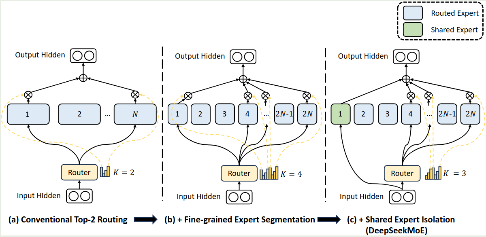
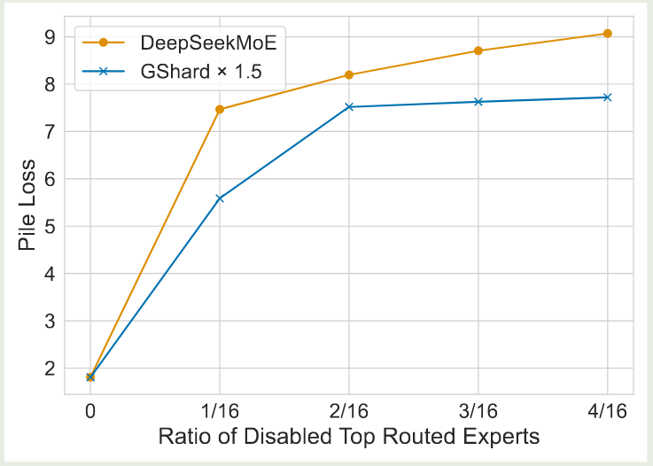
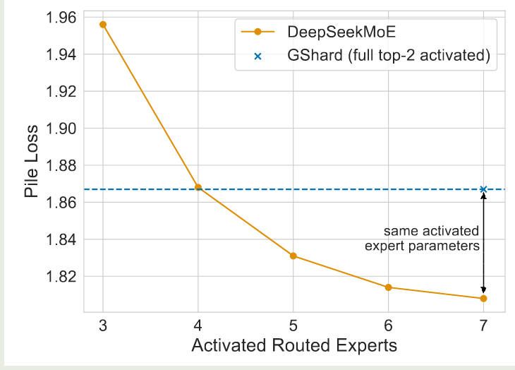

DeepSeek 在 2024 年 1 月发布了 DeepSeekMoE, 一个解决 MoE 模型 specialization 不足以及 redundancy 问题的大模型系列。

## Introduction

作者首先回顾了已有 MoE 模型的不足，主要有两点：

1. knowledge hybridity: 已有 MoE 模型的专家个数比较少，这就导致每个专家需要掌握更多样化的知识，提高了训练难度
2. knowledge redundancy: 不同专家掌握的知识可能有重叠，从而导致了模型参数的 redundancy

为了解决这两个问题，作者提出了 DeepSeek-MoE, DeepSeek-MoE 主要做出了两点改变：

1. Fine-Grained Expert Segmentation: 作者使用了更多的专家，来提高每个专家的 specialization, 降低训练成本
2. Shared Expert Isolation: 作者在 Routing expert 的基础上，加入了 shared expert 来学习 common knowledge.

作者在 2B-A0.6B 的模型进行了实验，结果显示模型表现超过了 GShard, 说明了 DeepSeekMoE 模型架构的有效性。

作者还进一步将模型 scale 到了 16B-A2.8B 和 145B-A22B, 实验结果均验证了模型的 scaling 效果。

## Method

### Preliminary

作者首先回顾了 transformer 架构，transformer 的第 $\ell$ 层 decode layer 可以表示为

$$
\begin{aligned}
u_{1:T}^{\ell} &= \mathrm{self\_attention}(h_{1:T}^{\ell-1}) + h_{1:T}^{\ell}\\
h_t^\ell &= \mathrm{FFN}(u_t^{\ell}) + u_t^{\ell}
\end{aligned}
$$

其中 $T$ 是 sequence length, $h_{1:T}^{\ell-1}$ 是第 $\ell-1$ 层 decoder layer 输出的 hidden states.

接下来，我们可以将 dense 架构转换为 MoE 架构，MoE 架构与 dense 架构不同的地方在与 $\mathrm{FFN}$ 不再是 MLP, 而是一个 MoE 模块，其表达式如下

$$
\begin{aligned}
h_t^\ell &= \sum_{i=1}^N\left(g_{i,t}\mathrm{FFN}_i(u_t^{\ell})\right) + u_t^{\ell}\\
g_{i,t} &= \begin{cases}
s_{i,t,}, &s_{i,t}\in\mathrm{Topk}(\{s_{j,t}\mid 1\leq j \leq N\},K)\\
0, &\text{otherwise}
\end{cases}\\
s_{i,t,} &= \mathrm{softmax}_i({u_t^{\ell}}^Te_i^{\ell})
\end{aligned}
$$

这里 $N$ 是专家的总个数， $K$ 是激活专家个数， $e_{i}^{\ell}$ 是 routing layer 的权重矩阵，$\mathrm{FFN}_i$ 是每个专家对应的 FFN.

### DeepSeekMoE Architecutre

DeepSeekMoE 架构如下图所示

相比于其他 MoE 架构，DeepSeekMoE 主要做了以下几点改变。

#### Fine-Grained Expert Segmentation

作者首先解决了每个专家学习内容过多的问题。作者的做法就是将每个 expert FFN 分割为 $m$ 个更小的专家，具体做法就是将 FFN intermediate hidden size 降低为原来的 $1/m$. 这样的话就可以在不增加模型参数量的情况下提高模型的表现。修正后的 MoE 模块为

$$
\begin{aligned}
h_t^\ell &= \sum_{i=1}^{mN}\left(g_{i,t}\mathrm{FFN}_i(u_t^{\ell})\right) + u_t^{\ell}\\
g_{i,t} &= \begin{cases}
s_{i,t,}, &s_{i,t}\in\mathrm{Topk}(\{s_{j,t}\mid 1\leq j \leq mN\},mK)\\
0, &\text{otherwise}
\end{cases}\\
s_{i,t,} &= \mathrm{softmax}_i({u_t^{\ell}}^Te_i^{\ell})
\end{aligned}
$$

可以看到，现在我们一共有 $mN$ 个专家，激活专家个数为 $mK$ 个。作者认为，通过提高专家的粒度，我们可以有效增加专家组合的可能性，这就提高了最终的组合多样性。

#### Shared Expert Isolation

接下来，作者介绍了解决不同专家学习到重复知识的问题，作者的做法是在 routing Expert 的基础上加入 Shared expert. 也就是说，有固定几个专家始终都会被激活，这部分专家复杂学习通用知识，从而减少知识冗余。增加 shared expert 之后的 MoE 模块为

$$
\begin{aligned}
h_t^\ell &= \sum_{i=1}^{K_s}\mathrm{FFN}_i(u_t^{\ell})+\sum_{i=K_s+1}^{mN}\left(g_{i,t}\mathrm{FFN}_i(u_t^{\ell})\right) + u_t^{\ell}\\
g_{i,t} &= \begin{cases}
s_{i,t,}, &s_{i,t}\in\mathrm{Topk}(\{s_{j,t}\mid K_s+1\leq j \leq mN\},mK-K_s)\\
0, &\text{otherwise}
\end{cases}\\
s_{i,t,} &= \mathrm{softmax}_i({u_t^{\ell}}^Te_i^{\ell})
\end{aligned}
$$

此时，模型中一共包含 $K_s$ 个共享专家，$mN-K_s$ 个 routing expert, 其中激活专家个数为 $mK-K_s$.

#### Load Balancing Loss

接下来，作者解决了训练时的 load imbalance 问题，作者提出了两个 loss 来分别解决不同层面的 load imbalance 问题。

首先，在 expert 层面，作者使用了如下的 load balancing loss:

$$
\mathcal{L} = \alpha_1\sum_{i=1}^{N'}f_iP_i
$$

其中 $\alpha_1$ 是超参数，

$$
f_i = \frac{N'}{K'T}\sum_{i=1}^{N'}\mathbb{1}(\text{Token }i \text{ selects Expert }i),\quad P_i = \frac{1}{T}\sum_{t=1}^Ts_{i,t}
$$

分别为以及分配给第 $i$ 个专家的 token 比例以及概率之和。$N'=mN-K_s$, $K'=mK-K_s$. $\mathbb{1}(\cdot)$ 是 indicator function.

其次，在 device 层面，作者也是用了 load balancing loss 来减少不同设备之间不必要的通信。作者将 routed experts 分为 $D$ 个 group $\mathcal{E}_1,\dots,\mathcal{E}_D$, 然后每个设备部署一个 group, group level 的 load balancing loss 定义如下：

$$
\mathcal{L} = \alpha_2\sum_{i=1}^D f_i' P_i'
$$

其中 $\alpha_2$ 是超参数，

$$
f_i' = \frac{1}{|\mathcal{E}_i|}\sum_{j\in\mathcal{E}_i}f_i,\quad P_i' = \sum_{j\in\mathcal{E}_i}P_i
$$

实际中，作者使用了一个较小的 $\alpha_1$ 来避免 routing collapse, 使用了一个较大的 $\alpha_2$ 来提高 Device 层面的负载均衡。

### Training

作者使用了中英文数据进行训练，tokenizer 基于 BPE 算法，vocab size 为 8K. 模型训练基于 HAI-LLM.训练时使用了 TP, DP, PP, EP 等并行策略。

2B, 16B, 145B 模型的参数如下表所示

| Model             | 2B   | 16B   | 145B   |
| ----------------- | ---- | ----- | ------ |
| total params      | 2B   | 16.4B | 144.6B |
| activated params  | 0.3B | 2.8B  | 22.2B  |
| hidden size       | 1280 | 2048  | 4096   |
| layers            | 9    | 28    | 62     |
| attention heads   | 10   | 16    | 32     |
| head dimension    | 128  | 128   | 128    |
| routed experts    | 63   | 64    | 128    |
| activated experts | 7    | 6     | 12     |
| shared experts    | 1    | 2     | 4      |
| training tokens   | 100B | 2T    | 245B   |

## Experiments

### Alignment

作者针对 DeepseekMoE 16B 进行了微调，微调使用了 **1.4M** 的训练样本，覆盖了 math, code, QA, reasoning 等任务。

### Ablation Study

作者在 2B 的模型上进行了 ablation study.

首先，作者探究了细粒度专家和共享专家的有效性，结果如下图所示

实验结果显示，与 Gshard 相比，**使用共享专家可以有效提高模型的表现**。并且，**使用更细粒度的专家也可以进一步提高模型的表现**

作者还探究了共享专家与路由专家的比例，作者分别使用不同的比例进行实验，结果发现共享专家：路由专家个数为 1：3 的时候模型效果最好。

作者还探究了模型的泛化性，作者 mask 掉一部分概率最高的 routing expert, 然后从剩下的专家里进行 topK 的挑选，然后作者比较模型和 GShard 的表现，结果如下图所示

实验结果显示，**DeepSeekMoE 对于 mask 操作更敏感，这说明 DeepSeekMoE 模型中专家的 specialization 更强。**

作者还探究了 mask 掉共享专家对模型表现的影响，结果显示**共享专家与路由专家之间的 overlap 很小，去掉共享专家之后，模型表现会变差。**

作者进一步分析了共享专家与路由专家组合的有效性。作者探究 DeepSeekMoE 是否可以使用更少的路由专家来获取知识。作者通过使用不同的 activated routed experts 来进行实验，实验结果如下图所示

实验结果显示，DeepSeekMoE 仅需激活 4 个路由专家，就可以达到与 GShard 相同的表现。**这说明了 DeepSeekMoE 模型中每个专家可以学习到更准确的知识。**

## Conclusion

作者在本文中提出了 DeepSeekMoE 架构，来提高 MoE 模型中专家的利用效率。为了达到这一点，作者首先使用了更细粒度的专家，降低每个专家的学习成本，然后，作者使用了共享专家，来降低不同专家之间的知识冗余。作者先在 2B 的模型上验证了方法的有效性，然后作者将模型 scale 到了 16B 和 125B。结果显示模型的效果均超过了以前的工作。

## References

- [arxiv](http://arxiv.org/abs/2401.06066)
